# Terraform Mastery Notes
## From Fundamentals to Production Internals — A Complete DevOps Engineer's Reference (AWS-Focused)

> **Scope:** basics → HCL deep dive → workflow & internals → state → modules → provisioners → workspaces → CI/CD → a full EKS project → Terragrunt, Terraform Cloud, Vault, multi-region architecture, GitOps → production war-stories → interview prep.
>
> **How to use this document:** read start to finish once, then keep it as a reference — jump to any chapter via the Table of Contents. Every chapter that benefits from a visual has a Mermaid diagram; every major concept has a runnable code example.

---

## Table of Contents

### Part I — Foundations
| # | Chapter |
|---|---|
| 1 | [Introduction & History of Terraform](#1-introduction--history-of-terraform) |
| 2 | [Infrastructure as Code — Why It Matters](#2-infrastructure-as-code--why-it-matters) |
| 3 | [Terraform vs Other Tools](#3-terraform-vs-other-tools) |
| 4 | [Installation & Setup (Windows / Linux / macOS)](#4-installation--setup) |

### Part II — Core Language & Workflow
| # | Chapter |
|---|---|
| 5 | [HCL Deep Dive — Syntax to Mastery](#5-hcl-deep-dive) |
| 6 | [Terraform Workflow, Providers & AWS Provider Deep Dive](#6-terraform-workflow--providers) |
| 7 | [Terraform CLI & Commands](#7-terraform-cli--commands) |
| 8 | [Variables, Locals, Outputs & Dynamic Configuration](#8-variables-locals-outputs--dynamic-configuration) |

### Part III — State & Internals
| # | Chapter |
|---|---|
| 9 | [State Management & Remote Backends](#9-state-management--remote-backends) |
| 10 | [Terraform Internals — How It Actually Works](#10-terraform-internals) |

### Part IV — Building Blocks
| # | Chapter |
|---|---|
| 11 | [Provisioners & User Data](#11-provisioners--user-data) |
| 12 | [Workspaces & Environment Management](#12-workspaces--environment-management) |
| 13 | [Modules — Reusability & Best Practices](#13-modules--reusability--best-practices) |

### Part V — Production Operations
| # | Chapter |
|---|---|
| 14 | [Production Best Practices, Common Issues & Solutions](#14-production-best-practices-common-issues--solutions) |
| 15 | [CI/CD with Terraform](#15-cicd-with-terraform) |

### Part VI — Applied Project & Integration
| # | Chapter |
|---|---|
| 16 | [Project: Production EKS Cluster from Scratch](#16-project-production-eks-cluster-from-scratch) |
| 17 | [Terraform + Ansible (Multi-Environment)](#17-terraform--ansible-multi-environment) |
| 18 | [Current Trends, AI Integration & Ecosystem Direction](#18-current-trends-ai-integration--ecosystem-direction) |
| 19 | [Interview Questions (Junior → Staff Level)](#19-interview-questions) |

### Part VII — Mastery-Level / Advanced Production Topics
| # | Chapter |
|---|---|
| 20 | [Terragrunt — DRY Multi-Environment Management](#20-terragrunt--dry-multi-environment-management) |
| 21 | [Terraform Cloud, Enterprise & Policy as Code (Sentinel)](#21-terraform-cloud-enterprise--policy-as-code-sentinel) |
| 22 | [Advanced State Operations — Declarative Import & Moved Blocks](#22-advanced-state-operations--declarative-import--moved-blocks) |
| 23 | [Testing Terraform — Terratest Deep Dive](#23-testing-terraform--terratest-deep-dive) |
| 24 | [Advanced Networking — Peering, Transit Gateway, PrivateLink](#24-advanced-networking--peering-transit-gateway-privatelink) |
| 25 | [Multi-Region & Multi-Account Architecture Patterns](#25-multi-region--multi-account-architecture-patterns) |
| 26 | [GitOps for Infrastructure — Atlantis Workflow](#26-gitops-for-infrastructure--atlantis-workflow) |
| 27 | [Secrets Management Deep Dive — HashiCorp Vault Integration](#27-secrets-management-deep-dive--hashicorp-vault-integration) |
| 28 | [Writing Custom Providers (Overview)](#28-writing-custom-providers-overview) |
| 29 | [Repo Structure & Organization at Scale](#29-repo-structure--organization-at-scale) |

### Part VIII — Reference
| # | Chapter |
|---|---|
| 30 | [Cheat Sheet — Quick Reference](#30-cheat-sheet--quick-reference) |

---

## 1. Introduction & History of Terraform

### 1.1 What Is Terraform?

Terraform is an **open-source Infrastructure as Code (IaC) tool** created by HashiCorp that lets you define, provision, and manage infrastructure using a declarative configuration language called **HCL (HashiCorp Configuration Language)**. Instead of clicking through a cloud console or writing imperative scripts, you *describe the desired end state* of your infrastructure, and Terraform figures out how to get there.

Key idea: **declarative, not imperative**. You say "I want 3 EC2 instances behind a load balancer" — not "run this command, then this command, then check if it worked, then run this other command."

### 1.2 History & Timeline

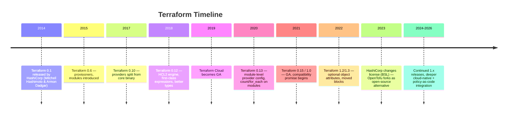

### 1.3 Why Terraform Won the IaC Space

- **Cloud-agnostic** — same workflow for AWS, Azure, GCP, Kubernetes, Datadog, GitHub, etc. (2000+ providers)
- **Declarative + plan preview** — you *see* what will change before it happens
- **State-based** — Terraform tracks what it created, enabling diffing and drift detection
- **Huge ecosystem** — Terraform Registry, modules, providers for almost anything with an API
- **Strong community + enterprise backing** (despite the 2023 license controversy, which birthed OpenTofu)

### 1.4 The BSL License Change & OpenTofu (Important Context for 2026)

In August 2023, HashiCorp switched Terraform's license from MPL 2.0 to the **Business Source License (BSL)**, restricting competitors from offering Terraform-as-a-service. In response, the Linux Foundation backed **OpenTofu**, a community-driven, truly open-source fork that remains compatible with Terraform syntax and state files. As a production engineer in 2026, you should know:

- Terraform (HashiCorp) and OpenTofu are **near drop-in compatible** for most workflows
- Some companies have migrated to OpenTofu for licensing reasons
- State files, `.tf` syntax, and most providers work interchangeably
- This notes file uses "Terraform" generically — nearly everything applies to OpenTofu too

---

## 2. Infrastructure as Code — Why It Matters

### 2.1 The Problem IaC Solves

Before IaC, infrastructure was provisioned manually ("ClickOps") or via ad-hoc shell scripts. This caused:

- **Configuration drift** — production slowly diverges from what anyone documented
- **No audit trail** — who changed the security group last Tuesday?
- **Snowflake servers** — every environment subtly different, "works on my server"
- **Slow disaster recovery** — rebuilding infra from memory takes days
- **No code review for infrastructure** — changes bypass the same rigor as app code

### 2.2 IaC Principles

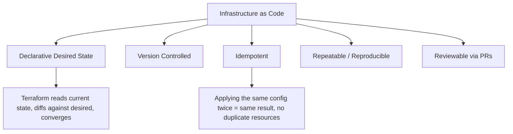

### 2.3 Declarative vs Imperative

| Aspect | Imperative (Bash/Scripts) | Declarative (Terraform) |
|---|---|---|
| You specify | Steps to reach a state | The end state itself |
| Idempotency | Must be manually engineered | Built-in |
| Drift detection | Manual/none | `terraform plan` shows drift |
| Order of operations | You control explicitly | Terraform builds a dependency graph |
| Rollback | Manual undo scripts | Re-apply previous config version |

### 2.4 Benefits in Production

1. **Consistency** — dev, staging, prod built from the same templated code, so "works in staging" reliably means "works in prod"
2. **Speed** — spin up a full environment in minutes instead of filing a ticket and waiting days for manual provisioning
3. **Auditability** — every change is a Git commit + PR + plan output, giving a permanent, searchable record of *who* changed *what* and *why*
4. **Disaster recovery** — `terraform apply` rebuilds infra from scratch against a fresh account/region if the worst happens
5. **Cost control** — code review catches an accidentally oversized `db.r5.24xlarge` before it ever gets provisioned, not after the bill arrives
6. **Collaboration** — infra changes go through the same review process as app code, so infra stops being a single engineer's tribal knowledge

### 2.5 The IaC Lifecycle in a Real Team

IaC isn't just "write once" — it's a continuous loop that mirrors software development, with the same review and testing discipline applied to infrastructure:

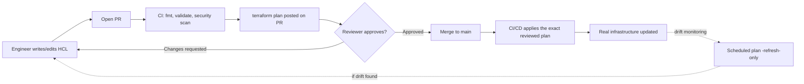

This loop — write, review, plan, apply, monitor — is what separates mature IaC practice from "we have some Terraform files somewhere." The plan/review step is the single highest-leverage habit in this entire document: it's the one thing standing between a typo and a production incident.

---

## 3. Terraform vs Other Tools

### 3.1 Terraform vs Ansible

The most common confusion for newcomers. They solve **different layers** of the problem.

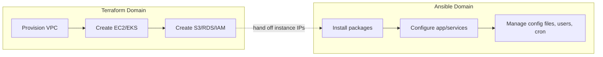

| Dimension | Terraform | Ansible |
|---|---|---|
| Category | Provisioning (infra creation) | Configuration management |
| Paradigm | Declarative | Primarily procedural/imperative (with declarative modules) |
| State | Maintains a state file | Stateless — checks live system each run |
| Language | HCL | YAML (playbooks) |
| Best for | Creating cloud resources (VPC, EC2, RDS, IAM, EKS) | Installing software, managing config on existing machines |
| Agent | Agentless (uses cloud provider APIs) | Agentless (uses SSH/WinRM) |

**Rule of thumb**: Terraform builds *the house* (foundation, walls, plumbing). Ansible *furnishes it* (installs software, tunes configs, manages users).

### 3.2 Using Terraform + Ansible Together

Common production pattern:

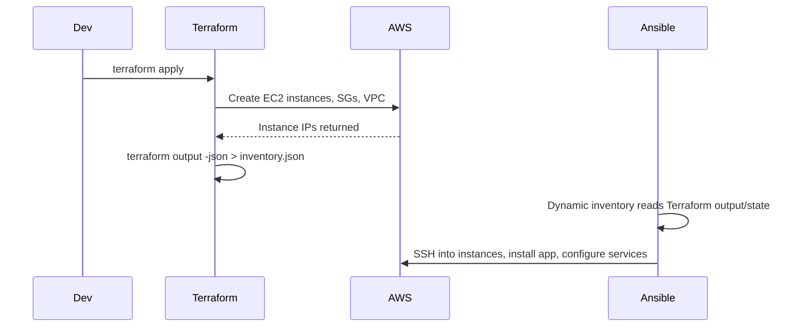

Practical integration approaches:
1. **Terraform outputs → Ansible dynamic inventory** (via `terraform-inventory` plugin or a `local_file` output)
2. **Terraform's `local-exec` provisioner** to trigger an Ansible playbook right after resource creation (use sparingly — see Provisioners chapter, this couples the two tools tightly and is often an anti-pattern)
3. **Fully decoupled pipelines** — Terraform pipeline runs first, writes instance metadata to SSM Parameter Store/S3, Ansible pipeline reads it independently (recommended for production — loose coupling, independent retries)

### 3.3 Terraform vs CloudFormation

| Dimension | Terraform | CloudFormation |
|---|---|---|
| Cloud support | Multi-cloud (AWS, Azure, GCP, etc.) | AWS-only |
| Language | HCL (concise, readable) | JSON/YAML (verbose) |
| State | Explicit state file (S3, etc.) | Managed internally by AWS |
| Drift detection | `terraform plan` | `aws cloudformation detect-stack-drift` (weaker, async) |
| Rollback | Manual (re-apply prior config) | Automatic rollback on failure |
| Plan preview | Full diff before apply | Change sets (less detailed) |
| Third-party resources | Yes, via providers (Datadog, GitHub, etc.) | Limited to AWS + custom resources (Lambda-backed) |
| Learning curve | Moderate | Steep (verbose syntax) |
| Community modules | Huge (Terraform Registry) | Smaller |

**When CloudFormation might still win**: pure-AWS shops that want native rollback and zero third-party state management overhead, or teams already deep in AWS-native tooling (CDK, SAM).

### 3.4 Terraform vs Pulumi vs CDK (Bonus Comparison)

| Tool | Language | Notes |
|---|---|---|
| Terraform | HCL (DSL) | Most mature ecosystem, huge provider count |
| Pulumi | Python/TS/Go/C# (real code) | Full programming language power, smaller ecosystem |
| AWS CDK | TypeScript/Python (compiles to CFN) | AWS-only, generates CloudFormation under the hood |
| OpenTofu | HCL (Terraform fork) | Community-governed, drop-in Terraform compatible |

---

## 4. Installation & Setup

### 4.1 Choosing an Install Method

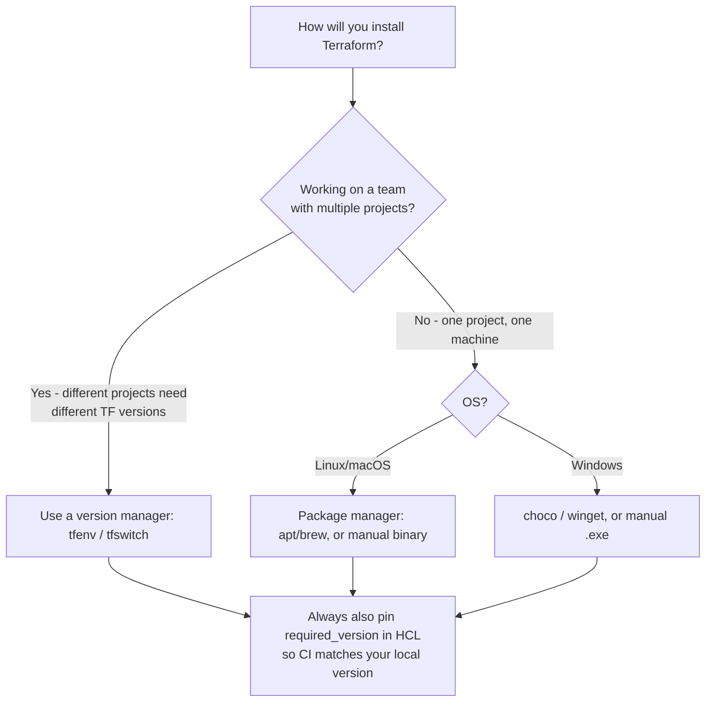

Whichever method you choose, the important production habit is the same: **pin the version explicitly** (`required_version` in the `terraform` block) so nobody's laptop silently drifts from what CI/CD uses.

### 4.2 Linux Installation

```bash
# Method 1: HashiCorp official APT repo (Debian/Ubuntu)
wget -O- https://apt.releases.hashicorp.com/gpg | sudo gpg --dearmor -o /usr/share/keyrings/hashicorp-archive-keyring.gpg
echo "deb [signed-by=/usr/share/keyrings/hashicorp-archive-keyring.gpg] https://apt.releases.hashicorp.com $(lsb_release -cs) main" | sudo tee /etc/apt/sources.list.d/hashicorp.list
sudo apt update && sudo apt install terraform

# Method 2: Manual binary install (any distro)
curl -O https://releases.hashicorp.com/terraform/1.9.0/terraform_1.9.0_linux_amd64.zip
unzip terraform_1.9.0_linux_amd64.zip
sudo mv terraform /usr/local/bin/

# Verify
terraform version
```

### 4.3 Windows Installation

```powershell
# Method 1: Chocolatey
choco install terraform

# Method 2: winget
winget install HashiCorp.Terraform

# Method 3: Manual
# Download the .zip from releases.hashicorp.com, extract terraform.exe,
# add its folder to your System PATH environment variable.

terraform version
```

### 4.4 Version Management (tfenv / tfswitch)

In production, different projects often pin different Terraform versions. Use a version manager instead of a single global install:

```bash
# tfenv (Linux/macOS)
git clone https://github.com/tfutils/tfenv.git ~/.tfenv
echo 'export PATH="$HOME/.tfenv/bin:$PATH"' >> ~/.bashrc
tfenv install 1.9.0
tfenv use 1.9.0

# tfswitch (cross-platform alternative)
curl -L https://raw.githubusercontent.com/warrensbox/terraform-switcher/release/install.sh | bash
tfswitch
```

**Production tip**: always pin the version in your config with a `required_version` constraint (covered in Section 5) so CI and every engineer's laptop use the exact same Terraform binary.

### 4.5 AWS Credentials Setup

Terraform's AWS provider needs credentials. In order of production-recommended preference:

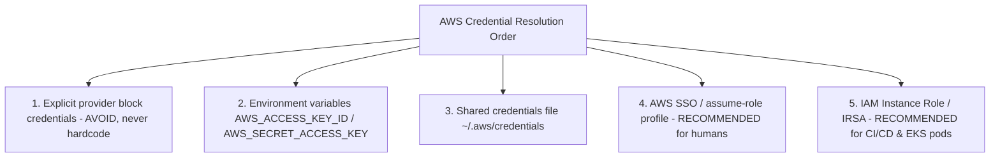

```bash
# Recommended for local dev: AWS SSO profile
aws configure sso
export AWS_PROFILE=my-sso-profile

# Recommended for CI/CD: OIDC federated role (GitHub Actions example)
# No static keys at all — short-lived tokens via assume-role-with-web-identity
```

**Never** commit AWS access keys into `.tf` files or provider blocks. Never store them in plaintext in a repo — even a private one.

---

## 5. HCL Deep Dive

This is the core chapter for production mastery — HCL (HashiCorp Configuration Language) syntax, block types, expressions, functions, loops, and conditionals, covered to the depth you'll need day-to-day in a real codebase.

### 5.1 Basic Syntax: Blocks, Arguments, Attributes

```hcl
# Anatomy of an HCL block
<BLOCK TYPE> "<LABEL 1>" "<LABEL 2>" {
  # arguments (key = value)
  argument_name = "value"

  # nested block
  nested_block {
    key = "value"
  }
}
```

Concrete example:

```hcl
resource "aws_instance" "web" {     # block type = resource, labels = "aws_instance", "web"
  ami           = "ami-0abcd1234"    # argument
  instance_type = "t3.micro"         # argument

  tags = {                            # argument whose value is a map
    Name = "web-server"
  }

  root_block_device {                 # nested block
    volume_size = 20
  }
}
```

- **Block**: a container (`resource`, `variable`, `provider`, etc.)
- **Argument**: `key = value` pair inside a block
- **Attribute**: a value exported *by* a resource once created, referenced as `<TYPE>.<NAME>.<ATTRIBUTE>` (e.g., `aws_instance.web.id`)

### 5.2 Types of Top-Level Blocks

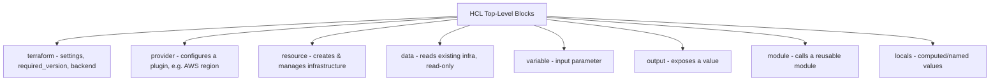

```hcl
terraform {
  required_version = ">= 1.7.0"
  required_providers {
    aws = {
      source  = "hashicorp/aws"
      version = "~> 5.0"
    }
  }
  backend "s3" {
    bucket = "my-tf-state-bucket"
    key    = "prod/network/terraform.tfstate"
    region = "us-east-1"
  }
}

provider "aws" {
  region = "us-east-1"
}

resource "aws_vpc" "main" {
  cidr_block = "10.0.0.0/16"
}

data "aws_availability_zones" "available" {
  state = "available"
}

variable "instance_type" {
  type    = string
  default = "t3.micro"
}

locals {
  environment = "production"
  common_tags = {
    Environment = local.environment
    ManagedBy   = "terraform"
  }
}

output "vpc_id" {
  value = aws_vpc.main.id
}

module "eks" {
  source = "./modules/eks"
  vpc_id = aws_vpc.main.id
}
```

### 5.3 `resource` vs `data` — The Most Important Distinction

- **`resource`**: Terraform **creates, updates, and destroys** this — it's under Terraform's ownership and tracked in state.
- **`data`**: Terraform **only reads** this — it references something that already exists (created manually, by another team, or by another Terraform state). Read-only, never modified or destroyed.

```hcl
# resource: Terraform owns and manages this VPC's lifecycle
resource "aws_vpc" "main" {
  cidr_block = "10.0.0.0/16"
}

# data: reads an AMI that already exists — Terraform never touches it
data "aws_ami" "amazon_linux" {
  most_recent = true
  owners      = ["amazon"]
  filter {
    name   = "name"
    values = ["amzn2-ami-hvm-*-x86_64-gp2"]
  }
}

resource "aws_instance" "web" {
  ami           = data.aws_ami.amazon_linux.id   # referencing a data source
  instance_type = "t3.micro"
}
```

### 5.4 Expressions & Data Types

HCL2 (used since Terraform 0.12) supports rich types:

| Type | Example |
|---|---|
| `string` | `"hello"` |
| `number` | `42`, `3.14` |
| `bool` | `true`, `false` |
| `list(type)` | `["a", "b", "c"]` |
| `set(type)` | unordered, unique values |
| `map(type)` | `{ key1 = "val1", key2 = "val2" }` |
| `object({...})` | `{ name = string, age = number }` — structured, fixed keys |
| `tuple([...])` | fixed-length, mixed-type list |
| `null` | absence of value |

```hcl
variable "subnet_cidrs" {
  type    = list(string)
  default = ["10.0.1.0/24", "10.0.2.0/24"]
}

variable "instance_config" {
  type = object({
    instance_type = string
    volume_size   = number
    monitoring    = bool
  })
  default = {
    instance_type = "t3.micro"
    volume_size   = 20
    monitoring    = true
  }
}
```

### 5.5 String Interpolation & Template Syntax

```hcl
locals {
  name_prefix = "myapp"
  environment = "prod"
}

resource "aws_instance" "web" {
  # Old-style ${} interpolation still works everywhere
  tags = {
    Name = "${local.name_prefix}-${local.environment}-web"
  }
}

# Heredoc / template strings
locals {
  user_data = <<-EOF
    #!/bin/bash
    echo "Environment: ${local.environment}" > /etc/motd
    systemctl start nginx
  EOF
}

# Template directives: for-loops and if-conditions INSIDE strings
locals {
  server_list = <<-EOT
  %{ for ip in ["10.0.1.1", "10.0.1.2"] ~}
  server ${ip};
  %{ endfor ~}
  EOT
}
```

### 5.6 Built-in Functions (The Ones You'll Actually Use)

Terraform has 100+ built-in functions (no user-defined functions allowed — a common gotcha for newcomers coming from real programming languages). Categories and daily-driver examples:

```hcl
# String functions
upper("hello")            # "HELLO"
lower("HELLO")             # "hello"
join("-", ["a","b","c"])   # "a-b-c"
split(",", "a,b,c")        # ["a","b","c"]
substr("hello", 0, 2)      # "he"
format("%s-%03d", "web", 5) # "web-005"
trimspace("  hi  ")        # "hi"

# Collection functions
length(["a","b","c"])      # 3
merge({a=1}, {b=2})        # {a=1, b=2}
concat([1,2], [3,4])       # [1,2,3,4]
lookup({a="x"}, "a", "default") # "x"
element(["a","b","c"], 1)  # "b"
keys({a=1,b=2})            # ["a","b"]
values({a=1,b=2})          # [1,2]
distinct([1,1,2,3])        # [1,2,3]
flatten([[1,2],[3,4]])     # [1,2,3,4]

# Numeric
max(1,5,3)                 # 5
min(1,5,3)                 # 1
ceil(4.1)                  # 5
floor(4.9)                 # 4

# Type conversion / encoding
tostring(42)
tonumber("42")
tolist(["a","b"])
jsonencode({a=1})
jsonencode(local.some_map)
base64encode("hello")
yamldecode(file("config.yaml"))

# Filesystem
file("./userdata.sh")
templatefile("./userdata.tpl", { env = "prod" })
fileexists("./config.json")

# Hashing/crypto
md5("hello")
sha256("hello")
uuid()

# CIDR / networking
cidrsubnet("10.0.0.0/16", 8, 1)   # "10.0.1.0/24"
cidrhost("10.0.1.0/24", 5)         # "10.0.1.5"
```

### 5.7 Loops: `count` vs `for_each`

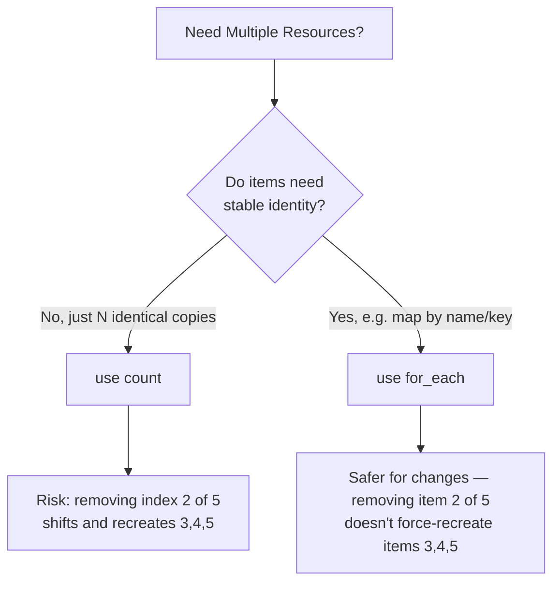

**`count`** — good for simple, truly identical N copies:

```hcl
resource "aws_instance" "web" {
  count         = 3
  ami           = data.aws_ami.amazon_linux.id
  instance_type = "t3.micro"
  tags = {
    Name = "web-${count.index}"   # web-0, web-1, web-2
  }
}

# Reference: aws_instance.web[0].id, aws_instance.web[*].id (splat)
```

**`for_each`** — production-preferred when items have distinct identities (map or set of strings):

```hcl
variable "instances" {
  type = map(object({
    instance_type = string
  }))
  default = {
    web = { instance_type = "t3.micro" }
    api = { instance_type = "t3.small" }
    db  = { instance_type = "t3.medium" }
  }
}

resource "aws_instance" "this" {
  for_each      = var.instances
  ami           = data.aws_ami.amazon_linux.id
  instance_type = each.value.instance_type
  tags = {
    Name = each.key   # "web", "api", "db"
  }
}

# Reference: aws_instance.this["web"].id
```

**Why `for_each` is safer in production**: with `count`, deleting the middle item in a list shifts every subsequent index — Terraform sees this as "destroy N, recreate N-1, N-2..." causing unnecessary (and dangerous) recreation of unrelated resources. `for_each` keys by a stable string, so removing one item only affects that item.

### 5.8 Conditional Expressions

```hcl
# Ternary-style conditional
resource "aws_instance" "web" {
  instance_type = var.environment == "prod" ? "t3.large" : "t3.micro"
}

# Conditional resource creation (the count-as-boolean trick)
resource "aws_eip" "web" {
  count    = var.create_eip ? 1 : 0
  instance = aws_instance.web.id
}

# Conditional with for_each (set trick)
resource "aws_instance" "monitoring" {
  for_each = var.enable_monitoring ? toset(["enabled"]) : toset([])
  # ...
}

# Coalesce - first non-null value
locals {
  instance_name = coalesce(var.custom_name, "default-name")
}
```

### 5.9 Dynamic Blocks

Used when a *nested block* (not a resource) needs to repeat based on a variable:

```hcl
variable "ingress_rules" {
  type = list(object({
    port        = number
    protocol    = string
    cidr_blocks = list(string)
  }))
  default = [
    { port = 80, protocol = "tcp", cidr_blocks = ["0.0.0.0/0"] },
    { port = 443, protocol = "tcp", cidr_blocks = ["0.0.0.0/0"] },
  ]
}

resource "aws_security_group" "web" {
  name   = "web-sg"
  vpc_id = aws_vpc.main.id

  dynamic "ingress" {
    for_each = var.ingress_rules
    content {
      from_port   = ingress.value.port
      to_port     = ingress.value.port
      protocol    = ingress.value.protocol
      cidr_blocks = ingress.value.cidr_blocks
    }
  }
}
```

### 5.10 Common HCL Gotchas (Production Pain Points)

1. **No user-defined functions** — Terraform is not a general-purpose language. Complex logic needs nested ternaries, `for` expressions, or delegating to external data sources.
2. **`count` index shifting** causes surprise resource recreation — prefer `for_each`.
3. **Sensitive values still show in state** — marking a variable `sensitive = true` hides it from CLI output, but it's still stored in plaintext in the state file (see State chapter — encrypt your backend!).
4. **Circular dependencies** between resources cause plan errors — Terraform builds a DAG (Section 10) and cannot resolve cycles.
5. **`for` expressions** vs `for_each` block — easy to confuse:
```hcl
# 'for' EXPRESSION - transforms a list/map into another list/map (not a resource loop)
locals {
  upper_names = [for name in var.names : upper(name)]
  name_map    = { for idx, name in var.names : idx => name }
}
```

---

## 6. Terraform Workflow & Providers

### 6.1 The Write → Plan → Apply Workflow

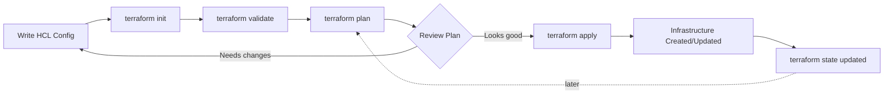

1. **Write** — author `.tf` files describing desired state
2. **Init** — download providers/modules, configure backend
3. **Plan** — Terraform computes a diff: current state vs desired config → an execution plan
4. **Apply** — Terraform executes the plan, calling provider APIs, updating state

### 6.2 `terraform init`

```bash
terraform init
```
What it actually does:
- Downloads provider plugins into `.terraform/providers/`
- Initializes the configured backend (local or remote, e.g. S3)
- Downloads any `module` sources referenced
- Creates/validates `.terraform.lock.hcl` (dependency lock file — **always commit this to git**)

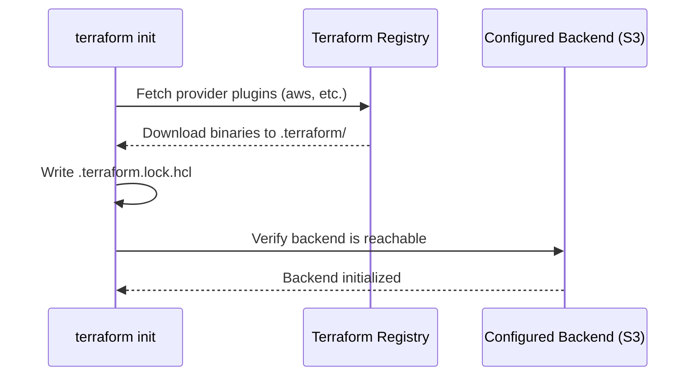

### 6.3 `terraform plan`

```bash
terraform plan
terraform plan -out=tfplan          # save plan to a file for later apply
terraform plan -var="env=staging"   # override a variable
terraform plan -target=aws_instance.web  # plan only a specific resource (use sparingly!)
```

Plan output symbols:
- `+` create
- `-` destroy
- `~` update in-place
- `-/+` destroy and recreate (forces replacement — pay close attention to these!)

### 6.4 `terraform apply`

```bash
terraform apply                 # interactive, prompts for confirmation
terraform apply -auto-approve   # no prompt — use ONLY in automated CI pipelines with prior plan review
terraform apply tfplan          # apply a previously saved plan file (recommended for CI — guarantees plan==apply)
```

**Production best practice**: In CI/CD, always run `plan` → save the plan artifact → require human/PR approval → `apply` that *exact* saved plan file. Never re-plan right before apply in an automated pipeline, since state may have drifted between the two steps.

### 6.5 What Are Providers?

A **provider** is a plugin that translates HCL into API calls for a specific platform (AWS, Azure, GCP, Kubernetes, Datadog, GitHub...). Terraform core has no built-in knowledge of any cloud — everything platform-specific lives in providers.

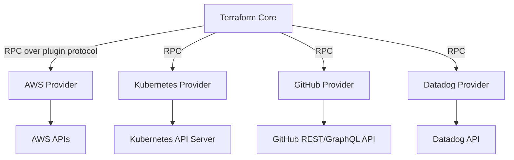

### 6.6 AWS Provider Deep Dive

```hcl
terraform {
  required_providers {
    aws = {
      source  = "hashicorp/aws"
      version = "~> 5.0"
    }
  }
}

# Basic provider config
provider "aws" {
  region = "us-east-1"
}

# Multiple provider configs (multi-region / multi-account) via alias
provider "aws" {
  alias  = "west"
  region = "us-west-2"
}

resource "aws_instance" "west_server" {
  provider      = aws.west
  ami           = data.aws_ami.amazon_linux.id
  instance_type = "t3.micro"
}

# Assume-role provider config (common for cross-account production setups)
provider "aws" {
  region = "us-east-1"
  assume_role {
    role_arn     = "arn:aws:iam::123456789012:role/TerraformExecutionRole"
    session_name = "terraform-session"
  }
  default_tags {
    tags = {
      ManagedBy   = "terraform"
      Environment = var.environment
    }
  }
}
```

**`default_tags`** is a production must-have — it auto-applies tags to every resource the provider creates, ensuring consistent cost-allocation tagging without repeating `tags = {}` on every single resource block.

### 6.7 Provider Version Constraints

```hcl
required_providers {
  aws = {
    source  = "hashicorp/aws"
    version = "~> 5.20"   # >= 5.20.0, < 5.21.0 (pessimistic constraint, patch-level flexibility)
    # version = ">= 5.0, < 6.0"   # allow any 5.x
    # version = "5.31.0"          # exact pin (most reproducible, least flexible)
  }
}
```

Production teams typically pin providers with `~>` at the minor version and let `.terraform.lock.hcl` (committed to git) guarantee byte-identical provider versions across every machine and CI run.

---

## 7. Terraform CLI & Commands

### 7.1 The CLI Surface at a Glance

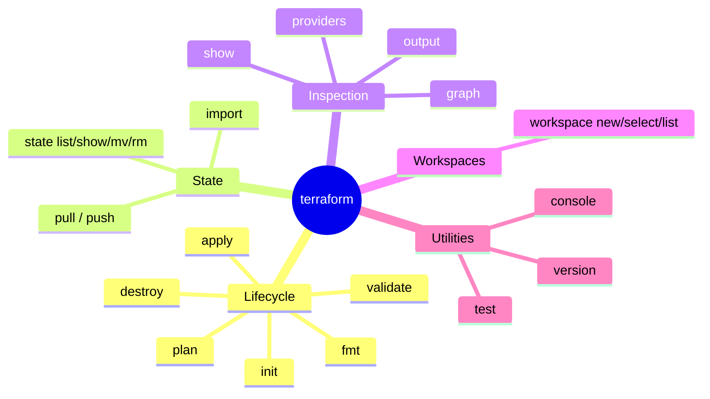

### 7.2 Core Commands

| Command | Purpose |
|---|---|
| `terraform init` | Initialize working directory, download providers/modules |
| `terraform plan` | Preview changes |
| `terraform apply` | Apply changes |
| `terraform destroy` | Tear down all managed infrastructure |
| `terraform validate` | Syntax + internal consistency check (no API calls) |
| `terraform fmt` | Auto-format `.tf` files to canonical style |
| `terraform refresh` | Sync state with real infrastructure (deprecated standalone — now `plan -refresh-only`) |
| `terraform show` | Human-readable output of state or a plan file |
| `terraform output` | Print output values |
| `terraform providers` | List providers required by the config |

```bash
terraform fmt -recursive        # format all .tf files in subdirectories
terraform validate
terraform destroy -target=aws_instance.web   # destroy a single resource — use with caution
terraform output -json          # machine-readable outputs, useful for piping to Ansible/scripts
```

### 7.3 Advanced Commands

```bash
# terraform state - direct state manipulation subcommands
terraform state list                              # list all resources in state
terraform state show aws_instance.web             # show attributes of one resource
terraform state mv aws_instance.web aws_instance.web_server   # rename in state (no infra change)
terraform state rm aws_instance.web                # remove from state WITHOUT destroying real resource
terraform state pull > backup.tfstate              # download remote state locally
terraform state push backup.tfstate                # upload local state to remote backend (dangerous!)

# terraform import - bring existing infra under Terraform management
terraform import aws_instance.web i-0123456789abcdef0

# terraform graph - visualize the dependency graph
terraform graph | dot -Tsvg > graph.svg

# terraform taint / untaint (deprecated since 0.15.2, use -replace instead)
terraform apply -replace="aws_instance.web"        # modern way to force recreation

# terraform console - interactive REPL for testing expressions
terraform console
> upper("hello")
"HELLO"

# workspace commands (see Chapter 12)
terraform workspace list
terraform workspace new staging
terraform workspace select prod
```

### 7.4 Debugging Terraform Issues

```bash
# Enable detailed logs
export TF_LOG=DEBUG          # TRACE, DEBUG, INFO, WARN, ERROR
export TF_LOG_PATH=./terraform.log
terraform apply

# Crash logs
# Terraform auto-writes crash.log on panics — attach this when filing GitHub issues

# Common debugging commands
terraform validate                 # catch syntax errors first
terraform plan -detailed-exitcode  # 0=no changes, 1=error, 2=changes present (useful in CI)
terraform providers                # confirm which provider versions are actually loaded
terraform state list | grep web    # find a resource's exact address for targeting
```

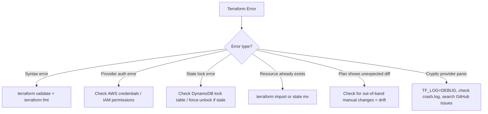

---

## 8. Variables, Locals, Outputs & Dynamic Configuration

### 8.1 Input Variables

```hcl
variable "environment" {
  description = "Deployment environment"
  type        = string
  default     = "dev"
  validation {
    condition     = contains(["dev", "staging", "prod"], var.environment)
    error_message = "Environment must be dev, staging, or prod."
  }
}

variable "db_password" {
  description = "Database master password"
  type        = string
  sensitive   = true     # hides from CLI output/logs (still plaintext in state!)
}
```

**Ways to supply variable values (precedence, highest wins):**

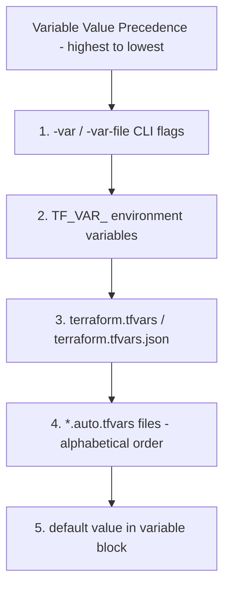

```bash
# CLI
terraform apply -var="environment=prod"
terraform apply -var-file="prod.tfvars"

# Environment variable
export TF_VAR_environment=prod

# tfvars file
# prod.tfvars
environment = "prod"
instance_type = "t3.large"
```

### 8.2 Local Values (`locals`)

Computed values used to avoid repetition — not settable by the caller, unlike variables:

```hcl
locals {
  name_prefix = "${var.project}-${var.environment}"
  common_tags = {
    Project     = var.project
    Environment = var.environment
    ManagedBy   = "terraform"
  }
  # locals can reference other locals and variables
  full_name = "${local.name_prefix}-app"
}

resource "aws_s3_bucket" "app" {
  bucket = local.full_name
  tags   = local.common_tags
}
```

### 8.3 Choosing Between Variables, Locals, and Outputs

A common source of confusion for newcomers — each of the three has a distinct direction of data flow:

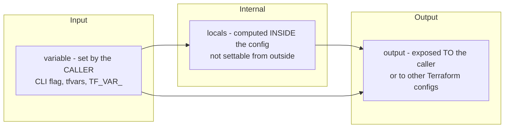

Rule of thumb: if a value needs to differ per environment or per caller, it's a `variable`. If it's derived/computed from other values and just needs a name to avoid repetition, it's a `local`. If something outside this config (a human, a script, a parent module, another state file) needs to consume a value this config produces, it's an `output`.

### 8.4 Output Values

```hcl
output "vpc_id" {
  description = "ID of the VPC"
  value       = aws_vpc.main.id
}

output "db_endpoint" {
  value     = aws_db_instance.main.endpoint
  sensitive = true      # prevents printing in plan/apply CLI output
}

# Outputs from a module are how parent configs consume child module results
output "instance_ips" {
  value = aws_instance.web[*].private_ip   # splat expression for list of resources
}
```

Outputs serve two purposes: (1) display useful info after `apply` (2) expose values for other Terraform configs (via `terraform_remote_state` data source) or external tools (Ansible, scripts) via `terraform output -json`.

### 8.5 Dynamic Configuration Patterns

```hcl
# Merge maps for layered defaults
locals {
  default_tags = { ManagedBy = "terraform" }
  env_tags     = { Environment = var.environment }
  final_tags   = merge(local.default_tags, local.env_tags, var.extra_tags)
}

# for expression to reshape data
locals {
  subnet_ids_by_az = {
    for subnet in aws_subnet.private :
    subnet.availability_zone => subnet.id
  }
}

# Conditional map construction
locals {
  instance_types = var.environment == "prod" ? {
    web = "t3.large"
    db  = "r5.xlarge"
  } : {
    web = "t3.micro"
    db  = "t3.small"
  }
}
```

---

## 9. State Management & Remote Backends

This is the single most important production topic in Terraform. Nearly every serious outage or team-blocking incident traces back to state mismanagement.

### 9.1 What Is State and Why It Exists

Terraform state (`terraform.tfstate`) is a JSON file that maps your HCL resource blocks to **real-world resource IDs**, and caches all their attributes. It's how Terraform knows:

- What it created (vs what exists but isn't managed by Terraform)
- The mapping between `aws_instance.web` in your code and `i-0abc123` in AWS
- Resource metadata needed to compute diffs on the next `plan`, without querying every attribute of every resource from the cloud API every time (though it does refresh in most workflows)

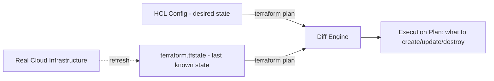

### 9.2 Why You Can't Just Push State to GitHub

- **Merge conflicts**: state is a giant JSON blob; two engineers applying concurrently corrupt it instantly, and Git can't meaningfully merge JSON diffs of resource state.
- **Secrets in plaintext**: state contains **every attribute** of every resource, including things like RDS master passwords, if they were set via a Terraform variable. Committing state to Git leaks secrets into history forever.
- **No locking**: Git doesn't prevent two people from running `apply` at the same instant — you'd get **state corruption or split-brain**, where two applies race to write different results.
- **No atomicity**: a partial `git push` failure could leave state inconsistent with reality.

### 9.3 State Conflicts & How to Avoid Them

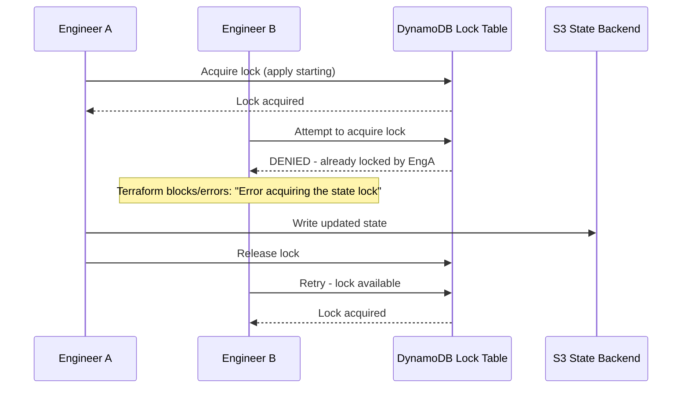

**Without locking**, both engineers' applies could interleave writes to the same state file, silently corrupting it or losing track of resources (a resource created by A "disappears" from state after B's apply overwrites it).

### 9.4 Remote State Backends — AWS S3 + DynamoDB (Classic Pattern)

```hcl
terraform {
  backend "s3" {
    bucket         = "mycompany-terraform-state"
    key            = "prod/networking/terraform.tfstate"
    region         = "us-east-1"
    dynamodb_table = "terraform-state-lock"   # state locking (pre-Terraform 1.11)
    encrypt        = true                      # SSE-S3 or SSE-KMS encryption at rest
  }
}
```

> **Note (2026 update)**: As of Terraform 1.11+ (AWS provider S3 backend), native **S3-based locking** using conditional writes is supported, removing the hard DynamoDB dependency for new setups — though DynamoDB locking remains extremely common in existing production estates and is still fully supported. Know both; you'll likely encounter the DynamoDB pattern in most real codebases through the mid-2020s.

Required infra for the classic pattern (bootstrap this manually or in a separate "bootstrap" Terraform state, since you can't store the state of the state bucket... in itself):

```hcl
resource "aws_s3_bucket" "tf_state" {
  bucket = "mycompany-terraform-state"
  lifecycle {
    prevent_destroy = true    # guard rail — never let terraform destroy the state bucket
  }
}

resource "aws_s3_bucket_versioning" "tf_state" {
  bucket = aws_s3_bucket.tf_state.id
  versioning_configuration {
    status = "Enabled"    # CRITICAL - lets you roll back to a previous state version
  }
}

resource "aws_s3_bucket_server_side_encryption_configuration" "tf_state" {
  bucket = aws_s3_bucket.tf_state.id
  rule {
    apply_server_side_encryption_by_default {
      sse_algorithm     = "aws:kms"
      kms_master_key_id = aws_kms_key.tf_state.arn
    }
  }
}

resource "aws_s3_bucket_public_access_block" "tf_state" {
  bucket                  = aws_s3_bucket.tf_state.id
  block_public_acls       = true
  block_public_policy     = true
  ignore_public_acls      = true
  restrict_public_buckets = true
}

resource "aws_dynamodb_table" "tf_lock" {
  name         = "terraform-state-lock"
  billing_mode = "PAY_PER_REQUEST"
  hash_key     = "LockID"
  attribute {
    name = "LockID"
    type = "S"
  }
}
```

### 9.5 State File Structure (What's Actually Inside)

```json
{
  "version": 4,
  "terraform_version": "1.9.0",
  "serial": 42,
  "lineage": "8f3e2a1b-...",
  "outputs": { "vpc_id": { "value": "vpc-0abc123", "type": "string" } },
  "resources": [
    {
      "mode": "managed",
      "type": "aws_instance",
      "name": "web",
      "provider": "provider[\"registry.terraform.io/hashicorp/aws\"]",
      "instances": [
        {
          "attributes": { "id": "i-0abc123", "ami": "ami-xyz", "...": "..." }
        }
      ]
    }
  ]
}
```

- **`serial`** increments on every state-changing operation — used to detect stale writes
- **`lineage`** is a unique ID for this state's "history" — changes only if state is manually recreated, and mismatched lineage is a red flag for accidental state file swaps

### 9.6 State Locking Deep Dive

Without locking, concurrent `apply` runs are a **race condition**. Locking makes `apply`/`plan`/`destroy` effectively mutually exclusive per state file.

```bash
# If a lock gets stuck (e.g. CI job was killed mid-apply)
terraform force-unlock <LOCK_ID>   # use with extreme caution — verify no apply is actually running!
```

**Production incident pattern**: a CI pipeline times out or the runner is killed mid-apply → lock never released → next pipeline run fails with "Error acquiring the state lock." Always investigate *why* before force-unlocking (is another apply genuinely in progress?), since force-unlocking during a live apply causes corruption.

### 9.7 Drift Detection & Reconciliation

**Drift** = real infrastructure has changed outside of Terraform (manual console edit, another automation tool, an AWS-initiated change like an AMI auto-update).

```bash
terraform plan -refresh-only    # shows drift without proposing config changes
terraform apply -refresh-only   # accepts drift into state (does NOT change real infra)
```

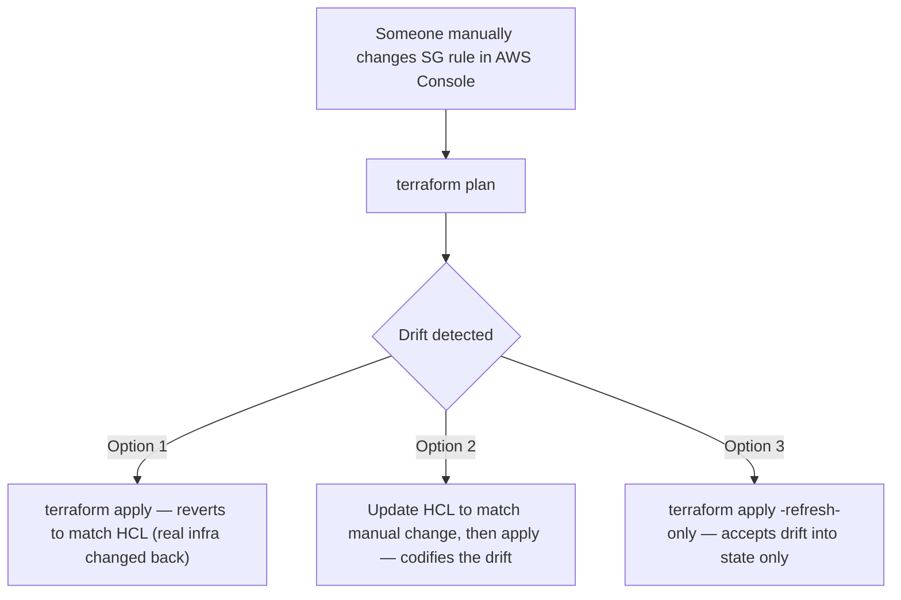

**Production best practice to prevent drift**: lock down IAM permissions so only the CI/CD pipeline's role can modify Terraform-managed resources; humans get read-only console access in production accounts.

### 9.8 State Consistency in Teams — Best Practices Summary

1. **Always use remote backends** (S3+DynamoDB, Terraform Cloud, Spacelift, etc.) — never local state for team projects
2. **Enable versioning** on the state bucket — lets you recover from a bad apply by restoring a prior state version
3. **Enable encryption at rest** (KMS) — state contains secrets
4. **One state file per logical unit** (network, per-service, per-environment) — smaller blast radius, faster plans, less lock contention
5. **Never manually edit state files** — use `terraform state mv/rm/import` commands
6. **Restrict state bucket IAM access** — treat it as sensitive as a secrets manager
7. **Back up before risky operations** — `terraform state pull > backup.tfstate` before a `state mv` or `import`

### 9.9 State File Splitting Strategy (Production Architecture)

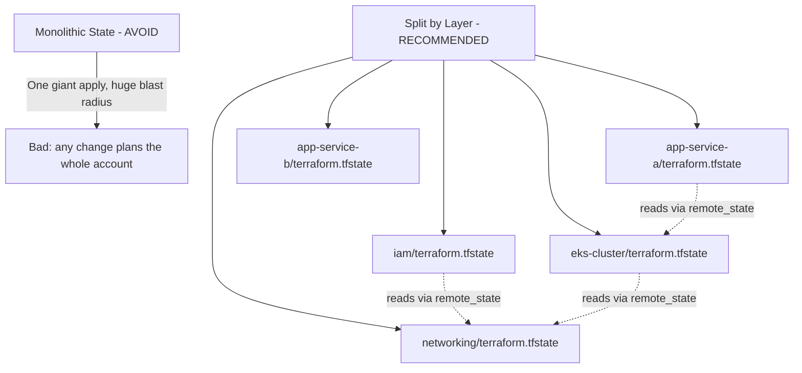

```hcl
# Reading another state's outputs (cross-stack references)
data "terraform_remote_state" "network" {
  backend = "s3"
  config = {
    bucket = "mycompany-terraform-state"
    key    = "prod/networking/terraform.tfstate"
    region = "us-east-1"
  }
}

resource "aws_instance" "web" {
  subnet_id = data.terraform_remote_state.network.outputs.public_subnet_id
}
```

---

## 10. Terraform Internals

Understanding what happens *underneath* `plan` and `apply` separates engineers who can debug production incidents from those who can only follow tutorials.

### 10.1 The Core Architecture

```mermaid
graph TD
    A[Terraform Core] --> B[Configuration Loader - parses HCL]
    A --> C[Graph Builder - builds DAG of resources]
    A --> D[State Manager - reads/writes state]
    A --> E[Plan/Apply Engine - walks graph, calls providers]
    E -->|RPC / gRPC| F[Provider Plugins - aws, kubernetes, etc.]
    F --> G[Actual Cloud APIs]
```

Terraform Core itself knows **nothing** about AWS, Kubernetes, or any specific platform. All of that logic lives in **providers**, which are separate binaries communicating with Core over a gRPC-based plugin protocol. This is why adding support for a new API just means writing a new provider — core never changes.

### 10.2 The Dependency Graph (DAG)

Terraform builds a **Directed Acyclic Graph** of all resources based on **implicit and explicit dependencies**, then walks it to determine execution order. This is *why* you rarely need to specify ordering manually — referencing `aws_vpc.main.id` inside `aws_subnet.main` automatically creates an edge in the graph.

```mermaid
graph TD
    VPC[aws_vpc.main] --> Subnet[aws_subnet.public]
    VPC --> IGW[aws_internet_gateway.main]
    Subnet --> RouteTable[aws_route_table.public]
    IGW --> RouteTable
    RouteTable --> RTAssoc[aws_route_table_association]
    Subnet --> RTAssoc
    Subnet --> Instance[aws_instance.web]
    SG[aws_security_group.web] --> Instance
    VPC --> SG
```

Resources with no dependency relationship between them (e.g., two unrelated S3 buckets) are created **in parallel** — Terraform's default parallelism is 10 concurrent operations (`-parallelism=N` to change).

```bash
terraform graph | dot -Tsvg > graph.svg   # requires graphviz installed
```

### 10.3 Explicit Dependencies with `depends_on`

Sometimes a dependency isn't visible through attribute references (e.g., IAM eventual consistency, or a resource that must exist first purely for side effects). Use `depends_on` sparingly — it disables some of Terraform's ability to parallelize and should be a last resort after checking if an implicit reference could work instead:

```hcl
resource "aws_iam_role_policy" "example" {
  # ...
}

resource "aws_instance" "web" {
  # This instance's user_data script assumes an IAM role that must exist first,
  # but there's no direct attribute reference to force ordering
  depends_on = [aws_iam_role_policy.example]
}
```

### 10.4 What Actually Happens During `plan`

```mermaid
sequenceDiagram
    participant CLI as Terraform CLI
    participant State as State File
    participant Provider as AWS Provider
    participant AWS as AWS API
    CLI->>State: Read current state
    CLI->>Provider: Refresh - GetResource for each managed resource
    Provider->>AWS: Describe* API calls
    AWS-->>Provider: Current real-world attributes
    Provider-->>CLI: Refreshed state (in memory)
    CLI->>CLI: Diff refreshed state vs HCL config
    CLI->>Provider: PlanResourceChange (per resource) - determine actions
    Provider-->>CLI: Proposed changes + any "requires replacement" flags
    CLI->>CLI: Build execution plan, present to user
```

Key insight: **plan performs a live refresh by default** (reads real infrastructure state via provider APIs) before diffing — this is why `plan` can be slow on large state files with many resources, and why network/API issues during `plan` are common.

### 10.5 What Happens During `apply`

```mermaid
sequenceDiagram
    participant CLI as Terraform CLI
    participant Graph as Dependency Graph Walker
    participant Provider as Provider Plugin
    participant Cloud as Cloud API
    participant State as State Backend
    CLI->>Graph: Walk graph in dependency order
    loop For each resource (parallel where possible)
        Graph->>Provider: ApplyResourceChange (Create/Update/Delete)
        Provider->>Cloud: Actual API call (e.g. RunInstances)
        Cloud-->>Provider: Result / new resource ID
        Provider-->>Graph: Updated attributes
        Graph->>State: Write resource to state IMMEDIATELY (not batched at the end!)
    end
    CLI->>State: Final state write, release lock
```

**Critical production insight**: Terraform writes state **incrementally, resource by resource**, not just once at the end. This is why a partially-failed `apply` still leaves you with a valid, useful state file reflecting everything that *did* succeed — re-running `apply` will pick up where it left off rather than starting over.

### 10.6 Resource Lifecycle: Create, Update-in-Place, or Destroy+Recreate

For each resource, the provider's schema defines which attribute changes are:
- **Updatable in place** (e.g., changing an EC2 instance's tags)
- **ForceNew / requires replacement** (e.g., changing an EC2 instance's `availability_zone` — AWS doesn't support live AZ migration, so Terraform must destroy and recreate)

```hcl
resource "aws_instance" "web" {
  ami           = "ami-0abcd1234"
  instance_type = "t3.micro"

  lifecycle {
    create_before_destroy = true   # create the replacement BEFORE destroying the old one
    prevent_destroy        = true   # guard rail: terraform refuses to destroy this resource
    ignore_changes          = [tags["LastModifiedBy"]]  # ignore drift on specific attributes
  }
}
```

```mermaid
flowchart TD
    A[Attribute Changed] --> B{Provider schema:<br/>updatable in-place?}
    B -->|Yes| C[Update API call - e.g. ModifyInstanceAttribute]
    B -->|No - ForceNew| D{create_before_destroy?}
    D -->|true| E[1. Create new resource<br/>2. Update references<br/>3. Destroy old resource]
    D -->|false, default| F[1. Destroy old resource<br/>2. Create new resource<br/>DOWNTIME RISK]
```

### 10.7 The Provider Plugin Protocol

Providers communicate with Core over gRPC (historically go-plugin over a local Unix socket/pipe). Each provider implements a standard interface:

- `GetProviderSchema` — describe all resources/data sources and their attributes
- `ValidateResourceConfig` — client-side validation before any API calls
- `PlanResourceChange` — given prior + proposed state, compute the diff and any ForceNew flags
- `ApplyResourceChange` — actually create/update/delete
- `ReadResource` — used during refresh

This plugin architecture is why you can write **custom providers** for internal/proprietary APIs (using the Terraform Plugin Framework in Go) and they integrate exactly like `hashicorp/aws` does.

### 10.8 `.terraform.lock.hcl` — The Dependency Lock File

```hcl
provider "registry.terraform.io/hashicorp/aws" {
  version     = "5.31.0"
  constraints = "~> 5.0"
  hashes = [
    "h1:abc123...",
    "zh:def456...",
  ]
}
```

Generated by `terraform init`, this file pins **exact provider versions and checksums**. **Always commit it to git** — it's the equivalent of `package-lock.json`/`Gemfile.lock`, guaranteeing every engineer and every CI run uses byte-identical provider binaries. Without it, two engineers running `init` weeks apart could silently get different provider versions with different behavior.

---

## 11. Provisioners & User Data

### 11.1 Understanding Provisioners

Provisioners run scripts/commands at resource creation or destruction time. **HashiCorp's official guidance: provisioners are a last resort.** Prefer cloud-native mechanisms (user_data, AWS Systems Manager, cloud-init, or Ansible/Packer) whenever possible, since provisioners:

- Aren't tracked in the declarative plan the way resource attributes are
- Can fail without cleanly rolling back
- Create tight coupling and hidden imperative logic inside a declarative tool
- Require network connectivity (SSH/WinRM) from wherever `terraform apply` runs to the target — often blocked in production VPCs

```mermaid
graph TD
    A[Need to configure a resource at creation?] --> B{Can cloud-native<br/>mechanism do it?}
    B -->|Yes - e.g. user_data, cloud-init| C[Use that - RECOMMENDED]
    B -->|No| D{Is it truly one-time<br/>bootstrap logic?}
    D -->|Yes| E[local-exec / remote-exec - acceptable, last resort]
    D -->|No - ongoing config mgmt| F[Use Ansible/Chef/Puppet post-provisioning]
```

### 11.2 Provisioner Types at a Glance

```mermaid
graph TD
    A[Provisioner Types] --> B["file — copies a file/dir<br/>TO the created resource"]
    A --> C["remote-exec — runs commands<br/>ON the created resource"]
    A --> D["local-exec — runs commands<br/>on the machine running terraform"]
    B --> E[Needs SSH/WinRM connection block]
    C --> E
    D --> F[No remote connection needed —<br/>runs locally, e.g. update an inventory file]
    A --> G["when = destroy — runs BEFORE<br/>the resource is destroyed, any provisioner type"]
```

```hcl
# file - copy a file/directory to the remote resource
resource "aws_instance" "web" {
  # ...
  provisioner "file" {
    source      = "app_config.json"
    destination = "/tmp/app_config.json"
    connection {
      type        = "ssh"
      user        = "ec2-user"
      private_key = file("~/.ssh/id_rsa")
      host        = self.public_ip
    }
  }
}

# remote-exec - run commands ON the created resource
resource "aws_instance" "web" {
  # ...
  provisioner "remote-exec" {
    inline = [
      "sudo yum install -y nginx",
      "sudo systemctl start nginx",
    ]
    connection {
      type        = "ssh"
      user        = "ec2-user"
      private_key = file("~/.ssh/id_rsa")
      host        = self.public_ip
    }
  }
}

# local-exec - run commands on the machine RUNNING terraform (not the created resource)
resource "aws_instance" "web" {
  # ...
  provisioner "local-exec" {
    command = "echo ${self.private_ip} >> inventory.txt"
  }

  # Common pattern: trigger Ansible right after creation
  provisioner "local-exec" {
    command = "ansible-playbook -i '${self.public_ip},' configure-app.yml"
  }
}

# destroy-time provisioner - runs BEFORE the resource is destroyed
resource "aws_instance" "web" {
  provisioner "local-exec" {
    when    = destroy
    command = "echo 'Instance ${self.id} being destroyed' >> destroy.log"
  }
}
```

### 11.3 Use Cases Where Provisioners Are (Somewhat) Justified

1. **Bootstrapping a config management tool** — e.g., `remote-exec` to install the Ansible/Chef agent, then hand off all further configuration to that tool
2. **Signaling external systems** — `local-exec` to notify a deployment tracker
3. **One-off cluster bootstrap commands** that have no Terraform provider equivalent (e.g., initializing a database schema — though a `null_resource` with triggers is often cleaner)

### 11.4 Using User Data with AWS EC2 (The Preferred Alternative)

`user_data` is cloud-init/cloud-native and runs automatically at first boot — no SSH connectivity needed from Terraform, no coupling, fully declarative:

```hcl
resource "aws_instance" "web" {
  ami           = data.aws_ami.amazon_linux.id
  instance_type = "t3.micro"

  user_data = templatefile("${path.module}/userdata.sh.tpl", {
    environment = var.environment
    app_version = var.app_version
  })

  # user_data_replace_on_change forces recreation if the script changes,
  # rather than silently leaving old instances un-updated
  user_data_replace_on_change = true
}
```

```bash
# userdata.sh.tpl
#!/bin/bash
set -euo pipefail
echo "Deploying environment: ${environment}, version: ${app_version}"
yum update -y
yum install -y docker
systemctl enable --now docker
docker run -d -p 80:80 mycompany/app:${app_version}
```

**Production recommendation**: use `user_data` for bootstrap-time setup, and a proper config management/orchestration layer (Ansible, or better, **immutable AMIs baked with Packer**) for anything beyond trivial setup. The gold-standard production pattern is: **Packer bakes a golden AMI with everything pre-installed → Terraform just launches instances from that AMI with minimal `user_data`** (avoids slow, fragile, unrepeatable boot-time provisioning entirely).

---

## 12. Workspaces & Environment Management

### 12.1 What Are Workspaces

Terraform CLI workspaces let you maintain **multiple distinct states from the same configuration**, switching between them without changing code paths.

```bash
terraform workspace list
terraform workspace new staging
terraform workspace new prod
terraform workspace select staging
terraform workspace show
```

```mermaid
graph TD
    A[Same .tf Config Files] --> B[Workspace: default]
    A --> C[Workspace: staging]
    A --> D[Workspace: prod]
    B --> E[terraform.tfstate.d/default]
    C --> F[terraform.tfstate.d/staging]
    D --> G[terraform.tfstate.d/prod]
```

```hcl
resource "aws_instance" "web" {
  instance_type = terraform.workspace == "prod" ? "t3.large" : "t3.micro"
  tags = {
    Environment = terraform.workspace
  }
}
```

### 12.2 Workspaces vs Directory-per-Environment — The Real Production Debate

This is one of the most debated topics in the Terraform community. Know both patterns and their trade-offs:

| Aspect | CLI Workspaces | Directory-per-Environment |
|---|---|---|
| Code duplication | None — single config | Some duplication (or shared modules) |
| Risk of `apply`-ing wrong env | **Higher** — easy to forget which workspace is selected | Lower — physically separate directories force explicit choice |
| Different resource configs per env (e.g., prod has extra WAF) | Awkward — needs conditionals everywhere | Natural — each env's `main.tf` can differ |
| Backend/state isolation | Same backend, different state *paths* | Can use fully separate backends/accounts |
| Team scaling | Gets messy with many envs | Scales better, clearer blast-radius boundaries |
| Best for | Small projects, ephemeral/preview environments | Production infra with prod/staging/dev separation |

```mermaid
graph TD
    A[Environment Strategy] --> B[CLI Workspaces]
    A --> C[Directory-per-Environment RECOMMENDED for prod]
    C --> D["environments/dev/main.tf"]
    C --> E["environments/staging/main.tf"]
    C --> F["environments/prod/main.tf"]
    D -.calls shared module.-> G[modules/app/]
    E -.calls shared module.-> G
    F -.calls shared module.-> G
```

**Production recommendation**: use the **directory-per-environment pattern with shared modules** for anything touching production. The physical separation is a critical safety guard-rail — it makes it structurally impossible to accidentally `apply` a dev-sized change against the prod state, which is a very real and very common incident cause with CLI workspaces (engineer forgets to `workspace select prod`, applies believing they're in dev, or vice versa).

Example directory-per-environment layout:

```
project/
├── modules/
│   └── app/
│       ├── main.tf
│       ├── variables.tf
│       └── outputs.tf
├── environments/
│   ├── dev/
│   │   ├── main.tf          # calls module "app" with dev-sized values
│   │   ├── backend.tf        # separate state key: dev/terraform.tfstate
│   │   └── terraform.tfvars
│   ├── staging/
│   │   ├── main.tf
│   │   ├── backend.tf        # staging/terraform.tfstate
│   │   └── terraform.tfvars
│   └── prod/
│       ├── main.tf
│       ├── backend.tf        # prod/terraform.tfstate — often a SEPARATE AWS ACCOUNT
│       └── terraform.tfvars
```

### 12.3 Managing Multiple Environments (Dev/Staging/Prod) — Account Isolation

Best-practice production pattern: **separate AWS accounts per environment** (not just separate state files), using AWS Organizations, with Terraform assuming a cross-account role per environment. This gives hard security/blast-radius isolation beyond what state separation alone provides — a compromised or misconfigured dev account literally cannot touch prod resources.

---

## 13. Modules — Reusability & Best Practices

### 13.1 What Are Modules

A module is just a directory containing `.tf` files. **Every Terraform configuration is technically a module** — the directory you run `terraform apply` in is the "root module." Modules become powerful when you call them from other configs to encapsulate and reuse infrastructure patterns.

```mermaid
graph TD
    A[Root Module] --> B[module: vpc]
    A --> C[module: eks]
    A --> D[module: rds]
    C --> E[module: eks calls module: iam internally]
    B -.outputs vpc_id, subnet_ids.-> C
    B -.outputs.-> D
```

### 13.2 Using Prebuilt Modules from the Terraform Registry

The Terraform Registry hosts community and HashiCorp-verified modules for nearly everything common:

```hcl
module "vpc" {
  source  = "terraform-aws-modules/vpc/aws"
  version = "~> 5.0"

  name = "prod-vpc"
  cidr = "10.0.0.0/16"

  azs             = ["us-east-1a", "us-east-1b", "us-east-1c"]
  private_subnets = ["10.0.1.0/24", "10.0.2.0/24", "10.0.3.0/24"]
  public_subnets  = ["10.0.101.0/24", "10.0.102.0/24", "10.0.103.0/24"]

  enable_nat_gateway = true
  single_nat_gateway = false   # one NAT per AZ for HA in prod

  tags = local.common_tags
}

module "eks" {
  source  = "terraform-aws-modules/eks/aws"
  version = "~> 20.0"

  cluster_name    = "prod-cluster"
  cluster_version = "1.30"
  vpc_id          = module.vpc.vpc_id
  subnet_ids      = module.vpc.private_subnets
}
```

**Production tip**: the `terraform-aws-modules` org on the Registry is a de facto community standard, battle-tested and widely adopted — usually a better starting point than hand-rolling common patterns (VPC, EKS, RDS, security groups) from scratch.

### 13.3 Creating Custom Modules

```
modules/web-app/
├── main.tf          # resources
├── variables.tf      # input variable declarations
├── outputs.tf         # output declarations
├── versions.tf         # required_providers / required_version
└── README.md            # usage docs (auto-generated via terraform-docs)
```

```hcl
# modules/web-app/variables.tf
variable "app_name" {
  type = string
}
variable "instance_type" {
  type    = string
  default = "t3.micro"
}
variable "vpc_id" {
  type = string
}
variable "subnet_ids" {
  type = list(string)
}

# modules/web-app/main.tf
resource "aws_security_group" "app" {
  name   = "${var.app_name}-sg"
  vpc_id = var.vpc_id
}

resource "aws_instance" "app" {
  count                  = length(var.subnet_ids)
  ami                    = data.aws_ami.amazon_linux.id
  instance_type          = var.instance_type
  subnet_id              = var.subnet_ids[count.index]
  vpc_security_group_ids = [aws_security_group.app.id]
  tags = {
    Name = "${var.app_name}-${count.index}"
  }
}

# modules/web-app/outputs.tf
output "instance_ids" {
  value = aws_instance.app[*].id
}
output "security_group_id" {
  value = aws_security_group.app.id
}
```

```hcl
# Calling it from the root module
module "checkout_service" {
  source        = "./modules/web-app"
  app_name      = "checkout"
  instance_type = "t3.small"
  vpc_id        = module.vpc.vpc_id
  subnet_ids    = module.vpc.private_subnets
}

module "search_service" {
  source        = "./modules/web-app"    # SAME module, different call = reuse
  app_name      = "search"
  instance_type = "t3.medium"
  vpc_id        = module.vpc.vpc_id
  subnet_ids    = module.vpc.private_subnets
}
```

### 13.4 Module Structure, Best Practices, and Outputs

```mermaid
graph TD
    A[Module Design Principles] --> B[Single Responsibility - one module, one concern]
    A --> C[Sensible Defaults - most variables should have defaults]
    A --> D[Explicit Outputs - expose only what consumers need]
    A --> E[No Hardcoded Environment Logic - pass env-specific values as variables]
    A --> F[Pin Module Version in source when using Registry/Git modules]
    A --> G[Document with terraform-docs]
```

**Do:**
- Keep modules focused — a "vpc" module shouldn't also create IAM users
- Version your modules (`version = "~> 2.0"` for Registry, or Git tags: `source = "git::https://github.com/org/tf-modules.git//vpc?ref=v1.4.0"`)
- Use `terraform-docs` to auto-generate README from variables/outputs
- Write module-level tests (Terratest, or native `terraform test` since 1.6+)

**Don't:**
- Over-abstract too early — a module with 40 conditional variables trying to handle every possible use case is often worse than two focused modules
- Nest modules more than 2-3 levels deep — debugging becomes painful
- Use `count`/`for_each` at the *module call* level combined with complex internal `for_each` — can create confusing double-indirection

### 13.5 Native Terraform Testing (1.6+)

```hcl
# tests/vpc.tftest.hcl
run "vpc_has_correct_cidr" {
  command = plan
  variables {
    cidr_block = "10.0.0.0/16"
  }
  assert {
    condition     = aws_vpc.main.cidr_block == "10.0.0.0/16"
    error_message = "VPC CIDR block did not match expected value"
  }
}
```

```bash
terraform test
```

---

## 14. Production Best Practices, Common Issues & Solutions

### 14.1 Master Checklist

```mermaid
graph TD
    A[Production-Ready Terraform Checklist] --> B[Remote backend with locking + versioning + encryption]
    A --> C[.terraform.lock.hcl committed to git]
    A --> D[CI/CD enforced - no local applies to prod]
    A --> E[Least-privilege IAM for the Terraform execution role]
    A --> F[State split by layer/service - not monolithic]
    A --> G[Sensitive values via Secrets Manager/SSM, not plaintext tfvars]
    A --> H[prevent_destroy on critical resources - DBs, state bucket]
    A --> I[Policy-as-code guardrails - Sentinel/OPA/Checkov]
    A --> J[Plan output requires human review before apply]
    A --> K[Drift detection scheduled - nightly plan-only runs]
    A --> L[Consistent tagging strategy - default_tags]
    A --> M[Module versioning pinned everywhere]
```

### 14.2 Common Production Issues & Solutions

| Issue | Root Cause | Solution |
|---|---|---|
| **"Error acquiring state lock"** | Previous apply crashed/timed out without releasing lock | Verify no apply is genuinely running, then `terraform force-unlock <ID>` |
| **Resource unexpectedly destroyed & recreated** | `count` index shift, or a `ForceNew` attribute changed unintentionally | Use `for_each` instead of `count`; check plan output carefully for `-/+` |
| **"Resource already exists" on apply** | Resource was created manually or by another process outside Terraform | `terraform import` to bring it under management |
| **Secrets visible in state file** | Any value flowing through Terraform lands in state, `sensitive=true` only hides CLI output | Encrypt state at rest (KMS); restrict state bucket IAM access; consider external secret refs (ARNs) instead of raw secret values where possible |
| **Plan takes 10+ minutes** | Huge monolithic state file, `-refresh` querying hundreds of resources | Split state by layer/service; use `-target` sparingly for debugging only, not routine workflow |
| **Provider version drift between engineers** | `.terraform.lock.hcl` not committed | Always commit the lock file |
| **Circular dependency error** | Two resources reference each other's attributes | Break the cycle — often need a third resource, or use `depends_on` with restructuring |
| **State file corruption after failed apply** | Rare, usually from concurrent applies without locking or a manual state edit gone wrong | Restore from S3 versioning (`aws s3api list-object-versions`), roll back to last-known-good |
| **`terraform destroy` accidentally run against prod** | No guard rails, same credentials work everywhere | Separate AWS accounts per env; `prevent_destroy` lifecycle rule; CI pipeline requires explicit approval gate for destroy actions |
| **Long-lived credentials leaked in CI logs** | Static AWS keys stored as CI secrets | Use OIDC federation (GitHub Actions/GitLab → AWS STS AssumeRoleWithWebIdentity) — no long-lived keys at all |
| **Module update breaks unrelated resources** | Unpinned module version (`source = "...vpc"` with no `ref`/`version`) | Always pin exact module versions; test upgrades in a lower environment first |

### 14.3 Security Best Practices

```mermaid
graph TD
    A[Terraform Security Layers] --> B[Least-Privilege IAM Execution Role]
    A --> C[Secrets Management]
    A --> D[State File Protection]
    A --> E[Policy-as-Code Enforcement]
    B --> B1[Scoped to only resources/actions the pipeline needs]
    B --> B2[Separate roles per environment - dev role can't touch prod]
    C --> C1[Pull from AWS Secrets Manager/SSM at apply time, not tfvars]
    C --> C2[Use data sources to reference secrets, never hardcode]
    D --> D1[Bucket policy: only CI role + break-glass admin role]
    D --> D2[KMS encryption, versioning, MFA delete optional]
    E --> E1[Checkov/tfsec/Trivy - static security scanning in CI]
    E --> E2[OPA/Sentinel - policy gates before apply, e.g. no public S3 buckets]
```

```hcl
# Referencing a secret without ever storing its value in HCL/tfvars
data "aws_secretsmanager_secret_version" "db_password" {
  secret_id = "prod/rds/master-password"
}

resource "aws_db_instance" "main" {
  # ...
  password = data.aws_secretsmanager_secret_version.db_password.secret_string
}
```

> Note: this still lands in state — you still need state encryption. The win here is that the *source of truth* for the secret is Secrets Manager (with its own rotation/audit trail), not a plaintext `.tfvars` file sitting in a repo or CI variable.

### 14.4 Policy as Code Example (OPA/Conftest style concept)

```rego
# Example policy: deny public S3 buckets
package terraform.s3

deny[msg] {
  resource := input.resource.aws_s3_bucket_public_access_block
  resource.block_public_acls == false
  msg := "S3 buckets must block public ACLs"
}
```

Run static scanners in CI before `apply` ever happens:

```bash
tfsec .
checkov -d .
terraform plan -out=tfplan && conftest test tfplan.json
```

### 14.5 Real Production Case Studies

**Case Study 1: The Midnight `count` Recreation Incident**
A team removed the 2nd of 5 EC2 instances defined with `count = 5`. Terraform's plan showed the removal of index 1 — but because `count` uses positional indexing, instances 2, 3, and 4 all shifted down one slot, and Terraform proposed destroying and recreating them too (since their "identity" in state shifted). Applied during business hours, this caused a multi-minute outage across 3 instances instead of the intended 1.
**Fix**: migrate to `for_each` with a stable map key; always read the full plan output (`-/+` symbols) before approving, especially counting exactly how many resources are affected.

**Case Study 2: The Stuck Lock**
A CI runner was OOM-killed mid-`apply`. The DynamoDB lock was never released. Every subsequent pipeline run failed with a lock error, blocking all infrastructure changes for the team for several hours until someone investigated, confirmed no apply was actually in flight, and ran `force-unlock`.
**Fix**: add CI timeout + graceful-shutdown handling; alert on lock-held-too-long; document the `force-unlock` runbook so it's not a 2am panic decision.

**Case Study 3: Cross-Account Drift**
A well-meaning engineer manually added an inbound rule to a security group directly in the AWS Console "just for testing," forgetting to update the Terraform HCL. Weeks later, an unrelated `apply` reverted the SG to match HCL, silently breaking a service that depended on that manual rule, in production, with no clear connection between the two events (the SG change was buried in a much larger unrelated plan diff).
**Fix**: scheduled nightly `plan -refresh-only` drift-detection jobs with Slack alerts; IAM policies preventing console write-access to Terraform-managed resources in prod; strong team norm of "if it's not in the HCL, it doesn't exist."

### 14.6 Cost Management Best Practices

- Use `infracost` in CI to show cost diffs on every PR (`infracost diff --path .`)
- Tag everything with `default_tags` for cost allocation reporting
- Right-size via `terraform plan` review — code review catches an accidental instance-type typo before it costs money
- Use `count`/`for_each` with environment-aware sizing (small in dev, larger in prod) rather than hardcoding prod-sized resources everywhere

---

## 15. CI/CD with Terraform

### 15.1 The Standard Pipeline Pattern

```mermaid
flowchart TD
    A[Developer opens PR with .tf changes] --> B[CI: terraform fmt -check]
    B --> C[CI: terraform validate]
    C --> D[CI: tfsec / checkov security scan]
    D --> E[CI: terraform plan -out=tfplan]
    E --> F[CI: Post plan output as PR comment]
    F --> G{Human Review & Approval}
    G -->|Approved + merged to main| H[CD: terraform apply tfplan]
    G -->|Changes requested| A
    H --> I[Notify team - Slack/Teams]
```

### 15.2 GitHub Actions Example

```yaml
name: Terraform
on:
  pull_request:
    paths: ['infra/**']
  push:
    branches: [main]
    paths: ['infra/**']

permissions:
  id-token: write   # required for OIDC
  contents: read
  pull-requests: write

jobs:
  terraform:
    runs-on: ubuntu-latest
    defaults:
      run:
        working-directory: infra
    steps:
      - uses: actions/checkout@v4

      - uses: hashicorp/setup-terraform@v3
        with:
          terraform_version: 1.9.0

      - name: Configure AWS credentials (OIDC — no static keys)
        uses: aws-actions/configure-aws-credentials@v4
        with:
          role-to-assume: arn:aws:iam::123456789012:role/github-actions-terraform
          aws-region: us-east-1

      - run: terraform fmt -check -recursive
      - run: terraform init
      - run: terraform validate

      - name: tfsec scan
        uses: aquasecurity/tfsec-action@v1.0.3

      - name: Terraform Plan
        id: plan
        run: terraform plan -out=tfplan -no-color
        continue-on-error: true

      - name: Comment PR with plan
        if: github.event_name == 'pull_request'
        uses: actions/github-script@v7
        with:
          script: |
            github.rest.issues.createComment({
              issue_number: context.issue.number,
              owner: context.repo.owner,
              repo: context.repo.repo,
              body: `#### Terraform Plan\n\`\`\`\n${{ steps.plan.outputs.stdout }}\n\`\`\``
            })

      - name: Terraform Apply
        if: github.ref == 'refs/heads/main' && github.event_name == 'push'
        run: terraform apply -auto-approve tfplan
```

### 15.3 GitLab CI Example

```yaml
stages:
  - validate
  - plan
  - apply

variables:
  TF_ROOT: infra

before_script:
  - cd $TF_ROOT
  - terraform init

validate:
  stage: validate
  script:
    - terraform fmt -check -recursive
    - terraform validate

plan:
  stage: plan
  script:
    - terraform plan -out=tfplan
  artifacts:
    paths:
      - $TF_ROOT/tfplan
    expire_in: 1 day
  rules:
    - if: '$CI_PIPELINE_SOURCE == "merge_request_event"'

apply:
  stage: apply
  script:
    - terraform apply -auto-approve tfplan
  dependencies:
    - plan
  rules:
    - if: '$CI_COMMIT_BRANCH == "main"'
  when: manual   # require explicit human trigger for apply, even on main
```

### 15.4 Jenkins Pipeline Example

```groovy
pipeline {
    agent any
    environment {
        AWS_REGION = 'us-east-1'
    }
    stages {
        stage('Init') {
            steps { sh 'terraform init' }
        }
        stage('Validate') {
            steps { sh 'terraform validate' }
        }
        stage('Plan') {
            steps { sh 'terraform plan -out=tfplan' }
        }
        stage('Approval') {
            steps {
                input message: 'Apply this plan?', ok: 'Apply'
            }
        }
        stage('Apply') {
            steps { sh 'terraform apply -auto-approve tfplan' }
        }
    }
    post {
        always {
            archiveArtifacts artifacts: 'tfplan', allowEmptyArchive: true
        }
    }
}
```

### 15.5 CI/CD Best Practices Specific to Terraform

1. **Never let CI run `terraform apply` without a preceding, reviewed `plan`** on the exact same commit
2. **Apply the saved plan file, not a fresh plan** — guarantees WYSIWYG (what you approved is what gets applied)
3. **Use OIDC/short-lived federated credentials**, not long-lived static AWS keys stored as CI secrets
4. **Separate pipelines/permissions per environment** — the pipeline that can touch prod should be distinctly more locked-down (required approvers, branch protection) than the dev pipeline
5. **Cache the provider plugin downloads** between CI runs to speed up `init`
6. **Run `plan` on every PR**, `apply` only on merge to main (or a manual gate) — never apply from a feature branch
7. **Store plan output/logs** as build artifacts for audit trail

---

## 16. Project: Production EKS Cluster from Scratch

This project walks through building a real, production-shaped EKS cluster: networking, IAM, the cluster itself, node groups, and validation — using modules and best practices from every chapter above.

### 16.1 Architecture Overview

```mermaid
graph TD
    subgraph VPC["VPC 10.0.0.0/16"]
        subgraph AZ1["AZ: us-east-1a"]
            PubA[Public Subnet 10.0.101.0/24]
            PrivA[Private Subnet 10.0.1.0/24]
        end
        subgraph AZ2["AZ: us-east-1b"]
            PubB[Public Subnet 10.0.102.0/24]
            PrivB[Private Subnet 10.0.2.0/24]
        end
        IGW[Internet Gateway]
        NatA[NAT Gateway AZ1]
        NatB[NAT Gateway AZ2]
    end
    IGW --> PubA
    IGW --> PubB
    PubA --> NatA
    PubB --> NatB
    NatA --> PrivA
    NatB --> PrivB
    PrivA --> EKS[EKS Control Plane]
    PrivB --> EKS
    EKS --> NG[Managed Node Group]
    NG --> Pods[Application Pods]
```

### 16.2 Step 1 — Networking (VPC, Subnets, Route Tables)

```hcl
# environments/prod/networking.tf
module "vpc" {
  source  = "terraform-aws-modules/vpc/aws"
  version = "~> 5.0"

  name = "prod-eks-vpc"
  cidr = "10.0.0.0/16"

  azs             = ["us-east-1a", "us-east-1b", "us-east-1c"]
  private_subnets = ["10.0.1.0/24", "10.0.2.0/24", "10.0.3.0/24"]
  public_subnets  = ["10.0.101.0/24", "10.0.102.0/24", "10.0.103.0/24"]

  enable_nat_gateway   = true
  single_nat_gateway   = false   # one NAT per AZ — HA, avoids single point of failure
  enable_dns_hostnames = true

  # Required tags for EKS to auto-discover subnets for load balancers
  public_subnet_tags = {
    "kubernetes.io/role/elb"                     = "1"
    "kubernetes.io/cluster/prod-cluster"          = "shared"
  }
  private_subnet_tags = {
    "kubernetes.io/role/internal-elb"             = "1"
    "kubernetes.io/cluster/prod-cluster"          = "shared"
  }

  tags = local.common_tags
}
```

### 16.3 Step 2 — Security Groups & IAM Roles

```hcl
# environments/prod/iam.tf
resource "aws_iam_role" "eks_cluster" {
  name = "prod-eks-cluster-role"
  assume_role_policy = jsonencode({
    Version = "2012-10-17"
    Statement = [{
      Effect    = "Allow"
      Principal = { Service = "eks.amazonaws.com" }
      Action    = "sts:AssumeRole"
    }]
  })
}

resource "aws_iam_role_policy_attachment" "eks_cluster_policy" {
  role       = aws_iam_role.eks_cluster.name
  policy_arn = "arn:aws:iam::aws:policy/AmazonEKSClusterPolicy"
}

resource "aws_iam_role" "eks_node_group" {
  name = "prod-eks-node-role"
  assume_role_policy = jsonencode({
    Version = "2012-10-17"
    Statement = [{
      Effect    = "Allow"
      Principal = { Service = "ec2.amazonaws.com" }
      Action    = "sts:AssumeRole"
    }]
  })
}

resource "aws_iam_role_policy_attachment" "node_policies" {
  for_each = toset([
    "arn:aws:iam::aws:policy/AmazonEKSWorkerNodePolicy",
    "arn:aws:iam::aws:policy/AmazonEKS_CNI_Policy",
    "arn:aws:iam::aws:policy/AmazonEC2ContainerRegistryReadOnly",
  ])
  role       = aws_iam_role.eks_node_group.name
  policy_arn = each.value
}
```

### 16.4 Step 3 — Deploying the EKS Cluster (Using the Community Module)

```hcl
# environments/prod/eks.tf
module "eks" {
  source  = "terraform-aws-modules/eks/aws"
  version = "~> 20.0"

  cluster_name    = "prod-cluster"
  cluster_version = "1.30"

  vpc_id     = module.vpc.vpc_id
  subnet_ids = module.vpc.private_subnets   # nodes in private subnets — best practice

  cluster_endpoint_public_access  = true
  cluster_endpoint_private_access = true
  # Production tip: restrict public endpoint CIDR further, or disable public access
  # entirely and route through a VPN/bastion for maximum security

  eks_managed_node_groups = {
    general = {
      desired_size = 3
      min_size     = 2
      max_size     = 6

      instance_types = ["t3.large"]
      capacity_type  = "ON_DEMAND"
    }
    spot_workers = {
      desired_size   = 2
      min_size       = 0
      max_size       = 10
      instance_types = ["t3.large", "t3a.large"]  # multiple types for spot availability
      capacity_type  = "SPOT"                       # cost optimization for fault-tolerant workloads
    }
  }

  # IRSA — IAM Roles for Service Accounts (pods get scoped IAM, not node-wide access)
  enable_irsa = true

  tags = local.common_tags
}
```

### 16.5 Step 4 — Testing & Managing the Cluster

```bash
# Configure kubectl
aws eks update-kubeconfig --region us-east-1 --name prod-cluster

# Verify cluster health
kubectl get nodes
kubectl get pods -A
kubectl cluster-info

# Verify via Terraform output too
terraform output cluster_endpoint
terraform output cluster_certificate_authority_data
```

```hcl
# environments/prod/outputs.tf
output "cluster_endpoint" {
  value = module.eks.cluster_endpoint
}
output "cluster_name" {
  value = module.eks.cluster_name
}
output "cluster_security_group_id" {
  value = module.eks.cluster_security_group_id
}
```

### 16.6 Step 5 — IRSA Example (Pod-Level IAM, a Production Must-Know)

```hcl
# Allow a specific pod (via ServiceAccount) to read from an S3 bucket,
# WITHOUT granting that permission to every pod on the node
module "irsa_s3_reader" {
  source  = "terraform-aws-modules/iam/aws//modules/iam-role-for-service-accounts-eks"
  version = "~> 5.0"

  role_name = "s3-reader-role"

  oidc_providers = {
    main = {
      provider_arn               = module.eks.oidc_provider_arn
      namespace_service_accounts = ["default:s3-reader-sa"]
    }
  }

  role_policy_arns = {
    s3_read = aws_iam_policy.s3_read_only.arn
  }
}
```

### 16.7 Full Deployment Flow Diagram

```mermaid
sequenceDiagram
    participant Dev
    participant Git
    participant CI as CI/CD Pipeline
    participant TF as Terraform
    participant AWS as AWS
    participant K8s as EKS Cluster
    Dev->>Git: Push infra/ changes (VPC + EKS module calls)
    Git->>CI: Trigger pipeline
    CI->>TF: init, validate, plan
    CI->>Dev: Post plan for review
    Dev->>CI: Approve
    CI->>TF: apply
    TF->>AWS: Create VPC, subnets, NAT, IGW
    TF->>AWS: Create IAM roles
    TF->>AWS: Create EKS control plane
    AWS-->>TF: Cluster ACTIVE
    TF->>AWS: Create managed node groups
    AWS->>K8s: Nodes join cluster
    CI->>K8s: kubectl apply (app manifests) or ArgoCD sync
```

### 16.8 Common EKS-via-Terraform Production Gotchas

- **Cluster creation takes ~10-15 minutes** — plan your CI timeout accordingly
- **`aws-auth` ConfigMap** — controls which IAM principals can access the cluster via `kubectl`; the EKS module manages this via `aws_auth` inputs, but a common incident is locking yourself out by misconfiguring it
- **Node group replacement on AMI update** — changing `instance_types` or launch template forces a rolling replacement of nodes; ensure PodDisruptionBudgets exist so this doesn't cause an app outage
- **OIDC provider must exist before IRSA roles reference it** — implicit dependency, usually handled automatically by the module, but a hand-rolled setup can hit ordering issues
- **Private-only endpoint** breaks `kubectl` from outside the VPC — need a bastion, VPN, or `AWS Systems Manager Session Manager` port-forward

---

## 17. Terraform + Ansible (Multi-Environment)

### 17.1 Recommended Integration Pattern

```mermaid
flowchart TD
    A[Terraform: Provision Infra] --> B[Output instance IPs/tags to SSM Parameter Store or file]
    B --> C[Ansible Dynamic Inventory reads AWS EC2 API directly, filtered by tags]
    C --> D[Ansible: Configure OS, install app, manage services]
    D --> E[Deployed, Configured Environment]
```

Best practice: **decouple** the two tools via AWS-tag-based dynamic inventory rather than chaining them together in a single pipeline step. This lets each tool be re-run independently (e.g., re-run Ansible config without touching infra, or vice versa) — far more resilient than a single monolithic `terraform apply` triggering `ansible-playbook` via `local-exec`.

### 17.2 Ansible Dynamic Inventory from Terraform-Tagged Resources

```hcl
# Terraform tags instances so Ansible can discover them
resource "aws_instance" "web" {
  for_each = var.instances
  # ...
  tags = {
    Name        = each.key
    Environment = var.environment
    Role        = "webserver"
    ManagedBy   = "terraform"
  }
}
```

```yaml
# inventory/aws_ec2.yml — Ansible dynamic inventory plugin config
plugin: amazon.aws.aws_ec2
regions:
  - us-east-1
filters:
  tag:ManagedBy: terraform
  tag:Environment: prod
  instance-state-name: running
keyed_groups:
  - key: tags.Role
    prefix: role
```

```bash
ansible-inventory -i inventory/aws_ec2.yml --graph
ansible-playbook -i inventory/aws_ec2.yml site.yml --limit role_webserver
```

### 17.3 Multi-Environment Pattern

```mermaid
graph TD
    A[Terraform: environments/dev] --> B[Tags: Environment=dev]
    C[Terraform: environments/staging] --> D[Tags: Environment=staging]
    E[Terraform: environments/prod] --> F[Tags: Environment=prod]
    B --> G[Ansible: --limit Environment_dev]
    D --> H[Ansible: --limit Environment_staging]
    F --> I[Ansible: --limit Environment_prod]
```

```bash
# Separate playbook runs per environment, matching the Terraform directory-per-env pattern
ansible-playbook -i inventory/aws_ec2.yml site.yml -e "env=dev" --limit tag_Environment_dev
ansible-playbook -i inventory/aws_ec2.yml site.yml -e "env=prod" --limit tag_Environment_prod
```

### 17.4 When Provisioner-Based Coupling Is Acceptable

For ephemeral/preview environments (spun up and torn down per PR) where tight coupling and speed matter more than resilience, a `local-exec` trigger straight after `apply` can be acceptable:

```hcl
resource "null_resource" "ansible_provision" {
  depends_on = [aws_instance.web]

  triggers = {
    instance_ids = join(",", aws_instance.web[*].id)
  }

  provisioner "local-exec" {
    command = "ansible-playbook -i '${join(",", aws_instance.web[*].public_ip)},' site.yml"
  }
}
```

Use `null_resource` with `triggers` (rather than a provisioner directly on `aws_instance`) so re-running Ansible doesn't require destroying/recreating the actual EC2 instances.

---

## 18. Current Trends, AI Integration & Ecosystem Direction

> Note: this section reflects the state of the ecosystem as commonly understood through early 2026. Verify specifics (versions, pricing, exact product names) against current HashiCorp/OpenTofu documentation, since tooling in this space moves quickly.

### 18.1 Major Trends Shaping Terraform's Ecosystem

```mermaid
mindmap
  root((Terraform<br/>Ecosystem Trends))
    Policy as Code
      OPA / Sentinel
      Automated compliance gates
    Platform Engineering
      Terraform behind internal developer platforms
      Self-service infra via Backstage/Port + Terraform under the hood
    OpenTofu Adoption
      License-driven migration for some orgs
      Near drop-in compatibility
    AI-Assisted IaC
      LLM-generated HCL from natural language intent
      AI-assisted plan/diff explanation and risk summarization
      AI-driven drift and anomaly detection
    GitOps for Infra
      Atlantis, Terraform Cloud/Enterprise, Spacelift, env0
      PR-driven plan/apply workflows as the norm, not the exception
    Ephemeral Environments
      Full per-PR environments provisioned and torn down automatically
    Kubernetes-Native IaC convergence
      Crossplane as an alternative/complement — K8s CRDs manage cloud infra
```

### 18.2 AI Integration Ideas in the Cloud-Native / Terraform Space

Practical, buildable product/feature ideas that combine Terraform with AI capabilities — useful both as trend awareness and as inspiration if you're building internal tooling:

1. **Natural-language-to-HCL generation with guardrails** — an internal tool where engineers describe intent ("give my service a Postgres database with backups") and an LLM generates a module *call* (not raw resources) against pre-approved, security-reviewed modules — keeping humans out of writing raw IaC for common patterns while staying within compliance boundaries.
2. **AI-assisted plan review** — summarizing a large `terraform plan` diff in plain English, flagging unusually risky changes (e.g., "this plan will delete and recreate your primary RDS instance — likely due to a changed `engine_version`"), before a human review gate.
3. **Automated drift explanation** — when drift is detected, an LLM correlates it against recent CloudTrail events to suggest *who and why*, rather than an engineer manually digging through logs.
4. **Cost-anomaly narration** — combining `infracost` diffs with an LLM to explain *why* a PR's estimated cost jumped (e.g., "this PR changes the RDS instance from db.t3.medium to db.r5.4xlarge, an estimated 8x cost increase").
5. **Policy-as-code authoring assistance** — helping platform teams write Sentinel/OPA policies from a plain-English compliance requirement ("no S3 buckets should allow public read access").
6. **Test generation** — auto-drafting `terraform test` (`.tftest.hcl`) cases from a module's variables/outputs to bootstrap test coverage on legacy modules.

These are genuinely useful directions if you're a DevOps engineer looking to build an internal platform feature or even an external product — the space is still young and the tooling gap (especially around plan-diff summarization and safe NL-to-IaC generation) is real.

### 18.3 Terraform in the Cloud-Native Stack Today

```mermaid
graph TD
    A[Platform Engineering Stack] --> B[Terraform/OpenTofu - infra provisioning]
    A --> C[Kubernetes - workload orchestration]
    A --> D[ArgoCD/Flux - GitOps app deployment]
    A --> E[Backstage/Port - developer self-service portal]
    B -.provisions.-> C
    E -.triggers.-> B
    D -.deploys onto.-> C
```

Terraform increasingly sits as the **provisioning layer beneath a self-service developer platform**, rather than something every engineer touches directly — a trend worth knowing for how production orgs are structuring platform teams in 2025-2026.

---

## 19. Interview Questions

### 19.1 How These Questions Are Organized

```mermaid
mindmap
  root((Interview Prep))
    Junior/Mid
      Terraform vs Ansible
      plan vs apply
      state basics
      count vs for_each
    Intermediate
      Why not state in Git
      State locking & drift
      lifecycle block
      Secrets handling
      Workspaces vs directories
    Advanced/Staff
      DAG & apply internals
      Multi-account pipeline design
      ForceNew vs in-place
      Real incident postmortems
      moved/import blocks
```

Use this as a study map: if you're prepping for a specific level, focus there first, but staff-level interviews frequently circle back to fundamentals ("explain state simply") to check depth of understanding, not just breadth.

### 19.2 Fundamentals (Junior/Mid-Level)

1. **What is Terraform, and how does it differ from a configuration management tool like Ansible?**
   Terraform provisions infrastructure declaratively and tracks it in state; Ansible configures existing systems, is largely procedural, and is stateless.

2. **What is the difference between `terraform plan` and `terraform apply`?**
   `plan` computes and previews a diff without making changes; `apply` executes that diff against real infrastructure.

3. **What is Terraform state, and why is it needed?**
   A JSON file mapping HCL resource addresses to real-world resource IDs and cached attributes — enables diffing, dependency tracking, and knowing what Terraform owns.

4. **Explain `count` vs `for_each`. When would you use each?**
   `count` for N identical, position-indexed copies; `for_each` for a map/set of distinct items with stable keys — safer against unintended recreation when the collection changes.

5. **What's the difference between a `resource` and a `data` block?**
   `resource` is created/managed/destroyed by Terraform; `data` is read-only, referencing something that already exists.

6. **What does `terraform init` actually do?**
   Downloads providers/modules, initializes the backend, generates/validates the dependency lock file.

7. **What is a provider in Terraform?**
   A plugin translating HCL into calls against a specific platform's API (AWS, Azure, Kubernetes, etc.), communicating with Terraform Core over a plugin protocol.

### 19.3 Intermediate

8. **Why shouldn't you store Terraform state in Git?**
   No locking (concurrent apply race conditions/corruption), no merge-ability for JSON diffs, and state contains plaintext secrets that would leak into Git history.

9. **How does Terraform state locking work, and what happens if a lock gets stuck?**
   A lock table (e.g., DynamoDB) or native backend locking prevents concurrent `apply`/`plan` writes; a stuck lock (from a crashed process) is cleared with `terraform force-unlock`, after confirming no apply is genuinely in progress.

10. **What is drift, and how do you detect and handle it?**
    Real infrastructure diverging from Terraform's last-known state (e.g., manual console changes). Detect via `terraform plan -refresh-only`; handle by either re-applying to revert drift, updating HCL to match it, or accepting it into state via `apply -refresh-only`.

11. **Explain the `lifecycle` block's `create_before_destroy`, `prevent_destroy`, and `ignore_changes`.**
    `create_before_destroy` creates the replacement before destroying the old resource (avoids downtime on ForceNew changes); `prevent_destroy` blocks any destroy of that resource as a safety guard; `ignore_changes` tells Terraform to ignore drift on specific attributes.

12. **How do you manage secrets in Terraform?**
    Pull from a secrets manager (AWS Secrets Manager/SSM) via data sources rather than hardcoding in `.tfvars`; mark sensitive variables `sensitive = true`; encrypt the state backend, since secrets still land in state regardless.

13. **What's the difference between CLI workspaces and a directory-per-environment structure? Which do you prefer for production?**
    Workspaces share the same config with multiple named states; directory-per-environment physically separates environment configs. Directory-per-environment is generally safer for production — reduces risk of applying against the wrong environment.

14. **How would you split a monolithic Terraform state file, and why?**
    Break by logical layer/service (networking, IAM, per-app), using `terraform state mv` to move resources into new state files, and `terraform_remote_state` data sources to wire cross-stack references. Reduces blast radius, plan time, and lock contention.

15. **What does `terraform import` do, and when would you use it?**
    Brings an existing, manually-created resource under Terraform management by associating it with a resource block in state, without recreating it. Used when infra was created outside Terraform and needs to be adopted.

### 19.4 Advanced / Staff-Level

16. **Walk through what happens internally during `terraform apply`, including how the dependency graph is used.**
    Terraform Core parses config, builds a DAG from implicit/explicit dependencies, refreshes state via provider `Read` calls, computes a diff, then walks the graph — calling provider `ApplyResourceChange` RPCs in dependency order (parallelizing independent branches) — writing state incrementally after each resource.

17. **How would you design a Terraform pipeline for a multi-team, multi-account AWS organization?**
    Separate AWS accounts per environment (blast-radius isolation), per-account/per-layer state files, a centralized state bucket with strict IAM, OIDC-federated CI credentials scoped per environment, mandatory plan review + policy-as-code gates before apply, and shared, versioned internal modules as the paved-road pattern for teams.

18. **How does Terraform decide whether an attribute change updates in-place vs forces resource replacement?**
    The provider's schema marks each attribute as either updatable or `ForceNew`; Terraform's plan phase consults the provider (`PlanResourceChange`) to determine which action applies to the specific diff.

19. **Describe a real production incident involving Terraform state and how you'd prevent it from recurring.**
    (Open-ended — a strong answer references a concrete cause like a `count`-index shift, a stuck lock, or drift, ties it to root cause, and proposes concrete guardrails: `for_each` migration, CI timeout handling, drift-detection jobs, IAM restrictions.)

20. **How would you handle a scenario where you need to rename a resource in your HCL without destroying and recreating the underlying infrastructure?**
    Use `terraform state mv` (or the declarative `moved` block introduced in 1.1+) to update the resource's address in state without touching real infrastructure.
    ```hcl
    moved {
      from = aws_instance.web
      to   = aws_instance.web_server
    }
    ```

21. **What are the trade-offs of using `depends_on` versus relying on implicit dependencies?**
    Implicit dependencies (via attribute references) let Terraform parallelize independent resources correctly and are self-documenting; `depends_on` is a blunt, explicit ordering hint needed only when no attribute reference exists (e.g., IAM eventual consistency), but overuse reduces parallelism and can mask design issues.

22. **How would you approach zero-downtime replacement of a resource that doesn't support in-place updates for a given attribute?**
    Use `create_before_destroy` in the `lifecycle` block so the new resource exists and is wired up before the old one is torn down; for load-balanced resources, ensure health checks / target group attachments handle the cutover cleanly.

23. **What's your strategy for testing Terraform modules before they reach production?**
    Native `terraform test` (`.tftest.hcl`) for logic/output assertions, `terraform plan` in a lower environment for real-world validation, static analysis (`tfsec`/`checkov`) in CI, and semantic-versioned module releases with a documented upgrade path.

---

## 20. Terragrunt — DRY Multi-Environment Management

### 20.1 The Problem Terragrunt Solves

By Chapter 12 you saw the directory-per-environment pattern (`environments/dev`, `environments/staging`, `environments/prod`). In real production orgs with dozens of services × multiple environments × multiple regions, this multiplies into hundreds of near-identical `backend.tf`, `provider.tf`, and module-call blocks — a maintenance nightmare. **Terragrunt** is a thin wrapper around Terraform (by Gruntwork) that keeps configuration DRY: backend config, provider config, and common variables are defined once and inherited everywhere.

```mermaid
graph TD
    A[Without Terragrunt] --> B[dev/backend.tf - hand-copied]
    A --> C[staging/backend.tf - hand-copied]
    A --> D[prod/backend.tf - hand-copied]
    E[With Terragrunt] --> F[terragrunt.hcl at root - defines backend ONCE]
    F -.inherited by.-> G[dev/terragrunt.hcl - just overrides]
    F -.inherited by.-> H[staging/terragrunt.hcl - just overrides]
    F -.inherited by.-> I[prod/terragrunt.hcl - just overrides]
```

### 20.2 Core Concepts

```
live/
├── terragrunt.hcl                 # root config: remote_state block, common inputs
├── dev/
│   ├── vpc/terragrunt.hcl          # points to modules/vpc, dev-sized inputs
│   └── eks/terragrunt.hcl          # depends_on vpc, dev-sized inputs
├── staging/
│   ├── vpc/terragrunt.hcl
│   └── eks/terragrunt.hcl
└── prod/
    ├── vpc/terragrunt.hcl
    └── eks/terragrunt.hcl
```

```hcl
# live/terragrunt.hcl (root — inherited by everything below)
remote_state {
  backend = "s3"
  generate = {
    path      = "backend.tf"
    if_exists = "overwrite"
  }
  config = {
    bucket         = "mycompany-terraform-state"
    key            = "${path_relative_to_include()}/terraform.tfstate"
    region         = "us-east-1"
    encrypt        = true
    dynamodb_table = "terraform-state-lock"
  }
}

generate "provider" {
  path      = "provider.tf"
  if_exists = "overwrite"
  contents  = <<-EOF
    provider "aws" {
      region = "us-east-1"
      default_tags {
        tags = { ManagedBy = "terragrunt" }
      }
    }
  EOF
}
```

```hcl
# live/prod/vpc/terragrunt.hcl
include "root" {
  path = find_in_parent_folders()
}

terraform {
  source = "git::https://github.com/mycompany/tf-modules.git//vpc?ref=v2.3.0"
}

inputs = {
  cidr_block  = "10.0.0.0/16"
  environment = "prod"
  az_count    = 3
}
```

```hcl
# live/prod/eks/terragrunt.hcl
include "root" {
  path = find_in_parent_folders()
}

dependency "vpc" {
  config_path = "../vpc"
}

terraform {
  source = "git::https://github.com/mycompany/tf-modules.git//eks?ref=v1.8.0"
}

inputs = {
  vpc_id     = dependency.vpc.outputs.vpc_id
  subnet_ids = dependency.vpc.outputs.private_subnet_ids
}
```

### 20.3 The `dependency` Block — Cross-Stack Wiring Without Manual `terraform_remote_state`

This replaces the manual `data "terraform_remote_state"` pattern from Chapter 9 — Terragrunt automatically fetches the dependency's outputs and even mocks them during `plan` so a fresh environment can be planned before its dependencies exist.

```mermaid
sequenceDiagram
    participant TG as Terragrunt (eks/)
    participant Dep as vpc/ state
    TG->>Dep: Read vpc/terraform.tfstate outputs
    Dep-->>TG: vpc_id, private_subnet_ids
    TG->>TG: Inject as inputs into eks module call
    TG->>TG: terraform apply (eks) with wired-in values
```

### 20.4 `run-all` — Apply an Entire Environment in Dependency Order

```bash
cd live/prod
terragrunt run-all plan     # plans vpc, then eks, then app-services, in correct order
terragrunt run-all apply    # applies respecting the dependency graph across directories
```

```mermaid
graph LR
    A[terragrunt run-all apply] --> B[vpc/ applied first]
    B --> C[eks/ applied - depends on vpc]
    C --> D[app-services/ applied - depends on eks]
```

### 20.5 When to Use Terragrunt vs Plain Terraform

| Situation | Recommendation |
|---|---|
| Single small project, 1-2 environments | Plain Terraform, directory-per-env is enough |
| Dozens of services × multiple envs × multiple regions | Terragrunt strongly recommended |
| Team already invested in Terraform Cloud/Enterprise workspaces | Evaluate — TFC's own workspace variables can cover some of the same DRY-ness |
| Need cross-stack dependency wiring without hand-written `remote_state` data sources | Terragrunt's `dependency` block is a clear win |

**Trade-off to be honest about**: Terragrunt adds a second tool/config layer engineers must learn, and debugging "what HCL actually got generated" takes an extra step (`terragrunt terragrunt-info`, or inspecting the generated `backend.tf`/`provider.tf`). It earns its complexity at scale, not on day one.

---

## 21. Terraform Cloud, Enterprise & Policy as Code (Sentinel)

### 21.1 Why a Managed Control Plane

Terraform Cloud (TFC) / Terraform Enterprise (TFE) provide a hosted (or self-hosted) run environment on top of open-source Terraform: remote state storage, remote plan/apply execution, a UI for approvals, VCS-driven runs, private module/provider registries, and policy enforcement — replacing a lot of the hand-rolled CI/CD + S3/DynamoDB + tfsec setup from earlier chapters with a managed product.

```mermaid
graph TD
    A[Git Push / PR] --> B[Terraform Cloud VCS Integration]
    B --> C[Remote Plan runs in TFC's infrastructure]
    C --> D[Sentinel/OPA Policy Check]
    D -->|Pass| E[Awaiting Approval in UI]
    D -->|Fail - hard mandatory| F[Run blocked]
    E --> G[Human clicks Confirm & Apply]
    G --> H[Remote Apply executes]
    H --> I[State stored in TFC, encrypted, versioned]
```

### 21.2 Workspaces in TFC (Different from CLI Workspaces!)

A **TFC workspace** is a full unit of configuration + state + variables + run history — closer to a "directory-per-environment" concept than a CLI `terraform workspace`. Each TFC workspace typically maps to one VCS repo/directory + one environment.

```hcl
# Variables are set in the TFC UI/API per-workspace, not in .tfvars committed to git
# Workspace: "prod-networking"
#   Terraform Variables: environment = "prod"
#   Environment Variables: AWS_* (or better, dynamic credentials via OIDC)
```

### 21.3 Sentinel Policy as Code

Sentinel is HashiCorp's policy-as-code framework, enforced automatically between `plan` and `apply` in TFC/TFE (Sentinel is a paid-tier feature; OPA/Conftest is the open-source equivalent covered in Chapter 14).

```python
# Example Sentinel policy: enforce mandatory tags on all resources
import "tfplan/v2" as tfplan

mandatory_tags = ["Environment", "Owner", "CostCenter"]

all_resources_tagged = rule {
    all tfplan.resource_changes as _, rc {
        rc.mode is "managed" implies
        all mandatory_tags as tag {
            rc.change.after.tags[tag] is not null
        }
    }
}

main = rule {
    all_resources_tagged
}
```

```hcl
# sentinel.hcl - policy set configuration
policy "mandatory-tags" {
  source            = "./mandatory-tags.sentinel"
  enforcement_level = "hard-mandatory"   # hard-mandatory | soft-mandatory | advisory
}
```

```mermaid
graph TD
    A[Enforcement Levels] --> B["advisory - logs violation, run proceeds"]
    A --> C["soft-mandatory - blocks run, but an authorized user can override"]
    A --> D["hard-mandatory - blocks run, NO override possible"]
```

### 21.4 Cost Estimation & Run Tasks

TFC has built-in cost estimation (comparable to `infracost`) shown directly on every plan, and **Run Tasks** — webhooks that call external services (security scanners, cost tools, custom compliance checks) as a required gate before apply, similar in spirit to a CI pipeline step but integrated into the native TFC run lifecycle.

### 21.5 Private Registry

Teams publish internal modules and even internal providers to TFC's **private registry**, giving the same `source = "app.terraform.io/my-org/vpc/aws"` experience as the public registry, but for proprietary modules — with built-in versioning, usage docs, and no-code provisioning UI for less Terraform-fluent stakeholders.

### 21.6 TFC vs Self-Hosted CI/CD (S3 + GitHub Actions) — Trade-offs

| Aspect | Terraform Cloud/Enterprise | Self-hosted (S3 + GitHub Actions/GitLab CI) |
|---|---|---|
| Setup effort | Low (managed) | Higher (build the whole pipeline yourself) |
| Cost | Paid tiers for teams/governance features | "Free" but engineering time to build/maintain |
| Policy enforcement | Native Sentinel, tightly integrated | Bolt-on OPA/Conftest step |
| State management | Fully managed, versioned, encrypted | You manage S3/DynamoDB yourself |
| Vendor lock-in | Higher | Lower — plain Terraform + your own CI |
| Air-gapped/on-prem | TFE supports self-hosted | Fully under your control by default |

---

## 22. Advanced State Operations — Declarative Import & Moved Blocks

### 22.1 Declarative `import` Blocks (Terraform 1.5+)

Chapter 7 showed the imperative `terraform import <addr> <id>` CLI command. Since 1.5, Terraform supports a **declarative, plannable** `import` block — the modern production-preferred approach, since it shows up in `terraform plan` like any other change and can be code-reviewed *before* being applied.

```hcl
# import.tf
import {
  to = aws_instance.web
  id = "i-0123456789abcdef0"
}

resource "aws_instance" "web" {
  ami           = "ami-0abcd1234"
  instance_type = "t3.micro"
  # Terraform will show a diff between this config and the real resource on plan —
  # adjust your HCL until the plan shows a clean "import, no other changes" before applying
}
```

```bash
terraform plan   # shows: "aws_instance.web will be imported" + any config drift to reconcile
terraform apply  # imports AND reconciles config in a single, reviewable, auditable step
```

```mermaid
sequenceDiagram
    participant Eng as Engineer
    participant HCL as import block + resource block
    participant TF as terraform plan
    participant AWS as Real AWS Resource
    Eng->>HCL: Write import block pointing to i-0123...
    Eng->>HCL: Write matching resource block (best-effort)
    TF->>AWS: Read real attributes
    TF->>TF: Diff real attributes vs HCL config
    TF-->>Eng: Plan shows import + any remaining config diffs
    Eng->>HCL: Adjust HCL until diff is clean
    Eng->>TF: terraform apply
    TF->>TF: Resource now under management, in state
```

**Why this matters in production**: the old imperative `terraform import` command bypassed code review entirely — it mutated state immediately, with no plan step. The declarative block turns "adopting an orphaned resource" into a normal, PR-reviewable, CI-pipeline-compatible change, consistent with every other Terraform operation.

### 22.2 `moved` Blocks — Declarative Refactoring

Also from 1.1+, complementing `terraform state mv`:

```hcl
# Renaming a resource, or refactoring it into a module, without destroy/recreate
moved {
  from = aws_instance.web
  to   = aws_instance.web_server
}

# Moving a resource INTO a module during a refactor
moved {
  from = aws_instance.web_server
  to   = module.web_app.aws_instance.web_server
}
```

```mermaid
graph LR
    A["Before: aws_instance.web (root module)"] -->|moved block| B["After: module.web_app.aws_instance.web_server"]
    B -.state updated, real infra untouched.-> C[Same EC2 instance, id unchanged]
```

Like `import` blocks, `moved` blocks are **declarative and stay in the code** (unlike the one-shot `terraform state mv` CLI command) — meaning a colleague pulling the latest code and running `plan` automatically benefits from the refactor, with no separate manual state-surgery step required on their machine.

### 22.3 Bulk Import Workflow (Adopting a Large Existing Estate)

A common real-world scenario: your team inherits an AWS account full of manually created resources with zero Terraform coverage.

```mermaid
flowchart TD
    A[Run terraformer / aws-nuke --dry-run or custom scripts to inventory existing resources] --> B[Generate HCL skeleton per resource type]
    B --> C[Write import blocks referencing each real resource ID]
    C --> D[terraform plan - iterate until diffs are clean]
    D --> E[terraform apply - resources now under management]
    E --> F[Enforce: no further manual changes - IAM lockdown]
```

Tools like **`terraformer`** (community tool) can reverse-engineer existing cloud resources into HCL + import statements to bootstrap this process, though the generated HCL typically needs significant manual cleanup before it matches your team's module/style conventions.

---

## 23. Testing Terraform — Terratest Deep Dive

### 23.1 Why Terratest (vs Native `terraform test`)

Chapter 13 introduced native `terraform test` (`.tftest.hcl`) — great for fast, in-process assertions on plan/apply output. **Terratest** (a Go library from Gruntwork) is the more established, more powerful production tool: it actually deploys real infrastructure in a real (usually sandbox) AWS account, runs assertions against the live resources (SSH into an instance, curl an endpoint, query an API), then tears everything down — true end-to-end validation.

```mermaid
graph TD
    A[Terratest Test Run] --> B[terraform init + apply against sandbox account]
    B --> C[Go test code makes real assertions]
    C --> D["e.g. curl the ALB endpoint, expect HTTP 200"]
    C --> E["e.g. SSH into instance, check nginx is running"]
    C --> F["e.g. query AWS API directly, verify tags/config"]
    D --> G[defer terraform destroy - always cleans up, even on test failure]
```

### 23.2 Example Terratest Test

```go
package test

import (
    "testing"
    "github.com/gruntwork-io/terratest/modules/terraform"
    "github.com/gruntwork-io/terratest/modules/aws"
    "github.com/stretchr/testify/assert"
)

func TestWebAppModule(t *testing.T) {
    terraformOptions := &terraform.Options{
        TerraformDir: "../modules/web-app",
        Vars: map[string]interface{}{
            "app_name":      "test-app",
            "instance_type": "t3.micro",
        },
    }

    // Always destroy at the end, even if the test fails midway
    defer terraform.Destroy(t, terraformOptions)

    terraform.InitAndApply(t, terraformOptions)

    instanceID := terraform.Output(t, terraformOptions, "instance_id")
    instance := aws.GetEc2InstanceById(t, "us-east-1", instanceID)

    assert.Equal(t, "running", instance.State.Name)
}
```

```bash
cd test/
go test -v -timeout 30m
```

### 23.3 Testing Strategy by Layer

```mermaid
graph TD
    A[Testing Pyramid for Terraform] --> B["Unit: terraform validate + fmt - instant, every commit"]
    A --> C["Static Analysis: tfsec/checkov - seconds, every PR"]
    A --> D["Logic Tests: terraform test .tftest.hcl - seconds, no real infra"]
    A --> E["Integration: Terratest against sandbox account - minutes, on module changes"]
    A --> F["End-to-End: full environment smoke tests post-deploy - minutes, post-apply in CI/CD"]
```

**Production guidance**: run the cheap checks (fmt/validate/static analysis) on every single commit; reserve Terratest's real-infrastructure-deploying integration tests for module changes specifically (not every app-config tweak), since spinning up real AWS resources in CI costs both time and money — many teams gate these to run on a schedule or only when `modules/**` changes, not on every PR.

---

## 24. Advanced Networking — Peering, Transit Gateway, PrivateLink

### 24.1 VPC Peering

Direct, non-transitive 1:1 connection between two VPCs — simplest option for a small number of VPCs, but doesn't scale well (peering is not transitive: if A↔B and B↔C are peered, A cannot reach C through B).

```hcl
resource "aws_vpc_peering_connection" "prod_to_shared" {
  vpc_id      = module.prod_vpc.vpc_id
  peer_vpc_id = module.shared_services_vpc.vpc_id
  auto_accept = true   # only works when both VPCs are in the same AWS account
}

resource "aws_route" "prod_to_shared" {
  route_table_id            = module.prod_vpc.private_route_table_id
  destination_cidr_block    = module.shared_services_vpc.vpc_cidr_block
  vpc_peering_connection_id = aws_vpc_peering_connection.prod_to_shared.id
}
```

```mermaid
graph LR
    A[VPC: Prod 10.0.0.0/16] <-->|Peering Connection| B[VPC: Shared Services 10.1.0.0/16]
    C[VPC: Staging 10.2.0.0/16] -.NOT connected to Shared unless separately peered.-> B
```

### 24.2 Transit Gateway — The Hub-and-Spoke Solution at Scale

When you have more than a handful of VPCs needing to talk to each other, peering's non-transitive N² connection growth becomes unmanageable. **Transit Gateway (TGW)** acts as a central hub — every VPC attaches once, and TGW routes between all of them.

```mermaid
graph TD
    TGW((Transit Gateway))
    VPC1[VPC: Prod] --- TGW
    VPC2[VPC: Staging] --- TGW
    VPC3[VPC: Shared Services] --- TGW
    VPC4[VPC: Security/Logging] --- TGW
    OnPrem[On-Prem via Direct Connect/VPN] --- TGW
```

```hcl
resource "aws_ec2_transit_gateway" "main" {
  description                    = "Central transit gateway"
  default_route_table_association = "enable"
  default_route_table_propagation = "enable"
  tags = local.common_tags
}

resource "aws_ec2_transit_gateway_vpc_attachment" "prod" {
  transit_gateway_id = aws_ec2_transit_gateway.main.id
  vpc_id             = module.prod_vpc.vpc_id
  subnet_ids         = module.prod_vpc.private_subnets
}

resource "aws_route" "prod_to_tgw" {
  route_table_id         = module.prod_vpc.private_route_table_id
  destination_cidr_block = "10.0.0.0/8"    # summarized route covering all spoke VPCs
  transit_gateway_id     = aws_ec2_transit_gateway.main.id
}
```

**Production pattern**: use separate TGW route tables per "trust zone" (e.g., prod spokes can't route to dev spokes even though both attach to the same TGW) — this is done via `aws_ec2_transit_gateway_route_table` and selective associations/propagations, giving segmentation without needing full mesh peering rules everywhere.

### 24.3 PrivateLink & VPC Endpoints — Avoiding the Public Internet Entirely

**VPC Endpoints** let resources in a private subnet reach AWS services (S3, DynamoDB, Secrets Manager, etc.) or other accounts' services **without traversing the public internet or needing a NAT Gateway** — better security posture and often lower cost (no NAT data-processing charges for that traffic).

```mermaid
graph TD
    subgraph "Private Subnet - no internet route"
        EC2[EC2 Instance]
    end
    EC2 -->|Gateway Endpoint - free, route-table based| S3[S3 Bucket]
    EC2 -->|Interface Endpoint - ENI + PrivateLink, hourly+data cost| SM[Secrets Manager]
    EC2 -.without endpoint, would need.-> NAT[NAT Gateway → Internet Gateway → AWS Public API]
```

```hcl
# Gateway endpoint (S3, DynamoDB only) - free, attaches to route tables
resource "aws_vpc_endpoint" "s3" {
  vpc_id            = module.vpc.vpc_id
  service_name      = "com.amazonaws.us-east-1.s3"
  vpc_endpoint_type = "Gateway"
  route_table_ids   = module.vpc.private_route_table_ids
}

# Interface endpoint (most other services) - creates an ENI with a private IP
resource "aws_vpc_endpoint" "secretsmanager" {
  vpc_id              = module.vpc.vpc_id
  service_name        = "com.amazonaws.us-east-1.secretsmanager"
  vpc_endpoint_type   = "Interface"
  subnet_ids          = module.vpc.private_subnets
  security_group_ids  = [aws_security_group.vpc_endpoints.id]
  private_dns_enabled = true   # so the normal AWS SDK endpoint URL resolves privately
}

# PrivateLink to a THIRD PARTY / another AWS account's service (e.g. a SaaS vendor)
resource "aws_vpc_endpoint" "vendor_service" {
  vpc_id             = module.vpc.vpc_id
  service_name       = "com.amazonaws.vpce.us-east-1.vpce-svc-0123456789abcdef0"
  vpc_endpoint_type  = "Interface"
  subnet_ids         = module.vpc.private_subnets
  security_group_ids = [aws_security_group.vpc_endpoints.id]
}
```

**Production checklist for networking**: prefer VPC endpoints over NAT Gateway routes for AWS-service traffic (cheaper + more secure); use Transit Gateway once you exceed ~3-4 VPCs needing interconnection; segment TGW route tables by trust boundary; always tag/document CIDR allocations centrally (an IP Address Manager or even just a well-maintained spreadsheet/Terraform-managed CIDR registry) to avoid overlapping ranges across accounts that later need to peer or connect via TGW.

---

## 25. Multi-Region & Multi-Account Architecture Patterns

### 25.1 Multi-Region with Provider Aliases

Chapter 6 introduced provider aliasing briefly. Real multi-region production setups lean on this heavily for active-active or DR (disaster recovery) architectures:

```hcl
provider "aws" {
  alias  = "primary"
  region = "us-east-1"
}
provider "aws" {
  alias  = "dr"
  region = "us-west-2"
}

module "primary_vpc" {
  source    = "./modules/vpc"
  providers = { aws = aws.primary }
  cidr      = "10.0.0.0/16"
}

module "dr_vpc" {
  source    = "./modules/vpc"
  providers = { aws = aws.dr }
  cidr      = "10.1.0.0/16"
}

resource "aws_db_instance" "primary" {
  provider   = aws.primary
  identifier = "prod-primary"
  # ...
}

resource "aws_db_instance" "replica" {
  provider            = aws.dr
  replicate_source_db = aws_db_instance.primary.arn   # cross-region read replica
  identifier          = "prod-dr-replica"
}
```

```mermaid
graph TD
    subgraph "us-east-1 (primary)"
        VPC1[VPC] --> RDS1[(RDS Primary)]
        VPC1 --> EKS1[EKS Cluster]
    end
    subgraph "us-west-2 (DR)"
        VPC2[VPC] --> RDS2[(RDS Read Replica)]
        VPC2 --> EKS2[EKS Cluster - standby]
    end
    RDS1 -.async replication.-> RDS2
    Route53[Route 53 Health Checks + Failover Routing] --> VPC1
    Route53 -.failover.-> VPC2
```

### 25.2 Multi-Account Strategy with AWS Organizations

Production orgs almost universally isolate environments (and often individual teams) into **separate AWS accounts** rather than relying on IAM boundaries within one account — hard security isolation, cleaner billing, and blast-radius containment (a compromised or misconfigured dev account structurally cannot affect prod).

```mermaid
graph TD
    Root[AWS Organizations - Management Account] --> OU1[OU: Production]
    Root --> OU2[OU: Non-Production]
    Root --> OU3[OU: Shared Services]
    Root --> OU4[OU: Security/Logging]
    OU1 --> Acct1[Account: prod-workloads]
    OU2 --> Acct2[Account: dev]
    OU2 --> Acct3[Account: staging]
    OU3 --> Acct4[Account: shared-networking / TGW]
    OU4 --> Acct5[Account: security-audit / CloudTrail aggregation]
```

```hcl
# Cross-account assume-role pattern — the Terraform pipeline's base role
# assumes a per-account execution role scoped to that account only
provider "aws" {
  alias  = "prod"
  region = "us-east-1"
  assume_role {
    role_arn = "arn:aws:iam::111111111111:role/TerraformExecutionRole"
  }
}

provider "aws" {
  alias  = "dev"
  region = "us-east-1"
  assume_role {
    role_arn = "arn:aws:iam::222222222222:role/TerraformExecutionRole"
  }
}
```

### 25.3 Landing Zone Pattern (AWS Control Tower + Terraform)

Many orgs use **AWS Control Tower** (or a hand-rolled "landing zone") to automate new-account provisioning with guardrails baked in (mandatory CloudTrail, GuardDuty, config rules), then use Terraform on top for workload-specific resources within each account — a layered ownership model:

```mermaid
graph TD
    A[Layer 1: Control Tower / Landing Zone] --> B[Baseline: CloudTrail, Config, GuardDuty, SCPs]
    B --> C[Layer 2: Terraform - Networking baseline per account]
    C --> D[Layer 3: Terraform - Workload-specific infra per team/service]
    D --> E[Layer 4: Kubernetes manifests / Helm - application layer]
```

### 25.4 Active-Active vs Active-Passive Trade-offs

| Pattern | Complexity | Cost | RTO/RPO |
|---|---|---|---|
| Active-Passive (DR standby) | Moderate | Lower (standby often smaller/scaled-down) | Minutes to hours RTO |
| Active-Active (multi-region live traffic) | High (data consistency, conflict resolution) | Higher (full duplicate capacity) | Near-zero RTO, but much harder to build correctly |

**Honest guidance**: most companies overestimate their need for active-active. A well-tested active-passive setup with practiced failover runbooks (and Terraform-codified DR infrastructure that's *actually exercised periodically*, not just deployed and forgotten) delivers most of the resilience value at a fraction of the operational complexity.

---

## 26. GitOps for Infrastructure — Atlantis Workflow

### 26.1 What Atlantis Adds Over Plain CI/CD

Chapter 15 showed hand-rolled GitHub Actions/GitLab CI pipelines. **Atlantis** is a purpose-built, open-source tool that runs as a service listening for PR webhooks, and automates the plan/apply workflow directly in PR comments — a popular middle ground between "raw CI scripts" and "pay for Terraform Cloud."

```mermaid
sequenceDiagram
    participant Dev
    participant GitHub
    participant Atlantis
    participant AWS
    Dev->>GitHub: Open PR with .tf changes
    GitHub->>Atlantis: Webhook: PR opened
    Atlantis->>Atlantis: Detect changed directories
    Atlantis->>AWS: terraform plan (per changed project)
    Atlantis->>GitHub: Post plan output as PR comment
    Dev->>GitHub: Comment "atlantis apply"
    GitHub->>Atlantis: Webhook: comment event
    Atlantis->>Atlantis: Verify plan still matches HEAD (no stale plan)
    Atlantis->>AWS: terraform apply
    Atlantis->>GitHub: Post apply result as PR comment
    Dev->>GitHub: Merge PR (state of truth now matches main)
```

### 26.2 `atlantis.yaml` Configuration

```yaml
version: 3
projects:
  - name: prod-networking
    dir: environments/prod/networking
    workspace: default
    terraform_version: v1.9.0
    apply_requirements: [approved, mergeable]   # PR must be approved AND mergeable before apply allowed
    workflow: default

  - name: prod-eks
    dir: environments/prod/eks
    autoplan:
      when_modified: ["*.tf", "../networking/**/*.tf"]   # replan if a dependency changes too

workflows:
  default:
    plan:
      steps: [init, plan]
    apply:
      steps: [apply]
```

### 26.3 Why Teams Choose Atlantis

- **PR is the single source of truth** — plan output, discussion, and approval all live in one GitHub/GitLab PR thread, no separate CI dashboard to check
- **Self-hosted, free, open-source** — no per-seat licensing like TFC's paid tiers
- **`apply_requirements`** gives branch-protection-style guardrails (require approval + green CI) before allowing apply
- **Automatic stale-plan detection** — if `main` moves before someone runs `atlantis apply`, it forces a re-plan rather than applying against outdated state

### 26.4 Atlantis vs Terraform Cloud vs Hand-Rolled CI

```mermaid
graph TD
    A[Choosing a GitOps Layer] --> B{Need Sentinel policy enforcement, cost estimation, private registry UI?}
    B -->|Yes, willing to pay| C[Terraform Cloud/Enterprise]
    B -->|No, want free + self-hosted + PR-native| D[Atlantis]
    B -->|Want full control, no third tool| E[Hand-rolled GitHub Actions/GitLab CI]
```

---

## 27. Secrets Management Deep Dive — HashiCorp Vault Integration

### 27.1 Why Go Beyond AWS Secrets Manager

Chapter 14 covered pulling secrets from AWS Secrets Manager via data sources. In multi-cloud or highly regulated environments, **HashiCorp Vault** is the common production-grade alternative/complement — offering dynamic secrets (short-lived, auto-expiring credentials generated on-demand, rather than long-lived static secrets sitting in a vault indefinitely).

```mermaid
graph TD
    A[Terraform apply] -->|requests DB credentials| B[Vault]
    B -->|generates a NEW, short-lived DB user on the fly| C[(RDS/PostgreSQL)]
    B -->|returns dynamic credentials, TTL 1 hour| A
    A -->|injects into resource config| D[Application/Resource]
    B -.after TTL expires.-> C
    Note1[Vault automatically revokes/rotates — no long-lived secret ever exists]
```

### 27.2 Vault Provider Example

```hcl
terraform {
  required_providers {
    vault = {
      source  = "hashicorp/vault"
      version = "~> 4.0"
    }
  }
}

provider "vault" {
  address = "https://vault.mycompany.internal:8200"
  # Auth via AWS IAM auth method — no static Vault token needed
  auth_login_aws {
    role = "terraform-ci"
  }
}

# Read a static secret from Vault's KV store
data "vault_kv_secret_v2" "db_creds" {
  mount = "secret"
  name  = "prod/database"
}

resource "aws_db_instance" "main" {
  password = data.vault_kv_secret_v2.db_creds.data["password"]
}

# Request DYNAMIC, short-lived credentials from Vault's database secrets engine
data "vault_database_secret_backend_role" "readonly" {
  backend = "database"
  name    = "readonly-role"
}
```

### 27.3 Static vs Dynamic Secrets — The Key Production Distinction

| Aspect | Static Secrets (Secrets Manager / Vault KV) | Dynamic Secrets (Vault only) |
|---|---|---|
| Lifetime | Long-lived until manually rotated | Short-lived, auto-expiring (minutes to hours) |
| Blast radius of a leak | High — valid indefinitely | Low — expires quickly, limiting exposure window |
| Setup complexity | Lower | Higher — requires Vault + a supported secrets engine per backend |
| Best for | Simple credential storage, API keys | Databases, cloud IAM credentials, anything supporting on-demand issuance |

### 27.4 Deciding Where a Secret Should Live

```mermaid
flowchart TD
    A[Need a secret in Terraform?] --> B{Does the target resource support<br/>fetching it at RUNTIME itself?}
    B -->|Yes - e.g. ECS reading from Secrets Manager directly| C[Pass only the ARN through Terraform —<br/>the raw value never touches state]
    B -->|No - Terraform must supply the raw value| D{Need short-lived,<br/>auto-expiring credentials?}
    D -->|Yes| E[Vault dynamic secrets engine]
    D -->|No, a stored static value is fine| F[AWS Secrets Manager / Vault KV via data source]
    C --> G[Still encrypt state — best practice regardless]
    E --> G
    F --> G
```

### 27.5 Production Guidance on Secrets

1. **Never** put raw secret *values* in `.tfvars`, even gitignored ones — they still end up in plaintext in state and CI logs
2. Prefer referencing secrets **by ARN/ID** where the resource itself supports fetching at runtime (e.g., ECS task definitions reading directly from Secrets Manager, bypassing Terraform entirely for the actual secret value)
3. Encrypt the state backend regardless — secrets that pass *through* Terraform (even from Vault) still land in state
4. Rotate the Terraform execution role's own credentials/session tokens frequently — OIDC federation (Chapter 15) with short-lived STS tokens is strictly better than any static access key here too

---

## 28. Writing Custom Providers (Overview)

### 28.1 When You'd Actually Need One

Most teams never write a custom provider — the ~2000+ community/official providers cover the vast majority of real infrastructure. You'd write one when:

- You have an **internal platform API** (e.g., your company's internal service-catalog or internal PaaS) that engineers should provision via Terraform alongside AWS resources
- You need to manage a **niche SaaS product** with no existing provider and no reasonable Terraform Registry alternative
- You're building a genuinely novel abstraction (e.g., wrapping several existing providers' resources into one higher-level custom resource type — though a **module** is usually the right tool for this, not a new provider)

```mermaid
graph TD
    A[Do you need a custom provider?] --> B{Does an existing provider cover this API?}
    B -->|Yes| C[Use it - don't reinvent]
    B -->|No, but it's just orchestrating existing resources| D[Write a MODULE, not a provider]
    B -->|No, and it needs true CRUD lifecycle against a new API| E[Write a custom PROVIDER]
```

### 28.2 The Terraform Plugin Framework (Go)

Modern custom providers are built with HashiCorp's **Plugin Framework** (the successor to the older Plugin SDKv2), implementing the same schema/CRUD interface every provider (including `hashicorp/aws`) implements under the hood.

```go
// Simplified skeleton — a resource with Create/Read/Update/Delete
type WidgetResource struct {
    client *MyInternalAPIClient
}

func (r *WidgetResource) Schema(ctx context.Context, req resource.SchemaRequest, resp *resource.SchemaResponse) {
    resp.Schema = schema.Schema{
        Attributes: map[string]schema.Attribute{
            "id":   schema.StringAttribute{Computed: true},
            "name": schema.StringAttribute{Required: true},
        },
    }
}

func (r *WidgetResource) Create(ctx context.Context, req resource.CreateRequest, resp *resource.CreateResponse) {
    // call r.client to create the widget via your internal API
    // set resp.State from the API response
}

func (r *WidgetResource) Read(ctx context.Context, req resource.ReadRequest, resp *resource.ReadResponse) {
    // fetch current state from the API, used during refresh/plan
}
// Update, Delete similarly implemented
```

```hcl
# Once built and published (even to a private registry), consumed exactly like any provider
terraform {
  required_providers {
    internalplatform = {
      source = "mycompany.internal/platform/internalplatform"
    }
  }
}

resource "internalplatform_widget" "example" {
  name = "my-widget"
}
```

### 28.3 The Bigger Picture

```mermaid
graph TD
    A[Terraform Core] -->|same RPC protocol for every provider| B[hashicorp/aws]
    A -->|same RPC protocol| C[hashicorp/kubernetes]
    A -->|same RPC protocol| D[mycompany.internal/platform]
    D --> E[Your Internal API]
```

The key mental model: **Core treats every provider identically** — there's no special-casing for "official" vs custom providers. If your internal platform has a stable API, a Terraform provider for it is a legitimate, well-supported path to giving engineers a unified `terraform apply` experience across both cloud and internal resources.

---

## 29. Repo Structure & Organization at Scale

### 29.1 Monorepo vs Polyrepo for Terraform

```mermaid
graph TD
    A[Monorepo] --> A1[All environments + all modules in ONE repo]
    A1 --> A2["Pro: single PR can touch module + its usage together"]
    A1 --> A3["Con: broad blast radius for repo-wide CI/permissions"]
    B[Polyrepo] --> B1[Separate repos: modules-repo, live-infra-repo per team/env]
    B1 --> B2["Pro: fine-grained access control per repo"]
    B1 --> B3["Con: module changes require a version bump + separate PR in consuming repos"]
```

| Aspect | Monorepo | Polyrepo |
|---|---|---|
| Module + usage in sync | Easy (same PR) | Requires version bump + separate PR |
| Access control granularity | Coarser (repo-wide, or path-based CODEOWNERS) | Fine-grained (repo-per-team) |
| CI complexity | Needs path-filtering to avoid re-planning everything | Simpler per-repo pipelines |
| Common at | Mid-size orgs, platform teams owning most infra | Large orgs with many autonomous teams |

### 29.2 A Reasonable Production Layout (Monorepo Example)

```
infra/
├── modules/                    # internal reusable modules
│   ├── vpc/
│   ├── eks/
│   └── rds/
├── live/                        # Terragrunt-style environment configs
│   ├── us-east-1/
│   │   ├── prod/
│   │   ├── staging/
│   │   └── dev/
│   └── us-west-2/
│       └── prod/                # DR region
├── policies/                     # Sentinel/OPA policy definitions
├── test/                          # Terratest Go test suites
└── .github/workflows/               # CI/CD pipeline definitions
```

### 29.3 CODEOWNERS & Access Control Pattern

```
# .github/CODEOWNERS
/infra/live/prod/          @platform-team @sre-leads
/infra/live/staging/       @platform-team
/infra/modules/            @platform-team
/infra/policies/           @security-team
```

Combined with branch protection requiring CODEOWNERS approval, this ensures prod-affecting changes always get platform/SRE eyes, while individual service teams can more freely iterate on their own staging configs.

---

## 30. Cheat Sheet — Quick Reference

### 30.1 Command Quick Reference

```bash
# Lifecycle
terraform init                      # initialize working dir
terraform validate                  # syntax/config check
terraform fmt -recursive            # auto-format
terraform plan -out=tfplan          # preview & save plan
terraform apply tfplan              # apply a saved plan
terraform destroy                   # tear down everything

# State
terraform state list                          # list resources
terraform state show <addr>                   # show one resource
terraform state mv <old_addr> <new_addr>       # rename in state
terraform state rm <addr>                      # remove from state (keep real resource)
terraform state pull > backup.tfstate          # download state
terraform import <addr> <cloud_id>             # adopt existing resource

# Debugging
TF_LOG=DEBUG terraform apply
terraform plan -detailed-exitcode
terraform providers

# Workspaces
terraform workspace new <name>
terraform workspace select <name>
terraform workspace list

# Misc
terraform console                    # interactive REPL
terraform graph | dot -Tsvg > g.svg  # dependency graph
terraform output -json               # machine-readable outputs
terraform apply -replace=<addr>      # force recreation of one resource
```

### 30.2 Plan Output Symbol Legend

| Symbol | Meaning |
|---|---|
| `+` | Create |
| `-` | Destroy |
| `~` | Update in-place |
| `-/+` | Destroy and recreate (⚠️ watch for downtime) |
| `<=` | Read (data source) |

### 30.3 File Naming Conventions (Community Standard)

```
main.tf          # primary resources
variables.tf     # input variable declarations
outputs.tf       # output declarations
providers.tf     # provider configuration
versions.tf      # required_version / required_providers
backend.tf       # backend configuration
terraform.tfvars # variable values (env-specific, often gitignored if sensitive)
locals.tf        # local values
data.tf          # data source blocks
```

### 30.4 Core Mental Model Summary

```mermaid
graph TD
    A[HCL Config = Desired State] -->|terraform plan| B[Diff vs Real Infra via State + Refresh]
    B --> C[Execution Plan]
    C -->|terraform apply| D[Provider RPCs → Cloud API Calls]
    D --> E[Real Infrastructure Changed]
    D --> F[State Updated Incrementally]
    F -.next run.-> A
```

**The one-sentence summary of Terraform**: *you describe what you want, Terraform figures out the diff between that and what's really there, and safely converges reality to match — tracking everything it manages in a state file so it never guesses.*

---

## Closing Notes

This document covers Terraform from first principles through the internals and production operating patterns you'll actually need running infrastructure at scale. A few habits that separate reliable production Terraform usage from fragile setups, worth internalizing beyond any single chapter:

- **Always read the full plan output** before approving an apply — especially `-/+` lines
- **Treat state as sensitive infrastructure** — encrypt it, lock it, back it up, restrict access to it
- **Prefer `for_each` over `count`** for anything that isn't a truly fixed, order-independent count
- **Keep modules small and composable** rather than one giant configurable mega-module
- **Split state by blast radius** — network, IAM, and each service independently
- **Let CI/CD be the only path to `apply` in shared/production environments**

